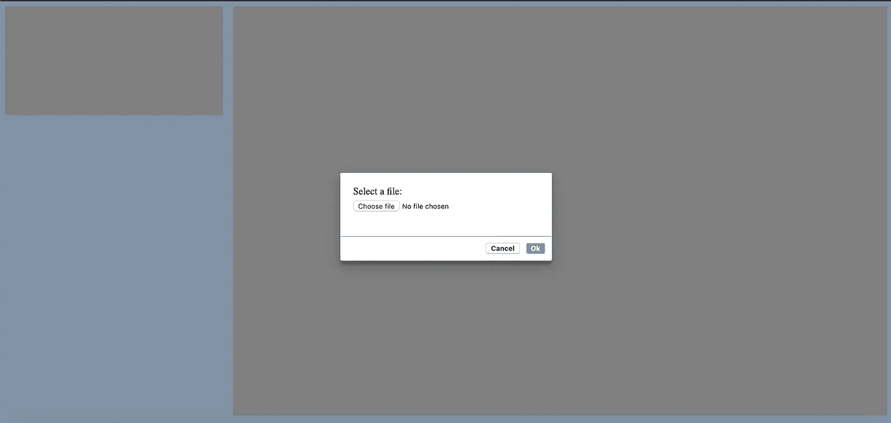
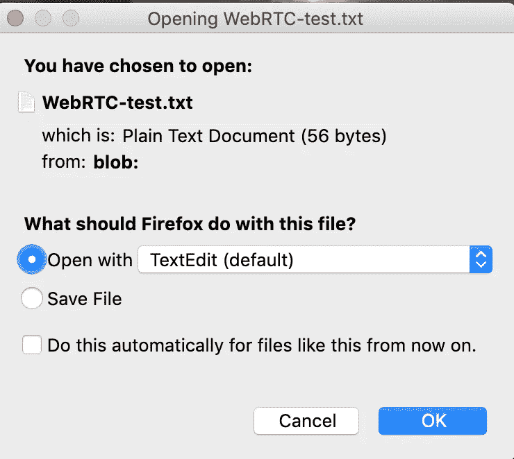
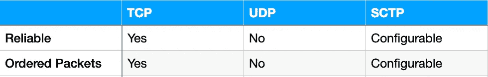

# 通过数据通道发送文件:使用 WebRTC 进行视频通话步骤 6

> 原文：<https://levelup.gitconnected.com/send-files-over-a-data-channel-video-call-with-webrtc-step-6-d38f1ca5a351>


克里斯蒂娜·特里普科维奇在 [Unsplash](https://unsplash.com/s/photos/post?utm_source=unsplash&utm_medium=referral&utm_content=creditCopyText) 上的照片

WebRTC 通常用于创建视频和语音呼叫，但这只是它所能做的一部分。它在用户之间建立了对等连接，我们可以将其用于任何目的，例如文件共享。

本文是关于 WebRTC 的系列文章的第六篇。

*   [第一步:来自网络摄像头和麦克风的数据流](/data-stream-from-your-webcam-and-microphone-videochat-with-javascript-step-1-29895b70808b)
*   [第二步:通过 WebSocket 建立连接](/set-up-a-connection-over-websocket-videochat-with-javascript-step-2-f78c307c4fd3)
*   [第三步:建立 WebRTC 连接](/establishing-the-webrtc-connection-videochat-with-javascript-step-3-48d4ae0e9ea4)
*   [第四步:找到你的联系人](/find-your-contact-videochat-with-javascript-step-4-4d527576b8cf)
*   [第五步:分享你的屏幕](/share-your-screen-with-webrtc-video-call-with-webrtc-step-5-b3d7890c8747)

到目前为止，我们已经能够在两个用户之间创建视频聊天，其中他们也可以共享他们的屏幕。我们现在希望允许用户通过连接共享文件。

这里假设您已经能够在对等体之间建立 WebRTC 连接。如果没有，可以按照[第三篇](/establishing-the-webrtc-connection-videochat-with-javascript-step-3-48d4ae0e9ea4)的步骤。

## 创建数据通道

一旦连接建立，WebRTC 允许我们在对等体之间创建一些网络通道。这些通道可用于传输任何类型的数据。[rtcdata channel](https://developer.mozilla.org/en-US/docs/Web/API/RTCDataChannel)JavaScript 接口代表了它们。

这样的通道是通过调用 peerConnection 对象的函数 *createDataChannel* 创建的。如果一方创建了一个通道，另一方必须实现 *ondatachannel* 事件处理程序来与之交互。

作为一个例子，我们在对等连接上实现了 *ondatachannel* 事件处理程序。当收到消息时，我们将它记录在控制台中，并回答“嗨，回来！”。

为了自己测试，您可以创建一个 id 为 *say-hello-button 的按钮(不管在哪里，只是为了测试)。*点击此按钮，创建一个名为“测试通道”(通道必须有名称)的数据通道，它立即发送“Hello！”给它的同伴。

在两个选项卡中打开您的应用程序，并在建立 WebRTC 连接后，单击一个选项卡中的按钮。在第二个选项卡的控制台中，您现在应该看到“Hello！”。在你点击按钮的标签页中，你应该看到“嗨，回来！”。我们已经通过数据通道进行了交流。

# 传输文件

我们希望使用数据通道在共享连接的两个对等体之间传输文件，文件可能很大。

## 阅读文件

在能够向对等方发送文件之前，第一步是在浏览器中加载文件。我们将使用一个标准的*输入*元素来实现。

```
<input type="file">
```

如果您正在阅读本系列，让我们从上一篇文章停止的地方继续。如果没有，只要您有办法建立 WebRTC 连接并从 JavaScript 访问文件，您就可以跳过下面的内容，直接跳到“发送文件”部分。

用户首先需要输入代码来开始与对等方(具有相同的代码)的视频呼叫。建立连接后，界面如下所示:


在左上角，用户看到自己，在中间的大视频元素中看到他的联系人。目前只有一个按钮共享屏幕的工具栏位于远程视频的底部，只有悬停时才可见。

我们首先添加一个共享文件的按钮:


点击此按钮时，要求用户选择一个文件:



这是一个手工制作的对话框。

对于有点长的 CSS，请查看 Github [库](https://github.com/Dornhoth/VideoChatWebRTC.git)。

一旦用户选择了一个文件,“确定”按钮被激活。当用户点击它时，文件被存储在全局变量*文件*中，我们可以通过数据通道发送这个文件。

## 发送文件

我们首先需要创建数据通道:

因为我们可以为一个对等连接创建许多数据通道，所以我们必须给它一个标签。我们取文件名。我们不是通过信道打招呼，而是发送文件:

通道中默认的预期二进制类型是 Blob，但 Google Chrome 不支持，所以在内部将 binary type 设置为“arraybuffer”。另一方面，Firefox 支持 blob，因此需要 blob。为了在两种浏览器中都能工作，我们还需要将通道的二进制类型声明为“arraybuffer ”,并将 Blob 转换为数组缓冲区。

在连接的另一端，我们也声明了 binaryType。当我们收到这些字节时，我们再次将它们做成一个 Blob，下载它并关闭数据通道。(如果你不知道 Blobs 是什么，查看[这篇文章](https://codeburst.io/javascript-interview-question-what-is-a-blob-f54482317e7f))。当数据通道关闭时，发送方关闭文件选择对话框。

为了测试这一点，我创建了一个包含两行文本的小文件，并通过信道发送出去。我在 Chrome 中的自己和 Firefox 中的自己之间创建了一个连接，并将文件从第一个浏览器发送到第二个浏览器。不出所料，Firefox 收到了文件，并请求我允许下载它:



将文件从 Firefox 发送回 Google Chrome 也不成问题。然后，我尝试使用一个更大的文件，一个 500 kB 的图像。从 Firefox 到 Chrome，我在试图通过通道发送字节数组时出错，对话框没有关闭(意味着文件没有到达另一端)。


反过来，从 Chrome 到 Firefox，对话框关闭了，但什么也没发生。图像未发送。

# 大文件问题

文件传输适用于小文件，但不适用于大文件。你可以尝试不同的文件，在 Firefox 和 Google Chrome 之间，什么可以，什么不可以的界限应该是 256kiB(大约 260kB)。为什么？

## SCTP

您可能想知道哪个传输层协议位于 WebRTC 数据通道之下。如果是 TCP，我们会有一个可靠的传输，数据包肯定会以正确的顺序到达，但我们会为此付出延迟的代价。如果是 UDP，我们会有更快的传输，但我们需要确保我们的数据包到达，我们必须重新排序。对于一些转会，你可能更喜欢一种选择，对于一些其他的选择。指定 WebRTC 协议的人不想一劳永逸地替你做决定，所以他们选择了一个替代方案:SCTP(流控制传输协议)。

SCTP 是一个很老的协议(2000 年)，你可能没听说过，因为在 WebRTC 之前它用得不多。为什么用这个？

因为它是可配置的。在创建数据通道时，您可以决定是否需要可靠的通道。



## 最大缓冲区大小

Chromium 和 Firefox 使用相同的协议实现， *usrsctp* 。在这个实现中，默认的最大缓冲区是 256kiB。当你通过数据通道发送一个小于 256kiB 的文件时，Firefox 和 Chromium 会将消息分成小块发送。对于超过这个限制的文件，块不再适合缓冲区，并且 *usrsctp* 抛出一个 EMSGSIZE 错误，这使得浏览器关闭通道。

Chromium 和 Firefox 允许你发送高达 256kiB 的消息(Firefox 到 Firefox 甚至可以发送高达 1gb 的消息),但不是所有其他浏览器。一般来说，浏览器间的限制是棘手的，而且不断变化。为了安全起见，我们应该自己拆分数据包，然后一个接一个地发送。

## 发送块

我们将保持我们的消息小:64kb(65535 字节)。

我们首先使用 Blob 方法 *arrayBuffer 将文件转换成数组缓冲区。然后，我们一个接一个地发送数据块，直到整个文件都发送完毕。最后，我们发送“文件结束”消息。*

在通道的另一端，我们创建一个数组，当数据块(数组缓冲区)到来时，我们将在其中存储它们。当我们收到一个消息时，只要它不是“文件结束”消息，那么它一定还是我们文件的一个块，所以我们把它添加到我们的块数组中。一旦我们收到“文件结束”消息，我们就可以把我们的块放在一个大的数组缓冲区中。我们将这个数组缓冲区转换成一个 Blob，并下载这个 Blob。最后，我们关闭通道。

要做到这一点，所有的数据块都必须到达，并且顺序正确。这是数据通道的默认行为。如果您不需要如此昂贵的选项，您可以在创建数据通道时将选项*命令*设置为*假*。有关选项的完整列表，请查看[文档](https://developer.mozilla.org/en-US/docs/Web/API/RTCPeerConnection/createDataChannel)。

用户现在可以通过 WebRTC 连接交换任意大小的文件。这种文件传输机制本身就是使用 WebRTC 的一个很好的理由。我们有可能直接在我们的同事之间安全快速地传输文件。你可以在这里找到全部代码(信令机制的客户端和 websocket 服务器)[。](https://github.com/Dornhoth/VideoChatWebRTC.git)

为了保持示例简单，我们没有做任何错误处理。您可以通过向发送者添加一个加载栏和一个成功/错误消息来改进这个例子。另一个值得指出的是，这个例子只适用于 Google Chrome 和 Mozilla Firefox。Safari 不支持数据通道接口的事件处理程序 o *nclose* 。

您还可以查看本系列中关于 WebRTC 的下一篇文章，在这篇文章中，我们将允许两个以上用户之间的连接。