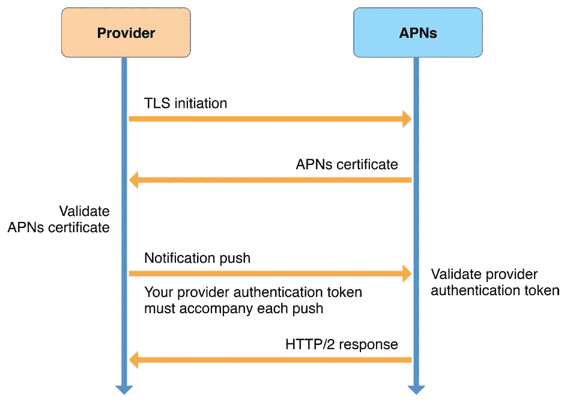

# 使用 Node.js 通过 APN 发送推送通知

> 原文：<https://levelup.gitconnected.com/send-push-notification-through-apns-using-node-js-7427a01662a2>



大多数 iOS 推送通知教程要么使用 firebase，要么依赖于不总是最新的第三方库。有时有理由不使用 firebase 或第三方服务/库。例如，当您的应用程序针对单一平台时，或者当您不想让您的应用程序因依赖关系而过载时。所以我想使用 node.js 通过 APNs 在 iOS 设备上发送 push 的简单指令。在 iOS 上发送 push 通知非常简单。本教程演示了向 APN 发送请求的基于证书和基于令牌的方法。因为这些步骤是由 APNs 协议指导的，所以请随意**将其与任何其他支持/框架**相关联。

# 先决条件

本教程假设您知道在 iOS 应用程序上集成推送通知服务的步骤。所以我假设你已经准备好了 **.p12** 证书或者 **.p8** 密钥文件。您还应该具备 node.js 或任何其他 javascript 框架的基础知识。如果你不了解 node.js/javascript!，不要担心——你可以很容易地将它与任何其他语言或框架联系起来。我不会深入 node.js 的细节，比如启动服务器、路由等等。这是简单明了的指令。我用[jsonwebtoken](https://github.com/auth0/node-jsonwebtoken)*生成 token(用你喜欢的任何包)。*

*   *jsonwebtoken v8.5.1*
*   *node.js v13.7.0*

# ***使用证书(p12)***

*使用此方法需要您从开发人员帐户获得的 **.p12 证书** (dev/prod)。我还在这篇文章的末尾添加了苹果文档的有用链接。现在我们将把 p12 证书转换成。使用 **openSSL** 的 pem 密钥和证书文件。关于 openSSL 及其命令我就不赘述了。我们将向苹果发送 **HTTPS/2** 的请求。使用下面的命令生成密钥/证书文件。将***path . 12****替换为您的 p12 文件路径或文件名(如果在同一个目录下)。当提示输入密码时，输入 p12 文件的密码。**

```
**openssl pkcs12 -in path.p12 -out newfile.crt.pem -clcerts -nokeys
openssl pkcs12 -in path.p12 -out newfile.key.pem -nocerts -nodes**
```

**既然您现在有了证书/密钥文件，让我们跳到 node.js 代码。**

**使用证书推送通知**

> **为了便于理解，我一行一行地记录下来。随心所欲地构建它们。**

**证书方法要求，**

*   **设备令牌。**
*   **从 p12 证书生成的密钥/证书文件。**
*   **您的应用程序捆绑 ID。**

**这就是证书方法。如果你想了解基于令牌的方法，请继续阅读。**

# **使用令牌(p8)**

**这种方法最大的好处是，不需要为每个应用程序创建单独的开发/生产证书。就请求而言，这种方法非常类似于 certificate one——除了将使用 JSON web token 而不是 key/cert。我们将使用. p8 文件中的**密钥来生成令牌。让我们直接进入代码。****

**使用令牌推送通知**

> **为了便于理解，我一行一行地记录下来。随心所欲地构建它们。**

**基于令牌的方法需要，**

*   **p8 文件及其密钥 ID——生成令牌。**
*   **您的团队 ID -生成令牌。**
*   **设备令牌。**
*   **应用捆绑 ID。**

**这就是基于令牌的方法。**

**你喜欢哪种方法？作为一名应用程序开发人员，我个人更喜欢基于令牌的方法，因为我不必为每个应用程序创建开发/生产证书。我希望这个说明能帮助你远离第三方服务提供商，在 iOS 上发送推送通知。如果你有任何疑问，请随意评论。**

**感谢阅读！**

# **有用的链接**

*   **[向 APNs 发送通知请求](https://developer.apple.com/documentation/usernotifications/setting_up_a_remote_notification_server/sending_notification_requests_to_apns?language=objc)**
*   **[建立到 APN 的基于令牌的连接](https://developer.apple.com/documentation/usernotifications/setting_up_a_remote_notification_server/establishing_a_token-based_connection_to_apns?language=objc)**
*   **[生成远程通知](https://developer.apple.com/documentation/usernotifications/setting_up_a_remote_notification_server/generating_a_remote_notification?language=objc)**
*   **[Node.js http2 客户端示例](https://nodejs.org/api/http2.html#http2_client_side_example)**