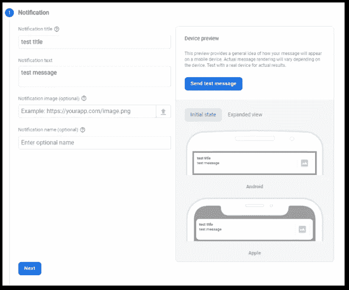

# 从 Flutter 应用程序向安装了 Firebase 的设备发送推送通知

> 原文：<https://levelup.gitconnected.com/send-push-notifications-from-a-flutter-app-to-devices-with-firebase-9c84ce58fe30>

## 通过 Firebase 在设备之间发送消息

## 使用 Firebase 云消息和 Firebase 云功能，我们可以实现一个系统来发送和接收来自 Flutter 应用程序的推送通知。


照片由[西格蒙德](https://unsplash.com/@sigmund?utm_source=medium&utm_medium=referral)在 [Unsplash](https://unsplash.com?utm_source=medium&utm_medium=referral) 上拍摄

今天我们将重点讨论如何从 Flutter 应用程序发送推送通知。因此 **Firebase** 将被使用，因为它提供了可以在 Flutter 应用程序中使用的包。在这种情况下，推送通知将被触发并发送到您自己的设备。Firebase 只为付费用户提供一些服务，但他们会向你收取使用费。如果您不使用这些服务，我们不会向您收取任何费用。

```
💡 You can get this guide as an ebook for free with more details. Click [HERE](https://xeladu.gumroad.com/l/pnff) to grab your copy!
```

我们最终的工作流程如下所示:

1.  从我们的应用程序中，带有自定义文本的消息被发送到 Firebase Cloud 函数。
2.  该函数会将我们的消息转发到 Firebase 云消息传递(FCM)服务。
3.  该服务会将消息传递到目标设备。
4.  我们的应用程序应该在几秒钟内收到推送通知。


邮件的工作流程

❌Unfortunately，目前我们不可能在不使用 Firebase 云功能的情况下从应用程序向设备发送消息，因为 FCM Flutter 包没有为此提供方法。所以我们必须使用上面的工作流程。

本文的后续步骤如下:

1.  创建和设置 Firebase 帐户和项目
2.  准备颤振应用程序
3.  编写发送和接收推送通知的代码

```
👉 Do you want all the details? Check out [my ebook](https://xeladu.gumroad.com/l/ffc) with in-depth guides about building Flutter apps with Firebase! Buy it on [Gumroad](https://xeladu.gumroad.com) now!
```

# Firebase 设置

在有趣的部分开始之前，我们需要设置后端，以便我们的应用程序可以发送和接收推送通知。我们将为每个支持的平台(iOS、Android、Web)创建一个 Firebase 项目和一个 Firebase 应用程序。如果已经配置了 Firebase 环境，可以跳过这一部分。

## 创建一个新的 Firebase 项目

如果你还没有，这里有一个简短的指南。否则，可以跳过这一部分。

1.  去[console.firebase.com](https://console.firebase.google.com/)用你的谷歌账户登录。
2.  点击**添加项目**
3.  选择一个名称
4.  谷歌分析可以跳过
5.  创建项目


成功创建项目后的 Firebase 页面

## Firebase 云功能的变更计划

要使用云功能，您需要将您的项目从 Spark 计划(免费使用)升级到 Blaze 计划(按使用付费)。这需要输入支付信息(例如信用卡，或者您也可以使用 Google Pay)。

❗:这个例子不会引起任何经常性的费用，但是如果你延长你的 Firebase 使用超过免费限制，你将为此付费。记住这一点！定价详情可在[这里](https://firebase.google.com/pricing/)找到。

要改变计划，去云功能区，点击**升级项目**按钮，并按照指示(见下图)


链接到云功能区


首次使用云功能时的升级通知

升级后，您应该会看到一个空的仪表板。您部署的功能将在这里可用，您可以在这里检查日志、健康状态和使用统计。

❗请注意，部署的云功能会占用资源，这会导致成本增加。如果部署更多的功能，成本可能会增加。您可以使用预算预警在出现意外成本时得到通知。

## 应用程序设置

第一步是将我们的应用程序与 Firebase 后端连接起来。之后，我们将专注于编写发送和接收推送通知的代码。

## 与 Firebase 后端的链接

现在这是一个非常简单的任务，因为有一个命令行工具可以支持我们进行配置。首先，我们需要将 [Firebase 核心](https://pub.dev/packages/firebase_core)依赖项添加到我们的项目中。运行命令

```
flutter pub add firebase_core
```

从应用的根文件夹中。下一个命令安装一个 cli 来连接我们的应用程序和 Firebase。奔跑

```
dart pub global activate flutterfire_cli
```

并等待安装过程完成。

最后，运行命令

```
flutterfire configure
```

它将指导你完成设置过程，创建 Firebase 应用程序，并将它们与你的 Flutter 应用程序链接起来。之后，会有一个包含所有相关 Firebase 帐户信息的 Dart 文件。**不要将该文件签入版本控制❗** 。

## 安装 Firebase 软件包

在您的 Flutter 项目中，打开`pubspec.yaml`文件，添加 Firebase 消息传递包和云函数包(见下图)。

```
flutter pub add firebase_messaging
flutter pub add cloud_functions
```

*   [Firebase 消息传递](https://pub.dev/packages/firebase_messaging)
*   [云功能](https://pub.dev/packages/cloud_functions)


pubspec.yaml 中必需的 Firebase 包

🔔软件包经常更新，所以本例中的版本可能已经过时。

## 为 iOS 启用应用功能

如果您将 iOS 作为一个平台，您需要做更多的配置工作来启用推送通知。一个特别的要求是你必须有一个有效的苹果开发者账户。没有它就不行。以下文章将指导您完成整个设置过程:

*   如何配置您的 XCode 项目
*   如何在 Apple 开发者门户网站中注册密钥、预置描述文件和标识符

[](https://firebase.flutter.dev/docs/messaging/apple-integration) [## 通过 APNs 集成的| FlutterFire

### 本指南适用于 iOS 和 macOS Flutter 应用程序，针对您需要的平台重复每个步骤。例如，如果你…

firebase.flutter.dev](https://firebase.flutter.dev/docs/messaging/apple-integration) 

Android 应用不需要额外的设置步骤。

## 设置云功能

Firebase CLI 工具([安装指南](https://firebaseopensource.com/projects/firebase/firebase-tools/))是与 Firebase 相关的一切的便利助手。我们将使用它们来初始化云函数并更新它们。
安装完成后，运行命令`firebase init functions`。它将引导您完成登录和设置过程。确保选择您之前创建的 Firebase 项目。最后，您将在项目目录中看到一个`functions`文件夹。它包含已部署的功能及其依赖项。设置完成🎉。


Firebase 云函数的函数文件夹

## 代码设置

最后，我们进入了最有趣的部分。在这里，我们将创建云函数，将我们的消息传递给 Firebase 云消息传递。我们将实现接收通知的处理程序，以便我们的应用程序显示通知。

## 设置云功能

这里是云函数的代码，我们将使用。它接受调用者提供的`data`参数，并调用云消息服务。结果表明操作的成功或失败。

将推送通知传递给 Firebase 消息服务的云功能

`data`对象是一个应该有 3 个属性的地图:

1.  `targetDevices`是包含目标设备令牌的字符串列表
2.  `messageTitle`是包含消息标题的字符串
3.  `messageBody`是包含消息正文的字符串

将这段代码插入到 functions 文件夹的`index.js`文件中。然后运行命令`firebase deploy --only functions`。操作完成后，Firebase 中的仪表板应该会更新。该函数已准备好被调用👏


部署功能后的 Firebase 功能仪表板


部署过程的输出

## 注册接收通知

当应用程序不运行时，所有通知都由操作系统处理。您可以像往常一样在通知栏中听到典型的声音和应用程序图标。为了在应用程序运行时处理收到的通知，我们需要注册一个处理函数。如果没有处理程序，消息就被吞掉了，你甚至不知道你收到了一个。

应用程序运行时的消息处理程序

在我们的处理程序注册后，应用程序运行时收到通知，标题和正文将打印到控制台。

应用程序在后台时的消息处理程序

后台处理程序有一个限制，即它必须是顶级函数。当收到通知并且应用程序在后台时，它将被调用。

## 发送推送通知

要发送推送通知，我们需要获取目标设备(在本例中是我们自己的设备)的设备令牌。然后，我们将消息发送给 Firebase Cloud Functions 服务，后者将消息传递给 Firebase Cloud Messaging 服务，并由它处理所有其他事情。例如，如果目标设备离线，则一旦该设备再次在线，就传输该消息。所有我们不需要担心的小细节🎉


应用程序启动时，设备令牌会打印到控制台

代码试图找到一个名为 **notifySubscribers** 的 Firebase 函数。找到后，它调用带有参数的函数，该参数包含目标设备、消息标题和用户在 UI 中输入的文本。控制台中的一条`print`消息告诉我们呼叫是否成功。

## 自定义推送通知

您可以将附加数据添加到推送通知中，并让您的应用程序以不同的方式处理它。 [RemoteMessage](https://pub.dev/documentation/firebase_messaging_platform_interface/latest/firebase_messaging_platform_interface/RemoteMessage-class.html) 对象有一个 [data](https://pub.dev/documentation/firebase_messaging_platform_interface/latest/firebase_messaging_platform_interface/RemoteMessage/data.html) 属性，您可以在该属性中向请求添加自定义数据。您的应用程序可以读取这些值并做出相应的反应。下图显示了使用 data 属性的云函数的修改版本。

向邮件中添加自定义数据

## 从 Firebase 发送测试通知

Firebase 允许从用户界面发送定制的推送通知。这样你就可以测试当你的应用没有运行时，通知是什么样子。按照以下步骤发送通知。

*   在 Firebase 页面上，转到**云消息**。


Firebase 页面上的菜单概述

*   点击**发送您的第一条消息**。


使用云消息发送您的第一条消息

*   输入至少一个标题和描述，点击**发送测试信息**。



使用云消息发送测试消息

*   添加您的设备令牌并点击**测试**。


最终将消息发送到目标设备

您的设备应该会收到推送通知。处理方式取决于应用程序是在前台、在后台还是根本不运行。

*   当应用程序根本没有运行时，你会在移动操作系统的通知栏中得到提示。


当应用程序在后台时，收到来自 Firebase 的推送通知

*   当应用程序在后台运行时，你会在移动操作系统的通知托盘中得到一个提示，如果设置了后台处理函数，后台处理函数会踢它(见下面可能的输出)。


当应用程序在后台时收到通知时的输出

*   当应用程序在前台运行时，如果设置了前台处理函数，它将处理消息(见下面可能的输出)。


当应用程序在前台时收到通知时的输出

当你的应用程序正在运行(前台或后台)并且收到通知时，你可以使用包[flutter _ local _ notifications](https://pub.dev/packages/flutter_local_notifications)来显示一个真实的通知。这样，用户可以得到正确的通知。另一种方法是在你的应用程序中显示一个横幅(例如，用一个 [Snackbar 小工具](https://docs.flutter.dev/cookbook/design/snackbars))，但如何从这里继续下去取决于你。

## 结论

这是让一个 Flutter 应用接收**和**向其他设备发送推送通知的最短方式。后端的配置一开始可能有点让人不知所措，但它真的没有那么难。有了这些知识，你就能以匿名的方式更容易地与你的应用程序用户互动。

## 源代码

你可以在 [GitHub](https://github.com/xeladu/flutter_push_notification) 上找到源代码。repo 包含没有 Firebase 配置的工作应用程序。您需要创建帐户，将您的应用程序与其链接，并部署云功能。然后你就可以重现这篇文章的所有结果了。

## 额外资源

这里有一些关于 Firebase 的额外资源，如果你想深入了解这个主题的话。

[](https://xeladu.gumroad.com/l/pnff) [## 使用 Flutter 和 Firebase 推送通知

### 这本电子书将向你展示如何使用 Firebase 在 Flutter 应用程序之间实现推送通知。每一步都是…

xeladu.gumroad.com](https://xeladu.gumroad.com/l/pnff) [](https://xeladu.gumroad.com/l/fcf) [## 火基云在深层发挥作用

### 这本电子书告诉你一切你需要知道的关于 Firebase 云功能。简短，精确，直截了当…

xeladu.gumroad.com](https://xeladu.gumroad.com/l/fcf) [](https://xeladu.gumroad.com/l/ffc) [## 颤振燃烧基础概要

### 这本电子书着重于让你能够在你的应用中集成 Firebase 云服务。当你想要的时候，它是一个跳跃的开始…

xeladu.gumroad.com](https://xeladu.gumroad.com/l/ffc) 

[***通过我的推荐链接加入成千上万的媒体会员，每月只需 5 美元就可以阅读你想阅读的文章！***](https://medium.com/@xeladu/membership)

[](https://medium.com/@xeladu/membership) [## 通过我的推荐链接加入 Medium-xela du

### 只需点击一下，就可以通过会员资格访问数千篇文章！您的会员资格只需 5 美元一张…

medium.com](https://medium.com/@xeladu/membership) 

点击[此处](http://bit.ly/xeladu-medium)每月获取一次我的所有中型文章的摘要🔔
浏览[我的 Gumroad 商店](https://xeladu.gumroad.com/)寻找有趣的编程素材🏬


[赛拉杜](https://xeladu.medium.com/?source=post_page-----9c84ce58fe30--------------------------------)

## 适合初学者的颤振文章

[View list](https://xeladu.medium.com/list/flutter-articles-for-beginners-a040ea777956?source=post_page-----9c84ce58fe30--------------------------------)24 stories

[赛拉杜](https://xeladu.medium.com/?source=post_page-----9c84ce58fe30--------------------------------)

## 软件工程师的高级颤振文章

[View list](https://xeladu.medium.com/list/advanced-flutter-articles-for-software-engineers-f074879fdef3?source=post_page-----9c84ce58fe30--------------------------------)9 stories