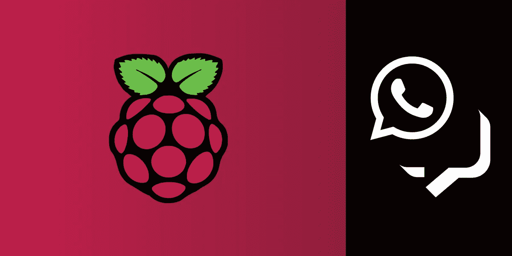

# 在节点启动时发送 Raspberry Pi IP 地址和消息

> 原文：<https://levelup.gitconnected.com/send-raspberry-pi-ip-address-on-boot-in-node-with-messages-21c9f7dfd505>

作为一个 Raspberry Pi 爱好者，有几次我需要一个可重用的脚本来改进我的项目。一个最好的例子就是在无头模式(没有显示器、键盘或鼠标)下启动时知道我的 Raspberry Pi 的 IP 地址。

最近我发表了一篇关于如何用 Node 和树莓 Pi 构建一个[家庭监控系统的教程。在实现这个项目时，我们的想法是不要让 Raspberry Pi 连接到显示器，所以当它在远离任何显示器的远程位置启动时，没有默认的方法知道 Raspberry Pi 的 IP 地址。本教程将指导您解决不知道 IP 地址的问题。](https://www.nexmo.com/blog/2020/05/19/home-surveillance-system-with-node-and-a-raspberry-pi)

# 先决条件

*   一个[树莓派](https://www.raspberrypi.org/)
*   [节点](https://nodejs.org/en/) &节点 [NPM](https://www.npmjs.com/) 安装在树莓派上
*   [一个 Vonage 账户](https://dashboard.nexmo.com/sign-up?utm_source=DEV_REL&utm_medium=blog&utm_campaign=send-raspberry-pi-ip-address-on-boot-in-node-with-messages)

# Vonage API 帐户

要完成本教程，您将需要一个 [Vonage API 帐户](http://developer.nexmo.com/ed?c=blog_text&ct=2020-08-05-send-raspberry-pi-ip-address-on-boot-in-node-with-messages)。如果你还没有，你可以今天就[注册](http://developer.nexmo.com/ed?c=blog_text&ct=2020-08-05-send-raspberry-pi-ip-address-on-boot-in-node-with-messages)开始用免费的信用点数来建造。一旦你有了一个帐户，你可以在 [Vonage API 仪表板](http://developer.nexmo.com/ed?c=blog_text&ct=2020-08-05-send-raspberry-pi-ip-address-on-boot-in-node-with-messages)的顶部找到你的 API 密匙和 API 秘密。

# 代码

在您的项目目录中，创建并打开一个名为`.env`的文件，添加您的环境变量。你可以在 [Vonage 开发者仪表盘](https://dashboard.nexmo.com/)中找到你的`API_KEY`和`API_SECRET`。将这些值添加到以下示例的前两行:

如果您选择发送短信通知，请将您的手机号码添加到您的`.env`文件的`SMS_TO=`部分。如果你决定使用 WhatsApp 发送通知，那么将你的 WhatsApp 手机号码添加到你的`.env`文件的`WHATSAPP_TO=`部分。

你可以在[消息沙盒 API](https://dashboard.nexmo.com/messages/sandbox) 页面找到你的`WHATSAPP_FROM`号。

遵循上面命令中的所有输入请求。然后，一旦完成，运行下面的命令将`Nexmo Node SDK`、`Express`、`Body-Parser`和`DotEnv`包安装到您的项目中:

在您的项目目录中创建一个名为`index.js`的新文件，然后打开这个文件。所需的第一部分是检索您的树莓 Pi 的 IP 地址。

将下面的代码添加到新的`index.js`文件中。`OS`模块提供对设备操作系统信息的访问，如`network interfaces`。

下面的代码遍历这些接口，寻找名为`wlan0`的接口，确保接口是`IPv4`并且不是面向内部的接口。

如果您在终端中运行以下命令，结果应该是您的设备的 Wifi IP 地址输出:

接下来，是时候发送 IP 地址作为通知了。本教程允许您选择以 SMS 文本消息、WhatsApp 消息或两者的形式发送通知。

# 发送短信

发送短信需要使用您的 API 密钥和 API 秘密，您已经将它们保存在`.env`文件中。首先，在您的`index.js`文件的顶部，添加以下行以包含`Nexmo`包和`DotEnv`包:

现在，在文件的底部，添加下面的功能，用 API 密钥和秘密初始化`Nexmo`对象。下一行用字符串“Your IP Address is:”填充变量`text`，然后将`ipAddress`传递给函数。

该方法的最后一部分发送 SMS。

# 发送 WhatsApp

发送 WhatsApp 消息需要更多的信息，包括一个`Application ID`和一个`Private Key`。要创建一个生成`application_id`变量和`private.key`文件的应用程序，运行以下命令:

打开您的`.env`文件，并更新行`APPLICATION_ID=`以包含您的新`Application ID`。

回到您的`index.js`文件，在文件底部添加以下命令:

上面的例子用参数`ipAddress`创建了一个名为`sendWhatsApp`的新函数。该函数使用`API_KEY`、`API_SECRET`、`APPLICATION_ID`和`APPLICATION_PRIVATE_KEY_PATH`初始化`Nexmo`对象的新实例。这里需要的额外重要信息是设置`apiHost`以确保连接到`messages-sandbox` API，而不是标准的生产 API。

剩下的方法创建一个字符串告诉用户 IP 地址，然后发送`WhatsApp`消息。

# 发送通知

按照现在的情况，如果运行`node index.js`，什么也不会发送。将输出 IP 地址，仅此而已。要发送通知，无论是作为短信，WhatsApp 消息，还是两者都有，找到行:`console.log(iface.address);`。在这一行下面，添加以下内容:

# 运行命令

现在代码已经实现并运行了，操作系统现在需要配置为在 Raspberry Pi 启动时运行这个脚本。为此，请在终端中打开以下文件:

每当操作系统启动时，该文件都会运行命令。在线上:`exit 0`添加下面的命令来运行您刚刚构建的项目。一定要更新文件`index.js`的完整路径:

# 测试一下！

你已经设置了一个 Raspberry Pi，编写了一些代码，允许你通过 WhatsApp、SMS 或文本到语音语音通话将 Raspberry Pi 的 IP 地址发送给你。现在剩下要做的就是重启 Raspberry Pi 并观察通知进入目的号码。

# 进一步阅读

这里还有一些文章，你可能会发现它们对用 Raspberry Pi 构建服务或发送 WhatsApp 消息很有帮助。

*   [带节点和树莓派的家庭监控系统](https://www.nexmo.com/blog/2020/05/19/home-surveillance-system-with-node-and-a-raspberry-pi)
*   [如何用 Node-RED 发送短信](https://www.nexmo.com/blog/2019/04/17/send-sms-messages-node-red-dr)
*   [如何用 Node.js 发送 WhatsApp 消息](https://www.nexmo.com/blog/2020/04/15/send-a-whatsapp-message-with-node-dr)
*   [用 Node.js 到处传递消息](https://www.nexmo.com/blog/2020/05/27/messaging-everywhere-with-node-dr)

不要忘记，如果您有任何问题、建议或想法想要与社区分享，请随时加入我们的[社区 Slack workspace](https://developer.nexmo.com/community/slack)

*最初发布于*[*https://www . NEX mo . com/blog/2020/08/05/send-raspberry-pi-IP-address-on-boot-in-node-with-messages*](https://www.nexmo.com/blog/2020/08/05/send-raspberry-pi-ip-address-on-boot-in-node-with-messages)