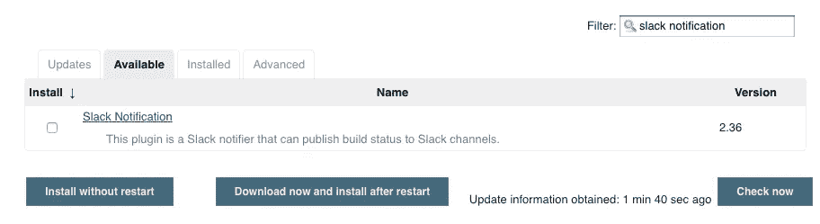

# 用 Jenkins 发送时差通知

> 原文：<https://levelup.gitconnected.com/send-slack-notifications-with-jenkins-f8e8b2d2e748>


约书亚·阿拉贡在 [Unsplash](https://unsplash.com?utm_source=medium&utm_medium=referral) 上拍摄的照片

# 先决条件

*   詹金斯:[已安装](https://jenkins.io/download/)并能够访问詹金斯的管理门户(即在 [http://localhost:8080](http://localhost:8080) /)
*   Slack: [已安装](https://slack.com/downloads/)并登录到您的工作区

Jenkins 是一个开源的 CI 服务器，它允许您轻松地为测试、构建和部署的自动化建立管道。在管道的某些阶段，您可能决定要向您和您的团队发送时差通知，以通知您构建状态。听起来是个简单的功能，对吧？确实是！

跟着做，您应该能够在接下来的 15 分钟或更短时间内发出第一个时差通知(假设您满足了先决条件)。

注意:我会先给你书面说明，然后在下面附上相关的截图，如果适用的话。

# 为 Slack 安装 Jenkins 应用程序

转到桌面上的 Slack 应用程序。

在你左侧导航栏的底部，你会看到 ***最近的应用*** 。

点击 ***添加更多应用*** *。*


搜索“詹金斯 CI”，点击 ***添加*** 。


您将被发送到浏览器中的 Jenkins 应用程序页面。点击 ***安装*** *。*

选择要发布到的松弛渠道，点击 ***添加* *詹金斯 CI 集成*** *。*(您也可以通过选择右下角显示*创建新频道*的链接来创建新频道)。


在下一页，向下滚动到 ***集成设置*** 以找到您在 Jenkins 中定制您的时差通知所需的所有设置和信息。

我们稍后将需要自动生成的**令牌**来在 Jenkins 中进行配置。


# 为 Jenkins 安装松弛通知插件

现在，在您的本地浏览器中进入您的 Jenkins 管理门户。

在左上角，进入 ***詹金斯→管理詹金斯→管理插件***


在 ***下可用*** 选项卡，过滤并搜索“时差通知”



选择**，然后选择左下角的***安装不重启*** 。**

****

**它将带您到安装页面，应该只需要几秒钟就可以完成安装。**

****

**出现“成功”信息后，点击 ***返回首页*** 返回主页面。**

****

# **把詹金斯和你的懈怠联系起来**

**在我们设置新的管道作业之前，我们需要配置 Jenkin 的设置来连接到您的 Slack。**

**我们将在 ***管理 Jenkins →配置系统*** 中完成**

****

**向下滚动 ***配置系统*** 页面，直到看到 ***松弛的设置。*****

****

*   ****工作区**:您团队的工作区名称。如果您在[https://example.slack.com/](https://example.slack.com/)登录 slack，您的工作区就是“示例”。**
*   ****凭证**:
    ——点击*添加→詹金斯*会弹出一个窗口。 *-* 在*种类*下拉菜单下，选择**密文** *。***

****

**将您的备用令牌复制并粘贴到*秘密*中，然后点击*添加*。**

**如果您忘记保存/复制令牌，请转到:
*Slack 应用程序目录(*[*https://<your workspace>. Slack . com/apps/manage*](https://nsoorx.slack.com/apps/manage)*)*→*Jenkins CI*→*配置* → *编辑配置→集成设置***

********

**可选:我为*描述*添加了 **SlackToken** 来跟踪我的凭证/令牌…**

****

**以便在添加后可以在下拉列表中阅读。你可以选择任何你想要的名字。**

****

**确保从下拉列表中选择新添加的令牌凭据。**

*   ****默认频道/成员 id** :输入您希望接收通知的频道名称(即#channel)或用户 id(即 UUU123UU4)。**

****

**一旦所有内容都填写完毕，点击 ***保存*** 。**

# **创建一个新作业来测试时差通知。**

**点击 ***创建新工作*** 。**

****

****命名**您的新工作，选择 ***管道*** ，然后点击左下角 ***确定*** 。**

****

**一路滚动到 ***管道*** *。*我们将编写或复制我们的 JenkinsFile 脚本到 ***脚本*** 文本框中。**

****

**将以下代码复制并粘贴到管道脚本中。这是发送 Slack 消息所需的基本框架([文档](https://jenkins.io/doc/pipeline/tour/hello-world/)):**

```
**pipeline {
    agent any

    stages {
        stage('Slack it'){
            steps {
                slackSend *channel*: '#slack-test-channel', 
                          *message*: 'Hello, world'
            }
        }
    }
}**
```

**点击 ***保存*** 。**

**现在点击**。*等一下…***

**点击你的最新构建，它应该在 ***构建历史*** *下闪烁。***

****

**点击 ***控制台输出*** 查看终端或命令提示符下会发生什么。**

********

**如果一切顺利，一个快乐的管家已经给你发送了一个松弛消息。**

****

# **让它成为值得传播的信息**

**既然您已经成功地发送了一个延迟通知，我们可以开始添加到 JenkinsFile 脚本中，使消息更漂亮、信息量更大。**

## **颜色:**

```
**def *COLOR_MAP* = [
    'SUCCESS': 'good', 
    'FAILURE': 'danger',
]**
```

## **获取生成用户:**

```
**def getBuildUser() {
    return currentBuild.rawBuild.getCause(Cause.UserIdCause).getUserId()
}**
```

## **管道:**

```
**def COLOR_MAP = [...]
def getBuildUser(){...}pipeline {
    // Set up local variables for your pipeline
    environment {
        // test variable: 0=success, 1=fail; must be string
        doError = '0'
        *BUILD_USER* = ''
    }

    agent any

    stages {
        stage('Error') {
            // when doError is equal to 1, return an error
            when {
                expression { doError == '1' }
            }
            steps {
                echo "Failure :("
                error "Test failed on purpose, doError == str(1)"
            }
        }
        stage('Success') {
            // when doError is equal to 0, just print a simple message
            when {
                expression { doError == '0' }
            }
            steps {
                echo "Success :)"
            }
        }
    }

    // Post-build actions
    post {
        always {
            script {
                *BUILD_USER* = getBuildUser()
            }
            echo 'I will always say hello in the console.' slackSend *channel*: '#slack-test-channel',
                *color*: *COLOR_MAP*[currentBuild.currentResult],
                *message*: "*${currentBuild.currentResult}:* Job ${env.JOB_NAME} build ${env.BUILD_NUMBER} by ${BUILD_USER}*\n* More info at: ${env.BUILD_URL}"
        }
    }
}**
```

**确保**取消** ***使用 Groovy 沙箱*** *…***

****

**否则你会得到一个错误，说“脚本不允许使用方法。”**

****

**将 Groovy 沙盒与脚本中的方法一起使用时出现错误消息**

## **最终结果:**

****

**现在，您已经学会了如何通过 Jenkins 发送 Slack 消息，可能性是无穷的！请让我知道这个教程是否有帮助，或者如果你有任何问题。快乐懈怠。**