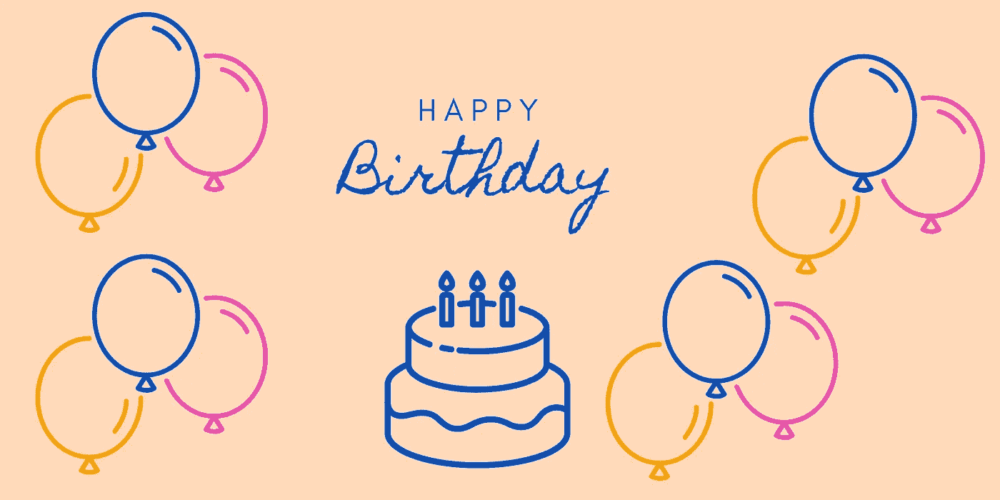
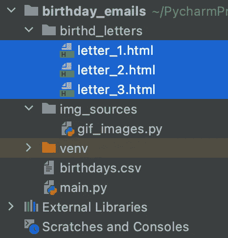
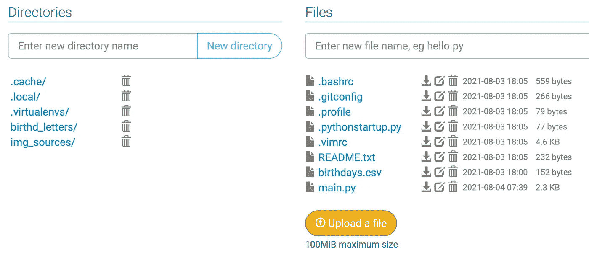
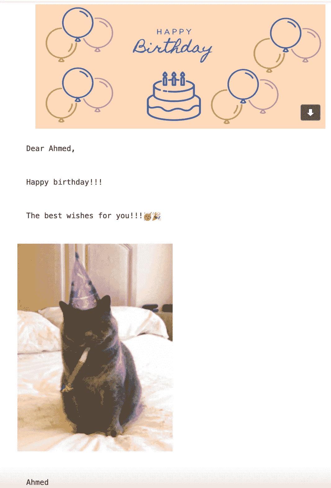
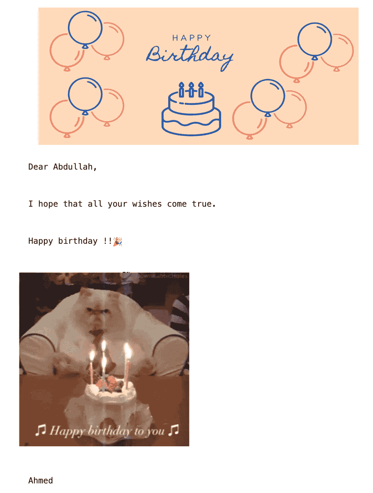

# 用 Python 发送生日邮件

> 原文：<https://levelup.gitconnected.com/sending-birthday-emails-with-python-13c35f387623>



(图片由作者提供)

许多人发现记住他们所有朋友的生日太难了，有些人写一些便条来记住每个人。因此，使用 python 程序，我们使程序向人们发送生日祝福电子邮件变得更加动态和省力。

# 编码前

建议创建一个新的电子邮件地址来创建此程序。第一个原因，账号会有漏洞，安全性会降低。此外，使用新的电子邮件可能会避免关闭原来的电子邮件，这一点将在代码中深入提及。

在这篇博客中，创建一个谷歌账户是第一步。点击“管理您的 Google 帐户”按钮。然后，点击左边的安全栏。现在，禁用“登录谷歌”部分下面的按钮，启用“不太安全的应用程序访问”按钮，以允许使用 python 程序。

# 编码

## 制作数据文件

创建一个名为`data`的新 CSV 文件，给所有朋友或你想给他们发生日邮件的人写信。在这里，您可以选择想要创建数据文件的格式。这些数据包括所有人的姓名、电子邮件、日期和月份。年份并不重要。

```
name,email,year,month,day
Ahmed,Ahmedbashatest1@gmail.com,1992,11,13
Abdullah,Ahmedbashatest@gmail.com,1992,11,13
Brook,Ahmedbashatest2@gmail.com,1994,08,04
```

## 制作电子邮件的信件

创建一个新的目录来保存所有 HTML 格式的电子邮件。



生日信件目录

该计划有一个“生日电子邮件”文件夹，其中有三个 HTML 字母。每个字母将有一个字符串“[Name]”来替换它的真实姓名。此外，“[GIF 图像]”将被替换为 GIF 图像的链接。下面的代码将阐明这一点。

```
<pre>
    
    <br />  Dear [NAME],<br />
    <br />  Happy birthday!!!<br />
    <br />  The best wishes for you!!!🥳🎉<br /><br />

<br /><br />  Ahmed</pre>
```

## 正在创建 GIF 文件

这不是一个必要的步骤，但会使字母看起来更好。第一步是在新文件夹中创建一个新的 python 文件。制作一个列表类型的变量，并分配任意多的 GIF 链接。下面的代码将检查这一部分。

```
gif_images = [
    "https://media.giphy.com/media/SRO0ZwmImic0/giphy.gif",
    "https://media.giphy.com/media/lopU8KO0B4W7VEBA13/giphy.gif",
    "https://media.giphy.com/media/IFjSbBHETzzr6GJdwW/giphy.gif",
    "https://media.giphy.com/media/26ufiTwmKToL3KB4k/giphy.gif",
    "https://media.giphy.com/media/s2qXK8wAvkHTO/giphy.gif",
    "https://media.giphy.com/media/128GCd3Vgai0WA/giphy.gif"
]
```

## 从主 python 开始

许多软件包需要安装和导入。其中一个软件包是“smtplib ”,它允许程序发送电子邮件。需要“datetime”来获取当前的日期和月份。使用“熊猫”图书馆是必要的，它使处理数据变得容易。通过使用“随机”程序将选择不同的字母和 GIF 图像。导入“MIMEText ”,这将有助于邮件内容。图书馆“时间”将避免使帐户被禁用，这一点将在后面深入讨论。导入为保存所有 GIF 链接而创建的列表。

```
############## IMPORTS ##############
import smtplib
import datetime as dtime
import pandas as pd
import random
import time
from email.mime.text import MIMEText
from img_sources.gif_images import gif_images
```

在启动逻辑之前，使用 pandas 库创建一个新变量来保存数据，并获取当前的日期和月份。

```
# read the data
df = pd.read_csv("birthdays.csv")
# current day and month
current_day = dtime.datetime.now().day
current_month = dtime.datetime.now().month
```

现在，创建一个名为“new_df”的新变量来分配当天的数据。做一个 if 语句并检查当前月的“new_df”的长度，如果结果大于零，这意味着有一个人或多个人在同一天同一个月过生日。在 if 语句中创建一个 for 循环，以便在一次或多次。按代码打开信夹，用“随机”库从三封信中选择一封。下一步是读取文件。

```
# save the rows that has the current day in new variable
new_df = df.loc[df['day'] == current_day]
# check the length of new_df of the current month so if the result is larger than 1
# so there is birthdays on this day
if len(new_df.loc[new_df['month'] == current_month]) > 0:
    # check the length of people having birthday in this day
    for i in range(len(new_df.loc[new_df['month'] == current_month])):
        # open a random html file for the three files that existed
        with open(f"./birthd_letters/letter_{random.randint(1, 3)}.html") as letter_file:
            # reading the file
            letter_contents = letter_file.read()
```

是时候用实际名称替换“[NAME]”，并在新变量中分配电子邮件了。如果这一天只有一个人或者有很多人，那么上一步有一个 if 语句来避免错误。另外，用随机选择的 GIF 图像替换“[GIF IMAGE]”。

```
# replace [NAME] with actual name on the data
if len(new_df["name"]) > 1:
    the_letter = letter_contents.replace("[NAME]", new_df["name"][i])
    the_email = new_df["email"][i]
else:
    the_letter = letter_contents.replace("[NAME]", new_df["name"].item())
    the_email = new_df["email"].item()

# here to replace the GIF from the imported pyhton files
the_letter = the_letter.replace("[GIF IMAGE]", random.choice(gif_images))
# here start using smtplib package to send the letter
```

建立与“smtplib”的连接，保护消息并写入登录信息，包括电子邮件和密码。创建一个包含电子邮件内容的变量，如发件人、收件人、主题和正文。代码结束时，设置 5 秒或更长的延迟时间。如果数据有许多人在同一时间过生日，该程序将同时发送他们两人，谷歌将认为这封电子邮件发送不想要的内容，该帐户将被禁用。

```
# new connection
with smtplib.SMTP("smtp.gmail.com") as con:
    # secure the mail
    con.starttls()
    # login
    con.login(user="Your Email", password="Your Password")
    # create the msg
    msg = MIMEText(the_letter, 'html')
    msg["From"] = "Your Email"

    msg["To"] = the_email
    msg["Subject"] = "Happy Birthday !!!🎊"
    # send the email
    #con.send_message(msg)
    # time delay to avoid closing google account
    time.sleep(10)
```

# 免费在云上运行代码

该计划正在工作，但有一个问题是开放代码，每天运行代码。因此，在云上运行程序是最简单的方法。因此，开始在 pythonanywhere 上创建一个新帐户。制作信件和 GIF 图像目录，它们必须被命名为 python 程序。将所有相关文件上传到云端。



云文件

单击顶部栏中的“Tasks ”,选择您希望代码运行的时间。在命令中，编写以下代码来运行程序。现在，该程序将在每天选定的时间运行。

```
python3 main.py
```

# 输出

这些人什么都会收到。



首次输出



第二输出

这里的代码是[这里的](https://github.com/AhmadBasha/BD_emails)。

如果你有什么要补充的，请留言评论。