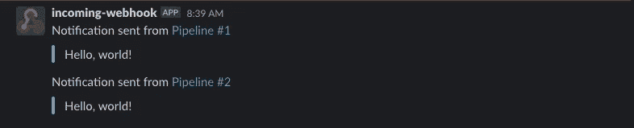
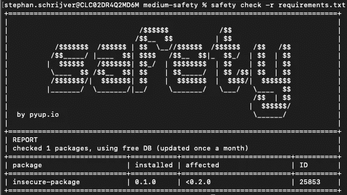
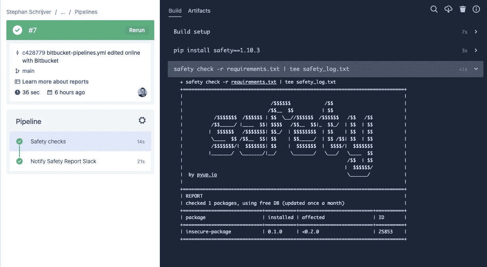
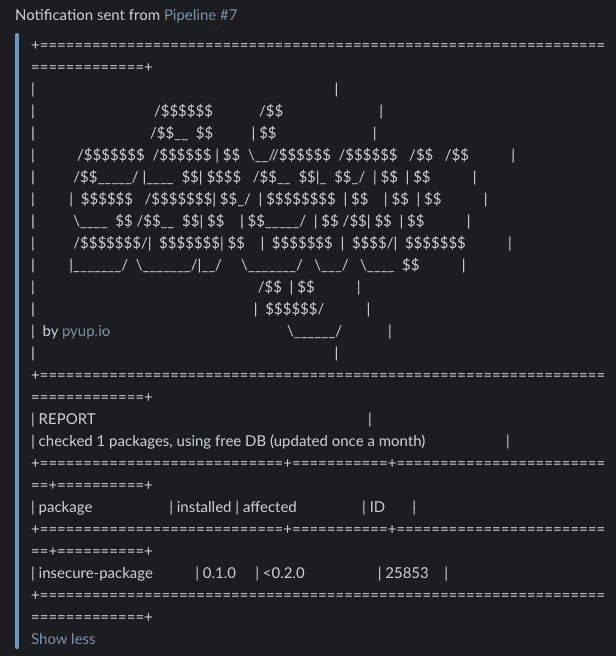
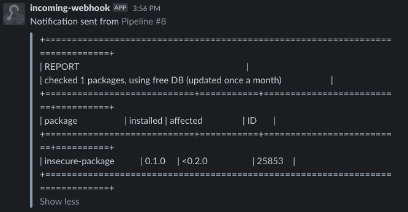
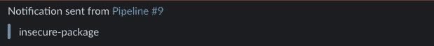
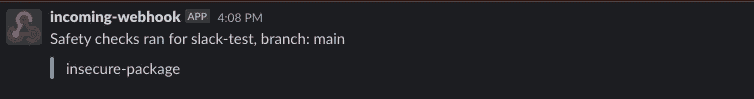

# 从位桶管道发送松弛消息

> 原文：<https://levelup.gitconnected.com/sending-slack-messages-from-bitbucket-pipelines-7efc6fc63dc7>

## 在空闲时间获取安全报告或平台计划输出


由 [Austin Distel](https://unsplash.com/@austindistel?utm_source=medium&utm_medium=referral) 在 [Unsplash](https://unsplash.com?utm_source=medium&utm_medium=referral) 上拍摄

有时，您希望在 Slack 中获得一个额外的通知，告知 Bitbucket Pipelines 管道中发生了什么，而不打开 Bitbucket Pipelines 接口。比如说；当一个应用程序正在构建但包含易受攻击的包时，或者当所有自动步骤都已通过而您必须触发一个手动步骤时，请注意。在本文中，我将向您展示几个如何做到这一点的例子。

# 先决条件

有一个[松弛通知管道](https://bitbucket.org/atlassian/slack-notify/src/master/)可用于位桶管道。你唯一需要做的就是在你的 Slack workspace 中配置一个 webhook，将它的 URL 添加到你的 Bitbucket 帐户变量或者存储库变量中作为`SLACK_WEBHOOK_URL`——或者其他任何你知道你在做什么的东西——并且在你设置好之后按照这个指南来做。如果您在提到的某个话题上遇到困难，请遵循以下指南:

*   [设置一个松弛的网钩](https://api.slack.com/messaging/webhooks)，直到并包括步骤 3。
*   [位桶帐户和存储库变量](https://support.atlassian.com/bitbucket-cloud/docs/variables-and-secrets/)，转到工作区/存储库变量

# 发送简单的信息

如果你想发送一个简单的消息到你的 Slack workspace，设置非常简单，你的`bitbucket-pipelines.yml`看起来如下。

这将在每次管道运行时发送 hello world 消息。正如你在下面看到的，这是它在松弛状态下的样子。



这是从位桶管道发送的松弛消息的外观

如果您在管道中有一些手动步骤，并且您希望在可以执行这个手动步骤时得到通知，这可能会很方便，例如:

闲置时此管道的输出:


发送到 Slack 的消息，通知我们何时可以运行手动步骤

# 向时差发送报告

让我们假设您想要运行一个依赖检查来扫描易受攻击的包，并在每次管道运行时向 Slack 发送一个报告。在我的例子中，我想为一个 Python 应用程序使用库' [safety](https://pypi.org/project/safety/) '，但是你当然可以使用你自己的语言与另一个产生一些输出的漏洞扫描器结合使用。

在通过一个`pip install`安装安全之后，安全可以基于一个——在我的例子中是— `requirements.txt`文件生成一个报告。我添加了一个包含依赖关系`insecure-package==0.1.0`的`requirements.txt`文件。然后您可以运行`safety check -r requirements.txt`，它将生成以下输出。



安全报告

我希望这个输出出现在我的 Bitbucket 管道接口中，但也出现在 Slack 中。为此，我们将使用`tee`，它允许我们标准输出文本，但也将输出写入一个文件，然后该文件可以被松弛管道拾取，从而产生以下管道配置:

您可以在步骤之间共享工件，因此我们将报告保存到`safety_log.txt`，然后可以在 slack 通知管道的消息中保存为`cat`。

这在我们的 Bitbucket Pipelines 接口中很好地打印了安全检查的报告，如下所示。



Bitbucket 管道中的安全报告

尽管如此，slack 消息还是有点混乱，就像你在下图中看到的那样。



杂乱的松弛消息包括我们的报告

要解决这个问题，我们可以替换以下代码行:

```
safety check -r requirements.txt | tee safety_log.txt
```

您可以用下面一行替换它，以打印从第 15 行开始的所有内容:

```
safety check -r requirements.txt | tail -n +15 | tee safety_log.txt
```

结果也有点乱，就像你在下图中看到的那样。



跳过报告中的 14 行

您也可以选择仅打印易受攻击的依赖项，方法是将其替换为以下行:

```
safety check -r requirements.txt --bare | tee safety_log.txt
```

就像你在下图中看到的，在我看来，这产生了一个非常优雅和简短的信息。



仅显示易受攻击的包

# 添加上下文

如果您为所有这些消息使用一个 Slack 通道，那么就不会真正清楚哪个管道刚刚为哪个存储库运行了。我们可以在 notify-slack 管道中添加`PRETEXT`变量，默认为“从管道发送的通知#…”。
我们可以使用由 Bitbucket 自动注入的变量来提供更多的上下文，比如存储库 slug 和 branch。

相同的 bitbucket-pipelines.yml 配置，但添加了托辞变量

导致以下松弛消息:



包含更多上下文的备用消息，如存储库名称和分支

您还可以添加更多的逻辑，以查看是否有任何易受攻击的包，并发送消息“没有发现易受攻击的包！”`safety_log.txt`为空时。

检查是否有任何易受攻击的依赖项

从我们的`requirements.txt`中移除`insecure-package==0.1.0`后，会产生以下 Slack 消息。


消息表明没有易受攻击的软件包

# 就是这样！

这是将文件内容发送到松弛通道的几个例子。就像我说的，你可以用你自己的语言和依赖漏洞扫描器来使用它，或者你可以和其他工具一起使用，比如 terraform，code linters，单元测试等等。

# 问题、建议或反馈

如果您对本文有任何问题、建议或反馈，请告诉我！