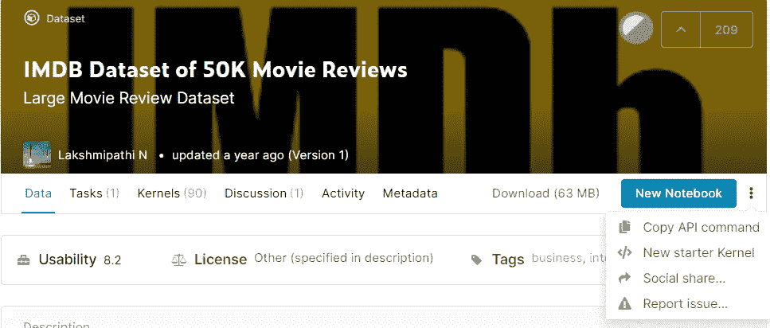
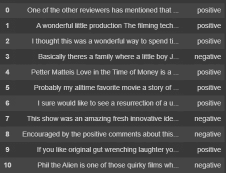

# 使用双 LSTM|使用 Streamlit 的 Web 应用程序进行情感分析

> 原文：<https://levelup.gitconnected.com/sentiment-analysis-642b935ab6f9>

1.  什么是情感分析？
2.  情感分析是用来做什么的？
3.  如何用 python 做情感分析？
4.  使用 streamlit 的情绪分析应用

# **什么是情感分析？**

情感分析是使用自然语言处理和统计学来分析文本背后的情感的过程。它是一种文本分析方法，检测文本中的极性(例如，肯定或否定的观点)，无论是整个文档、段落、句子还是子句。

理解人们的情绪对企业来说至关重要，因为客户能够比以往任何时候都更公开地表达他们的想法和感受。客户情绪可以在推文、评论、评论或其他地方找到。情绪分析有助于理解这些情绪。通过自动分析客户反馈，从调查反馈到社交媒体对话，品牌能够用心倾听客户，并定制产品和服务以满足他们的需求。

例如，我们可以使用情感分析来自动分析这些评论，并帮助您发现客户是否对您公司的产品、产品定价和客户服务满意，而不是手动查看关于公司最近产品的数千条评论。

与许多其他领域一样，[机器学习](https://www.mygreatlearning.com/blog/what-is-machine-learning/)和深度学习的进步将情感分析带入了前沿算法的前景。今天我们使用 n [自然语言处理](https://www.mygreatlearning.com/blog/natural-language-processing-tutorial/)，统计，和文本分析来提取，并且将文本的情感识别为各种类别，例如优秀，良好，最差，糟糕，或者中性。

# **情感分析有什么用途？**

据估计，世界上 80%的数据是非结构化和无组织的。每天都会产生大量的文本数据，如推文、电子邮件、支持票、聊天、社交媒体对话、调查、文章、文档等，但很难分析、理解和整理，更不用说耗时和昂贵了。然而，情感分析通过自动标记来帮助企业理解所有这些非结构化文本。

情感分析是一个非常有用的工具，可以帮助我们有效地监控社交媒体。它概述了某些主题背后的更广泛的公众意见，这种做法正在被世界各地的组织广泛采用。它有许多强大而广泛的应用，例如社交媒体上的情绪变化已被证明与股票市场的变化相关。因此，利用情绪分析，我们也可以希望通过股票市场赚钱。

在美国总统选举期间，奥巴马政府使用情感分析来衡量公众对政策声明和竞选信息的意见。能够快速看到从论坛帖子到新闻文章等一切事物背后的情绪意味着能够更好地为未来制定战略和计划。

情感分析广泛应用于市场研究和客户服务方法中。企业不仅可以看到人们对自己产品或服务的看法，还可以看到他们对竞争对手的看法。通过情感分析可以快速揭示用户的整体客户体验。

# **如何用 Python 做情感分析**

在这一节中，我将使用 python 和 Keras 构建一个情感分析器。此外，我正在使用谷歌 Colab 编码和训练网络。如果你不熟悉 Google Colab，这是一个由 **Google** 提供的免费 Jupyter 笔记本环境，在这里你可以使用免费的 GPU 和 TPU，它们可以解决所有问题，如设置编码环境、下载所有依赖项。我使用 Colab，因为它提高了神经网络的训练速度，并且我可以直接从 Kaggle 导入数据集，而不用下载到我的 PC 上。

你必须有一些关于神经网络和深度学习的知识，才能理解本节的其余部分。查看[这个](https://www.mygreatlearning.com/blog/what-is-deep-learning/)博客，了解深度学习的概况。如果你没有上述知识，不要担心，你仍然可以使用 Python 中的 SaaS API 来执行情感分析，这是由像 MonkeyLearn 这样的云解决方案提供的。因此，让我们从我们需要的最重要的东西开始，即数据。

**数据集**

这里使用的数据集可以从这个 Kaggle 链接下载。如果您下载数据集并提取压缩文件，您将看到一个 CSV 文件。该文件包含 50，000 条记录和两列:评论和观点。“评论”列包含评论的文本,“情感”列包含评论的情感。情感列可以有两个值，即“正面”和“负面”，这使得我们的问题成为二元分类问题。

或者，如果您正在使用 Google Colab，请按照以下步骤将该数据集导入到您的 Colab 笔记本中。

在开始之前，您需要从您的 kaggle 帐户下载 kaggle.json 文件。请遵循以下步骤:

1.  进入你的 Kaggle 账户，点击我的账户。如果您没有 Kaggle 帐户，请创建一个，它是免费的。
2.  接下来，通过点击“创建新的 API 令牌”按钮下载 kaggle.json 文件。
3.  去你的 Colab 笔记本开始编码

接下来，获取您想要的数据集的 API 命令(这里您不需要这样做，因为我已经将 API 命令放在下面的代码中了)



获取 API 命令以将数据直接下载到 colab

```
# Install Kaggle library
!pip install -q kagglefrom google.colab import files
#upload the kaggle.json file you downloaded
uploaded = files.upload()# make a diectoryin which kajggle.json is stored
!mkdir ~/.kaggle
!cp kaggle.json ~/.kaggle/#download the dataset into the colab(paste API command after !)
!kaggle datasets download -d lakshmi25npathi/imdb-dataset-of-50k-movie-reviews#unzip the data
!unzip imdb-dataset-of-50k-movie-reviews.zip
```

**导入所有库**

下一步是导入执行这段代码所需的所有必要的库

```
import numpy as np
import pandas as pd
from keras.preprocessing.text import Tokenizer
from keras.preprocessing.sequence import pad_sequences
from keras.models import Sequential, load_model
from keras.layers import Dense, Embedding, LSTM, Bidirectional,Flatten,Dropout
from sklearn.model_selection import train_test_split
from keras.utils.np_utils import to_categorical
import re
```

**导入并预处理数据**

在分析我们的数据时，我们发现许多评论包含 HTML 标签、数字和特殊字符，这些在评论中没有任何重要意义。所以下一步就是移除它们。

```
def remove_special_chars(tweets): # it unrolls the hashtags to normal words
 for remove in map(lambda r: re.compile(re.escape(r)), [“,”, “:”, “\””, “=”, “&”, “;”, “%”, “$”,
 “@”, “%”, “^”, “*”, “(“, “)”, “{“, “}”,
 “[“, “]”, “|”, “/”, “\\”, “>”, “<”, “-”,
 “!”, “?”, “.”, “‘“,
 “ — “, “ — -”, “#”]):
 tweets.replace(remove, “”, inplace=True)
 return tweetsdef remove_tags(text):
 return re.compile(r’<[^>]+>’).sub(‘’, text)
def remove_num(text):
 return ‘’.join(re.sub(r”([0–9]+)”,””,text))data = pd.read_csv('/content/IMDB Dataset.csv')
data.review=data.review.apply(lambda x : remove_tags(x))
data.review=data.review.apply(lambda x : remove_num(x))
remove_special_chars(data.review)
data.head()
```

输出



**单词嵌入**

第一步，我们将使用 keras.preprocessing.text 模块中的 Tokenizer 类来创建一个单词到索引的字典。在单词-索引字典中，语料库中的每个单词被用作关键字，而相应的唯一索引被用作关键字的值。因为我们希望每个评论的长度相同，以便它可以适合模型，所以我们填充它以获得所有长度相同的评论，并将每个列表的最大大小设置为 500。你可以试试不同的尺寸。大于 500 的列表将被截断为 500，这个过程称为填充。

```
tokenizer = Tokenizer(num_words=5000,filters=’!”#$%&()*+,-./:;<=>?@[\\]^_`{|}~\t\n’,lower=True,split=” “)tokenizer.fit_on_texts(data[‘review’])
X = tokenizer.texts_to_sequences(data[‘review’])
X = pad_sequences(X,maxlen=500)
Y = data[‘sentiment’]
vocab_size = len(tokenizer.word_index) + 1# We can then create our train and test sets:
X_train, X_test, Y_train, Y_test = train_test_split(X, Y, test_size=0.3, random_state = 24)#We store this tokenizer in a file to use later in web app
import pickle
# saving
with open('tokenizer.pickle', 'wb') as handle:
    pickle.dump(tokenizer, handle, protocol=pickle.HIGHEST_PROTOCOL)from sklearn.preprocessing import LabelEncoder
def prepare_targets(y_train, y_test):
 le = LabelEncoder()
 le.fit(y_train)
 y_train_enc = le.transform(y_train)
 y_test_enc = le.transform(y_test)
 return y_train_enc, y_test_encytrain,ytest = prepare_targets(Y_train,Y_test)
```

此外，我们使用 LabelEncoder 对我们的标签进行编码，因为在训练神经网络时，我们的标签需要采用这种形式。

**设计模型:**

现在我们使用 Keras 设计一个序列模型。我们添加不同的层，如嵌入层，双 LSTM 层和密集层。

双向长短期记忆是一种递归神经网络。它处理两个方向的数据，因为它有两个隐藏层。这是与 LSTM 的主要分歧点。BiLSTM 在自然语言处理方面已经证明了良好的效果。

```
model = Sequential()
model.add(Embedding(vocab_size, 50, input_length=500))
model.add(Bidirectional(LSTM(128)))
model.add(Dropout(0.5))
model.add(Dense(1,activation=’sigmoid’))
model.compile(optimizer=’adam’,
 loss=’binary_crossentropy’,
 metrics=[‘accuracy’])
model.summary()
```

**训练模型:**

接下来，我们在编译模型之后对其进行训练。我们使用“二元交叉熵”作为损失函数，因为这是一个二元分类。此外，我们使用 Keras 的 Earlystoping 方法，这样我们可以在得到最小的验证损失时停止训练过程。在对模型进行 10 个时期的训练之后，验证准确度大约为 87%,这是不错的。

```
from keras.callbacks import EarlyStopping
es = EarlyStopping(monitor=’val_loss’, mode=’min’, verbose=1, patience=5)history=model.fit(X_train, ytrain,
 batch_size=128,
 epochs=20,
 validation_data=[X_test, ytest],
 callbacks=[es])#We save this model so that we can use in own web app
model.save('movie_sent.h5')
```

**用您自己的评论进行测试:**

下一步是在真实评论上测试我们的模型，看看它是否有任何好处。记得将输入字符串转换成填充序列，就像我们处理训练数据一样

```
string11=’’’Between the Lovecraftian overtones and Liberato’s performance, 
The Beach House offers up beautifully shot terror and will make you think before opening your door.’’’
x_1=tokenizer.texts_to_sequences([string11])
x_1 = pad_sequences(x_1,maxlen=500)
model.predict(x_1)Output:
array([[0.9992687]], dtype=float32)
#the output is closer to 1 for positive review
#and closer to zero for negative review
```

# **使用 streamlit 的情绪分析应用**

如果您没有听说过 streamlit，那么您需要快速查看一下。这是一个用于机器学习和数据科学的开源应用框架，帮助我们在几个小时内而不是几周内制作出漂亮的数据应用。streamlit 最吸引人的地方在于，我们可以用 Python 来完成所有这些工作，并且可以用一个脚本来编写 Python 代码和设计我们的应用程序。

因此，现在我们基于我们在上一节中制作的情感分析器制作一个 web 应用程序。为此，我们已经保存了我们的模型并腌制了我们的记号化器，以便我们现在可以在我们自己的 PC 上使用它。在 Colab 的文件部分，您可以找到这些文件并下载。我用 Visual Studio 来编码，但你可以使用任何编辑器。

```
import streamlit as st
import pickle
from tensorflow.keras.models import load_model
from tensorflow.keras.preprocessing.text import Tokenizer
from tensorflow.keras.preprocessing.sequence import pad_sequencesdef predict(message):
 model=load_model(‘movie_sent.h5’)
 with open(‘tokenizer.pickle’, ‘rb’) as handle:
 tokenizer = pickle.load(handle)
 x_1 = tokenizer.texts_to_sequences([message])
 x_1 = pad_sequences(x_1, maxlen=500)
 predictions = model.predict(x_1)[0][0]
 return predictionsst.title(“Movie Review Sentiment Analyzer”)
message = st.text_area(“Enter Review”,”Type Here ..”)
if st.button(“Analyze”):
 with st.spinner(‘Analyzing the text …’):
 prediction=predict(message)
 if prediction > 0.6:
 st.success(“Positive review with {:.2f} confidence”.format(prediction))
 st.balloons()
 elif prediction <0.4:
 st.error(“Negative review with {:.2f} confidence”.format(1-prediction))
 else:
 st.warning(“Not sure! Try to add some more words”)
```

接下来，我们将其保存为“sent_analysis.py ”,并在终端中使用 streamlit 运行它。web 应用程序将在您的默认浏览器中打开。

```
streamlit run sent_anaysis.py
```

现在我们从烂番茄那里获取随机评论，这是一个美国电影和电视评论聚合网站。现在让我们看看这个应用程序是如何工作的。

正如我们所见，基于评论家给出的观点，这个网络应用能够准确地对评论进行分类

注意:必须注意，已经对电影评论数据进行过训练的情感分析器最适合于从电影评论中提取情感。当从关于股票或药品的评论中提取情绪时，不能指望这个情绪分析器能很好地工作。为此，我们需要用与股票或药品相关的数据来训练它。

这就把我们带到了本文的结尾，在这里我们学习了如何构建自己的情感分析器，然后基于它开发一个 web 应用程序。如果你觉得这篇文章有趣，你可以看看我的另一篇文章，描述了[如何使用深度学习对动物的高清图像进行分类](https://www.mygreatlearning.com/blog/image-recognition/)