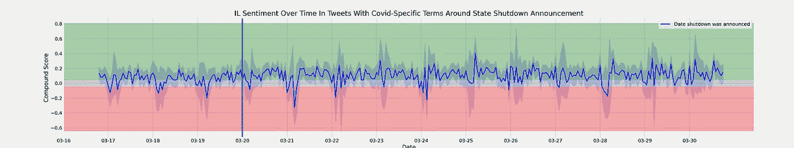
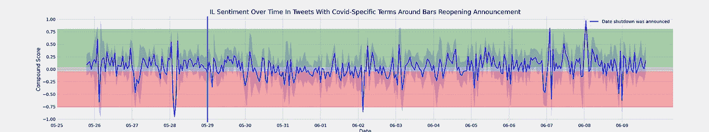

# 新冠肺炎推特上的情感分析

> 原文：<https://levelup.gitconnected.com/sentiment-analysis-on-covid-19-tweets-23e38a94fcfb>

作为我在大会上参加数据科学沉浸式课程期间的一个项目，我和一个小组被分配了对新冠肺炎社交媒体帖子进行情感分析的任务。我的队友是艾琳·阿尼博格乌、埃里克·海德堡和史蒂文·马尔科。我们一起决定使用 Twitter 作为我们选择的社交媒体平台，我们将在全州范围的封锁和重新开放的开始阶段查看和比较某些州的推文情绪。我们关注的州是纽约、新泽西、伊利诺伊、密歇根、俄亥俄、佛罗里达、乔治亚和德克萨斯。

我们努力回答的问题陈述是:

> 随着新冠肺炎·疫情继续成为美国所有餐桌上的话题，当然还有电视屏幕上的话题，关于新冠肺炎公告的普遍情绪已经成为一个兴趣点。
> 
> 由于对此疫情的大多数回应主要是基于区域和州的，我们希望集中收集受病毒影响的几个高调州的推文，比较各州对各自关闭和重新开放公告的消息的反应，并确定各州对公告的反应是否不同。
> 
> 这些州包括但不限于:—纽约、新泽西、德克萨斯、佛罗里达、俄亥俄、佐治亚、密歇根和伊利诺伊。

一旦我们知道了什么样的问题需要努力回答，以及我们想要关注的状态和时间段，我们的下一个挑战就是找出如何收集我们的数据。最初，我们认为我们可以使用 Twitter 的开发者账户来访问我们想要的推文，但即使有了 access 开发者账户，你也只能收集几天前的推文，而我们需要几个月前的数据。我们发现了一个 python 包 [GetOldTweets3](https://pypi.org/project/GetOldTweets3/) ,它允许我们从任何时间段、位置和我们选择的查询中抓取数据，而不需要任何 API，这正是我们需要的，并开始学习如何使用它。对于搜索查询，我们决定尝试在日常事务和新冠肺炎相关推文之间找到平衡。为了收集这类结果，我们添加了表示基本参与时事的术语(例如密歇根州的兰辛或惠特莫)，这使我们能够收集更多有见地和感人的推文。我们还使用了 Covid 追踪项目提供的数据，以便对特定时期内 Covid 阳性率的变化有一个总体的了解。

一旦我们收集了数据，接下来的步骤就是数据清理和 EDA —这是每个人处理数据时最喜欢的部分，对吧？为此，我们需要确保不会收集到重复的推文以及不相关的数据，日期和时间也要采用适当的日期时间格式，并按照相同的时间范围进行调整。随后，我们决定调查一些州在这期间的推特活跃程度，以及有多少推特来自某些城市。听起来很容易，但这当然是我们工作中最具挑战性和最耗时的部分。

我们的分析和建模就是对这些数据的情绪分析。对于那些可能不知道的人来说，情感分析是一种自然语言处理的形式，可以识别一篇文本的总体观点。如今，许多数据都是以文本而非数字的形式出现的，因此有办法来解释它非常重要。然而，计算机有时很难抓住一个人可能写的东西背后的全部意义。例如，像讽刺这样的比喻性语言对计算机来说很难解释。如果一个人在推特上说:“我今天过得很愉快！”讽刺的是，计算机可能会认为他们确实有一个伟大的一天，是快乐的。

这就是 VADER 的作用。VADER 代表“Valence Aware Dictionary”和“情绪推理机”。这是一个基于词典和规则的情绪分析工具，用于分析社交媒体上表达的情绪。VADER 提供了四个分数，分别是肯定的、中性的、否定的和复合的。正面、中性和负面分数都给出给定文本属于该类别的百分比，而复合分数将这三者组合起来给出范围从-1 到 1 的总体情绪分数。如果复合分数介于-1 到-0.05 之间，则认为该文本具有负面情绪；-0.05 到 0.05 表示中性情绪，而 0.05 到 1 表示正面情绪。我们绘制了这两个时期每个州的情绪图。

伊利诺伊州关闭公告的情绪分析。

伊利诺伊州重新开放公告的情绪分析。

我们发现，无论日期有多大，地方性问题通常会影响人们的情绪，而不是全国性问题，几天后情绪就会恢复正常。比较关闭和重新开门的数据，重新开门的公告比关闭公告更具负面情绪。最后，我们发现从午夜到凌晨 4 点，tweets 的复合分值绝对值更高，意味着夜间出现的峰值更强，无论是负值还是正值。为了证明这些数据是一种潜在的用户友好方式，我们创建了一个 [Tableau 仪表板](https://public.tableau.com/profile/steven.markoe#!/vizhome/ClientProject_16003790542760/Dashboard1)，它映射了一段时间范围内不同状态的情绪。

对于如何进一步推进这个项目，我们有一些想法。首先是对美国所有州进行新冠肺炎情绪分析，并比较结果。第二种方法是进行假设检验，以确定情绪分析中的任何峰值是否显著不同。第三，将其他重大/重要事件与我们的数据点联系起来会很有趣，包括新冠肺炎和非新冠肺炎相关事件。最后，对 Twitter 用户进行更多的背景研究，因为过去的研究已经显示了关于 Twitter 用户的有趣见解。

总的来说，这个项目非常有见地，是我们在这门课程中完成的第一个现代的、真实世界的范例项目之一。能够自己收集和解释数据并发现我们的发现给了我信心，让我相信我正在学习并成为比我想象的更强大的数据科学家/分析专家。它给了我信心，让我相信我正走在正确的职业道路上，并将找到一份做我热爱的事情的工作，并希望能够帮助他人。

[链接到 GitHub 库](https://github.com/haleytaft/covid-sentiment-analysis)

来源:(存储库中有更多链接)

*   [使用 Python 中的 VADER 简化情感分析(在社交媒体文本上)](https://medium.com/analytics-vidhya/simplifying-social-media-sentiment-analysis-using-vader-in-python-f9e6ec6fc52f)