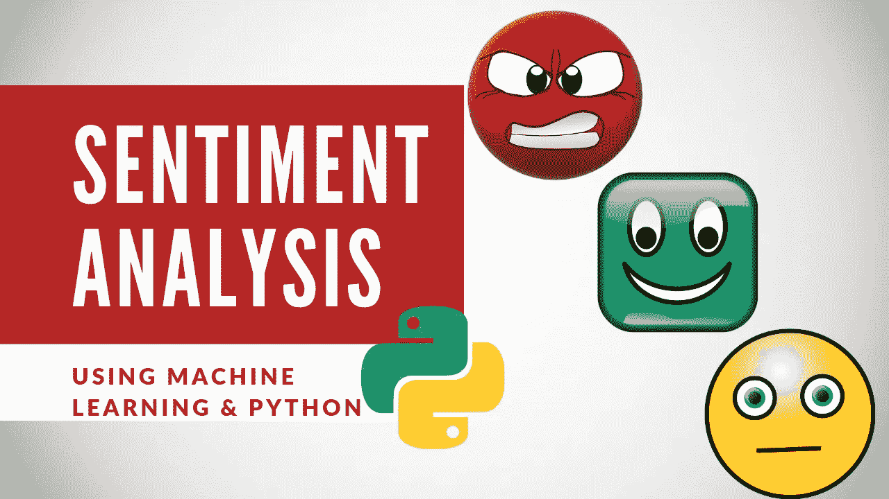
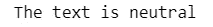

# 基于机器学习和 Python 的情感分析

> 原文：<https://levelup.gitconnected.com/sentiment-analysis-using-machine-learning-python-9122e03f8f7b>



**情感分析**是对一篇文本中表达的观点进行计算识别和分类的过程，尤其是为了确定作者对某个特定话题、产品等的态度。是正的、负的或中性的。— **维基百科**

在本文中，我将向您展示如何使用 Python 编程语言构建自己的程序来确定网站上的文章是正面的、负面的还是中性的。

如果你不想读这篇文章，想要一段视频，你可以看看下面的 [**YouTube 视频**](https://youtu.be/bUgKhp8YwO0) 。它详细介绍了本文中的所有内容，并且将帮助您轻松地开始编写自己的文章情感分析程序，即使您的计算机上没有安装编程语言 Python。或者两者都可以作为学习的辅助材料！

# 编程；编排

在编写一行代码之前，我喜欢做的第一件事是在注释中描述代码的作用。这样，我可以回顾我的代码，确切地知道程序完成了什么。

```
# Get the sentiment of articles from the internet
```

您可能需要首先安装软件包。

```
pip install newspaper3k
pip install nltk
pip install textblob
```

接下来，我们将导入库。

```
#Import the libraries
from textblob import TextBlob
import nltk
from newspaper import Article
```

现在我们将添加包含我们想要抓取的文章/文本的网站的 URL，然后我们将它存储到一个变量中。

```
#Get the article
url = '[https://everythingcomputerscience.com/'](https://everythingcomputerscience.com/')
article = Article(url)
```


被抓取的[网站](https://everythingcomputerscience.com/)的部分图片。

一旦我们有了网站的 URL，我们需要下载 URL 的 HTML 内容，解析文章，下载句子分词器，并提取关键词。

这听起来比实际上更难，这些库将使这个过程变得简单和容易。

```
# Do some NLP
article.download() #Downloads the link’s HTML content
article.parse() #Parse the article
nltk.download('punkt')#1 time download of the sentence tokenizer
article.nlp()#  Keyword extraction wrapper
```

让我们打印文本摘要，看看这个站点/文章是关于什么的。

```
text = article.summary#print text
print(text)
```

> 计算机科学(CS)计算机科学(CS)是对计算机原理和使用的研究。简单地说，它是一门研究数字计算机处理信息的理论和方法、计算机硬件和软件的设计以及计算机应用的科学。计算机只是计算机科学家的工具，就像天文学家的望远镜一样。自学！

现在我们将打印总结文本的情感值，看看这个站点的作者对主题的感受。

```
obj = TextBlob(text)#returns the sentiment of text
#by returning a value between -1.0 and 1.0
sentiment = obj.sentiment.polarity
print(sentiment)
```


中性的情感价值

当获得文本的情感时，数字是很重要的，但有时人们只是想知道网站/文章对主题是积极的、消极的还是中立的。所以我们会展示这个。

```
if sentiment == 0:
  print('The text is neutral')
elif sentiment > 0:
  print('The text is positive')
else:
  print('The text is negative')
```



# 结论和资源

就这样，你完成了创建你的程序！

同样，如果你愿意，你可以观看并听我解释我的 [YouTube 视频](https://youtu.be/bUgKhp8YwO0) **中的所有代码。**

如果你有兴趣阅读更多关于机器学习的内容，以立即开始处理问题和示例，我建议你阅读 [*用 Scikit-Learn 和 TensorFlow 进行机器学习实践:构建智能系统的概念、工具和技术。*](https://www.amazon.com/Hands-Machine-Learning-Scikit-Learn-TensorFlow/dp/1491962291/ref=sr_1_1?crid=10QDWDNMUMCYF&keywords=hands-on%20machine%20learning%20with%20scikit-learn%20and%20tensorflow&qid=1563929293&s=books&sprefix=hands-on%20machine%2Cstripbooks-intl-ship%2C143&sr=1-1&source=post_page---------------------------)

这是一本帮助初学者学习编写机器学习程序和理解机器学习概念的好书。


[使用 Scikit-Learn 和 TensorFlow 进行机器实践学习:构建智能系统的概念、工具和技术](https://www.amazon.com/Hands-Machine-Learning-Scikit-Learn-TensorFlow/dp/1491962291/ref=sr_1_1?crid=10QDWDNMUMCYF&keywords=hands-on%20machine%20learning%20with%20scikit-learn%20and%20tensorflow&qid=1563929293&s=books&sprefix=hands-on%20machine%2Cstripbooks-intl-ship%2C143&sr=1-1&source=post_page---------------------------)

感谢您阅读本文，希望对您有所帮助！

[](https://gitconnected.com/learn/python) [## 学习 Python -最佳 Python 教程(2019) | gitconnected

### Python 是一种动态的通用编程语言，在许多领域都有应用，包括 web 开发、数据科学…

gitconnected.com](https://gitconnected.com/learn/python)