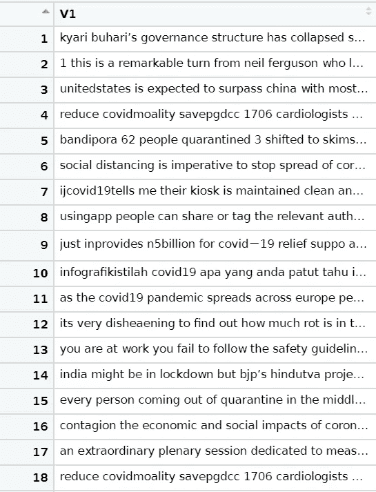

# R 语言中 Twitter 标签的情感分析

> 原文：<https://levelup.gitconnected.com/sentiment-analysis-with-twitter-hashtags-in-r-af02655f2113>

在我们目前所处的混乱和疫情中，我们如何判断全球对某一特定事件的看法是否一致？

或许消极大于积极，反之亦然。因此，我们可以创建一个从 Twitter 的推文中获得的情绪分析，来给我们一个特定事件的总体情绪的估计。

请注意，您可以将它复制到任何特定的兴趣上。我决定分析冠状病毒疾病或 COVID19 的情绪，因为在撰写本文时，这是一个广泛讨论的话题。

不管怎样，我们开始吧！

由于我们将基于 twitter 标签收集推文，我们将首先连接我们的 twitter 帐户。为此，您需要执行以下步骤:

*   为标准 API([https://developer.twitter.com/en](https://developer.twitter.com/en))申请一个 Twitter 开发者账户
*   创建应用程序
*   消费者 API 密钥和访问令牌&访问令牌秘密细节，以在 R

一旦您设法获得了以下内容，我们就可以开始加载我们分析所需的以下库。

如果你还没有下载这些库，继续运行 *install.packages* 命令或者在工具- >库下手动搜索并安装它们。

加载我们分析所需的下列库

一旦安装完毕，我们就可以使用上面提到的键来设置我们的 Twitter 帐户，从而开始我们的第一组代码。

将***替换为您各自的密钥，这将允许您使用 Twitter 标准 API 的直接认证。

接下来，我们将使用下面的代码通过 hashtags 收集 tweets。在这个例子中，我们决定收集 500 条 tweets，用 n 表示，关于标签 covid19。

如果你决定收集更多的推文，处理时间可能会长一点。我们还决定将列表转换成数据框。

查看我们刚刚获得的推文

如您所知，我们对其他列不感兴趣，如 favourited、favouriteCount 等。并且仅在文本列中。因此，我们只关注使用以下代码的文本列。

正如你所看到的，虽然我们得到了我们想要的关于标签的文本，但是它并不是标准化的。有大写或大写的字符，标点符号或链接包括在内。

理想情况下，我们会想把这些都去掉，这样我们就只剩下一些简单的词来进行分析。根据你想要删除多少标点符号、链接或空格，常见的如下。

与我们之前获得的未清除文本相比，之前应用函数后的结果。这看起来更加干净整洁，这将有助于我们以后的情感分析。

在 R 中使用自然语言处理时，需要记住的一件关键事情是 vector 必须在一个语料库列表中。因此，我们将把我们的字符向量转换成一个语料库列表。

在我们探索数据之前的最后一步是删除停用词。尤其是在 NLP 中，停用词是在我们的句子或文本中不增加任何价值的词。

停用词的示例包括:“the”、“a”、“An”、“in”

太好了！一切看起来都准备好了，在运行我们的情绪分析之前，让我们享受一下视觉化的乐趣，好吗？为此，我们将使用 wordcloud 库。

单词云的工作原理是显示一组不同大小和粗细的单词。字云里出现的字越大越粗；它表示它在文本数据中出现的频率较高。

您计划创建的单词云的值可以通过包含和更改以下内容进行调整:

*   单词:要绘制的单词
*   频率:它们的频率
*   最小频率:频率低于最小频率的单词不会被标绘
*   最大字数:要绘制的最大字数
*   random.order:随机排列单词。如果为假，它们将以递减的频率绘制
*   rot.per:旋转 90 度的文字比例(垂直文本)
*   颜色:颜色词从最少到最多。例如，使用 colors ="black "表示单色。

在我们的实例中，wordcloud 生成了以下与 covid19 相关的常见单词。

如果你喜欢视觉效果，wordcloud 是一个令人兴奋的探索包！好了，回到我们的最后一点，就是用我们收集的数据进行情感分析。

# 情感分析

情感分析是自然语言处理的应用，用于从一段文本中识别和提取主观信息。与一段文字相关的信息与情感有关，如积极、消极、快乐、恐惧等。

这对于全面了解人们在这种情况下对某个特定话题谈论或发微博的内容特别有用。

我们将首先使用我们之前加载的 syuzhet 库中的*get _ NRC _ perspective*函数。之后，我们将计算每种情绪的得分，并在列表中添加一些额外的列，如下所示。

一旦完成，我们最终可以使用 *ggplot2* 库来可视化我们的情感。

最终情感输出

从情感评分中，我们可以看到大多数关于这个特定标签 covid19 的推文都非常积极，这是一个很好的指标。

最后，根据上下文，情感分析可以提供有趣的见解，当作为一个整体收集和分析时，它看起来像是一个单一的文本。

好奇的学习者？释放你在媒体上学习的全部潜力，用不到一杯咖啡的钱支持像我这样的作家。

 [## 通过我的推荐链接加入媒体——杰森·LZP

### 作为一个媒体会员，你的会员费的一部分会给你阅读的作家，你可以完全接触到每一个故事…

lzpdatascience.medium.com](https://lzpdatascience.medium.com/membership) 

刚接触 R 编程，不知道从哪里开始？看看我的电子书一步一步的指南！

 [## 数据科学入门指南(PDF /电子书

### 有一段时间了，我希望每个人都保持安全和健康。本月初，由于封锁，我刚刚…

link.medium.com](https://link.medium.com/p0QTh0HMZbb)