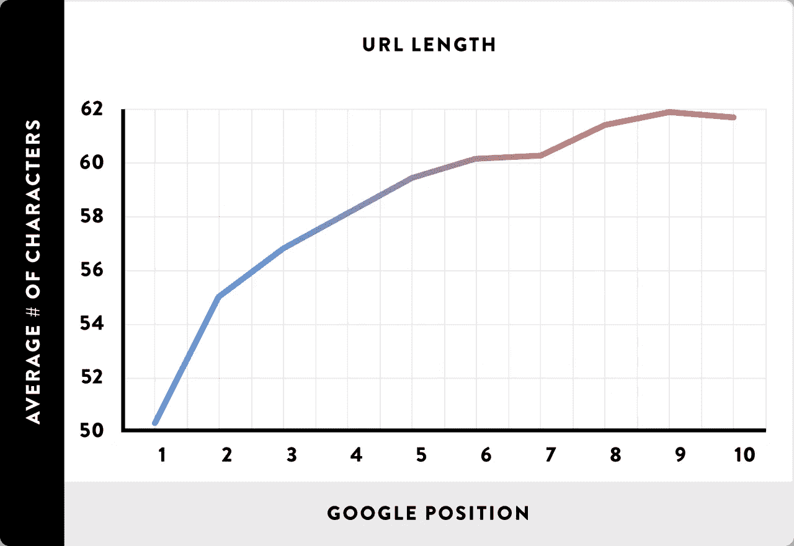

# 搜索引擎友好的网址

> 原文：<https://levelup.gitconnected.com/seo-friendly-urls-2f7c503d3fb2>

## 什么是搜索引擎友好的 URL，如何在 Apache 和 PHP 中使用它们


图片由 pixabay.com[上](https://pixabay.com/)的[挖掘营销](https://pixabay.com/illustrations/seo-search-engine-optimization-4110999/)

搜索引擎优化(SEO)似乎总是像巫术。数百个因素进入一个黑盒子，然后出来一个排名。因此，我和 SEO 总是分道扬镳。

然而，当我开始在网上建立自己的形象时，了解一些 SEO 元素似乎是个不错的主意。事实证明，有许多排名因素在你的控制范围之内。在我的网站的新版本中，我看到的第一个 SEO 组件就是 URL 本身。简单的实现并不一定是搜索引擎的最佳选择，所以在利用你的 URL 时需要考虑一些因素。

以下是我在经历了太多的时间后，对 SEO 友好的网址的一些了解:

# 搜索引擎友好的网址

谷歌和其他搜索引擎使用网站的 URL 来确定其内容，长度和关键词等因素直接影响搜索结果的排名。

那么，一个 SEO 友好的 URL 是什么样子的呢？它简短易读，包含几个描述页面内容的关键字:

`https://website.com/post/**cute-puppy-images**`

如果你在某处看到这个 URL，你可以立即在你的脑海中解析它，你可以假设它可能包含一些**可爱**小狗**的**图片**。由于我对`GET`变量的天真实现，同样的帖子在我的网站上会是这样的:**

`https://website.com/?s=**blogpost**&**bpid**=**69**`

没有办法通过查看网址来判断帖子的内容。这是一篇**博客文章**，很好，但是什么是 **bpid** ？而这个随机数 69 是什么意思？

更短的和人类可读的链接更有可能在搜索结果中被点击，有机点击率(有多少人看到一个链接点击它)是另一个排名因素。神秘的链接也不太可能在社交媒体上分享，这是理所应当的。当你看到类似`http://random.website.to/?a=29054b06c22b&b=7d5aadf10f6b`的链接时，你可能会想到病毒或骗局，但不会想到小狗。

Google 建议尽可能使用连字符和小写 URL 安全字符来分隔 URL 中的单词。安全字符有`0–9`、`a-z`，以及`-`、`?`、`&`或`=`等特殊字符。

## URL 长度

一般来说，较短的网址是首选。正如你在下图中看到的，一个 URL 的长度和它在谷歌搜索结果中的位置是相关的。尽量保持在 50 到 60 个字符之间，不要使用太多的子文件夹，包括三到五个关键词。



URL 长度和排名相关性，图片来自[backlinko.com](https://backlinko.com/hub/seo/urls)。

# HTTPS

另一个影响网站排名和点击率的 URL 组件是 SSL/TLS 加密。如今，如果你有一个公共网站，你应该**总是**使用`https://`。感谢令人惊叹的非营利认证机构[让我们加密](https://letsencrypt.org/)，你可以很容易地获得**免费的**可以自动更新的证书，所以没有理由不使用加密。

# 使用 SEO 友好的 URL

很长一段时间，我真的相信那些有着良好结构和人类可读的 URL 的网站在他们的根目录中使用了真实的文件夹和文件，它们的布局和 URL 一样。然而，一旦我想了更多，我意识到这将是一个绝对混乱的维护，特别是对于有几千个页面的大网站。一定有更好的方法来做到这一点。幸运的是:

## 街头流氓

这个想法是将所有请求重定向到一个文件，同时保持 URL 的结构。在 Apache 中有一个简单的选项:

`FallbackResource /index.php`

当请求的 URL 无法解析为真实路径时，这会将所有请求重定向到 webroot 级别的索引文件。这意味着像`/styles/style.css`这样的现有文件仍然工作，而对`/post/how-to-become-a-millionaire`的请求由索引文件处理。

`FallbackResource`选项要么放在`<Directory>`块内的虚拟主机配置中，要么放在`.htaccess`文件中。

## 服务器端编程语言（Professional Hypertext Preprocessor 的缩写）

一旦索引文件处理了所有请求，我们就可以创建一个脚本，根据 URL 显示正确的页面。包括另一个文件或从数据库动态加载内容。PHP 超全局变量`$_SERVER`包含`REQUEST_URI`字段，该字段包含请求的完整路径，例如`/post/how-to-become-a-millionaire`。当我们用斜杠分割路径时，第一个数组元素是`post`，所以我们可以包含 post 处理脚本，它从数据库加载`how-to-become-a-millionaire` post 并显示它。

```
<?php
*// trim leading slashes*
$path = ltrim( **$_SERVER['REQUEST_URI']** , '/' );
*// split at the slashes*
$elements = explode( '/' , $path );
if ( count( $elements ) > 0 )
{
    switch ( $elements[0] )
    *// do something depending on the first element in the URL*
}
?>
```

## 尾随斜线

尽管对`FallbackResource`命令有一点好奇。`/index.php`中的`/`表示它将始终指向网站根目录中的索引文件。这对于 URL 中的嵌套文件夹是必需的。然而，这意味着在根域后面会有一个尾随斜杠。

说到尾随斜线，有没有并不重要，但是你应该保持一致。我更喜欢没有尾随斜线的外观，但我无法为根域删除它。[根据谷歌工程师](https://twitter.com/JohnMu/status/943076424130363392)的说法，根域上的尾随斜杠没有问题，但对于其他路径，就有区别了:例如`https://website.com`和`https://website.com**/**`是相同的，而`https://website.com/fish`和`https://website.com/fish**/**`则不是。

不过，这真的触发了我的强迫症，我的根域名有一个斜杠，而所有其他的网址都是一致的，没有一个。救命啊！而 Firefox 和 Edge 自动隐藏斜线，Chrome 则显示。

SEO 很恐怖。有成百上千个因素，你不知道哪些因素有多大关系，而且它们在不断变化。

但是你可以做一些事情来提高你的 URL 的搜索引擎友好性。用几个关键词描述你的内容，保持网址简短易读。

Apache 和 PHP，你首选的后端工具，或者每一个主要的内容管理系统都提供了一个简单的方法来在你的网站上启用 SEO 友好的 URL，所以继续做吧，让你的 URL 也变得漂亮。

祝你在谷歌上一路顺风！