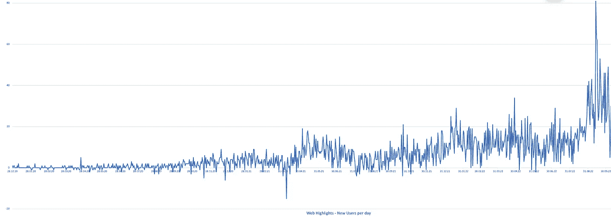
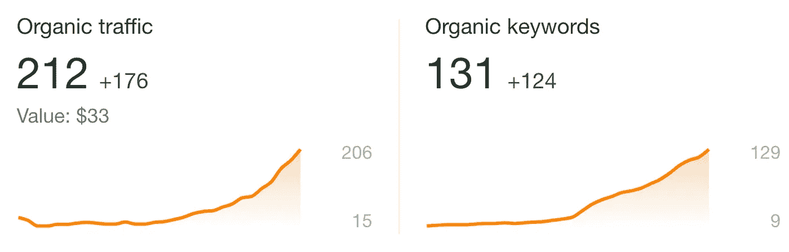
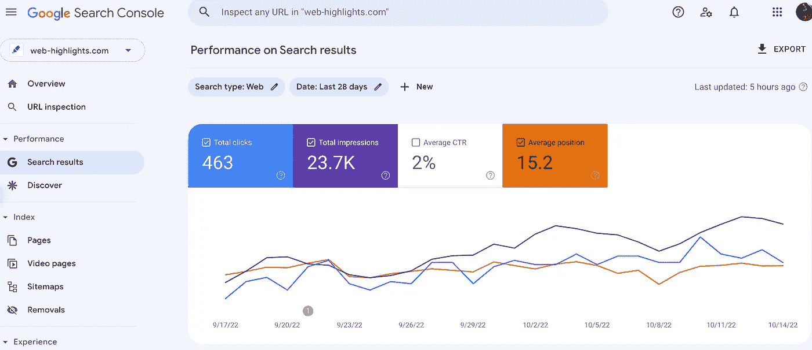
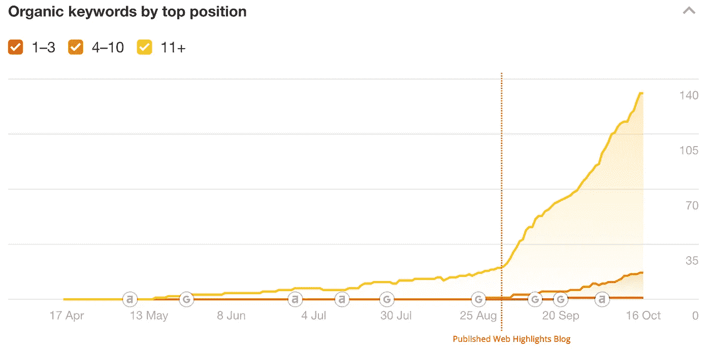
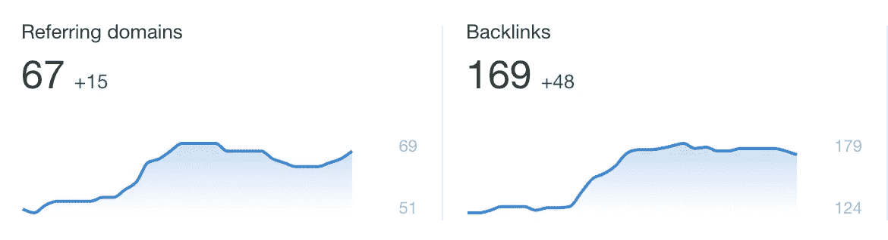
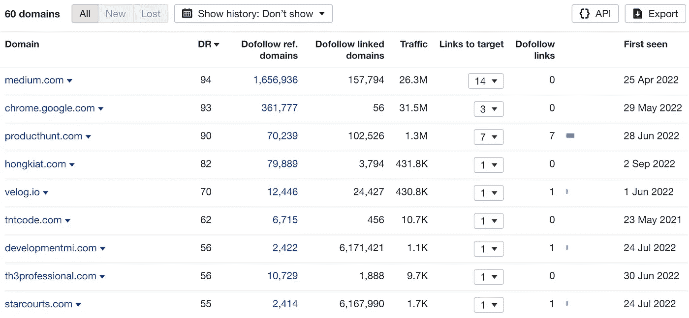

# 我使用的 SEO 策略在两个月内获得了 2000 个用户

> 原文：<https://levelup.gitconnected.com/seo-strategies-i-used-to-gain-2-000-users-in-two-months-e2313c00e107>

## 下面是我的用户群如何在短短两个月内增长了 37 %

美国宇航局在 [Unsplash](https://unsplash.com?utm_source=medium&utm_medium=referral) 拍摄的照片

当我在 Medium 上读到一篇为我今天的 [Web 亮点](https://web-highlights.com/) Chrome 扩展奠定基础的文章时，我没有动力，也有些失望。

> 增长是初创公司的生命线，这也是 Snapchat 与街角咖啡馆的不同之处——它是指数级的。德·特雷纳

两个月前， **Web Highlights** 在 [Chrome 网络商店](https://chrome.google.com/webstore/detail/web-highlights-pdf-web-hi/hldjnlbobkdkghfidgoecgmklcemanhm)拥有 3577 名活跃用户。假设你也有一个已发表的副业项目或在 Medium 上写文章。你一定会对每天查看你的文章或项目的统计数据上瘾。当然，我也在这么做，8 月初，由于用户增长停滞，我有点失望。

每天新增用户—2019 年 12 月至今

上图显示，2022 年初，日均用户增长开始下降。这让我失去了动力，主要是因为甚至有几天我会失去用户。这意味着卸载该扩展的用户多于安装它的用户。

但是，自 2022 年 6 月以来，你可以看到每天用户增长的增加，并在 9 月 13 日看到 81 名新用户。

在过去的两个月里，新用户的数量翻了一番，从每天 15 个增加到 30 多个。**我是怎么做到的？**

# 产品营销

开发人员在副业项目中遇到的最大问题之一是，许多人可以开发出很棒的产品，但往往不知道如何营销它们——下面就是其中之一👋

你可以创造出世界上最伟大的产品，但是如果没有人听说或者了解它，它注定会失败。

> 初创公司的产品团队和营销团队之间的唯一区别是，一个专注于长期增长，另一个专注于立即可衡量的增长。—[**Des Traynor 启动对讲机**](https://www.intercom.com/resources/books/intercom-starting-up)

当我开始开发 Web Highlights Chrome 扩展时，我从不关心营销或 SEO。我一直致力于开发一款产品，帮助学生、研究人员和其他人以更有条理的方式组织他们的互联网研究。

Web Highlights 还远非完美，但它可以跟上我所有的竞争对手。许多用户会说我的 web highlighter 扩展要好得多，Chrome 网络商店的评论也同意这一点。但这不是重点——事实是我的扩展目前有大约 6000 名活跃用户。我的一些竞争对手有超过 70 万的用户。

那么，我的扩展与拥有近 10 亿用户的类似荧光笔扩展有什么区别呢？

*答案是—* ***营销*** *和****SEO****。*

两个月前，我在媒体上从乔治·菲尔德那里读到了这篇文章。我留了一张私人纸条，问他是否有一些关于如何扩展和营销我的分机的建议。乔治花了很多时间给我非常有见地的提示，我们打了大约一个小时的电话。在这一点上，再次感谢你，乔治。我发现世界各地的陌生人花这么多时间去帮助别人真是令人惊讶。

以下是我从我们的谈话中总结出的几点，它们是过去两个月用户增长的原因。

 [## 网络亮点- PDF 和网络荧光笔

### 厌倦了浏览你的历史来寻找你昨天看到的信息？别担心。网络集锦覆盖了你

chrome.google.com](https://chrome.google.com/webstore/detail/web-highlights-pdf-web-hi/hldjnlbobkdkghfidgoecgmklcemanhm) 

# 在你的网站上开设博客

如果我不得不接受，我会说在 [Web Highlights](https://web-highlights.com) 上开设博客是新用户增长的关键点。

如果你的网站没有有机关键词，SEO 是不可能的。关键词告诉搜索引擎你的页面是关于什么的，这样他们就可以向搜索者显示相关的内容。在你的网站上放置有机关键词是获得更多有机流量的关键。

有机流量也是我在[媒体](https://medium.com/@mariusbongarts)和我的[网络亮点博客](https://web-highlights.com/blog/)上发表这篇文章的原因。在我主持博客之前，我的网站上只有几个关键词。我的登陆页面包含了几个句子，提供了少量的关键词。到那时，这个页面至少在谷歌搜索中是可见的。

Ahrefs 是一个分析页面有机流量的优秀工具。它包含了你的页面在排名前 100 的有机搜索结果中的所有关键词。然后它会计算一个**有机流量值**，估计你的目标网站每月获得多少有机搜索流量。

Ahrefs 有机交通—过去 90 天

上面的截图显示了 Web Highlights 的有机流量和有机关键词在过去 90 天内的发展情况。你可以看到，开设博客产生了不可思议的影响。

短短两个月，有机流量从 20 增长到 212。请注意，每月的有机流量值只是一个**估计值**。最好使用[谷歌搜索控制台](https://search.google.com/)来查看流量。

谷歌搜索控制台—[web-highlights.com](https://web-highlights.com/)

上图显示了谷歌搜索控制台工具的截图。在这里，我们可以看到在过去的 28 天里，有多少流量真正来自有机搜索流量。28 天内有 463 次点击，Web Highlights 产生的有机点击比 Ahref 估计的还要多。

Ahrefs 还可以通过顶部位置对关键字进行分组。它区分三个关键字组:

*   **排名靠后(11+)**
*   **中等排名(4-10)**
*   **高排名(1–3)**

这意味着，如果 Web Highlights 有一个像“web-highlighter”这样的高排名关键字，它将出现在前三个搜索结果中。

下面的图表更好地展示了博客托管的影响:

按顶部位置排列的有机关键词

在发布博客之前，Web Highlights 有大约 30 个排名较低的关键字，一个排名中等的关键字，没有排名较高的关键字。

如今，排名靠后的**有 140 个，排名居中的****有 30 个，甚至**还有一个排名靠前的关键词**。**

# 创建反向链接

一旦你的网站配备了一些关键词，你应该关注另一个重要的指标——**反向链接**。

一个**反向链接**只是一个从一个不同的站点到你的站点的锚链接。反向链接是提高网站 SEO 排名的最重要因素之一。

> 反向链接也称为入站链接，因为它们代表另一个网站的流量来到你自己的网站。——[mailchimp.com/marketing-glossary/backlinks/](https://mailchimp.com/marketing-glossary/backlinks/)

## **跟随和不跟随反向链接**

反向链接并不都一样。我们需要理解有两种不同类型的反向链接:

*   **Do-Follow** 链接:锚链接**无** `rel="no-follow"`属性。
*   **No-Follow** 链接:带有`rel="no-follow"`属性的锚链接。

**Do-Follow 链接:**

**Do-follow** 链接示例

**无关注链接:**

**不跟随**链接示例

**不关注**链接才是你应该关注的。但是他们很难得到。在 Medium、Quora 等平台上。，任何人都可以发布内容，链接是**no-follow**automatically。这些链接不会被谷歌抓取，也不会对你的谷歌排名有太大影响。然而，无关注链接也是有价值的，因为它们会给你的网站带来流量。

但是带来最显著效果的是 **do-follow** 链接。这些链接允许谷歌和其他搜索引擎指向你的网站。每个 do-follow 链接都会加强你的域名权威。

> 获得你的故事或者你的根域名的反向链接是在谷歌搜索中获得排名的首要因素。阿米尔·卡迈勒🚀

## **域权限**

每个反向链接从另一个网站将使您的网站排名更高。尤其是 do-follow 链接会对你的 SEO 评分产生很大的影响。

你应该专注于创建尽可能多的网站反向链接。但是，同样非常重要的是，你不仅要关注数量，还要关注反向链接域名的质量。

链接页面的**域权限**越高，对你页面的权限影响越大。

> 一个网站的域名权威度说的是这个网站对它的主题有多重要，有多大可能取得好的排名。——[en.ryte.com](https://en.ryte.com/wiki/Domain_Authority)

标度从 0 到 100，你可以用一个工具[检查域权限，就像这个](https://moz.com/domain-analysis)。例如，来自像**medium.com**(domain-authority =**95**)这样的域的反向链接将比来自低排名网站的反向链接具有更大的影响。

> Medium 是域名权限最高的网站之一。阿米尔·卡迈勒🚀

我做的事情之一是确保我的每一篇媒体文章至少有一个到 web-highlights.com 的反向链接。即使文章中的中等链接是**非关注**链接，它们仍然积极地影响着 SEO，因为它们给我的网站带来了更多的流量。

> 一个没有后续的反向链接仍然有一定的搜索引擎优化价值。— [阿米尔·卡迈勒](https://medium.com/u/dd64f287dc93?source=post_page-----e2313c00e107--------------------------------)

此外，我通过在[quora.com](https://www.quora.com/Is-there-an-extension-that-lets-me-highlight-text-on-websites-and-save-them/answer/Marius-Bongarts-1)上写答案和联系在线荧光笔比较文章的作者来链接网络亮点。

同样， [Ahrefs](https://ahrefs.com/) 可以在这方面帮助我们。我们可以很容易地看到反向链接和参考领域在过去几个月增加。

Ahrefs —反向链接的数量

此外， [Ahrefs](https://ahrefs.com/) 使我们能够分析每个链接网站的域名权限。

引用域

可以看到**medium.com**是具有最高**域权限**的链接域。不幸的是，它不像大多数链接域那样包含 do-follow 链接。

然而，例如，在 [Producthunt](https://www.producthunt.com/posts/web-highlights) 上发布我的产品，对于从一个具有非常高的域权限的页面为我的 highlighter 扩展提供七个 do-follow 链接是必不可少的。

# 改进网站结构

另一件重要的事情是改善你的网站。你要确保你的网站有好的性能，易访问性，最佳实践，特别是搜索引擎优化的分数。

使用谷歌的 Lighthouse 工具实现这一点相对容易，它包含在 Chrome 开发者工具中。或者，你可以下载 [Lighthouse Chrome 扩展。](https://chrome.google.com/webstore/detail/lighthouse/blipmdconlkpinefehnmjammfjpmpbjk?hl=de)

灯塔报—[web-highlights.com](https://web-highlights.com/)

您可以运行一个报告，告诉您如何提高分数。例如，您希望确保所有图像都包含一个可访问的`alt`属性。这使得搜索引擎也能访问你的图片。但是，最重要的是，它通过使用屏幕阅读器等工具，使您的网站对残疾人来说是可访问的。

> 也许使用`alt`标签最重要的原因是为了支持可访问性— [MDN](https://developer.mozilla.org/en-US/docs/Web/API/HTMLImageElement/alt)

实现你的网站的所有可访问性标准会给每个人带来很多好处，作为一个副作用，你会被谷歌排名更高。

我发表了几篇关于网页可访问性的文章。您可能希望从阅读以下文章开始:

*   [让你的网站无障碍的 4 个简单步骤](https://medium.com/@mariusbongarts/4-simple-steps-to-make-your-website-accessible-a29ec305da1e)
*   [停止使用 div 做按钮！](https://javascript.plainenglish.io/stop-using-divs-for-buttons-87a0b3d7945e)

# 最后的想法

许多优秀的软件产品都失败了，因为许多开发人员构建了优秀的产品，但不知道如何让大众能够使用它们。

如果谷歌找不到你的产品，它基本上就不存在。迈出第一小步，变得对搜索引擎可见并不困难。第一步是在你的页面上发布大量内容。拥有自己的博客可能是一个巨大的进步。如果你也尝试将你的网站链接到尽可能多的网站，并在你的网站上实现标准的 SEO 惯例，这将会有所帮助。

我总是乐于回答问题，并乐于接受批评。随时欢迎联系我！通过**[**LinkedIn**](https://www.linkedin.com/in/marius-bongarts-6b3638171/)**，**关注我**[**Twitter**](https://twitter.com/MariusBongarts)或 [**订阅**](https://medium.com/subscribe/@mariusbongarts) 通过电子邮件获取我的故事。****

****[**这里是无限制访问介质上每一个内容的链接**](https://medium.com/@mariusbongarts/membership) **。如果你使用此链接注册，我将免费为你赚一小笔钱。******

**** [## 通过我的推荐链接加入 Medium-Marius bong arts

### 作为一个媒体会员，你的会员费的一部分会给你阅读的作家，你可以完全接触到每一个故事…

medium.com](https://medium.com/@mariusbongarts/membership)**** 

# ****关于作者****

****我是埃森哲软件工程分析师宋。最驱动我的是我想创造一些可能对他人有帮助并改变他人生活的东西的冲动。****

****比如你是否厌倦了浏览自己的历史来寻找前几天看到的信息？我的 [**网页集锦**](https://web-highlights.com/) [**Chrome 扩展**](https://chrome.google.com/webstore/detail/web-highlights-%20-bookmark/hldjnlbobkdkghfidgoecgmklcemanhm) 覆盖了你，将通过以结构化和高效的方式组织你的研究来提高你的生产力。就像你在书和文章上做的那样，突出显示任何网页或 PDF 上的文本。你的精彩片段会直接同步到 web-highlights.com 的网络应用上，你可以在任何地方找到它们。****

# ****进一步阅读****

**** [## 我用 Web & PDF 荧光笔 Chrome 扩展达到 5000+用户的旅程

### 如何将 Chrome 扩展从一个小型项目发展到拥有超过 5000 名用户的项目？制作 PDF 和 Web 荧光笔…

web-highlights.com](https://web-highlights.com/blog/my-journey-to-5000-users-with-a-web-pdf-highlighter-chrome-extension/)  [## 我的第一个 9.99 美元之旅与我的副业

### Chrome 扩展带来的被动收入

medium.com](https://medium.com/@mariusbongarts/my-journey-to-the-first-9-99-with-my-side-project-3edc13dd1f2d)****