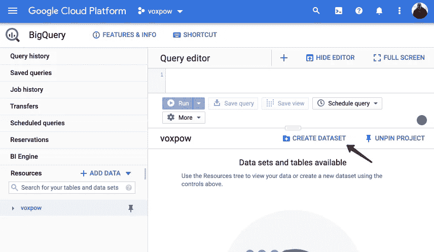
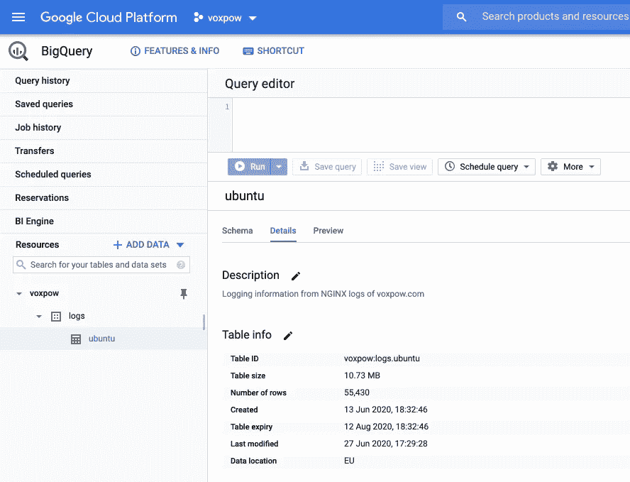
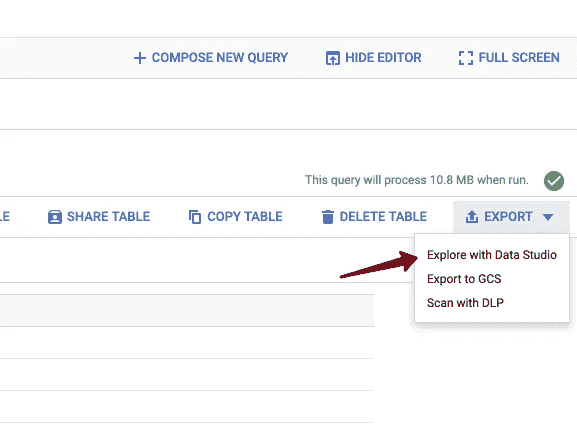
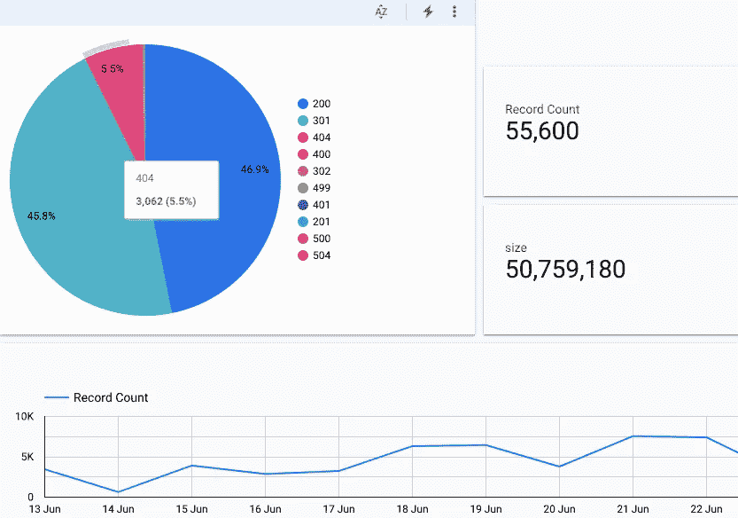

# 服务器日志流进入 BigQuery:是的，当然

> 原文：<https://levelup.gitconnected.com/server-logs-stream-into-bigquery-yes-of-course-5e47d5983d6b>

## 监控您的服务器流量，检测机器人的行为，并轻松创建图表


照片由 [Depositphotos](https://depositphotos.com/)

# 摘要

在本教程中，我们将完成从服务器向 Google BigQuery 发送包含日志数据的流所需的所有设置。
网上还有一些关于这个话题的教程，但是我发现它们不够清楚或者充满了过时的信息。为了让一切如我所料地工作，需要做各种各样的改变，我将在本文中介绍这些改变。我已经在一个语音识别平台上测试了这种方法，该平台名为 [Voxpow](https://voxpow.com/) (运行在 Ubuntu 18.04 和 Nginx 上)，几周以来，大量数据的结果已经足够好了。

# 但是我们为什么需要这个呢？

一个问题出现了——我们为什么需要它？为什么我们不直接下载日志并用 [Pandas](https://pandas.pydata.org/) 或其他工具如 [GoAccess](https://goaccess.io/) (超棒的开源网络日志分析器)进行分析？

我希望能够实时查看数据，并能够对流量进行某种分析。在我们的语音平台中，我们也有一个 API，我需要更多关于每个用户点击率的信息。

这就是我寻找实现日志流进入 [Google BigQuery](https://cloud.google.com/bigquery) 的最佳方式，在那里我们能够检查每个请求、IP 和访问过的页面。

这就像谷歌分析所有的服务器流量，而不仅仅是 JavaScript 检测到的访客。嗯，不多，但我们很接近…

借助这一技术，我们正在实现:

*   能够在我们的服务器上几乎实时监控点击量；
*   有可能看到搜索引擎机器人是如何抓取我们的网站；
*   检查是否有太多来自特定 IP 地址的访问。

每个数据都存储在 BigQuery 中，在那里我们可以使用 SQL 语法执行闪电般的请求。最重要的是，我们可以在 Google Data Studio 或定制的数据可视化解决方案中集成我们的数据。

## 什么是谷歌大查询

它是一个无服务器、高度可扩展且经济高效的云数据仓库，旨在实现业务灵活性。它允许我们执行极快的查询，并使用简单的 SQL 获得我们需要的数据——只需很少的时间。
此外，BigQuery 的高速流插入 API 为实时分析提供了强大的基础，使我们的数据可立即用于分析。这非常适合我们的需要，因为我们通常需要处理大量的信息，你可以想象普通机器人的爬行速度。

## 受影响的是什么

为了发送所有这些流信息，我们需要从服务器到 BigQuery 的某种类型的连接。使用定制的方法从日志中发送信息可能很难实现，因为我们需要在日志循环、服务器关闭、从同一个地方恢复等情况下实现特定行为的逻辑。到目前为止，我发现 Fluentd 是最适合这些需求的工具。它是统一日志记录层的开源数据收集器。它适用于 Apache 和 Nginx，但是对于本教程，我们将更多地关注 Nginx。

# 在 Ubuntu + nginx 上安装

让我们开始，去扔设置一切的过程。在 Ubuntu 18.04 + Nginx 1.14 上进行设置。

1.  **安装流体**

**2。创建一个大查询数据集**

首先，您需要在 Google Cloud 中注册，然后开始创建项目和设置服务帐户凭证的过程。如果您遇到任何问题，可以参考文档。

然后，我们必须选择使用 CLI 或可视化界面。如果你喜欢命令行，你需要检查一下 [bq](https://cloud.google.com/bigquery/docs/bq-command-line-tool) 。这是一个基于 python 的 BigQuery 命令行工具。

从可视控制台中，您可以创建这样的数据集:



在 BigQuery 中创建数据集

创建数据集后，您需要创建一个表和模式。对于命名，我们使用 **voxpow:logs:ubuntu** (数据集:表:模式)

**3。创建一个 JSON 模式来处理 web 日志+服务器主机名+ vhost 名称**

重要的一步是定义包含所有字段的模式，这些字段应该与数据相匹配。

BigQuery 的 JSON 模式

如果使用 Apache 服务器，由于日志格式不同，这个模式需要修改。

**4。安装 Fluentd 谷歌大查询插件**

安装流畅的附加插件，以便与 BiqQuery 进行通信

**5。配置 fluentd 来读取这个 vhost 的 nginx 访问日志，并上传到 BigQuery**

配置文件的位置:**/etc/TD-agent/TD-agent . conf**

Nginx 的 td 代理配置

这可能是最难的部分，因为您需要根据自己的需要调整这个配置。我们也在使用 vhosts，这可能会增加额外的复杂性，但允许我们将此功能扩展到更多的服务。

如果您想读取不同的格式，您可以更改<service>标签。</service>

连接到 BigQuery 的所有服务都放在安全位置的 JSON 文件中，不能通过 HTTP 访问。这是一部分:

```
**json_key /home/voxpow/voxpow-aSdx3sf0spf.json**
```

如果有些事情没有按预期工作或只是为了确认，您需要检查 fluentd 的日志:

**6。在确保用户 fluentd 运行身份(默认为 td-agent)对您的 Nginx 访问日志拥有读取权限后，启动(或重启)fluentd。**

您可以像这样控制和检查 Fluend 守护程序:

```
**$ sudo systemctl status td-agent**
```

您还可以启动和停止服务:

```
**$ sudo systemctl start td-agent
$ sudo systemctl stop td-agent**
```

如果您面临权限问题，这可以从日志中识别出来，那么可以使用这个简单 bash 脚本来授予日志目录权限:

以及在特定的时间内设置 cron 作业，以适应您的网站负载。请记住，日志轮换服务将根据权限更改访问文件。

**7。恭喜，您已经设置了 web 访问日志，可以注入到 BigQuery 中。**

如果有任何错误，你可以在日志中找到:**/var/log/TD-agent/TD-agent . log**

# BigQuery 中的服务器日志

如果设置一切正常，您应该能够在 BigQuery 控制台中看到点击。



BigQuery 统计

# SQL 查询示例

您可以修改并使用其中的一些示例查询，但是请记住，如果您有很多行，您可能需要为“大查询”付费，黄金法则是只询问您真正需要的信息。

对日志数据使用的 SQL 查询示例

# 图表

您可以制作各种图表，将数据直接导出到 Data Studio。



使用 Data Studio 探索



简单数据工作室可视化

# 资源使用

在最初的几周，我们有一些高 CPU 峰值，但这是由于 td-agent.conf 中的错误配置。

# 摘要

在本文中，我们讨论了 BigQuery 中的示例配置和日志流。有很多服务器分析工具，但我发现以下要点很难通过其他解决方案获得:

*   对 Google bot 抓取做一个分析；
*   API 使用情况的实时统计，在不同的命令行界面中可用；
*   快速获得 IP 信息和请求频率的可能性；
*   数据仓库并存储该信息以执行进一步的分析；

使用这种方法，很容易对搜索引擎爬虫进行详细的分析，并获得洞察力——它们如何抓取你的网站，什么样的因素对访问频率有影响，等等。