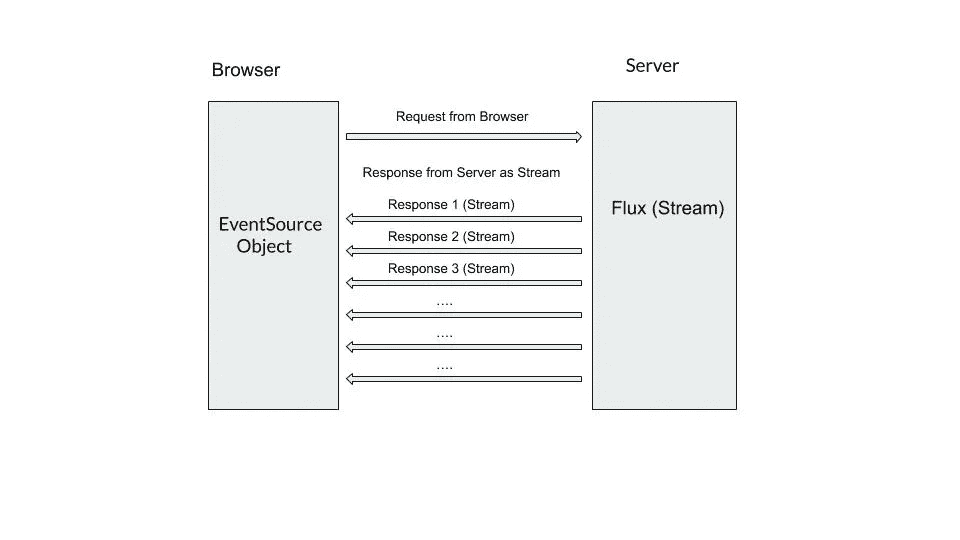
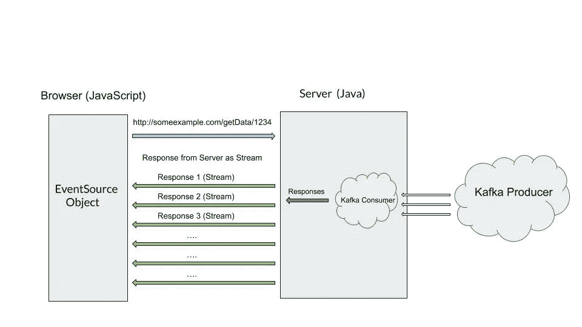
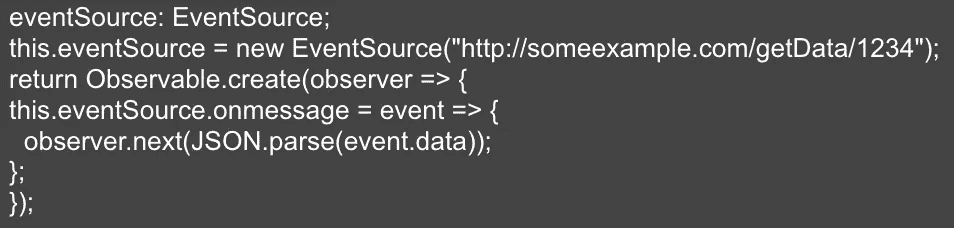
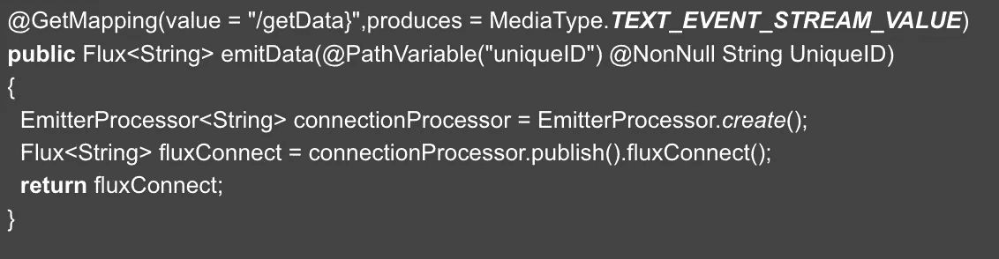
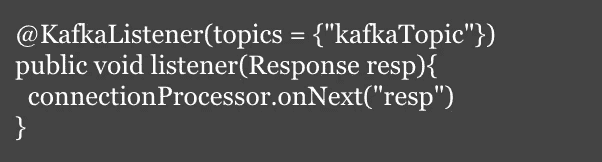

# 服务器发送的事件—架构和实现

> 原文：<https://levelup.gitconnected.com/server-sent-events-architecture-and-implementation-d4ec3fa7974e>

SSE——一个有趣的架构，已经流行了很长时间。

> 那么，什么是 SSE 呢？

通俗地说，SSE 是一个服务器发送的事件，其中 UI 首先发起调用并请求数据，然后服务器在数据可用时将数据发送回调用者(UI)。

当从 UI 建立 HTTP 连接时，服务器保持连接，并在从下游 APIs 源获得事件/数据时用数据进行响应。

与服务器立即发回响应并关闭连接的普通 HTTP 调用不同，在 SSE 中，服务器将连接保持一段时间，并在响应可用时以流的形式发回响应。它可以通过一个 HTTP 连接一个接一个地发送数据包。一旦发送完所有数据，服务器就会关闭连接。

图一。服务器发送的事件请求-响应图

如上图所示，服务器以数据流的形式发送响应。来自浏览器的单个请求将在同一个 HTTP (HTTPS)调用中发出多个响应(JSON 类型)。

然而，浏览器必须将请求实现为来自 JavaScript 的 EventSource 对象。默认情况下，这个对象存在于除了 Internet Explorer 之外的所有主流浏览器中(我知道你对此的感受…！！).

> 为什么服务器发送事件？

服务器发送事件(SSE)用于这样的场景:浏览器不断地从服务器寻找更新，当服务器端有任何可用的东西时，服务器发出响应。浏览器不会一次又一次地发出连续的请求(长轮询),而是只发出一次请求，服务器会在任何可用的时候发回响应。

**长轮询场景:**如果服务器在浏览器请求到来时没有可用的数据，通常它会发回空数据，一段时间后浏览器会再次发出请求，以检查数据是否可用，以及服务器是否做出适当的响应，如果服务器没有数据，这个循环会永远继续下去。

相信我，我见过大约 25-30 次往返调用，在这些场景中，浏览器不断检查服务器上的更新，但运气不佳。这种情况非常消耗资源，而且由于多次调用被重复进行，对浏览器资源来说非常麻烦。

该架构和 SSE 完全消除了长轮询的概念，在长轮询中，浏览器不断向服务器发出多个请求。

现在，对什么是 SSE 有了一个基本的了解，让我们稍微挖掘一下编码的观点以及如何实现这一点。

使用的技术堆栈:

1.  用户界面的 JavaScript
2.  后端的 Java
3.  作为数据消费者的阿帕奇·卡夫卡

图 2:实时 SSE 实现

> SSE 实施:

第一步:**浏览器的 JavaScript】**

浏览器通过 **EventSource 对象调用 SSE 服务器。** EventSource 对象是 SSE 的 JavaScript 实现。使用 EventSource 对象，浏览器调用服务器并保持调用，直到服务器终止调用。出于任何原因(ALB 超时、网络中断)，如果从 UI 到后端的连接中断，EventSource 对象会自动重新连接到服务器。让我告诉你，这是自动的，不需要额外的手动或编码干预。

SSE 的 JavaScript 代码片段:

第二步:**服务器上的 SSE(Java)**

a.SSE 事件以流的形式发送回来。因此，我们必须确保我们的代码/API 以“文本/事件流”的响应类型进行响应。

b.SSE 是基于来自 UI 的连接实现的。当连接请求进来时，服务器需要保持连接，直到获得响应。可以用“EmitterProcessor”用 Java 实现。这是一种可以和几个用户一起使用的处理器。该发射器处理器是与浏览器保持唯一一次性连接的处理器。

c.发送回浏览器的数据的响应类型是 Flux 类型。Flux 是负责将数据流返回给用户的对象。

Flux 和 EmitterProcessor 都是基于 Java 的 Reactor core Publisher API 构建的。 [Reactor Core](https://github.com/reactor/reactor-core) 是一个 Java 库，实现了反应式编程模型。

上面的代码描述了 GET 调用是如何在 Java 中构建的，以及响应类型如何是事件流值、接收到的连接和发送回调用者(浏览器)的 Flux 事件。

第三步: **Kafka 消费，发送 SSE 事件**

一旦建立了连接，服务器就保持连接并等待数据。在这里，我们正在阅读阿帕奇卡夫卡消费者的事件。一旦 Kafka 生产者为我们的 Kafka 消费者订阅的主题产生了事件，数据/事件将被我们的消费者消费。

读取数据，如果存在 SSE 连接，则将数据发送回浏览器。重复这个过程，直到服务器终止连接。

需要注意的事项:

使用 AWS 时，从浏览器到服务器的连接会根据应用程序负载平衡器(ALB)超时而断开。如果超时设置为 180 秒，连接会在 180 秒后断开，浏览器会自动重新连接到服务器。

我希望我的这篇文章已经帮助您理解了服务器发送事件的概念。快乐编码…！！

如果你喜欢这篇文章，请尽可能多地在页面底部拍手。它鼓励我写更多。