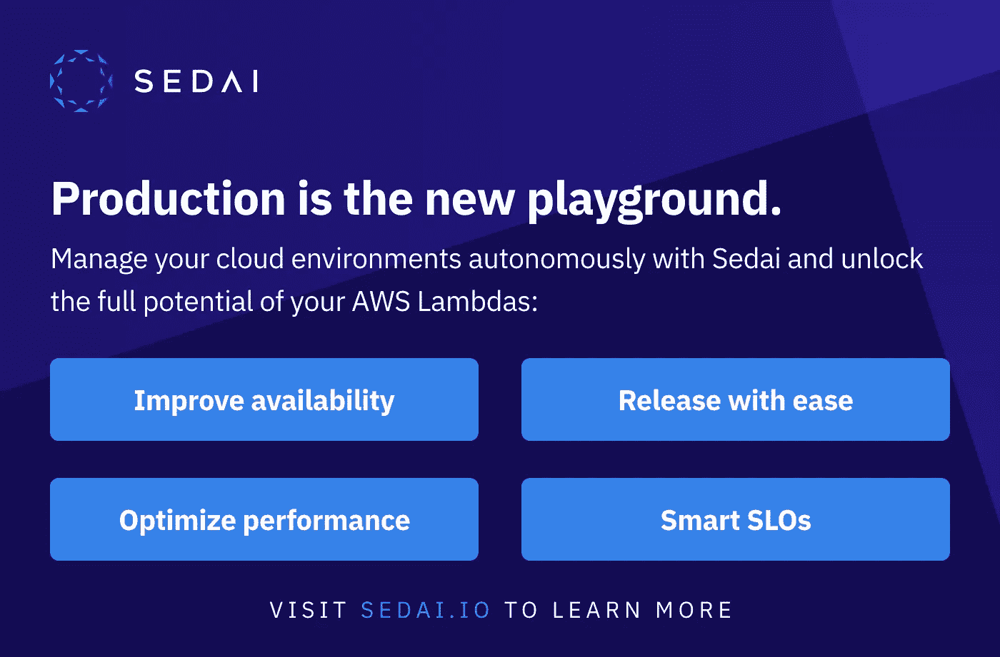

# 无服务器 API 到 API 认证🚀

> 原文：<https://levelup.gitconnected.com/serverless-api-to-api-authentication-d4cb4472721e>


肯里克·米尔斯在 [Unsplash](https://unsplash.com/s/photos/stop-hand?utm_source=unsplash&utm_medium=referral&utm_content=creditCopyText) 拍摄的照片

## 使用 OAuth2 客户端凭证授权流，使用 Amazon Cognito 验证 API 到 API 集成的实用指南，包括代码示例和视觉效果。

# 介绍

在无服务器的世界中，在开发解决方案时，总会有两个或多个 API 需要同步地相互通信的情况。

黄金标准是使用事件的完全解耦的域服务，但是在现实中，经常有一些原因需要使用 REST 的机器对机器风格的通信。

这篇博文介绍了如何使用 [OAuth2 客户端凭证授权流](https://aws.amazon.com/blogs/mobile/understanding-amazon-cognito-user-pool-oauth-2-0-grants/)来认证 API(*机器*)而不是用户，使用 [AWS Cognito](https://aws.amazon.com/cognito/) 、 [API 网关](https://aws.amazon.com/api-gateway/)、 [AWS Lambda](https://aws.amazon.com/lambda/) 和 [TypeScript](https://www.typescriptlang.org/) ，为了便于演示，这些都托管在 [Lerna monorepo](https://lerna.js.org/) 中。您可以在 这里[查看代码回购。](https://github.com/leegilmorecode/serverless-api-to-api-auth)

我们将构建以下无服务器体系结构:


我们正在构建的解决方案的示例架构

**建筑工程如下:**

1.  用户调用`create orders` POST API 端点。(*为了便于演示，此端点没有任何身份验证*)
2.  后端 lambda 然后为具有所需范围的交付 API 生成一个访问令牌(在这个场景中是`create.delivery`)。
3.  从 AWS Cognito 返回的访问令牌随后在请求的`Authorization`报头中发送给 deliveries API，即创建交付端点。
4.  我们针对交付 API 的 API 网关配置将自动为我们验证令牌，即令牌是否有效、未过期、是否由正确的提供商发布、令牌上是否有针对该特定端点的正确范围等
5.  如果是一个`valid`令牌，我们允许 API Gateway 调用正确的 lambda。如果是`invalid`，那么请求将被拒绝。

> *💡* ***注意*** :通常 lambda 会与 DynamoDB 之类的后端数据存储进行交互，但是我们只是将控制台输出记录到 CloudWatch 中以查看发生了什么，因为这个演示只是使用 Cognito 来显示 M2M 流。

## 有哪些替代方案？

根据我的经验，一些团队通常会单独使用 **API 密匙**进行认证和授权，这不是一个好主意，也不是最佳实践:

> “不要依赖 API 密钥作为 API 认证和授权的唯一手段。首先，如果在一个使用计划中有多个 API，拥有该使用计划中一个 API 的有效 API 键的用户可以访问该使用计划中的所有 API。相反，使用 IAM 角色、[Lambda 授权者](https://docs.aws.amazon.com/apigateway/latest/developerguide/apigateway-use-lambda-authorizer.html)或 [Amazon Cognito 用户池](https://docs.aws.amazon.com/apigateway/latest/developerguide/apigateway-integrate-with-cognito.html)。—[https://docs . AWS . Amazon . com/API gateway/latest/developer guide/API-gateway-API-usage-plans . html](https://docs.aws.amazon.com/apigateway/latest/developerguide/api-gateway-api-usage-plans.html)

控制对 API Gateway 的访问的一些其他替代方法在这里[详细介绍](https://docs.aws.amazon.com/apigateway/latest/developerguide/apigateway-control-access-to-api.html)，但是使用本文中的方法的好处是它也可以用于其他服务，如 AWS AppSync，因为它是一个行业标准，也可以与 Lambda Authorisers 结合使用。

# 让我们开始行动吧！🚀

> *🛑*
> 
> *💡* ***注*** :示例代码尚未准备好投入生产，有详细的注释来突出整体概念和架构。

**该解决方案在一个 Lerna monorepo 内分为三个无服务器应用**:

1.  🔐授权服务( *AWS 认知客户端、资源服务器等*)
2.  🛍️订单服务 API ( *面向公众的客户，即消费者*)
3.  📦交付服务 API ( *内部资源服务器*)

我们可以通过下面的步骤来部署它们。

## 部署授权资源🔐

在回购运行的基础上`npm i`然后`npm run bootstrap` ( *这将安装依赖项，然后引导 Lerna*

完成上述步骤后，运行以下命令从`./apps/auth-service`文件夹部署认证服务:`npm run deploy:develop`

部署完成后，为了测试如何取回访问令牌，您可以使用终端运行以下 CURL 命令(*替换占位符*)

```
curl -X POST --user <client_id_here>:<client_secret_here> 'https://serverless-auth-service-develop.auth.eu-west-1.amazoncognito.com/oauth2/token?grant_type=client_credentials&scope=serverless-auth-service-develop/cancel.delivery' -H 'Content-Type: application/x-www-form-urlencoded'
```

或者，您可以通过创建一个新资源来使用 [Postman](https://www.postman.com/) ，单击`Authorization`选项卡，将类型更改为“`OAuth 2.0`”，并在单击“`Get New Access Token`”之前填写详细信息:


需要添加客户端 ID 和客户端密码的 Postman 屏幕示例

如果您获取返回的结果`access_token`，您可以使用[https://jwt.io/](https://jwt.io/)(*如下图*所示)查看 JWT 的内容


来自 AWS Cognito 的解码访问令牌示例

正如您可以从生成的访问令牌中看到的，它具有以下内容:

1.  它只有`cancel.delivery`作用域，因为这是令牌所请求的全部内容(*如果您将此留空，您将获得客户端拥有的所有可用作用域*
2.  它有一个`exp`属性，即到期的纪元日期/时间。
3.  它有一个唯一的`sub`和`client_id`属性，即应用程序客户端 ID ( *即订单 API* )
4.  在纪元日期/时间发布的`iat`属性。
5.  它有一个`jti`属性，这是这个特定令牌的唯一标识符。
6.  它有一个`iss`属性，是颁发令牌的身份提供者，在我们的场景中是我们的 AWS Cognito 用户池。

## 部署交付 API📦

完成上述步骤后，从`./apps/deliveries`目录运行以下命令来部署交付服务:`npm run deploy:develop`

> *💡* ***注意*** :在 Auth Service `*serverless.yml*`中我们将用户池的 arn 推送到[参数存储](https://docs.aws.amazon.com/systems-manager/latest/userguide/systems-manager-parameter-store.html)这里:

```
# push the value to parameter store
UserPoolArnSSMParameter:
   Type: AWS::SSM::Parameter
   Properties:
      Name: **'/serverless-auth/${self:provider.stage}/userpool-arn'**
      Type: String
      Value:
         Fn::GetAtt:
            - UserPoolResource
            - Arn
   Description: SSM Parameter for cognito userpool arn.
```

> 要在此处的交货`*serverless.yml*`堆栈中消费:

```
authorizer:
   # import the arn via ssm
   **arn: ${ssm:/serverless-auth/${self:provider.stage}/userpool-arn}**
   scopes:
      - serverless-auth-service-develop/create.delivery
```

> 我们需要使用 SSM 而不是 CloudFormation [跨堆栈](https://aws.amazon.com/premiumsupport/knowledge-center/cloudformation-reference-resource/)的输出和输入来实现这一点的原因是，由于 API 网关的底层 CloudFormation，目前该`*Authorizer*`属性的无服务器框架存在一个[问题。](https://github.com/serverless/serverless/issues/3212#issuecomment-307341924)

## 获取订单 API 部署🛍️

最后，完成上述步骤后，从`./apps/orders`目录运行以下命令来部署订单服务:`npm run deploy:develop`

这是现在部署的所有相关服务！🥳

# 端到端测试✔️

现在让我们对其进行端到端的测试，看看它的运行情况，并在 CloudWatch 中查看生成的日志。

您可以从`./postman`文件夹中导入 Postman 文件`serverless-auth-service.postman_collection.json` ，这将允许您点击创建订单端点，返回如下所示的类似响应:


来自创建订单端点的响应示例

现在，您可以使用下面的查询，通过上面响应中的`CorrelationID`属性，使用 [CloudWatch Log Insights](https://docs.aws.amazon.com/AmazonCloudWatch/latest/logs/AnalyzingLogData.html) 来整理您跨两个域服务的日志(下面显示了我们的示例关联 ID 的*结果)*

```
fields *@timestamp*, *@message* | filter *@message* like /a9b0f153-8cd7-4257-8ff9-34ce33678738/
| sort *@timestamp* asc
| limit 50
```


使用 CloudWatch Log Insights 跨多个日志组按 CorrelationId 查看所有呼叫

从上面经过整理的日志中可以看到，Orders 服务生成了一个访问令牌，该令牌具有正确的作用域，允许它成功地调用内部交付服务。

# 缓存令牌

对于生产服务，您可能希望缓存访问令牌，而不是在每次 lambda 调用中一遍又一遍地生成它们(*特别是如果您出于安全原因将它们设置为一小时后过期*)。

**更新**:正如神奇的[辛·布里萨尔斯](https://medium.com/u/33d1209889d5?source=post_page-----d4cb4472721e--------------------------------)向我指出的，访问令牌和刷新令牌的到期时间如下:

"*访问令牌可以配置为在最短 5 分钟或最长 24 小时内过期。刷新令牌可以配置为在短至一小时内到期，长至十年后到期。*

下图显示了在没有缓存的情况下，lambdas 如何不断地生成相同的访问令牌，每次只使用一次。


图中显示了 lambdas 向外扩展，每个生成一个新令牌

## 我们如何用缓存来解决这个问题？

在现实中，你可能会在一个服务中缓存令牌，例如[参数存储](https://docs.aws.amazon.com/systems-manager/latest/userguide/systems-manager-parameter-store.html)，并使用[应用配置 Lambda 层](https://docs.aws.amazon.com/appconfig/latest/userguide/what-is-appconfig.html)将令牌自动拉入各种 Lambda 并缓存；如果令牌即将到期，则 Lambda 可以重新生成一次访问令牌，并将其推回到参数存储区，以供后续的扩展 Lambda 获取。(**我将在后续文章**中展示这一点)

其架构如下所示:


显示使用应用配置和 Lambda 层存储访问令牌的图表

我在下面的博文中介绍了如何使用[应用配置 Lambda 层](https://docs.aws.amazon.com/appconfig/latest/userguide/what-is-appconfig.html):

[](/serverless-feature-flags-6e49d534e79f) [## 无服务器功能标志🚀

### 带有 lambda 扩展和 AppConfig 的无服务器功能标志

levelup.gitconnected.com](/serverless-feature-flags-6e49d534e79f) 

# 包扎

这是一个超级基础的例子，展示了如何认证 API 到 API 通信的前提，但是我希望你发现它是有用的，并且是一个工作的基础！在后续文章( *V2* )中，我将进一步举这个例子并展示:

1.  用不同的方法缓存访问令牌。
2.  将这种方法与其他 AWS 服务一起使用，作为在您的解决方案中认证 API 的单一方式(*例如与 AWS AppSync 一起使用，使用 Lambda 授权器等*

我很乐意就以下任何一个问题与您联系:

[https://www.linkedin.com/in/lee-james-gilmore/](https://www.linkedin.com/in/lee-james-gilmore/)https://twitter.com/LeeJamesGilmore[](https://twitter.com/LeeJamesGilmore)

如果你觉得这些文章鼓舞人心或有用，请随时用虚拟咖啡[https://www.buymeacoffee.com/leegilmore](https://www.buymeacoffee.com/leegilmore)来支持我，不管怎样，让我们联系和聊天吧！☕️

如果你喜欢这些帖子，请关注我的简介[李·詹姆斯·吉尔摩](https://medium.com/u/2906c6def240?source=post_page-----39c4f4ae5aff----------------------)以获取更多的帖子/系列，不要忘了联系并问好👋

如果你喜欢，也请使用帖子底部的“鼓掌”功能！( ***你可以鼓掌不止一次！！*** )

**本文由** [**Sedai.io**](https://www.sedai.io/) 赞助



# 关于我

"*大家好，我是 Lee，英国的 AWS 认证技术架构师和首席软件工程师，目前担任技术云架构师和首席无服务器开发人员，过去 5 年主要从事 AWS 上的全栈 JavaScript 工作。*

*我认为自己是一个热爱 AWS、创新、软件架构和技术的无服务器布道者。*

****所提供的信息是我个人的观点，我对这些信息的使用不承担任何责任。*****