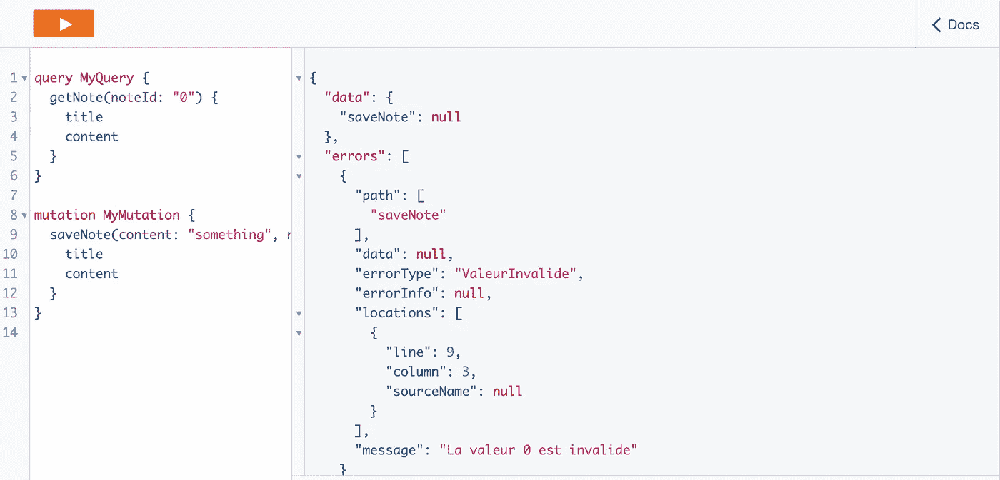
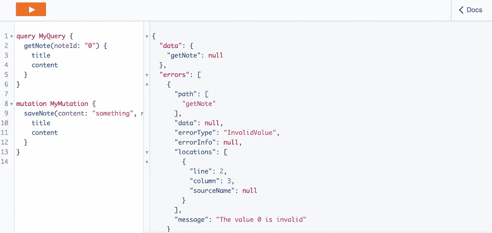
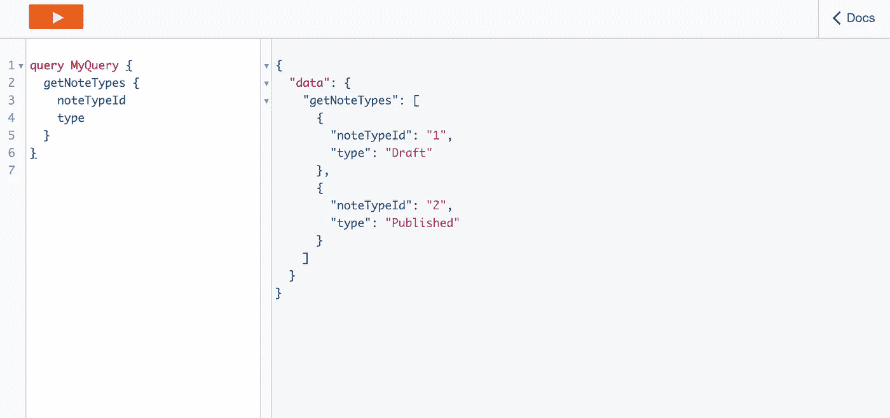
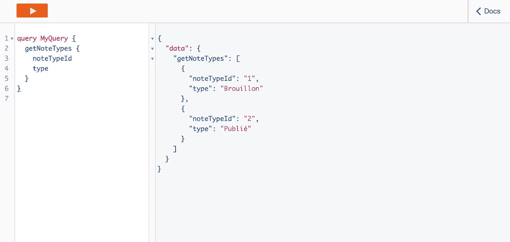

# 无服务器 AppSync 本地化和 i18n🚀

> 原文：<https://levelup.gitconnected.com/serverless-appsync-localisation-i18n-a72fe0a75876>

Francesco Casalino 在 [Unsplash](https://unsplash.com/s/photos/letters?utm_source=unsplash&utm_medium=referral&utm_content=creditCopyText) 上拍摄的照片

## 介绍

自从 AWS 推出 [AppSync](https://aws.amazon.com/appsync/) 以来，它已经成为无服务器世界的游戏改变者，允许团队使用托管的 GraphQL 服务，用于 web 应用程序和移动设备。如果您将这与[无服务器框架](https://www.serverless.com/)和[无服务器 appsync](https://github.com/sid88in/serverless-appsync-plugin) 插件结合起来，您就有了一个非常强大的方法来快速构建无服务器生产就绪的 GraphQL APIs。💥

然而，缺点之一是使用了 [VTL ( *速度模板语言*)模板](https://docs.aws.amazon.com/appsync/latest/devguide/resolver-mapping-template-reference-overview.html)，即 graphQL 解析器和底层服务( *DynamoDB、Lambda、HTTP 等*)之间的“*粘合代码*”，**是它们在本地化、重用正则表达式、静态数据和 i18n 方面不够灵活！😢**

这篇博客文章将讨论一种新颖的方法来翻译后端 AppSync 日志、配置值和 API 返回值，这是基于它是为哪种语言环境而构建的！你可以在这里 找到非常基本的回购 [**的例子。**](https://github.com/leegilmorecode/serverless-appsync-i18n)

## 快速提醒，AppSync 和 GraphQL 是什么？

AWS AppSync 被描述为:

> AWS AppSync 是一个完全托管的服务，通过处理安全连接到 AWS DynamoDB、Lambda 等数据源的繁重工作，可以轻松开发 GraphQL APIs。添加缓存以提高性能，订阅以支持实时更新，以及客户端数据存储以保持离线客户端同步也同样简单。部署完成后，AWS AppSync 会自动调整 GraphQL API 执行引擎，以满足 API 请求量。— AWS

该视频很好地概述了这项服务:

## 那么本地化的方法是什么呢？🤔

让我们举一个例子，它的代码可以在这里 找到 [**。**](https://github.com/leegilmorecode/serverless-appsync-i18n)

您为自己的公司构建了一个很酷的 notes 服务，该服务在英国取得了巨大成功，现在产品管理部门希望将该服务部署到法国，为他们的法国客户服务！然而，我们的问题是:

1.  **graph QL 解析器的返回值都是英文的(*在 VTL* 中硬编码)，而且它们需要是法文的！🇫🇷**
2.  **当产品部署到巴黎地区时，将为产品提供支持的团队都会说法语，所以理想情况下日志也应该是法语的(*同样，在 VTL 硬编码*)。🇫🇷**
3.  当我们不需要计算层时，我们不想重复所有的工作，或者每当另一个场所想要接受服务时就跳到 lambda！🤷

这是一个虚构的例子，当然 lol，我的法语是不存在的，虽然我已经在企业无服务器域服务上使用了这种方法，这些服务是在以前的公司使用 AppSync 构建的，并在 AWS 上跨多个地区使用。这是整个堆栈中的“一次构建并部署到任何地区”的第一思维模式。

方法是在无服务器构建时使用 ***替换*** 属性，根据**区域设置标志和 JavaScript** 将正确的值注入 VTL 模板。这是利用了在我写的[这里](/serverless-framework-meets-the-cdk-70037c730c04) ✔️的博客中讨论的`serverless.js`或`serverless.ts`文件

## 我们来看一个例子！

首先，我们需要创建一些 JavaScript 文件，这些文件可以导入到无服务器文件中，并返回扩展到用于翻译的 JS 替换属性中的函数，例如`error messages`:

基于区域设置返回正确值的错误消息示例函数

和`error types`:

基于区域设置返回正确值的错误类型示例函数

**注意**在`invalidValueErrorMessage`属性中，我们有一个占位符`{0}`，它对应于下面的 VTL 代码:

然后我们可以将这些值分散到`substitutions`属性和`serverless.js`文件中，这样它们将在无服务器构建时替换任何占位符:

> 替换允许将变量从这里传递到速度模板
> ${exampleVar1}将在所有映射模板中替换为给定值—[https://github.com/sid88in/serverless-appsync-plugin](https://github.com/sid88in/serverless-appsync-plugin)

这意味着，如果我们现在尝试在部署到 **Paris** 地区时使用 noteId 为`0`的解析器`getNote`或`saveNote`，您将会得到以下特定于地区的错误消息/日志:

使用模板和替换的法语部署错误消息

或以下为英国**部署:**

使用模板和替换的英国部署错误消息

## 你还能做什么很酷的事情？

这种灵活的方法还允许我们使用`local resolver`返回硬编码的数据，比如枚举和基本列表，而不是像 DynamoDB 这样的数据存储。解析器`getNoteTypes`的 VTL 示例如下:

基本的 VTL 文件，将一组对象放入有效负载

对应的 JavaScript 函数`getNoteTypes.js`为:

构建时被替换的硬编码静态列表数据示例

当被查询时，它将在 **UK** 中返回以下值:

使用模板和替换的英国部署基础数据

以下为**法国**的部署:

使用模板和替换的法国部署基础数据

这种方法我过去也曾使用过，通过使用 [$matches 方法](https://docs.aws.amazon.com/appsync/latest/devguide/resolver-util-reference.html)可以在 VTL 文件中使用的**通用正则表达式**，也可以在 Lambdas 和其他代码中使用，因此它们被定义在一个地方。您还可以对配置值执行同样的操作，例如 ElasticSearch 分页请求 VTL 中的最大页面大小。这里的关键是将它们导出到 NPM 包中，或者作为您的 monorepo 的一部分，以便它们可以在您的整个堆栈中使用。

重要的一点是，在使用无服务器时，显示 JavaScript/TypeScript 相对于其他语言(如 Java、Python 和 Dotnet Core 等)的灵活性。

**我希望你觉得这很有用，如果有，请在 LinkedIn 上告诉我！**

## AppSync 愿望列表

如果我对 AppSync 团队有一个具体的愿望清单，那就是:

1.  提供内部 API 选项，就像 API Gateway 一样。许多团队希望将 AppSync 用于内部企业应用程序，但据我所知，没有办法使其仅可用于给定的网络(或 VPN)🤔
2.  **这个**https://github.com/aws/aws-appsync-community/issues/147→[❤️](https://github.com/aws/aws-appsync-community/issues/147)
3.  允许在需要时不进行身份验证。是的，你可以用 IAM 解决这个问题，但是对于许多不需要登录的网站来说，这是一个痛苦的设置..

# 包扎

如果你觉得这篇文章很有趣，那么让我们联系以下任何一个:

【https://www.linkedin.com/in/lee-james-gilmore/
[https://twitter.com/LeeJamesGilmore](https://twitter.com/LeeJamesGilmore)

如果你觉得这些文章鼓舞人心或有用，请随时用虚拟咖啡[https://www.buymeacoffee.com/leegilmore](https://www.buymeacoffee.com/leegilmore)来支持我，不管怎样，让我们联系和聊天吧！☕️

如果你喜欢这些帖子，请关注我的简介[李·詹姆斯·吉尔摩](https://medium.com/u/2906c6def240?source=post_page-----39c4f4ae5aff----------------------)以获取更多的帖子/系列，不要忘记联系我并打招呼👋

**本文由**[**sedai . io**](https://www.sedai.io/)赞助

# 关于我

"*大家好，我是 Lee，英国的 AWS 认证技术架构师和首席软件工程师，目前担任技术云架构师和首席无服务器开发人员，过去 5 年主要从事 AWS 上的全栈 JavaScript 工作。*

*我认为自己是一个无服务器布道者，热爱 AWS、创新、软件架构和技术。*”

****所提供的信息是我个人的观点，我对这些信息的使用不承担任何责任。*****