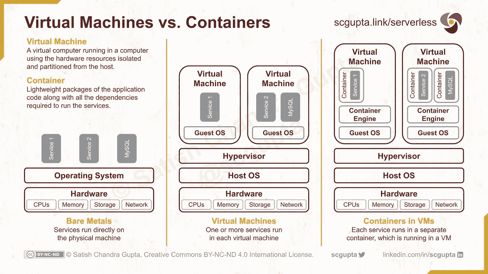
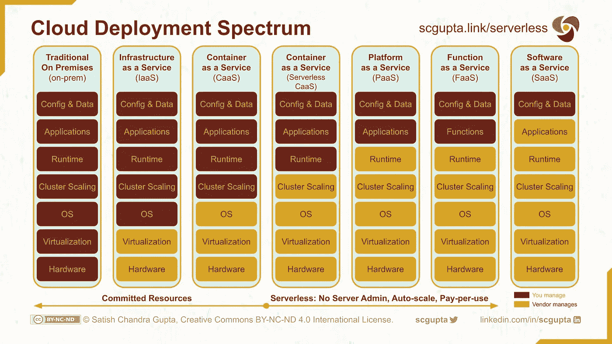
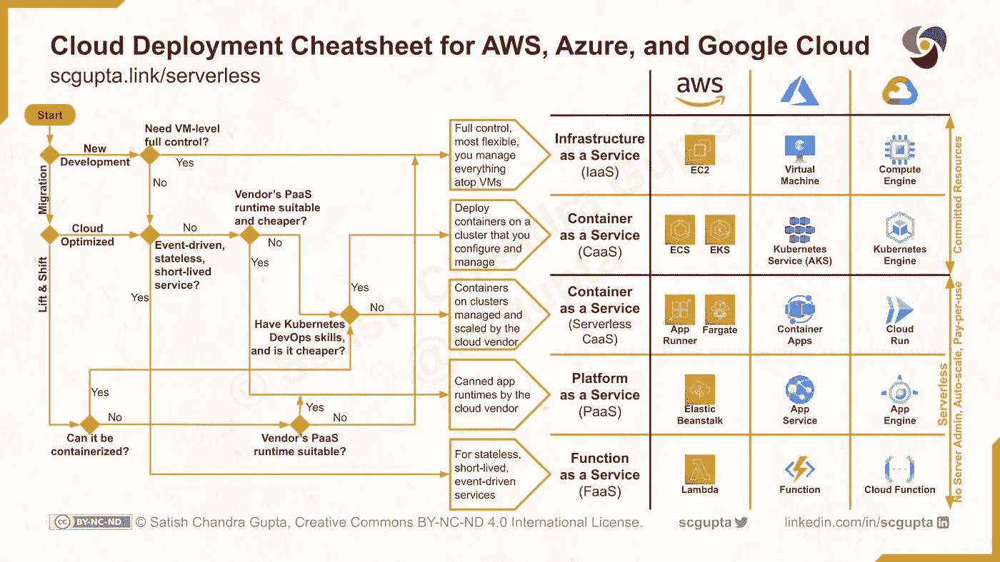

# AWS、Azure 和 Google Cloud 上的无服务器计算

> 原文：<https://levelup.gitconnected.com/serverless-architecture-for-microservices-on-aws-vs-google-cloud-vs-azure-as-iaas-caas-paas-faas-6a64cdaaab86>

布兰登·尼尔森在 [Unsplash](https://unsplash.com/photos/L4v4T5aDtnE) 上拍摄的照片

## 微服务

## 了解云部署环境，为您的应用、团队和业务选择最佳替代方案。

亚马逊在 2006 年推出了第一个 AWS 服务:S3 用于存储，EC2 用于计算。现在，来自 AWS、Azure 和 Google Cloud 等各种云供应商的服务和产品太多了。评估这么多选项并选择一个适合你的会让人不知所措。

选择合适的基础设施方案不仅与应用的技术要求有关，还与团队的专业知识和企业的发展阶段有关。

在本文中，您将了解目前可用的云部署方案，以及如何根据您的需求选择合适的方案。我们还将深入探讨无服务器替代方案，以及随着您的团队和业务的增长，什么可以使跨替代方案的迁移变得更容易。

# 云计算

让我们快速回顾一下什么是云计算，为什么它变得如此广泛。

云计算是最基本的计算机资源的*虚拟化*，并使它们按需可用*:*

*   ***计算:** CPU、GPU 和内存*
*   ***存储:**持久磁盘*
*   ***网络:**数据 IO 带宽*

*其他云服务，如数据库、事件队列都是建立在这些原始资源之上的。*

*用户不必亲自维护 IT 基础架构。相反，计算机资源被整合到分布式数据中心，并在用户之间共享。云的价值主张是:*

*   *免除 IT 基础架构的资本支出规划*
*   *能够按需扩展 IT 基础架构，以及*
*   *数据中心基础架构整合带来的规模经济。*

*有两种云 IT 基础架构:*

*   ***内部:**当您运行自己的数据中心，为整个公司的团队整合 IT 基础架构时。*
*   ***公有云:**当你把它外包给云厂商(AWS，Azure，Google Cloud，IBM 等。)，其 IT 基础架构由多个客户共享。*

*有不同的服务模式(IaaS、PaaS、SaaS 等。)取决于您在云部署中期望的控制和抽象级别。我们将研究每一个模型，但首先让我们了解无服务器计算。*

# *无服务器计算*

*无服务器并不意味着没有服务器。只是开发者不与服务器交互，也不管理服务器。无服务器计算有三个特征:*

*   ***无服务器管理员:**无前期供应，无服务器管理*
*   ***自动扩展:** infra 会根据使用情况自动扩展，并且高度可用*
*   ***按使用付费:**没有闲置的基础设施成本，只为您使用的东西付费*

*三大云供应商都提供几种*无服务器*云服务，如数据库、数据仓库、事件流和 API 网关。在本文中，我们将重点关注用于部署应用程序和服务的基本计算机资源(计算、内存)的无服务器计算选项。*

*无服务器部署有两个好处:*

*   ***快速开发:**减少 DevOps 释放资源专注于开发，提高开发人员生产力。您可以更快地开发和推出您的应用和服务。*
*   ***更低的成本:**您可以选择一种经济高效的无服务器替代方案(得益于按使用付费)，同时享受针对突然负载峰值的保险(得益于自动扩展)。只有在非常高的规模下，放弃无服务器并自己管理计算规模才更经济。*

# *云部署:IaaS vs PaaS vs SaaS*

*让我们从内部一直走到 SaaS，了解云部署范围。*

## *内部(内部)*

*在传统的内部云部署中，您在多个地理位置构建和运营数据中心。您可以从裸机硬件开始控制和管理一切。*

*显然，这种方法只适用于非常非常大的公司，如脸书和谷歌。不是每个人都有能力建立自己的多地理位置数据中心，并持续进行这种规模的容量规划。甚至 [Twitter 也考虑将一切从内部迁移到云](https://blog.twitter.com/engineering/en_us/topics/infrastructure/2019/the-start-of-a-journey-into-the-cloud)和[将数据处理](https://www.youtube.com/watch?v=4FLFcWgZdo4)和[分析迁移到谷歌云](https://www.youtube.com/watch?v=3QHGhnHx5HQ)。*

## *基础设施即服务(IaaS)*

*这是最简单的选择。你在云上得到一个虚拟机。你可以在本地机器上做任何事情，但是现在通过`ssh`到远程虚拟机。你可以通过点击浏览器来启动(和关闭)任意多的程序。*

*您的云供应商正在使用虚拟机管理程序对硬件进行虚拟化，以划分和分配资源。它甚至可以为您提供专用机器的选项，而无需与任何其他租户共享。*

*   ***AWS:** 亚马逊弹性计算云(EC2)，EC2 专用主机，面向 GPU 的 EC2 P3*
*   ***Azure:** Azure 虚拟机，Azure 专用主机，Azure GPU 优化虚拟机*
*   ***GCP:** 谷歌计算引擎，独立租户节点，云 GPU*

## *容器即服务(CaaS)*

*容器是运行应用程序服务所需的应用程序代码和所有必要依赖项(例如，特定版本的编程语言运行时和库)的轻量级包。*

*正如虚拟机虚拟化计算机硬件一样，容器虚拟化操作系统。容器定义了精确的应用运行时，无论您是在笔记本电脑上还是在公共云上运行应用，都可以确保相同的执行环境。*

*container engineer 可以在裸机物理机上运行，但是在生产环境中，它通常在虚拟机上运行。*

*这些容器是使用类似于 [Kubernetes](https://kubernetes.io/) 的工具编排的。您必须配置一个 Kubernetes 集群并定义伸缩规则。随着服务负载的增加，Kubernetes 将根据配置创建更多的容器实例和虚拟机节点。*

*   ***AWS:** 使用 EC2 的弹性集装箱服务(ECS)或弹性 Kubernetes 服务(EKS)*
*   ***Azure:** Azure Kubernetes 服务(AKS)*
*   ***GCP:** 库伯内特发动机*

**

*虚拟机与容器*

## *无服务器 CaaS*

*无论是虚拟机还是带有 orchestrator 的容器，都需要配置和管理服务器。无服务器 CaaS 将供应集群的责任委托给云供应商。您在由云供应商管理和扩展的集群上运行您的容器。*

*在 CaaS 和无服务器 CaaS 之间切换时，您不需要对容器进行任何更改。两者运行同一个容器。唯一的区别是谁管理服务器集群，你还是云供应商。*

*无服务器 CaaS 具有容器的所有优点，但没有管理 Kubernetes 集群的麻烦。*

*   ***AWS:**App Runner；Fargate 的弹性集装箱服务(ECS)或弹性 Kubernetes 服务(EKS)*
*   *Azure: Azure 容器应用*
*   ***GCP:** 云润*

## *平台即服务(PaaS)*

*PaaS 产品先于 CaaS。不同的云供应商提供了一组固定的运行时和自动伸缩。您可以选择适合您的 web 应用程序或服务的运行时。*

*在某种程度上，固定运行时就像容器，尽管是由云供应商而不是您定义的。我预见无服务器的 CAA 会盖过 PaaS。当您可以用容器选择自己的运行时，为什么要将自己限制在供应商提供的运行时中呢？*

*   ***AWS:** 弹性豆茎*
*   ***Azure:** App 服务*
*   *GCP: App 引擎*

## *功能即服务(FaaS)*

*您将应用程序设计为一组无状态的、事件驱动的、短命的“纳米”服务。在典型的 3 层设计中，您有一个 API 网关，它将服务 API 映射到一个函数。这些函数可以与[数据存储库](https://towardsdatascience.com/datastore-choices-sql-vs-nosql-database-ebec24d56106)交互，以执行业务逻辑，然后返回结果。*

*云供应商在其功能产品中支持多种编程语言。但是一定要检查冷启动时间:收到触发后启动该功能所需的时间。*

*在接收到触发事件(很可能是 REST API 调用)时，启动该函数。它会在完成时关闭。因此，您只需支付这段时间的费用。由于为每个事件触发器启动(或重用)一个函数，因此缩放是透明的。*

*   ***自动气象站:**λ*
*   ***天蓝色:**天蓝色功能*
*   ***GCP:** 云函数*

## *软件即服务(SaaS)*

*SaaS 封装了任务的逻辑。例如， [Amazon Cognito](https://aws.amazon.com/cognito/) 负责用户注册、登录和访问控制，因此您甚至不必编写逻辑代码。类似地，[谷歌的语音转文本](https://cloud.google.com/speech-to-text)服务进行自动语音识别，并将音频流转录为文本。*

*通用任务的 SaaS 宇宙减少了开发时间。您选择正确的服务，配置并组合它们，只编写特定于您的应用程序的业务逻辑。您为每次 API 调用付费。*

**

*云部署范围:内部部署 vs IaaS vs CaaS vs PaaS vs FaaS vs SaaS*

# *无服务器架构*

*无服务器架构是一种设计应用和服务的方法，它消除了供应和管理底层服务器基础设施的需要。*

*您通过编织云供应商提供的服务并仅编码您的业务逻辑来设计应用程序。*

*这意味着您将使用云供应商提供的数据库、身份服务、API 网关、事件队列和其他无服务器服务，而不是自行部署。这种方法的一个缺点是供应商锁定，因为您已经将自己的服务与云供应商提供的服务紧密联系在一起。*

*鉴于主要云供应商的生态系统之间的相似性，您可以在一定程度上降低这种风险。如果有必要，您可以考虑构建瘦[外观](https://en.wikipedia.org/wiki/Facade_pattern)和[工厂方法](https://en.wikipedia.org/wiki/Factory_method_pattern)设计模式，以隔离特定于云供应商的代码，并保持您的业务逻辑不受污染。*

## *无服务器！= FaaS*

*许多人认为只有 FaaS 没有服务器。在我看来，这是无服务器的极端定义。将所有业务逻辑实现为短命的、无状态的、事件驱动的(“纳米”)服务既不总是理想的，而且可能会花费您更多的成本，尤其是当您的使用率一直很高的时候。*

*只要您不供应、配置和管理服务器集群来运行和扩展您的服务，我就认为它是无服务器的。在我的书中，即使是将一个整体服务打包在一个容器中，并将其部署在无服务器的 CaaS 上也是无服务器的。*

# *云原生开发战略*

*我不相信以技术为中心的发展战略。考虑团队能力和商业环境是很重要的。一定要考虑让你的技术决策面向未来，但不要以现在为代价。*

## *如果您正在构建 PoC 或初始最小可行产品*

*你想尽快放到用户手里，时间就是最宝贵的商品。此外，您的服务负载将非常低，而且是零星的。只要能满足您的技术需求，FaaS 解决方案将是最简单、最快速的解决方案。*

*如果 FaaS 不工作，那么尝试从您的供应商的 PaaS 运行时。只有在极少数情况下，您才需要使用无服务器 CAA 或更高版本。*

## *你有合适的产品市场，知道你需要做什么*

*你可以住在 FaaS 或 PaaS，尤其是如果你预计在相当长的一段时间内交通流量稀少。但是在这个阶段，是时候清理你的 FaaS/PaaS 在迭代 PoC/MVP 时可能变得一团糟了。*

*你在这个阶段做出的设计决策将会持续很长一段时间。由于您对业务需求有清晰的了解，并且对您需要构建什么有一个公平的想法，您应该仔细检查您的应用程序架构，并确保它将持续 100 倍的流量增长。*

*我建议从 CaaS 开始。您希望专注于满足客户的需求，而不希望每天都与间歇性的不可重现的错误交火。您应该投资于为您的服务定义容器，并在开发、阶段和产品部署中使用它们。*

*选择归结为 CaaS 和无服务器 CaaS。回答这两个问题:*

*   *您的团队目前拥有 Kubernetes DevOps 功能吗？*
*   *CaaS 的成本建模预测是否更低？*

*如果两个问题的答案都是“是”，那么就选 CaaS，否则就选 Serverkess CaaS。*

*请记住，这个错误的代价并不大，您可以很容易地逆转这个决定，因为相同的容器可以部署在 CaaS 或无服务器 CaaS 上。在两者之间切换不需要对容器或应用程序代码进行任何更改。*

## *如果您出于某种疯狂的原因需要完全控制虚拟机*

*你注定要被困在 IaaS。*

# *云迁移策略*

*如果您正在将一个现有的应用程序或服务迁移到云，第一个问题是:您是希望“原样”迁移它，还是希望针对云进行优化？*

## *提升和移动*

*您可以将应用程序迁移到云，而无需重新设计或更改代码。它也被称为*主机转移*。*

*如果应用程序可以容器化，那么您必须为它定义容器，并享受统一运行时的好处。CaaS 和无服务器 CaaS 之间的选择是相同的。如果您的 DevOps 团队中有 Kubernetes 技能并且 CaaS 更便宜，请选择 CaaS，否则请选择无服务器 CaaS。*

*如果应用程序不能容器化，但有一个 PaaS 运行时适合它，那么就使用 PaaS，否则就必须使用 IaaS。*

## *云优化*

*如果您正在重新设计应用程序并针对云进行优化，那么您的情况与开发新应用程序的情况相同，但有两点需要注意:*

*   *如果您需要虚拟机级别的控制，那么没有什么需要重新设计的。您将使用 IaaS，所以坚持使用 lift-cand-shift。*
*   *既然是现有 app，你已经有产品市场契合度了。因此，遵循同样的决策路径。*

**

*服务部署清单:AWS vs Azure vs Google Cloud*

# *摘要*

*快速回顾一下本文所涵盖的内容:*

*   *什么是云计算？*
*   *什么是无服务器？*
*   *云部署范围:IaaS vs CaaS vs PaaS vs FaaS vs SaaS*
*   *主流云中的计算替代方案:AWS vs Azure vs Google Cloud*
*   *云原生开发和迁移策略*

*希望这篇文章对你有用。请在评论中给出你的反馈和建议。*

# *资源*

*   *[AWS 计算服务](https://docs.aws.amazon.com/whitepapers/latest/aws-overview/compute-services.html)*
*   *[选择 Azure 计算服务](https://docs.microsoft.com/azure/architecture/guide/technology-choices/compute-decision-tree)*
*   *[选择谷歌云计算选项](https://cloud.google.com/blog/topics/developers-practitioners/where-should-i-run-my-stuff-choosing-google-cloud-compute-option)*
*   *MartinFowler.com Mike Roberts 的[无服务器架构](https://martinfowler.com/articles/serverless.html)*
*   *[AWS 上的无服务器](https://aws.amazon.com/serverless/)*
*   *[无服务器应用:架构、模式和 Azure 实现](https://docs.microsoft.com/dotnet/architecture/serverless/)*
*   *[谷歌云上的无服务器](https://cloud.google.com/serverless/whitepaper)*

***如果您喜欢，请:***

******

**原载于*[【ML4Devs.com】T21](https://www.ml4devs.com/articles/serverless-architecture-for-microservices-on-aws-vs-google-cloud-vs-azure-as-iaas-caas-paas-faas/)*。**