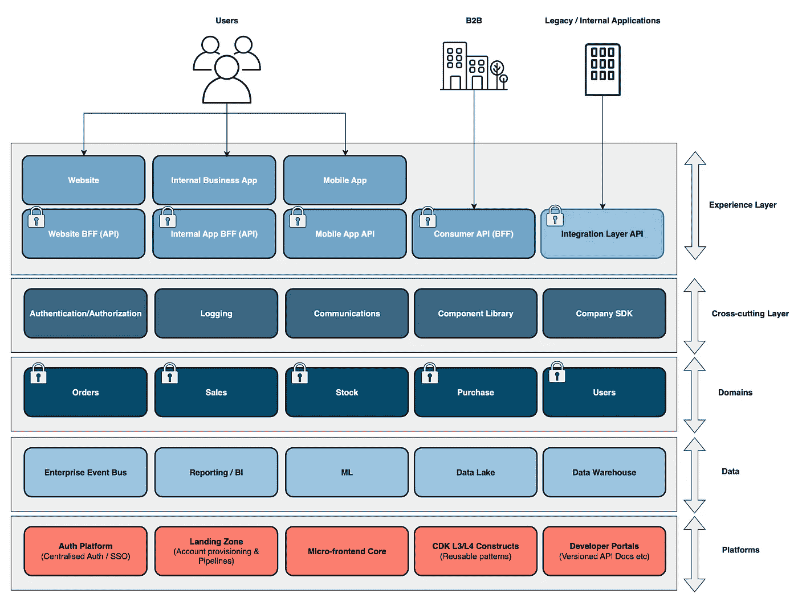

# 无服务器架构层🚀

> 原文：<https://levelup.gitconnected.com/serverless-architecture-layers-a9dc50e9b342>

威利安·贾斯登·德·瓦斯康塞洛斯在 [Unsplash](https://unsplash.com/s/photos/moutain-layers?utm_source=unsplash&utm_medium=referral&utm_content=creditCopyText) 上拍摄的照片

## 受 Eric Evans 伟大作品的启发，我如何以及为什么认为企业组织应该使用具有五个无服务器架构层的领域驱动设计。我们将通过一个使用架构层的虚构公司，用视觉和描述来进行讨论。

# 内容

⚪体验层
⚪横切层
⚪领域层
⚪数据层
⚪平台层

无服务器的五个架构层的示例

# 介绍

在无服务器世界的企业架构中，我们必须从概念上和整体上考虑我们的整体解决方案，将其作为一组模式、模板和防护栏，以确保我们不会以一个贫血的 [lambda 弹球架构](https://www.thoughtworks.com/en-gb/radar/techniques/lambda-pinball)而告终，随着时间的推移，它会变成一个大泥球，很可能是一个具有大量重复业务逻辑和浪费团队努力的分布式整体。(*如下图*)

无服务器弹球架构和无服务器转换项目中的大球泥

> “Lambda 弹球架构的特点是，当请求在越来越复杂的云服务图表中来回跳动时，会忽略 Lambda、桶和队列的复杂网络中的重要领域逻辑。”—思想工作

这很容易发生，因为企业组织开始了他们的无服务器转型，随着时间的推移，许多新团队在他们自己的筒仓中开发新的解决方案，这很快就可以推断出来，因为许多组织也是全球性的，地理上是分布式的。将此与[康韦法则](https://www.thoughtworks.com/insights/articles/demystifying-conways-law)结合起来，我们可以很快大规模地解决大问题和大规模返工。

本文讨论分层架构，Eric Evans 在《领域驱动设计》一书中突出了这一点。(*我鼓励所有架构师和无服务器开发人员购买这本书*)，以及这对于企业的无服务器范例意味着什么。

领域驱动的设计——Eric Evans:[https://tinyurl.com/rs7jap5r](https://tinyurl.com/rs7jap5r)

说到企业组织中的无服务器世界，我相信它看起来更像下图，其中显示了"**五个无服务器架构层**":

无服务器的五个架构层的示例

以下几层跨越了旧世界和新的无服务器世界(*我们将引用书中的话*):

✔️ **用户界面(演示)&应用→体验**

✔️ **域→域**

✔️ **基础设施→平台**

在本文中，我们将深入五个无服务器架构层，同时展示一个虚构公司的无服务器架构在使用或不使用这种方法时的样子。

我们虚构的公司，李·詹姆斯·山地服装公司

我们还可以将这种方法与[无服务器战术 DD(R)](/serverless-tactical-dd-r-23d18d529fa1) 和企业范围的[技术雷达](https://www.thoughtworks.com/radar/byor)相结合，以确保在企业范围的转型期间，当团队转向无服务器世界时，我们拥有相关的护栏、模式和架构治理；同时还允许创新和演进架构:

架构层+战术 DD(R) +技术雷达

 [## 无服务器战术 DD(R)🚀

### 对于无服务器解决方案，什么是战术性 DD(R)作为非功能性需求的战术方法，以及…

levelup.gitconnected.com](/serverless-tactical-dd-r-23d18d529fa1)  [## 构建您自己的雷达| Thoughtworks

### 了解如何使用我们的雷达创建练习在所有组织级别进行对话，并回顾您的…

www.thoughtworks.com](https://www.thoughtworks.com/radar/byor) 

在下一节中，让我们从下面的各个层开始。

# 体验层概述🏂

> **要深入体验层，请参见下面的链接**

 [## 无服务器架构层& DDD(第 1 部分)——体验层

### 详细讨论 5 个无服务器架构层，从第 1 部分中的体验层开始。

leejamesgilmore.medium.com](https://leejamesgilmore.medium.com/serverless-architecture-layers-ddd-part-1-the-experience-layer-fc57205153c3) 

在本书中，**用户界面**或**表示层**被描述为“*负责向用户显示信息并解释用户命令*”,而**应用层**被描述为“*定义软件应该做的工作并指导表达性领域对象解决问题*”。

> 定义软件应该做的工作，并指导表达性的领域对象解决问题

接下来是关于**应用层**“*这一层一直很薄。它不包含业务规则或知识，而只是协调任务并将工作委托给下一层中的域对象的协作*

> ”*这一层保持得很薄。它不包含业务规则或知识，而只是协调任务，并将工作委托给下一层中的领域对象的协作*

我们可以在下图中看到一个由表示层和应用层组成的**无服务器** **体验层**的示例，它通常由微前端、 [Alexa 应用](https://developer.amazon.com/en-US/alexa)、网站(*或许是亚马逊 S3* 中存储的 React 应用)、移动应用等体验组成；以及针对前端的特定[后端( *BFF* )](https://docs.microsoft.com/en-us/azure/architecture/patterns/backends-for-frontends) 瘦 API，或许使用[亚马逊 API 网关](https://aws.amazon.com/api-gateway/)或者 [AWS AppSync](https://aws.amazon.com/appsync/) 。

使用瘦 API(BFF)的体验层

> 创建单独的后端服务，供特定的前端应用程序或接口使用。当您想避免为多个接口定制一个后端时，这种模式很有用。萨姆·纽曼首先描述了这种模式。—[https://learn . Microsoft . com/en-us/azure/architecture/patterns/back ends-for-frontends](https://learn.microsoft.com/en-us/azure/architecture/patterns/backends-for-frontends)

这些瘦 API 可以有自己的认证需求，例如，内部员工应用程序可能使用与 Azure AD 联合的 [SSO](https://en.wikipedia.org/wiki/Single_sign-on) ，但是移动和 Alexa 应用程序可能对系统的外部用户使用 [Amazon Cognito](https://aws.amazon.com/cognito/) 。

在这些瘦 API 中不应该有业务逻辑(*我们将在后面继续讨论为什么*)，而应该只关心通过利用**域层**来编排体验所需的业务功能。

> 这些经验团队与团队拓扑中的'[流一致的](https://teamtopologies.com/key-concepts)团队一致。这些被描述为“与来自(通常)业务领域部分的工作流一致”

**让我们看一个我们公司的例子**

从下图中我们可以看到，处理 mountain wear 库存的库存团队有:

1.  允许业务逻辑泄漏到内部库存检查系统的前端代码中。这个逻辑对于其余的系统是不可访问的。
2.  一个 Alexa 应用程序需要添加“在线查看股票”的功能；然而，内部库存检查系统和网站库存检查功能的前端 API 的两个后端中已经复制了该逻辑。

如果业务逻辑留在了它应该在的领域层，那么这三种体验都可以恰当地利用它。

团队直接出错的例子

## 摘要

✔️确保商业逻辑不会通过组织泄露。( *Lambda Pinball* )
✔️确保业务逻辑在整个组织和体验中可重用，因为它不位于 BFF 或前端代码中。
✔️允许我们在每次体验中使用不同的身份验证要求。
✔️体验，即 UI/Voice/UX 不应包含任何共享的业务逻辑。✔️体验的后端 API 应该是无状态的。

# 交叉层概述📐

书中没有关于**横切层**的对等物，但是在我看来，这是在构建企业无服务器解决方案和通过技术雷达获得治理时必须考虑的事情。

> 这些横切关注点通常通过团队拓扑中的'[启用](https://teamtopologies.com/key-concepts)'团队来进行。这些被描述为“帮助流对齐的团队克服障碍”。还检测缺失的功能”

横切关注点的例子有前端开发的组件库、电子邮件和 SMS 等通信的发送，以及聚合日志和跟踪，允许我们跨无数服务和调用关联日志。另一个是身份验证，因为我们的客户无论使用 Alexa 应用程序、聊天机器人还是我们的网站，都应该有 SSO 体验。

我们可能还想考虑为代码重用创建一个公司 SDK，以提高开发速度，并减少认知负荷。在 AWS 世界中，这可以通过使用 [AWS 代码工件](https://aws.amazon.com/codeartifact/)来实现。

> 一个**软件开发工具包** ( **SDK** )是一个可安装包——维基百科中的[软件开发](https://en.wikipedia.org/wiki/Software_development_process)工具的集合

红色的交叉层

作为 CTO 和架构师，如果我们在开始设计我们的解决方案时没有像团队一样尽早考虑这个问题，我们会发现单个团队开始一遍又一遍地处理和解决相同的问题；例如，多个团队在研究客户身份认证。(*如下图*)

跨交叉层中许多许多团队的重复

这导致团队在他们自己的筒仓中选择不同的 SasS 产品，例如，增加了新团队的认知负荷(一次又一次地解决相同的问题)，并减少了我们与供应商大规模获得更好合同的机会。如果我们随后在大量团队中用日志、通信、组件库等等来推断这一点，就会让我们处于一种糟糕的状态。

**让我们看一个我们公司的例子**

在我们的 *Lee James Mountain Wear* 的例子中，我们发现我们的库存和订单团队都在自己的筒仓中构建自己的 React 组件库，因为缺乏战略层面的沟通，而没有在企业层面上考虑这个问题。

与此同时，我们的客户和订单团队都在围绕可观察性开展 POC 工作，并与两家不同的 SaaS 供应商交谈。随着团队数量的增长，以及全球层面的发展，你会在规模上遇到一些严重的问题(如下图所示*)。*

不从整体上考虑跨领域问题时的问题

## 摘要

✔️防止每个团队在解决相同问题时出现复杂性、重复和认知负荷。
✔️允许人们更容易地在球队之间流动，因为我们有标准。
✔️不用重新发明轮子就能提高团队的速度和灵活性。
由于 SasS 产品在企业范围内的使用增加，✔️使我们能够与供应商达成更好的交易。

# 🛍️属性域图层概述

> **要深入了解领域层，请参见下面的**

 [## 无服务器架构层和 DDD(第三部分)——域层

### 详细讨论 5 个无服务器架构层，这次将在第 3 部分讨论领域层。

leejamesgilmore.medium.com](https://leejamesgilmore.medium.com/serverless-architecture-layers-ddd-part-3-the-domain-layer-43ffce28806f) 

在我看来，领域层是最重要的，也是最需要关注的。在书中，Eric Evans 将此描述为“*”,负责表示业务概念、有关业务情况的信息以及业务规则。*”。

> “负责表示业务概念、关于业务情况的信息和业务规则”——Eric Evans(领域驱动设计)

在一个无服务器的世界中，这通常会使用由 [AWS Lambda](https://aws.amazon.com/lambda/) 或 [AWS Fargate](https://aws.amazon.com/fargate/) 支持的私有 API 网关来表示，特别是使用其自己的数据存储，如 [AWS DynamoDB](https://aws.amazon.com/dynamodb) 。我们还希望通过领域驱动设计(DDD)来推动这一点，这将在下面的 ***概念层面*** 进行讨论:

 [## 无服务器域驱动设计

### 用真实世界的例子将 DDD 概念分解成有形的无服务器等价物。

leejamesgilmore.medium.com](https://leejamesgilmore.medium.com/serverless-domain-driven-design-6da44e151cfa) 

> 这些领域团队与团队拓扑中的'[流一致的](https://teamtopologies.com/key-concepts)'团队一致。这些被描述为“与来自(通常)业务领域部分的工作流一致”

API 应该使用[开放 API ( *Swagger* )](https://swagger.io/specification/) 进行良好的定义和版本控制，并且应该成为域的聚合根和主接口。在事件驱动的系统中，我们还必须使用定义良好的版本化事件来与领域交互，例如使用带有[模式注册表](https://docs.aws.amazon.com/eventbridge/latest/userguide/eb-schema.html)的 [Amazon EventBridge](https://aws.amazon.com/eventbridge/) 。这确保了我们可以在不影响消费者的情况下改变我们的域服务的内部。

领域层—可重用的业务逻辑

域服务的内部应该封装起来，这样我们就不会有其他域和团队直接访问我们的数据存储，例如，绕过我们的业务规则、日志和逻辑的治理。(*如上图*)

域层—利用共享的业务逻辑

这意味着我们可以跨许多体验层和其他领域重用领域业务逻辑，使用 IAM auth 和 SigV4 从前端 API 的瘦后端调用我们的领域 API。

> “这意味着我们现在可以跨许多体验层和其他领域重用领域业务逻辑，使用 IAM auth 和 SigV4 从前端 API 的瘦后端调用我们的领域 API。”—李·吉尔摩

不共享内部数据存储——我们只使用定义良好的 API

我们需要确保域被很好地封装，并且域服务不会开始与其他域的内部交互，无论是数据存储还是内部 [AWS SNS](https://aws.amazon.com/sns/) 主题还是[亚马逊 SQS](https://aws.amazon.com/sqs/) 队列(如上图所示的*)。这就撤销了我们在定义领域和创建版本化接口方面所做的所有工作。*

这些域被很好地封装，在 AWS 主干网之外是不可访问的

我们还应该确保外部世界无法访问我们的域服务，即使它们是使用身份验证绑定的。(*如上图*)。

由于 API 应该使用机器到机器的流程来绑定，因此没有理由通过 Postman、curl、mobile、网页等来访问它们。例如，它们永远不会被直接从前端调用，所以出于安全原因，它们应该被相应地绑定。

那么领域驱动的设计在代码层面上会是什么样的呢？

上面的链接讨论了 DDD，以及我们如何在纯粹的概念和服务级别应用这些概念。下面的链接更进了一步，展示了我们如何在代码级别做到这一点:

 [## 无服务器的干净架构和代码采用领域驱动的设计🚀

### 在我们的无服务器解决方案中使用干净的代码和架构，以确保代码和基础架构的干净分离…

leejamesgilmore.medium.com](https://leejamesgilmore.medium.com/serverless-clean-architecture-code-with-domain-driven-design-852796846d28) 

## 摘要

✔️定义良好的版本化 API 和事件确保消费者了解如何与我们的域进行交互。
✔️域接口意味着我们可以在不影响消费者的情况下改变内部结构。
✔️我们的域服务不对外开放，只能通过机器对机器的流程进行访问。(*即使用私有 API 网关*)。
✔️我们确保消费者不会与我们领域的内部交互，只通过我们定义良好的 API 和事件。
✔️域逻辑可以被其他域服务或体验所利用，防止贫血的域被分割成分布式整体。

# 数据层概述📊

> **要深入了解数据层，请参阅以下文章:**

 [## 无服务器架构层& DDD(第 4 部分)——数据层

### 详细讨论 5 个无服务器架构层，这次将在第 4 部分讨论数据层。

leejamesgilmore.medium.com](https://leejamesgilmore.medium.com/serverless-architecture-layers-ddd-part-4-the-data-layer-8d27b5889034) 

下一个无服务器层是**数据层**，书中没有表示；然而，在今天的数据和事件驱动的世界中，我们需要从企业层面考虑这个问题。

数据层通常由三个关键区域组成:

1.  **企业服务总线**。例如，这通常是[亚马逊事件桥](https://aws.amazon.com/eventbridge/)或[亚马逊 MSK ( *卡夫卡* )](https://aws.amazon.com/msk/) 。
2.  **汇报和 BI** 。例如，这通常是[亚马逊快速网站](https://aws.amazon.com/quicksight/)和[亚马逊雅典娜](https://aws.amazon.com/athena/)。
3.  **数据**。例如，这通常是亚马逊红移或 S3 数据湖。

> 数据层通常通过团队拓扑中的“复杂子系统”和“平台”团队来进行。复杂的子系统团队被描述为“需要大量数学/计算/技术专业知识的地方”。平台团队将在后面进一步讨论。

我们应该在企业架构级别对此进行治理，以确保我们的领域服务能够以事件驱动的方式在整个组织中相互交互，而不是让不同的团队使用不同的技术( *SNS、Kafka、EventBridge 等*)。这将在下面的文章中介绍:

 [## 无服务器事件驱动系统🚀

### 您应该如何以及为什么首先使用 Amazon EventBridge 构建事件驱动的无服务器架构…

levelup.gitconnected.com](/serverless-event-driven-systems-9617c6406064) 

利用企业服务总线，如***Amazon event bridge***现在意味着域可以使用定义良好的版本化事件相互交互，体验层中前端 API 的后端也可以引发其他域可能感兴趣的事件:

在数据层(即我们的企业服务总线)引发的域事件

如下所示，域名可能会引发“订单已创建”、“价格已修改”等事件。并且体验层可以引发诸如“用户登录”的事件。

数据层—引发的示例域事件

这也使我们能够构建数据湖并聚合这些事件，从而使我们更加以数据为导向，因此事件、数据和报告/BI 之间存在内在联系。下面的文章讨论了如何利用流和事件来解决无服务器世界中两阶段提交的问题:

 [## 无服务器流式事件🚀

### 如何基于 DynamoDB 和 DocumentDB 中的数据库更改，使用 EventBridge、可视化和…

levelup.gitconnected.com](/serverless-streamed-events-ada6ed9a9ecf) 

让我们看一个我们公司的例子

在企业组织 *Lee James Mountain Wear* 中，我们有三个不同的团队使用三种不同的技术( *SQS、EventBridge 和 MSK* )，因此这使得基于事件的领域通信变得非常困难。从一开始就在企业层面实现标准化会使这变得容易得多，减少开发时间，降低团队的认知负荷，并允许版本化的事件模式和事件发现。

> “从一开始就在企业层面实现标准化会使这变得容易得多，减少开发时间，降低团队的认知负荷，并允许版本化的事件模式和事件发现。”——Lee Gilmore

## 摘要

✔️:企业服务总线允许我们跨业务团队进行协调 amazon eventbridge 应该是你在 AWS 上的首选。
✔️亚马逊 EventBridge Schema Registry 允许其他团队查看我们的版本化事件并使用它们(*易于发现，减少认知负荷并增强沟通* )
✔️我们可以通过将数据和事件流式传输到数据湖或数据仓库来报告它们，并使用 Athena 和 QuickSite 等工具进行使用。
✔️我们可以利用情感分析和事件来建立单一客户视图。
✔️减少了使用 ESB 的团队的认知负荷，并提高了他们的速度和敏捷性。

# 平台层概述🌐

本书的最后一层是基础设施层，相当于平台层。在无服务器的世界中，团队将通过 IaC 管理他们自己的架构和服务，而不是传统的服务器管理。该书将基础设施层描述为“*提供支持更高层的通用技术能力*”。

> "*提供支持更高层的通用技术能力* " — Eric Evans(领域驱动设计)

在开发团队的无服务器世界中，这通常包括:

1.  **认证平台**。这是团队执行机器对机器流程的标准方式。
2.  管道/账户。无服务器团队不需要考虑不同的繁重工作，例如启动管道或创建 VPC、联网、中转网关等。这应该是模板化的，可以快速为新的团队/领域旋转起来(*想想自动售货机*)。
3.  **安全**。当新的团队和解决方案出现时，安全性应该尽早融入到我们的模板中——尽快向左移动。
4.  **API 规范/事件模式**。这些应该是集中的，容易被团队发现，增加灵活性和速度。这是我们应该重点关注开发者体验的地方。

> 平台层通常通过团队拓扑中的“平台”团队进行。平台团队被描述为“一组其他类型的团队，它们提供令人信服的内部产品，以加速与流程一致的团队的交付”。

如下图所示:

平台层

在我看来，其中最重要的是**管道和账户**，因为无服务器团队应该有能力利用模板和参考架构，该平台从本质上消除了差异化的繁重工作并减少了认知负荷。这些模板还应该包含安全性，尽可能早地转移安全性。

有许多产品，如 [AWS Proton](https://aws.amazon.com/proton/) 和 [Backstage IO](https://backstage.io/) 在企业级执行这一功能。

## 摘要

✔️开发者门户和平台应该提高无服务器团队的速度和灵活性。
平台应提供✔️差异化的繁重工作，如联网、建立 VPCs、创建管道等。
✔️开发者门户应该让团队更容易发现 API 和事件定义。
✔️亚马逊 CDK L3/L4 结构允许团队重用标准基础架构模板。
✔️拥有[微前端战略](https://micro-frontends.org/)和核心 UI，这使得团队更有效率，并在 UI 层面上支持 DDD。

# 摘要

我希望这对于在企业架构层面上从概念上考虑我们的无服务器架构是有用的。

请点击此处订阅我的企业无服务器新闻稿，了解更多相同的内容:

 [## 企业无服务器🚀LinkedIn

### Lee Gilmore |面向 AWS 开发人员、DevOps 工程师和云架构师的无服务器新闻和文章

www.linkedin.com](https://www.linkedin.com/newsletters/enterprise-serverless-%F0%9F%9A%80-6875837779876605952/) 

# 包扎👋

请[去我的 YouTube 频道](https://www.youtube.com/channel/UC_Bi6eLsBXpLnNRNnxKQUsA)订阅类似内容！

我很乐意就以下任何一个方面与您联系:

[https://www.linkedin.com/in/lee-james-gilmore/](https://www.linkedin.com/in/lee-james-gilmore/)
https://twitter.com/LeeJamesGilmore

如果你喜欢这些帖子，请关注我的简介[李·詹姆斯·吉尔摩](https://medium.com/u/2906c6def240?source=post_page-----39c4f4ae5aff----------------------)以获取更多的帖子/系列，不要忘记联系我并打招呼👋

如果你喜欢，也请使用帖子底部的“鼓掌”功能！(*你可以不止一次鼓掌！！*)

# 关于我

"*大家好，我是 Lee，AWS 社区构建者、博客作者、AWS 认证云架构师和全球无服务器架构师，住在英国；目前在 City Electrical Factors 工作，过去 6 年主要从事 AWS 上的全栈 JavaScript 工作。*

*我认为自己是一个无服务器倡导者，热爱 AWS、创新、软件架构和技术。*

*****所提供的信息是我个人的观点，我对信息的使用不承担任何责任。*****

您可能还对以下内容感兴趣:

 [## 无服务器内容🚀

### 我的所有无服务器内容的索引，可以在一个地方轻松浏览，包括视频、博客文章等..

leejamesgilmore.medium.com](https://leejamesgilmore.medium.com/serverless-content-46ef5b562d8e)