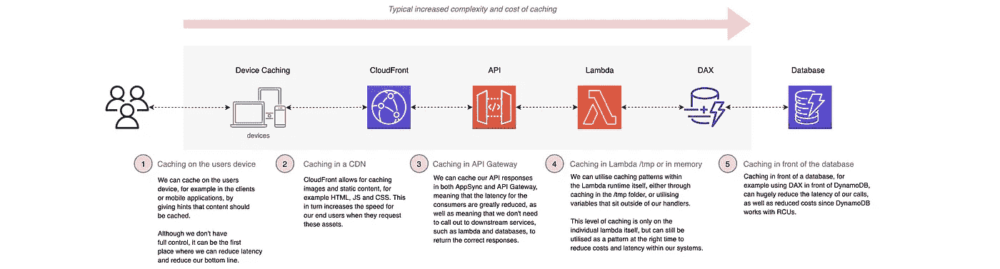
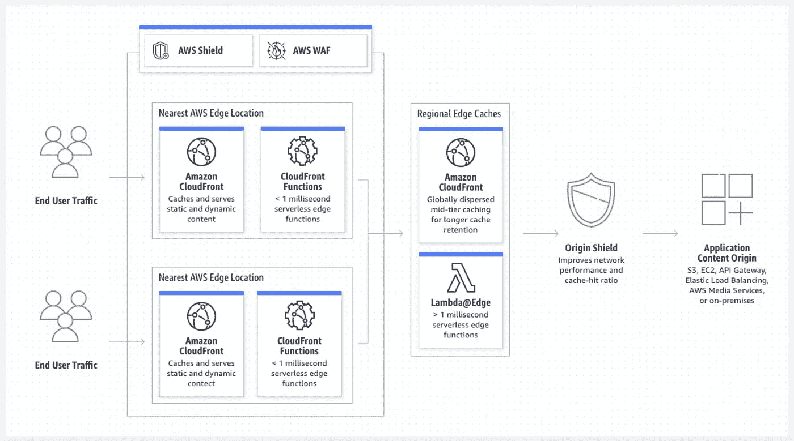
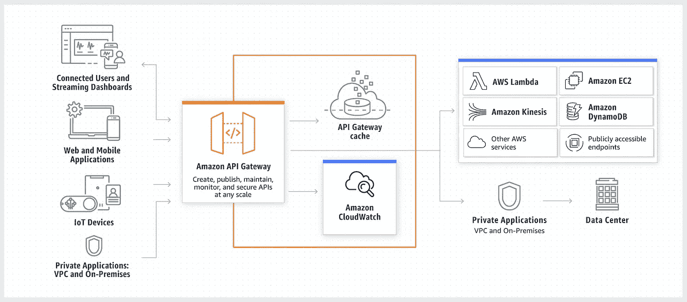
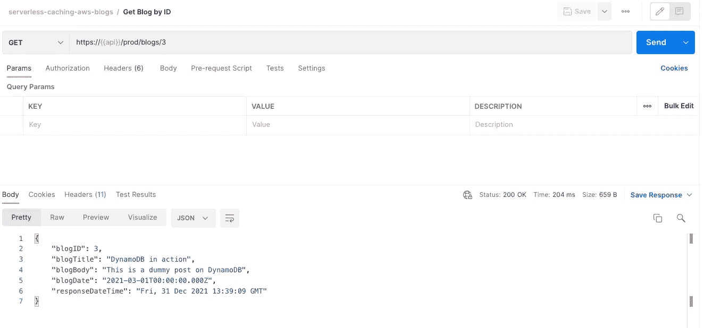
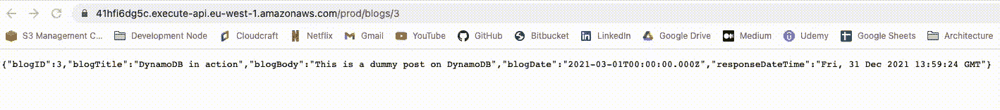
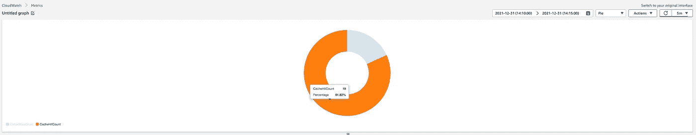
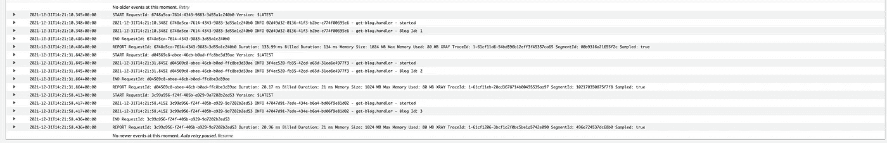

# 无服务器缓存策略——第 1 部分(Amazon API 网关)🚀

> 原文：<https://levelup.gitconnected.com/serverless-caching-strategies-part-1-amazon-api-gateway-c2d680d5b3b>


胡安·帕布鲁·丹尼尔在 [Unsplash](https://unsplash.com/s/photos/storage?utm_source=unsplash&utm_medium=referral&utm_content=creditCopyText) 上拍摄的照片

## 如何在您的解决方案中使用无服务器缓存策略，包括用 TypeScript 和 CDK 编写的代码示例和视觉效果，以及 GitHub 中的相关代码库。第 1 部分介绍 Amazon API 网关。


# 介绍

这是涵盖 AWS 上的无服务器缓存策略以及为什么应该使用它们的许多文章的第 1 部分。这第一部分将是对缓存的高级介绍，以及 TypeScript 中的[示例和使用 **Amazon API Gateway** 进行缓存的 CDK](https://github.com/leegilmorecode/serverless-caching) 。

🔵 [**本文的第 2 部分**使用***DynamoDB DAX***](https://leejamesgilmore.medium.com/serverless-caching-strategies-part-2-amazon-dynamodb-dax-d841e1e1ad0e)查看数据库级别的缓存。

🔵 [**本文第 3 部分**将考察*运行时环境本身*](https://medium.com/@leejamesgilmore/serverless-caching-strategies-part-3-lambda-runtime-b3d21250927b)*内的缓存。*

*🔵 [**本文第 4 部分**将着眼于 ***AppSync*** 级别](https://leejamesgilmore.medium.com/serverless-caching-strategies-part-4-appsync-7fe6ede93183)的缓存。*

*🔵**本文的第 5 部分**将用 ***CloudFront*** 来看看 CDN 级别的缓存。*

# *什么是缓存，为什么要使用缓存？☁️*

*先来覆盖一下'**什么是缓存？**’。在计算中，高速缓存是一个高速数据存储层，它存储数据的一个子集，通常本质上是短暂的，以便将来对该数据的请求可以比通过访问数据的主存储位置更快地得到满足。缓存允许您有效地重用以前检索或计算的数据。*

> *在计算中，高速缓存是一个高速数据存储层，它存储数据的一个子集，通常本质上是短暂的，以便将来对该数据的请求可以比通过访问数据的主存储位置更快地得到满足。缓存允许您有效地重用以前检索或计算的数据。—[https://aws.amazon.com/caching/](https://aws.amazon.com/caching/)*

*高速缓存中的数据通常存储在诸如 RAM ( *随机存取存储器*)的快速存取硬件中，并且也可以与软件组件相关联地使用。缓存的主要目的是通过减少访问底层较慢存储层的需求来提高数据检索性能。*

*与数据库相比，高速缓存通常会暂时存储数据的一个子集，而数据库的数据通常是完整和持久的。*

## *为什么使用缓存？*

*在无服务器应用中缓存的主要好处是**增加** **速度**，这反过来也可以有**降低成本**的额外好处。*

*在无服务器应用程序中，缓存通常意味着更快的 API 响应时间、更快的页面加载速度、更短的延迟、更快的查询速度等。这还可以减少计算和数据库调用，进而降低成本。*

## *什么时候应该考虑缓存？*

*我在下面链接的前一篇文章中提到了这一点，在那里我讨论了**无服务器策略 DD(R)** 作为非功能性需求、就绪定义和完成定义的一种方法；这反过来可以帮助您在 SDLC 中的适当时间考虑缓存策略:*

*[](https://leejamesgilmore.medium.com/serverless-tactical-dd-r-23d18d529fa1) [## 无服务器战术 DD(R)🚀

### 对于无服务器解决方案，什么是战术性 DD(R)作为非功能性需求的战术方法，以及…

leejamesgilmore.medium.com](https://leejamesgilmore.medium.com/serverless-tactical-dd-r-23d18d529fa1)* 

# *我们在这个系列的基础上构建了什么？🏗️*

*在这一系列文章中，我们将构建两个虚构的博客，一个专门用于无服务器文章，另一个用于 AWS 新闻。您可以在下面看到高级架构及其详细介绍(*粉色圆圈表示您可以在这些解决方案中缓存的位置*):*

**

## *无服务器博客✔️*

*无服务器博客有以下流程:*

*⚪一个 CloudFront 发行版缓存了 React 网站，该网站以一个 S3 bucket 作为其源。*我们可以在这个级别缓存 web app。**

*react 应用程序利用 GraphQL API 通过 AWS AppSync 访问其数据。*对于某些端点，我们可能会考虑使用 AppSync 缓存。**

*appsync api 通过 Lambda 解析 DynamoDB 的数据，我们使用 DAX 作为数据库前端的缓存。*在这里，我们可以利用 DAX 在数据库级别进行缓存。**

## *AWS 新闻博客✔️*

*AWS 新闻博客有以下流程:*

*⚪一个 CloudFront 发行版缓存了 React 网站，该网站以一个 S3 bucket 作为其源。我们可以在这个级别缓存 web 应用程序。*

*react 应用程序通过亚马逊 API 网关为其数据利用 REST API。*我们在 API 网关内的 API 级别进行缓存。**

*⚪对于缓存未命中，我们使用 Lambda 函数从无服务器的 Aurora 数据库中检索数据。*在这个场景中，我们还可以在 lambda 本身中缓存某些数据。**

> **💡* ***注意*** :这是允许我们在文章中讨论关键架构点的最小代码和架构，因此这不是生产就绪的，并且不符合编码最佳实践。(例如，在端点上没有认证)。我还尽量不把代码分割得太多，这样所有依赖关系都在一个文件中的示例文件就很容易查看。*

# *AWS 上哪里可以缓存？☁️*

*下图显示了我们架构中可以启用缓存策略的一些层。*

*谈到 AWS 上的缓存，我个人喜欢尽可能靠近消费者进行缓存，例如:*

**

# *在这一系列文章中，我们将使用哪些服务？🧰*

*下面的列表更详细地介绍了我们将在本系列中使用的服务，**但是如果您在**之前使用过这些服务，请随意跳到下一部分:*

> *请随意跳到下一部分“我们在构建什么？”如果您对大多数 AWS 服务感到满意，并且只想看看架构模式。*

## *亚马逊 DynamoDB 加速器( *DAX* ) ✔️*

*Amazon DynamoDB Accelerator (DAX)是一个完全托管的、高度可用的内存中缓存[用于](https://aws.amazon.com/caching/) [Amazon DynamoDB](https://aws.amazon.com/dynamodb/) ，即使每秒有数百万个请求，也能提供高达 10 倍的性能提升——从毫秒到微秒。*

*DAX 完成了向 DynamoDB 表添加内存加速所需的所有繁重工作，而不需要开发人员管理缓存失效、数据填充或集群管理。*

*现在，您可以专注于为客户构建出色的应用程序，而无需担心大规模性能。您不需要修改应用程序逻辑，因为 DAX 与现有的 DynamoDB API 调用兼容。在 [DynamoDB 开发者指南](https://docs.aws.amazon.com/amazondynamodb/latest/developerguide/DAX.html)中了解更多信息。*

*[https://aws.amazon.com/dynamodb/dax/](https://aws.amazon.com/dynamodb/dax/)*

## *亚马逊云锋✔️*

*Amazon CloudFront 是一项内容交付网络(CDN)服务，旨在提供高性能、安全性和开发人员便利性。*

*借助内置的数据压缩、边缘计算功能和现场级加密，在数毫秒内联系到全球各地的观众。*

**

*[https://aws.amazon.com/cloudfront/](https://aws.amazon.com/cloudfront/)*

## *AWS AppSync ✔️*

*组织选择用 GraphQL 构建 API 是因为它帮助他们更快地开发应用程序，让前端开发人员能够用一个 GraphQL 端点查询多个数据库、微服务和 API。*

*AWS AppSync 是一个完全托管的服务，通过处理安全连接到 AWS DynamoDB、Lambda 等数据源的繁重工作，可以轻松开发 GraphQL APIs。添加缓存以提高性能，订阅以支持实时更新，以及客户端数据存储以保持离线客户端同步也同样简单。部署完成后，AWS AppSync 会自动调整 GraphQL API 执行引擎，以满足 API 请求量。*

> **💡* ***注意*** : AppSync 也内置了缓存，我们不会在本文中讨论。*

*[https://aws.amazon.com/appsync/](https://aws.amazon.com/appsync/)*

## *亚马逊 API 网关✔️*

*Amazon API Gateway 是一个完全托管的服务，使开发人员可以轻松地创建、发布、维护、监控和保护任何规模的 API。API 充当应用程序从后端服务访问数据、业务逻辑或功能的“前门”。使用 API Gateway，您可以创建支持实时双向通信应用程序的 RESTful APIs 和 WebSocket APIs。API Gateway 支持容器化和无服务器的工作负载，以及 web 应用程序。*

> **💡* ***注意*** : API 网关也内置了缓存*

**

*[https://aws.amazon.com/api-gateway/](https://aws.amazon.com/api-gateway/)*

# *入门！✔️*

*首先，使用以下 git 命令克隆以下 repo:*

```
*git clone [https://github.com/leegilmorecode/serverless-caching](https://github.com/leegilmorecode/serverless-caching)*
```

*这将把示例代码下载到您的本地机器上。*

# *部署解决方案！👨‍💻*

*🛑 **注意** : *运行以下命令将在您的 AWS 帐户上产生费用，并且一些服务不在免费层。**

*在 repo 的'`aws-blog`'文件夹中运行以下命令安装所有依赖项:*

```
*npm i*
```

*完成此操作后，运行以下命令来部署解决方案:*

```
*npm run deploy*
```

*🛑 **注** : *记得在你完成后拆掉堆叠，这样你就不会继续被充电了，使用“npm 运行移除”。**

> **💡* ***注意*** :我们使用 CustomResource 作为部署的一部分来创建 blogs 表，并用一些虚拟数据填充它，因此您可以直接使用它。*

# *测试解决方案🎯*

*现在我们已经部署了解决方案，您可以使用 postman 文件测试端点，该文件可以在下面找到:`aws-blog/postman/serverless-caching-aws-blogs.postman_collection.json`*

**

*来自 API 的示例响应*

# *通过关键代码交谈👊*

**好了，我们已经讨论了什么是缓存，我们可以在哪里使用 API Gateway 来执行缓存，以及如何部署示例 repo——现在让我们来看一些代码。**

*以下来自 repo 的截图显示了我们如何使用 CDK 设置 API Gateway，以及两个不同方法的相关缓存，我们可以在更精细的级别覆盖每个方法的默认设置:*

*上面的代码显示，对于`/Blogs GET`,我们已经将缓存设置为启用，它将缓存响应 10 分钟。由于我们的博客没有太大变化，这似乎是一个合理的设置值。*

*对于`/Blogs/{id} GET`，我们需要根据路径中的`id`设置我们的缓存关键参数，否则所有的`blogs/1`、`blogs/2`调用等都将缓存并返回相同的数据！(*这显然是我们不想要的！*)我们可以在下面的代码中看到这一点:*

*在 lambdas 本身的代码中，我们还返回了一个名为'【T6]'的属性，因此我们很容易看到缓存的运行。这显示在下面的 GIF 中，我们可以看到初始请求也从'`13:59:24`'设置了 DTO 的时间部分'`14:00:51`'，并且随着响应被缓存，它仍然保持在'`14:00:51`'时间戳，请求延迟平均从 250 毫秒增加到 50 毫秒，并且缓存到位 T22:*

**

*发生缓存的示例*

*我们还可以查看 API Gateway CloudWatch 指标，了解四种端点的缓存命中情况(*缓存未命中是最先发出的请求*):*

**

*查看 CloudWatch 日志中的`get-blog` lambda，我们可以看到缓存正在发生，每个博客 ID 请求只有一个条目，不管命中端点多少次(*这是因为 API 级别的缓存意味着缓存命中永远不会命中我们的 lambda，因此也不会命中数据库*):*

**

*显示在 API 上进行缓存时未调用 lambda 的示例日志*

# *摘要*

*我希望你觉得有用！加入我的**第 2 部分**，我们将继续使用 ***DynamoDB DAX*** 研究数据库级缓存。*

*请点击此处订阅我的企业无服务器新闻稿，了解更多相同的内容:*

*[](https://www.linkedin.com/newsletters/enterprise-serverless-%F0%9F%9A%80-6875837779876605952/) [## 企业无服务器🚀LinkedIn

### Lee Gilmore |面向 AWS 开发人员、DevOps 工程师和云架构师的无服务器新闻和文章

www.linkedin.com](https://www.linkedin.com/newsletters/enterprise-serverless-%F0%9F%9A%80-6875837779876605952/)* 

# *包扎👋*

*请[去我的 YouTube 频道](https://www.youtube.com/channel/UC_Bi6eLsBXpLnNRNnxKQUsA)订阅类似的内容！*

**

*我很乐意就以下任何一个方面与您联系:*

*[https://www.linkedin.com/in/lee-james-gilmore/](https://www.linkedin.com/in/lee-james-gilmore/)T10[https://twitter.com/LeeJamesGilmore](https://twitter.com/LeeJamesGilmore)*

*如果你觉得这些文章鼓舞人心或有用，请随时用虚拟咖啡[https://www.buymeacoffee.com/leegilmore](https://www.buymeacoffee.com/leegilmore)来支持我，不管怎样，让我们联系和聊天吧！☕️*

*如果你喜欢这些帖子，请关注我的简介[李·詹姆斯·吉尔摩](https://medium.com/u/2906c6def240?source=post_page-----39c4f4ae5aff----------------------)以获取更多的帖子/系列，不要忘记联系我并打招呼👋*

*如果你喜欢，也请使用帖子底部的“鼓掌”功能！(*可以不止一次鼓掌！！**

***本文由**[**sedai . io**](https://www.sedai.io/)赞助*

**

# *关于我*

*"*大家好，我是 Lee，英国的 AWS 社区构建者、博客作者、AWS 认证云架构师和首席软件工程师；目前是一名技术云架构师和首席无服务器开发人员，过去 5 年主要从事 AWS 上的全栈 JavaScript 工作。**

*我认为自己是一个无服务器倡导者，热爱 AWS、创新、软件架构和技术。*

****所提供的信息是我个人的观点，我对这些信息的使用不承担任何责任。****

*您可能还对以下内容感兴趣:*

*[](https://leejamesgilmore.medium.com/serverless-content-46ef5b562d8e) [## 无服务器内容🚀

### 我的所有无服务器内容的索引，可以在一个地方轻松浏览，包括视频、博客文章等..

leejamesgilmore.medium.com](https://leejamesgilmore.medium.com/serverless-content-46ef5b562d8e) [](https://leejamesgilmore.medium.com/serverless-private-apis-part-2-91fb9ab0c484) [## 无服务器私有 APIs 第 2 部分🚀

### 如何允许私有无服务器平台 API 在您的内部使用自定义域名进行安全通信…

leejamesgilmore.medium.com](https://leejamesgilmore.medium.com/serverless-private-apis-part-2-91fb9ab0c484) [](https://leejamesgilmore.medium.com/serverless-private-apis-60749934b161) [## 无服务器私有 API🚀

### 如何允许私有无服务器平台 API 在您的组织内部进行安全通信，而无需…

leejamesgilmore.medium.com](https://leejamesgilmore.medium.com/serverless-private-apis-60749934b161) [](https://leejamesgilmore.medium.com/serverless-synthetic-canaries-7946dc5216ba) [## 无服务器合成金丝雀🚀

### 使用 CloudWatch 合成金丝雀来监控你的无服务器应用程序的实际例子，有视觉效果和…

leejamesgilmore.medium.com](https://leejamesgilmore.medium.com/serverless-synthetic-canaries-7946dc5216ba)*