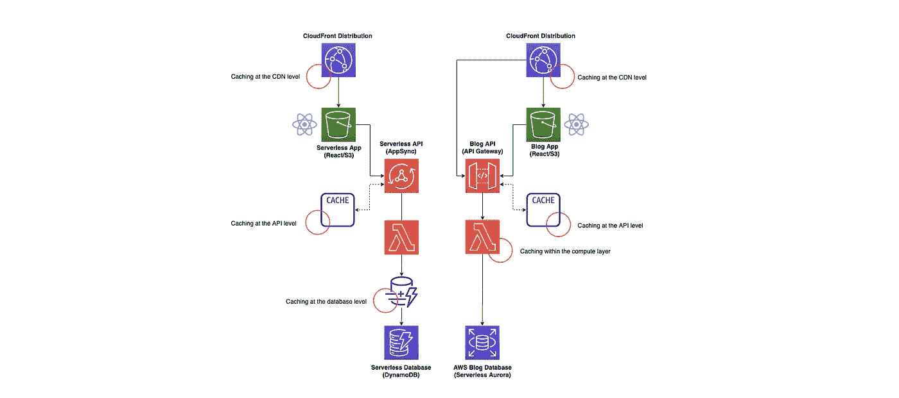
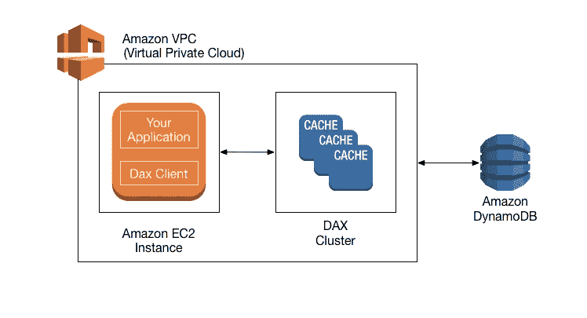
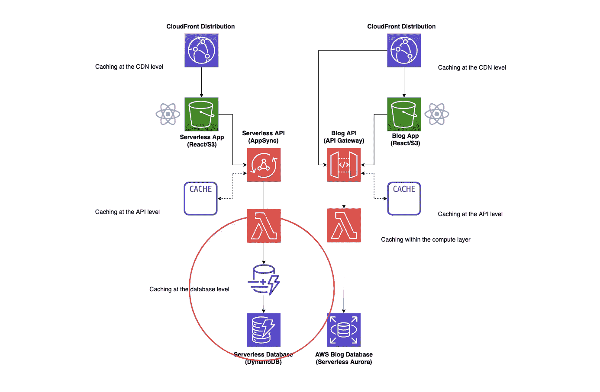
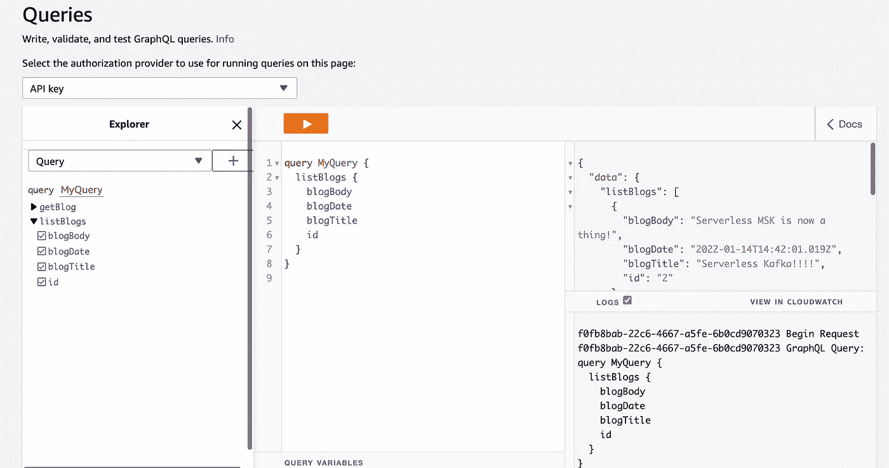
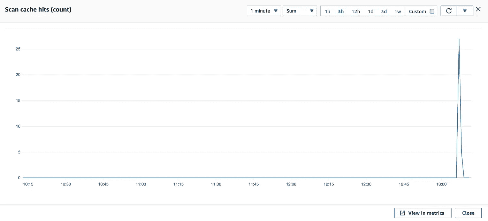
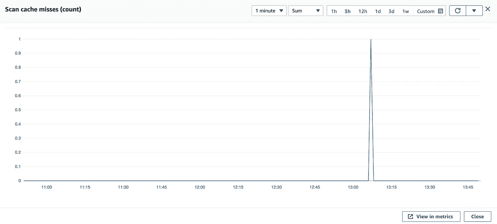
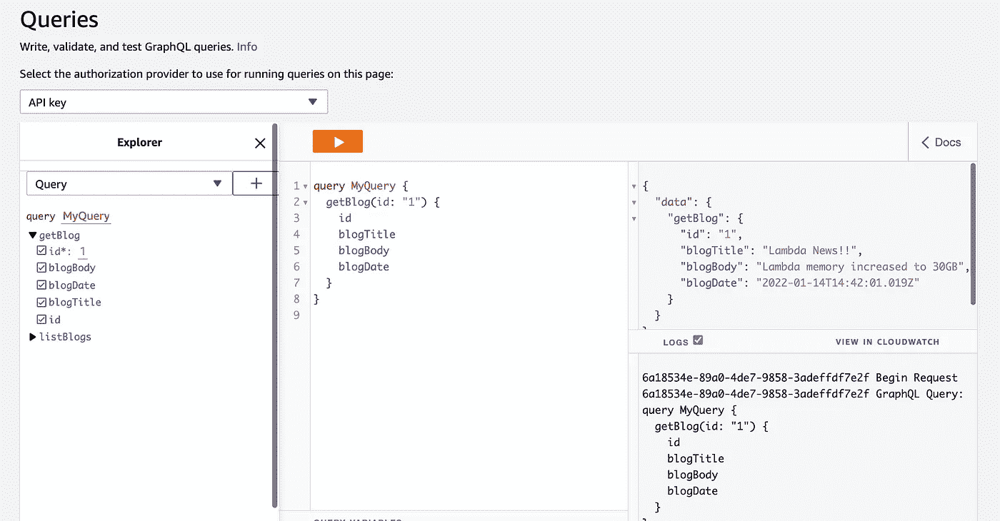
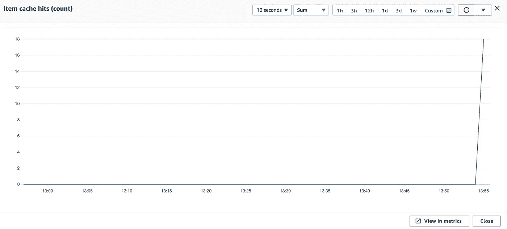
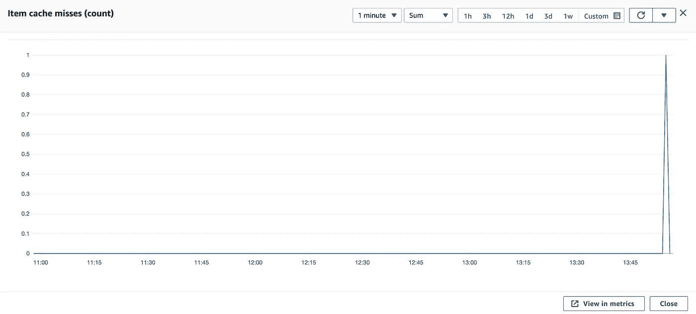
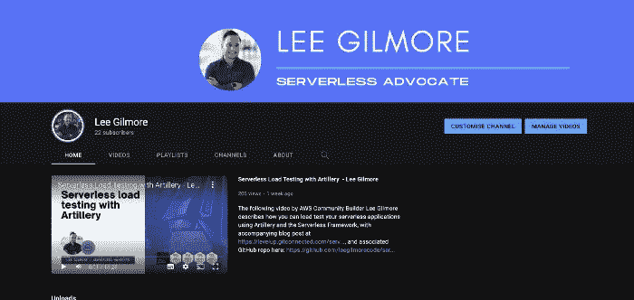

# 无服务器缓存策略—第 2 部分(Amazon DynamoDB DAX)🚀

> 原文：<https://levelup.gitconnected.com/serverless-caching-strategies-part-2-amazon-dynamodb-dax-d841e1e1ad0e>


阿莱西奥·林在 [Unsplash](https://unsplash.com/s/photos/road-speed-blur?utm_source=unsplash&utm_medium=referral&utm_content=creditCopyText) 上的照片

## 如何在您的解决方案中使用无服务器缓存策略，包括用 TypeScript 和 CDK 编写的代码示例和视觉效果，以及 GitHub 中的相关代码库。第 2 部分介绍 Amazon DynamoDB DAX。


# 介绍

这是涵盖 AWS 上的无服务器缓存策略以及为什么应该使用它们的许多文章的第 2 部分。第 1 部分是对缓存的高级介绍，以及 TypeScript 中的[示例和使用 Amazon API Gateway 进行缓存的 CDK](https://github.com/leegilmorecode/serverless-caching) 。

**这部分将介绍使用 DynamoDB DAX 在数据库层进行缓存。**

🔵[本文的第 1 部分介绍了使用 Amazon](https://leejamesgilmore.medium.com/serverless-caching-strategies-part-1-amazon-api-gateway-c2d680d5b3b) API Gateway 在 API 层进行缓存。

🔵**本文的第 2 部分使用 *DynamoDB DAX* 研究数据库级别的缓存。**

🔵[本文的第 3 部分将关注 *Lambda* 运行时环境本身](https://medium.com/@leejamesgilmore/serverless-caching-strategies-part-3-lambda-runtime-b3d21250927b)中的缓存。

🔵本文的第 4 部分将着眼于 *AppSync* 级别的缓存。

🔵本文的第 5 部分将讨论使用 *CloudFront* 在 CDN 级别进行缓存。

**本文由**[**sedai . io**](https://www.sedai.io/)赞助


[https://www.sedai.io/](https://www.sedai.io/)

# 我们在建造什么？🏗️

如本系列的第 1 部分所述，这是我们正在构建的:



# 无服务器博客✔️

无服务器博客有以下流程:

⚪一个 CloudFront 发行版缓存了 React 网站，该网站以一个 S3 bucket 作为其源。我们可以在这个级别缓存 web 应用程序。

react 应用程序利用 GraphQL API 通过 AWS AppSync 访问其数据。*对于某些端点，我们可能会考虑使用 AppSync 缓存。*

appsync api 通过 Lambda 解析 DynamoDB 的数据，我们使用 DAX 作为数据库前端的缓存。*在这里，我们可以利用 DAX 在数据库级别进行缓存。*

# AWS 新闻博客✔️

AWS 新闻博客有以下流程:

⚪一个 CloudFront 发行版缓存了 React 网站，该网站以一个 S3 bucket 作为其源。*我们可以在这个级别缓存 web app。*

react 应用程序通过亚马逊 API 网关为其数据利用 REST API。*我们在 API 网关内的 API 级别进行了缓存。*

⚪对于缓存未命中，我们使用 Lambda 函数从无服务器的 Aurora 数据库中检索数据。*在这个场景中，我们还可以在 lambda 本身中缓存某些数据。*

> *💡* ***注意*** *:* 这是允许我们在文章中讨论关键架构点的最小代码和架构，因此这不是生产就绪的，并且不符合编码最佳实践。(例如，在端点上没有认证)。我还尽量不把代码分割得太多，这样所有依赖关系都在一个文件中的示例文件就很容易查看。

# 什么是 DynamoDB DAX？✔️

提醒一下，Amazon DynamoDB Accelerator (DAX)是一个完全托管的、高度可用的内存中缓存[用于](https://aws.amazon.com/caching/) [Amazon DynamoDB](https://aws.amazon.com/dynamodb/) ，它可以提供高达 10 倍的性能提升——从毫秒到微秒——甚至每秒数百万次请求。

DAX 完成了向 DynamoDB 表添加内存加速所需的所有繁重工作，而不需要开发人员管理缓存失效、数据填充或集群管理。

现在，您可以专注于为客户构建出色的应用程序，而无需担心大规模性能。您不需要修改应用程序逻辑，因为 DAX 与现有的 DynamoDB API 调用兼容。在 [DynamoDB 开发者指南](https://docs.aws.amazon.com/amazondynamodb/latest/developerguide/DAX.html)中了解更多信息。

# 入门！✔️

首先，使用以下 git 命令克隆以下 repo:

```
git clone [https://github.com/leegilmorecode/serverless-caching](https://github.com/leegilmorecode/serverless-caching)
```

这将把示例代码下载到您的本地机器上。

# 部署解决方案！👨‍💻

🛑 **注意** : *运行以下命令会在你的 AWS 账户上产生费用，而且有些服务不在免费层。*

在 repo 的'`serverless-blog`'文件夹中运行以下命令安装所有依赖项:

```
npm i
```

完成此操作后，运行以下命令来部署解决方案:

```
npm run deploy
```

🛑 **注意** : *当你完成时记得拆掉堆叠，这样你就不会继续被充电了，使用“npm run remove”。*

> *💡* ***注意*** *:我们使用 CustomResource 作为 deploy 的一部分来创建 blogs 表，并用一些虚拟数据填充它，因此您可以直接使用它。*

# 通过关键代码交谈👊

## DAX 是如何设置的？

亚马逊 DynamoDB 加速器(DAX)旨在亚马逊虚拟私有云(亚马逊 VPC)环境中运行，如下图所示:



[https://docs . AWS . Amazon . com/Amazon dynamodb/latest/developer guide/DAX . concepts . html](https://docs.aws.amazon.com/amazondynamodb/latest/developerguide/DAX.concepts.html)

在运行时，DAX 客户端将应用程序的所有 DynamoDB API 请求定向到 DAX 集群。如果 DAX 可以直接处理这些 API 请求之一，它就会这样做。否则，它将请求传递给 DynamoDB。



该图显示了 DAX 中缓存的位置

## lambda 如何从 DAX 读取数据？

您的应用程序可以通过指定 DAX 集群的端点来访问 DAX。DAX 客户端软件与群集端点一起执行智能负载平衡和路由。下面显示了 Lambda 中的 get 项，它是通过 AppSync 解析器访问的:

> 如果请求指定*最终一致读取*(默认行为)，它尝试从 DAX 读取项目。如果请求指定了*强一致读取*，DAX 会将请求传递给 DynamoDB。DynamoDB 的结果不会缓存在 DAX 中。相反，它们被简单地返回给应用程序”

DAX 可以响应以下 API 调用:

🔵GetItem
🔵批处理 GetItem
🔵查询
🔵扫描

如果请求指定*最终一致读取* ( *默认行为*)，它尝试从 DAX 读取项目:

🔵如果 DAX 有可用的项目(一个*缓存命中*)，DAX 会将项目返回给应用程序，而不访问 DynamoDB。

🔵如果 DAX 没有可用的条目(一个*缓存未命中*，DAX 将请求传递给 DynamoDB。当收到来自 DynamoDB 的响应时，DAX 将结果返回给应用程序。但是它也将结果写入主节点上的缓存。

> 如果群集中有任何读取复制副本，DAX 会自动将复制副本与主节点保持同步

## 我们如何将数据写入 DAX？

以下 DAX API 操作被视为“*直写*”:

🔵BatchWriteItem
🔵更新项目
🔵删除项目
🔵PutItem

通过这些操作，数据首先被写入 DynamoDB 表，然后被写入 DAX 集群。只有当数据成功写入*表和*DAX 时，操作才成功。

## 缓存实际上是如何工作的？

DAX 管理两个独立的缓存，项目缓存和查询缓存。它们都将在下面讨论

**项目缓存**
DAX 维护一个*项目缓存*来存储`GetItem`和`BatchGetItem`操作的结果。缓存中的项表示来自 DynamoDB 的最终一致的数据，并按其主键值存储。

当应用程序发送一个`GetItem`或`BatchGetItem`请求时，DAX 尝试使用指定的键值直接从项目缓存中读取项目。如果找到这些项目(缓存命中)，DAX 会立即将它们返回给应用程序。如果没有找到项目(缓存未命中)，DAX 会向 DynamoDB 发送请求。DynamoDB 使用最终一致的读取来处理请求，并将项目返回给 DAX。DAX 将它们存储在项目缓存中，然后将它们返回给应用程序。

项目缓存具有生存时间(TTL)设置，默认情况下为 5 分钟。DAX 会为写入项目缓存的每个项目分配一个时间戳。如果某项在缓存中停留的时间超过 TTL 设置，则该项过期。如果对一个过期的项目发出一个`GetItem`请求，这被认为是缓存未命中，DAX 将把`GetItem`请求发送给 DynamoDB。

**查询缓存**
DAX 还维护一个*查询缓存*来存储`Query`和`Scan`操作的结果。该缓存中的项目表示来自 DynamoDB 表上的查询和扫描的结果集。这些结果集按其参数值存储。

当应用程序发送一个`Query`或`Scan`请求时，DAX 尝试使用指定的参数值从查询缓存中读取一个匹配的结果集。如果找到了结果集(缓存命中)，DAX 会立即将其返回给应用程序。如果没有找到结果集(缓存未命中)，DAX 会向 DynamoDB 发送请求。DynamoDB 使用最终一致的读取处理请求，并将结果集返回给 DAX。DAX 将其存储在查询缓存中，然后将其返回给应用程序。

# 测试解决方案🎯

## 我们如何确定缓存对扫描有效？

我们可以在 CloudWatch 的以下示例中看到，`Scan`缓存通过 AppSync 在我们的`listBlogs`查询中工作:



这显示了通过 DAX 的扫描调用的缓存( *25+缓存命中*):



这里我们可以看到，我们有一个缓存未命中，这是第一次调用，因为发生这种情况时缓存是空的:



## 我们如何确定缓存对 get 项有效？

我们可以使用 AppSync 控制台，使用`getBlog`查询对单个项目执行查询:



这显示了来自 Lambda 解析器的通过 DAX 的`getItem`调用上的缓存( *18 缓存命中*):



我们可以看到，我们有一个缓存未命中，这是第一次调用，因为此时缓存为空:



# 有什么优缺点？

既然我们已经介绍了 DAX 是什么，它是如何工作的，以及如何配置和测试它；DAX 的优缺点是什么？

**优势**

🔵DAX 作为缓存可以提供高达 10 倍的性能提升，从毫秒到微秒，甚至每秒数百万次请求。

🔵它与 SDK DocumentClient 具有相同的 API，这意味着使用 DAX 作为 DynamoDB 的缓存不需要任何代码更改。

🔵开发人员不需要管理缓存失效、数据填充或集群管理。

🔵DAX 允许您按需扩展。您可以从三节点 DAX 群集开始，然后通过添加额外的节点来增加容量。DAX 允许您向外扩展到 10 节点集群，每秒钟可以处理数百万个请求。

🔵无需担心管理任务，例如硬件或软件配置、设置和配置、软件修补、操作分布式缓存集群或在扩展时在多个实例上复制数据。

**缺点**

🔵它是非无服务器 AWS 服务，也就是说，它不会自动扩展，您需要决定集群中的节点数量和实例类型。

🔵您需要了解缓存一致性行为，并确保您的应用程序代码按预期工作:[https://docs . AWS . Amazon . com/Amazon dynamodb/latest/developer guide/DAX . consistency . html](https://docs.aws.amazon.com/amazondynamodb/latest/developerguide/DAX.consistency.html)

🔵DAX 要求您将其放入 VPC，这意味着您的解决方案可能需要重新架构才能使用它(*即，您可能没有将 lambdas 连接到私有子网，也没有将 VPC 用于您的解决方案*)。

# 摘要

我希望你觉得有用！

请点击此处订阅我的企业无服务器新闻稿，了解更多相同的内容:

[](https://www.linkedin.com/newsletters/enterprise-serverless-%F0%9F%9A%80-6875837779876605952/) [## 企业无服务器🚀LinkedIn

### Lee Gilmore |面向 AWS 开发人员、DevOps 工程师和云架构师的无服务器新闻和文章

www.linkedin.com](https://www.linkedin.com/newsletters/enterprise-serverless-%F0%9F%9A%80-6875837779876605952/) 

# 包扎👋

请[去我的 YouTube 频道](https://www.youtube.com/channel/UC_Bi6eLsBXpLnNRNnxKQUsA)订阅类似内容！



我很乐意就以下任何一个方面与您联系:

[https://www.linkedin.com/in/lee-james-gilmore/](https://www.linkedin.com/in/lee-james-gilmore/)
https://twitter.com/LeeJamesGilmore

如果你觉得这些文章鼓舞人心或有用，请随时用虚拟咖啡[https://www.buymeacoffee.com/leegilmore](https://www.buymeacoffee.com/leegilmore)来支持我，不管怎样，让我们联系和聊天吧！☕️

如果你喜欢这些帖子，请关注我的简介[李·詹姆斯·吉尔摩](https://medium.com/u/2906c6def240?source=post_page-----39c4f4ae5aff----------------------)以获取更多的帖子/系列，不要忘记联系我并打招呼👋

如果你喜欢，也请使用帖子底部的“鼓掌”功能！(*可以不止一次鼓掌！！*)

# 关于我

"*大家好，我是 Lee，英国的 AWS 社区构建者、博客作者、AWS 认证云架构师和首席软件工程师；目前是一名技术云架构师和首席无服务器开发人员，过去 5 年主要从事 AWS 上的全栈 JavaScript 工作。*

*我认为自己是一名无服务器倡导者，热爱 AWS、创新、软件架构和技术。*

*****所提供的信息是我个人的观点，我对这些信息的使用不承担任何责任。*****

您可能还对以下内容感兴趣:

[](https://leejamesgilmore.medium.com/serverless-content-46ef5b562d8e) [## 无服务器内容🚀

### 我的所有无服务器内容的索引，可以在一个地方轻松浏览，包括视频、博客文章等..

leejamesgilmore.medium.com](https://leejamesgilmore.medium.com/serverless-content-46ef5b562d8e)