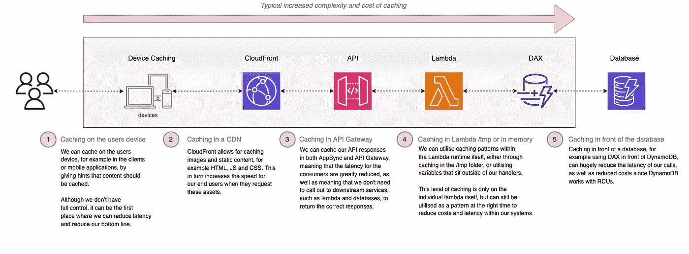
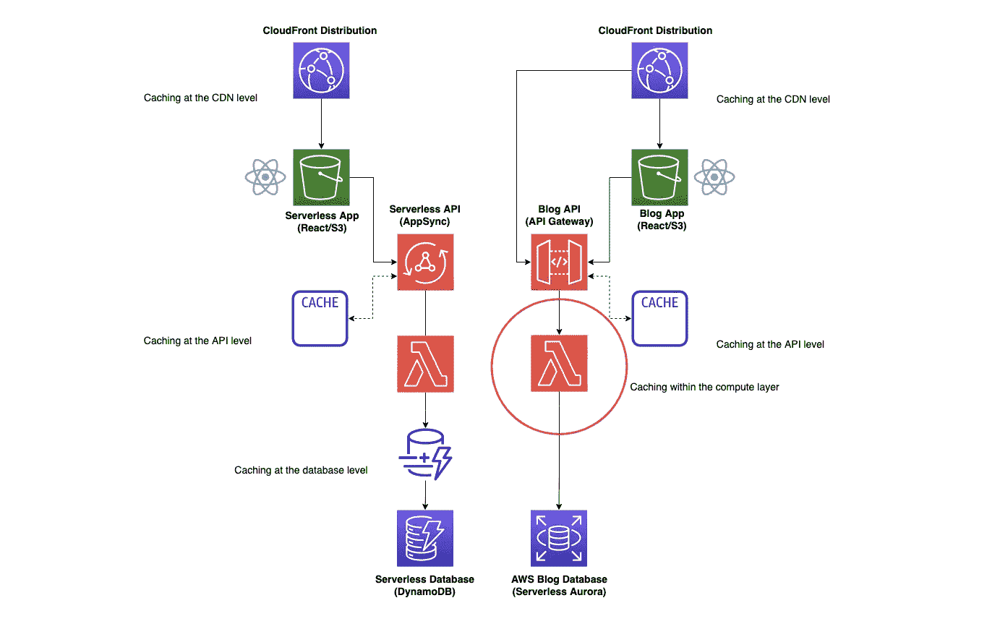
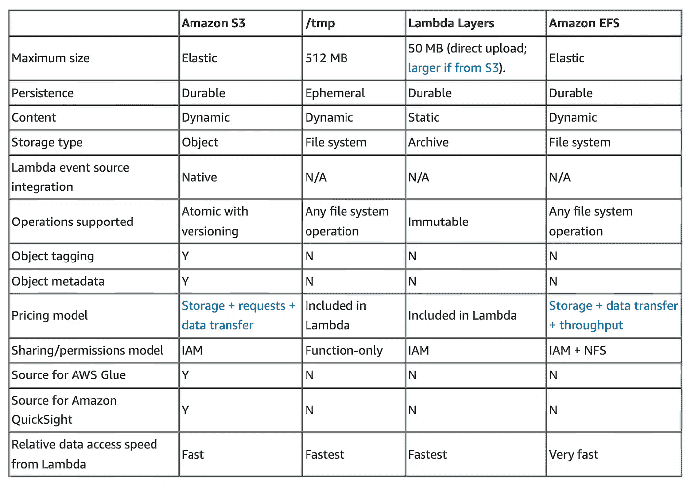
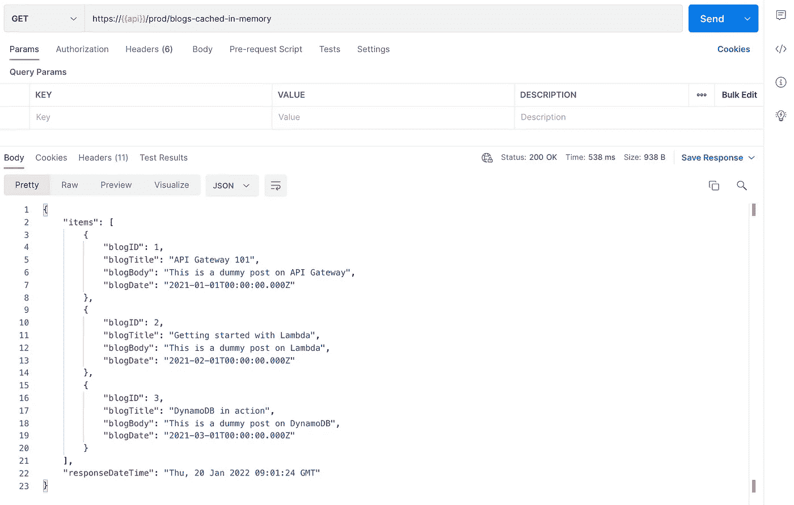
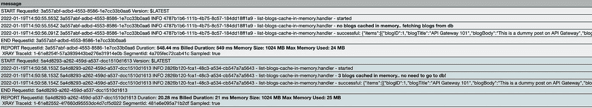
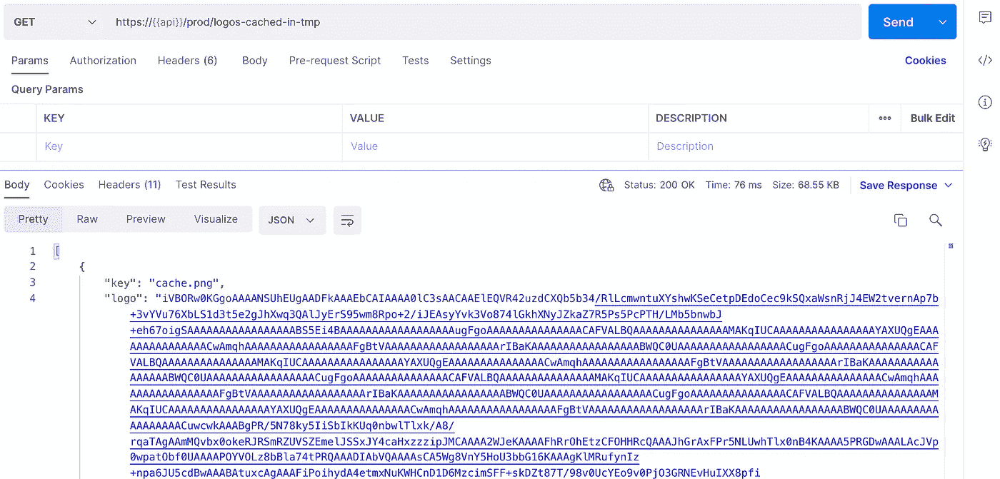
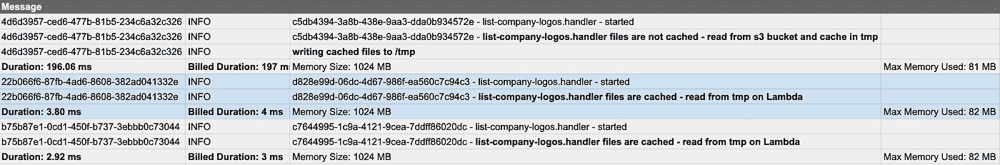

# 无服务器缓存策略—第 3 部分(Lambda 运行时)🚀

> 原文：<https://levelup.gitconnected.com/serverless-caching-strategies-part-3-lambda-runtime-b3d21250927b>


由[马腾·戴克斯](https://unsplash.com/@maartendeckers?utm_source=unsplash&utm_medium=referral&utm_content=creditCopyText)在 [Unsplash](https://unsplash.com/s/photos/squares?utm_source=unsplash&utm_medium=referral&utm_content=creditCopyText) 上拍摄的照片

## 如何在您的解决方案中使用无服务器缓存策略，包括用 TypeScript 和 CDK 编写的代码示例和视觉效果，以及 GitHub 中的相关代码库。第 3 部分介绍 Lambda 运行时环境中的缓存。


# 介绍

这是一系列文章的第 3 部分，涵盖了 AWS 上的无服务器缓存策略，以及为什么应该使用它们。Github 回购可以在这里找到【https://github.com/leegilmorecode/serverless-caching 。

这一部分将介绍 Lambda 运行时环境中的缓存。

🔵[本文的第 1 部分介绍了使用 Amazon](https://leejamesgilmore.medium.com/serverless-caching-strategies-part-1-amazon-api-gateway-c2d680d5b3b) API Gateway 在 API 层进行缓存。

🔵[本文的第 2 部分使用 *DynamoDB DAX*](https://leejamesgilmore.medium.com/serverless-caching-strategies-part-2-amazon-dynamodb-dax-d841e1e1ad0e) 查看数据库级别的缓存。

🔵**本文的第 3 部分将关注 *Lambda* 运行时环境本身中的缓存。**

🔵[本文的第 4 部分将着眼于 *AppSync* 级别](https://leejamesgilmore.medium.com/serverless-caching-strategies-part-4-appsync-7fe6ede93183)的缓存。

🔵本文的第 5 部分将讨论使用 *CloudFront* 在 CDN 级别进行缓存。

本文由 [Sedai.io](https://www.sedai.io/) 赞助


[https://www.sedai.io/](https://www.sedai.io/)

# 快速回顾👨‍🏫

下图显示了您可以在无服务器解决方案中缓存的一些区域:



# 我们在建造什么？🏗️

正如本系列的第 1 部分所描述的，这是我们正在构建的；我们将重点关注本文中以粉色突出显示的区域:



# 无服务器博客✔️

无服务器博客有以下流程:

⚪一个 CloudFront 发行版缓存了 React 网站，该网站以一个 S3 bucket 作为其源。我们可以在这个级别缓存 web 应用程序。

react 应用程序利用 GraphQL API 通过 AWS AppSync 访问其数据。*对于某些端点，我们可能会考虑使用 AppSync 缓存。*

appsync api 通过 Lambda 解析 DynamoDB 的数据，我们使用 DAX 作为数据库前端的缓存。在这里，我们可以利用 DAX 在数据库级别进行缓存。

# AWS 新闻博客✔️

AWS 新闻博客有以下流程:

⚪一个 CloudFront 发行版缓存了 React 网站，该网站以一个 S3 bucket 作为其源。*我们可以在这个级别缓存 web 应用。*

react 应用程序通过亚马逊 API 网关为其数据利用 REST API。*我们在 API 网关内的 API 级别进行缓存。*

⚪对于缓存未命中，我们使用 Lambda 函数从无服务器的 Aurora 数据库中检索数据。在这种情况下，我们还可以在 lambda 本身中缓存某些数据。

> *💡* ***注意*** *:* 这是允许我们在文章中讨论关键架构点的最小代码和架构，因此这不是生产就绪的，并且不符合编码最佳实践。(例如，在端点上没有认证)。我还尽量不把代码分割得太多，这样所有依赖关系都在一个文件中的示例文件就很容易查看。

# 我们如何在 Lambda 本身中进行缓存？✔️

有几种方法可以在 lambda 本身中进行缓存:

🔵Lambda 运行时环境中的缓存(内存中的*)。*

*🔵Lambda 上/tmp 文件夹中的缓存。*

*🔵使用 AppConfig Lambda 层缓存机密。*

> **💡* **注意**:使用 lambda layers/extensions 和 AppConfig 缓存秘密已经在下面的文章中讨论过了。*

*[](/serverless-feature-flags-6e49d534e79f) [## 无服务器功能标志🚀

### 带有 lambda 扩展和 AppConfig 的无服务器功能标志

levelup.gitconnected.com](/serverless-feature-flags-6e49d534e79f) 

## Lambda 运行时环境✔️中的缓存

一旦 Lambda 容器被初始化并第一次运行，它将在以后的调用中持续存在(*，当连接到 VPC 时，它将在大约 15 分钟的不活动状态中保持温暖，当没有连接时，它将在大约 5 分钟内保持温暖*)。

在 Lambda 处理程序本身之外创建的任何东西都将在 Lambda 容器预热期间保留在内存中，直到进一步调用。

我们可以使用上面的这两个特性来允许我们在第一次运行时在 Lambda 处理程序之外填充一个变量；在我们的示例中，从数据库调用中填充数据( *blogs* );然后对 Lambda 容器的后续调用将从内存中读取数据(*，而不是每次都返回数据库*)。

让我们看看下面一个带注释的基本代码示例:

在我们的场景中，我们很高兴文章列表很少改变(*比方说每月一次*)，并且这种方式的缓存可能比 API 网关级别的缓存更具成本效益，或者在每次 lambda 调用时从数据库中连续读取。还有一个巨大的性能增益。

然而，我们确实需要考虑到，当一篇新的博客文章发表时，这些温暖的羔羊可能需要一点时间死去，内存中的缓存需要再次恢复水分。

> *💡* ***注意*** *:* 我们当然可以通过在内存缓存中添加一个 TTL 来解决这个问题，并在给定的一段时间后重新水化。

> “这种方式的缓存可能比 API 网关级别的缓存更具成本效益”

在这种情况下，我们需要考虑无服务器解决方案中可以缓存的所有方面，并根据成本、复杂性、业务需求和性能选择合适的解决方案。

> *💡* ***注*** *:* 过去的一个真实例子是 Lambda 缓存来自客户端的访问令牌-凭证授权流(机器到机器流)。这个访问令牌大约有 24 小时的有效期，所以我们不需要为每个请求生成令牌，而是将令牌缓存在内存中。

> “在这种情况下，我们需要考虑我们的无服务器解决方案中可以缓存的所有方面，并根据成本、复杂性和性能选择正确的解决方案。”

## Lambda ✔️上/tmp 文件夹中的缓存

与上面类似，我们能够在 Lambda 上填充高达 512MB 的`/tmp`文件夹，然后这个短暂的文件存储将在以后的调用中保持不变。

> “Lambda 执行环境为您的代码提供了一个在/tmp 使用的文件系统。该空间的固定大小为 512 MB。多个 Lambda 调用可以重用同一个 Lambda 执行环境来优化性能。/tmp 区域在执行环境的生命周期内被保留，并为调用之间的数据提供临时缓存。每次创建新的执行环境时，都会删除这个区域。
> 
> 因此，这是一个短暂的存储区域。虽然函数可以在调用之间缓存数据，但它应该只用于代码在一次调用中需要的数据。它不是一个永久存储数据的地方，最好用于支持代码所需的操作。"—[https://AWS . Amazon . com/blogs/compute/choosing-between-AWS-lambda-data-storage-options-in-we B- apps/](https://aws.amazon.com/blogs/compute/choosing-between-aws-lambda-data-storage-options-in-web-apps/)

在我们的例子中，我们从亚马逊 S3 提取一些静态对象(*徽标图像文件*，然后将它们写入 Lambda 上的`tmp`文件夹。在 Lambda 的进一步调用中，logo 文件保留在 tmp 中，并且我们不再需要在第一次调用之后联系 S3(每个 Lambda 实例)。

在这种情况下，我们可以提高 Lambdas 的速度，并大幅降低成本；然而，如上所述，文件可能已经过时，不会改变，直到 Lambda 是一个新的容器。

下表显示了 Lambda 存储类型的相对速度:



[https://AWS . Amazon . com/blogs/compute/choosing-between-AWS-lambda-data-storage-options-in-web-apps/](https://aws.amazon.com/blogs/compute/choosing-between-aws-lambda-data-storage-options-in-web-apps/)

> “在这种情况下，我们可以大幅提高速度和降低成本；然而，如上所述，这些文件可能已经过时，不会改变，直到 Lambda 再次成为一个新的容器。

让我们看看下面的一个带注释的基本代码示例，它来自我们的 repo，我们将 S3 的徽标文件缓存到 tmp 目录中:

就像我们上面讨论的内存缓存一样，这是我们需要考虑我们的无服务器解决方案中可以缓存的所有领域，并根据成本、复杂性和性能(*以及限制，如 512 MB 的最大临时存储大小*)选择正确的解决方案。

> *💡** 

# *入门！✔️*

*首先，使用以下 git 命令克隆以下 repo:*

```
*git clone [https://github.com/leegilmorecode/serverless-caching](https://github.com/leegilmorecode/serverless-caching)*
```

*这将把示例代码下载到您的本地机器上。*

# *部署解决方案！👨‍💻*

*🛑 **注意** : *运行以下命令将在您的 AWS 帐户上产生费用，并且一些服务不在免费层。**

*在 repo 的'`aws-blog`'文件夹中运行以下命令安装所有依赖项:*

```
*npm i*
```

*完成此操作后，运行以下命令来部署解决方案:*

```
*npm run deploy*
```

*🛑 **注意** : *记得在你完成后拆掉堆叠，这样你就不会继续被充电了，通过使用“npm 运行移除”。**

> **💡* ***注意*** *:* 我们使用 CustomResource 作为部署的一部分来创建 blogs 表，并用一些虚拟数据填充它，因此您可以直接使用它*。**

# *测试解决方案🎯*

*现在我们已经部署了解决方案，您可以使用 postman 文件测试端点，该文件可以在这里找到:`aws-blog/postman/serverless-caching-aws-blogs.postman_collection.json`*

> **💡* ***注意*** :您还需要将一些示例图像放入已创建的 S3 桶中。*

## *我们如何确定缓存正在工作？*

*让我们看看日志，看看缓存在我们的两个场景中是如何工作的:*

***缓存在内存中** ✔️*

*我们要讨论的第一个场景是在内存中缓存博客，我们可以在下面看到:*

**

*调用内存中的博客端点*

*我们可以从下面的日志中看到:*

1.  *随着第一次调用(*和缓存* *为空*)lambda 用了*549 毫秒完成(*主要是由于数据库调用和冷启动*)**
2.  **对同一个 lambda 的第二次调用将博客文章缓存在内存中，lambda 花了大约***21 毫秒*** 才完成，根本没有调用数据库。**

**这极大地节省了延迟并提高了性能，而且我们不需要进行进一步的数据库调用，这在使用 DynamoDB 等数据库时会节省成本。**

****

****临时缓存** ✔️**

**接下来，我们将关注 Lambda 本身的`tmp`文件夹中的缓存文件，特别是从 S3 桶中提取图像(*徽标*)。我们可以从下面的日志中看到:**

1.  **随着第一次调用(*和缓存* *为空*)的进行，lambda 花费了*197 毫秒来完成(*主要是由于对 S3 的调用，以从 S3 桶和冷启动*中拉下标志)***
2.  **对同一个 lambda 的第二次调用将徽标图像缓存在 lambda 运行时环境中的`tmp`目录中，Lambda 平均花费大约 ***4ms*** 来完成。**

**这大大节省了延迟并提高了性能，而且我们不需要再打电话到 S3，这样也可以节省成本。**

****

**呼叫徽标端点**

**下面的日志显示了正在进行的缓存:**

****

**显示使用 tmp 目录进行缓存的示例日志**

# **有什么优缺点？**

**现在我们已经讨论了如何在我们的 Lambdas 中进行缓存；有什么优缺点？**

## **优势**

**🔵潜在的成本节约。**

**🔵潜在的性能提升和延迟减少。**

## **不足之处**

**🔵只要 Lambda 是热的，缓存就可以保持不变，因此是不确定的。(*你可以通过在缓存中存储一个 TTL 时间戳来解决这个问题*)。**

**🔵根据 Lambda 的吞吐量和伸缩性，可能会有更高效的缓存服务可供使用。**

# **摘要**

**我希望你觉得有用！请继续和我一起完成第 4 部分和第 5 部分的缓存之旅！**

**请点击此处订阅我的企业无服务器新闻稿，了解更多相同的内容:**

**[](https://www.linkedin.com/newsletters/enterprise-serverless-%F0%9F%9A%80-6875837779876605952/) [## 企业无服务器🚀LinkedIn

### Lee Gilmore |面向 AWS 开发人员、DevOps 工程师和云架构师的无服务器新闻和文章

www.linkedin.com](https://www.linkedin.com/newsletters/enterprise-serverless-%F0%9F%9A%80-6875837779876605952/)** 

# **包扎👋**

**请[前往我的 YouTube 频道](https://www.youtube.com/channel/UC_Bi6eLsBXpLnNRNnxKQUsA)订阅类似内容！**

****

**我很乐意就以下任何一个方面与您联系:**

**【https://www.linkedin.com/in/lee-james-gilmore/】T3
T5[https://twitter.com/LeeJamesGilmore](https://www.linkedin.com/in/lee-james-gilmore/)**

**如果你觉得这些文章鼓舞人心或有用，请随时用虚拟咖啡[https://www.buymeacoffee.com/leegilmore](https://www.buymeacoffee.com/leegilmore)来支持我，不管怎样，让我们联系和聊天吧！☕️**

**如果你喜欢这些帖子，请关注我的简介[李·詹姆斯·吉尔摩](https://medium.com/u/2906c6def240?source=post_page-----39c4f4ae5aff----------------------)以获取更多的帖子/系列，不要忘记联系我并打招呼👋**

**如果你喜欢，也请使用帖子底部的“鼓掌”功能！(*可以不止一次鼓掌！！*)**

# **关于我**

**"*大家好，我是 Lee，英国的 AWS 社区构建者、博客作者、AWS 认证云架构师和首席软件工程师；目前是一名技术云架构师和首席无服务器开发人员，过去 5 年主要从事 AWS 上的全栈 JavaScript 工作。***

***我认为自己是一名无服务器倡导者，热爱 AWS、创新、软件架构和技术。***

*******所提供的信息是我个人的观点，我对这些信息的使用不承担任何责任。*******

**您可能还对以下内容感兴趣:**

**[](https://leejamesgilmore.medium.com/serverless-content-46ef5b562d8e) [## 无服务器内容🚀

### 我的所有无服务器内容的索引，可以在一个地方轻松浏览，包括视频、博客文章等..

leejamesgilmore.medium.com](https://leejamesgilmore.medium.com/serverless-content-46ef5b562d8e)**