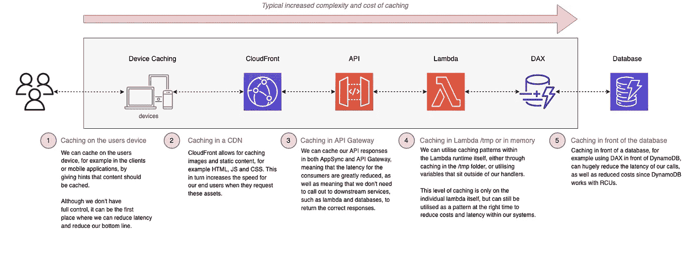
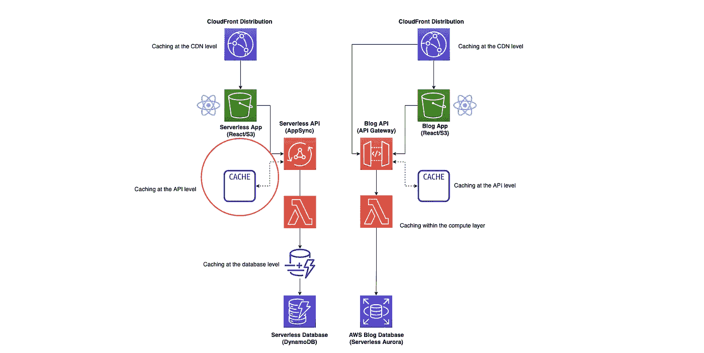
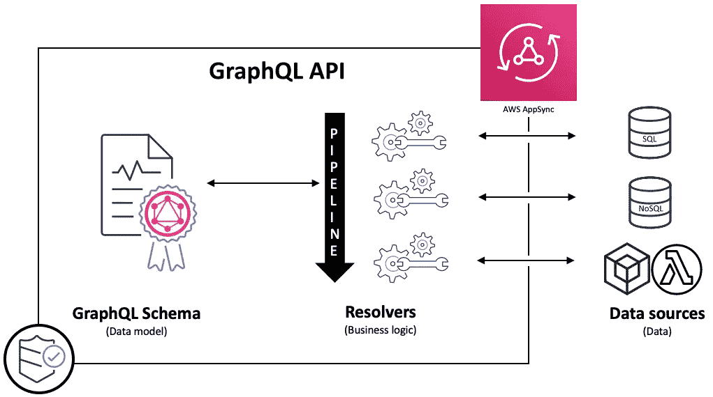
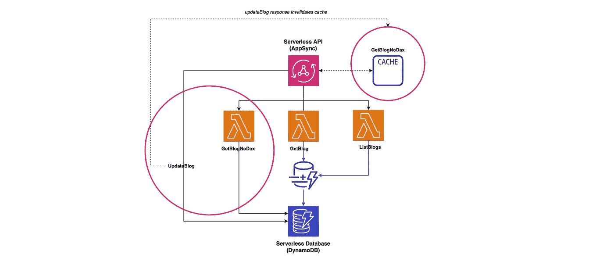
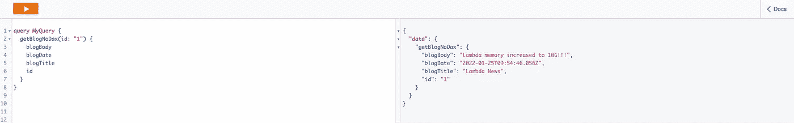
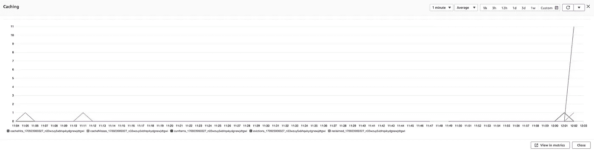
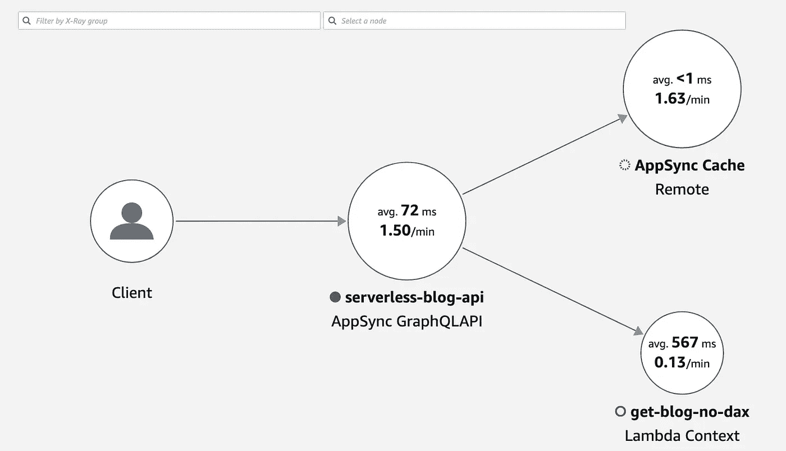
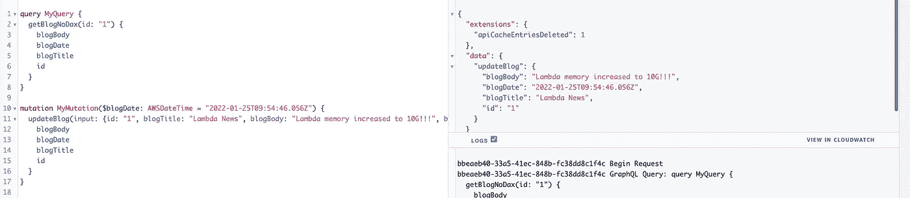
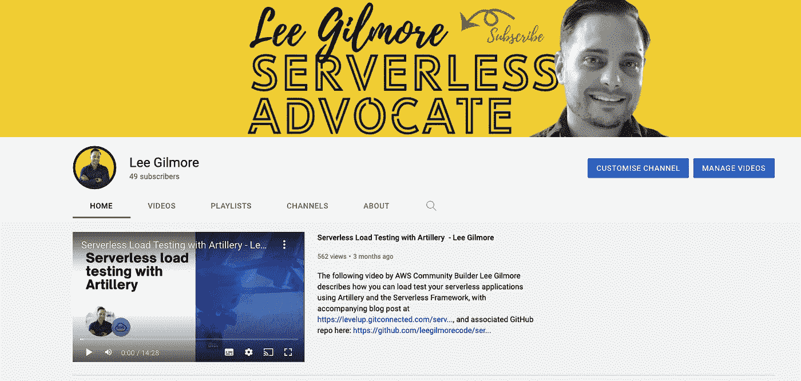

# 无服务器缓存策略—第 4 部分(AppSync)🚀

> 原文：<https://levelup.gitconnected.com/serverless-caching-strategies-part-4-appsync-7fe6ede93183>


由 [Unsplash](https://unsplash.com/?utm_source=unsplash&utm_medium=referral&utm_content=creditCopyText) 上的[真空背景](https://unsplash.com/@vackground?utm_source=unsplash&utm_medium=referral&utm_content=creditCopyText)拍摄

## 如何在您的解决方案中使用无服务器缓存策略，包括用 TypeScript 和 CDK 编写的代码示例和视觉效果，以及 GitHub 中的相关代码库。第 4 部分介绍 AWS AppSync 中的缓存。


# 介绍

这是涵盖 AWS 上的无服务器缓存策略以及为什么应该使用它们的文章的第 4 部分。Github 回购可以在这里找到[https://github.com/leegilmorecode/serverless-caching](https://github.com/leegilmorecode/serverless-caching)。

这一部分将介绍 AWS AppSync 中的缓存。

🔵[本文的第 1 部分介绍了使用 Amazon](https://leejamesgilmore.medium.com/serverless-caching-strategies-part-1-amazon-api-gateway-c2d680d5b3b) API Gateway 在 API 层进行缓存。

🔵[本文的第 2 部分使用 *DynamoDB DAX*](https://leejamesgilmore.medium.com/serverless-caching-strategies-part-2-amazon-dynamodb-dax-d841e1e1ad0e) 研究数据库级的缓存。

🔵[本文的第 3 部分研究了 *Lambda* 运行时环境本身](https://leejamesgilmore.medium.com/serverless-caching-strategies-part-3-lambda-runtime-b3d21250927b)中的缓存。

🔵**这一部分将着眼于 *AppSync* 级别的缓存。**

🔵本文的第 5 部分将讨论使用 *CloudFront* 在 CDN 级别进行缓存。

本文由 [Sedai.io](https://www.sedai.io/) 赞助


[https://www.sedai.io/](https://www.sedai.io/)

# 快速回顾👨‍🏫

下图显示了您可以在无服务器解决方案中缓存的一些区域:



# 我们在建造什么？🏗️

正如本系列的第 1 部分所描述的，这是我们正在构建的；我们将重点关注本文中以粉色突出显示的区域，特别是 AppSync 中的缓存:



# 无服务器博客✔️

无服务器博客有以下流程:

⚪一个 CloudFront 发行版缓存了 React 网站，该网站以一个 S3 bucket 作为其源。我们可以在这个级别缓存 web 应用程序。

react 应用程序利用 GraphQL API 通过 AWS AppSync 访问其数据。*对于某些终端，我们可能会考虑使用 AppSync 缓存。*

appsync api 通过 Lambda 解析 DynamoDB 的数据，我们使用 DAX 作为数据库前端的缓存。*在这里，我们可以利用 DAX 在数据库级别进行缓存。*

# AWS 新闻博客✔️

AWS 新闻博客有以下流程:

⚪一个 CloudFront 发行版缓存了 React 网站，该网站以一个 S3 bucket 作为其源。*我们可以在这个级别缓存 web app。*

react 应用程序通过亚马逊 API 网关为其数据利用 REST API。*我们在 API 网关内的 API 级别进行了缓存。*

⚪对于缓存未命中，我们使用 Lambda 函数从无服务器的 Aurora 数据库中检索数据。在这个场景中，我们还可以在 lambda 本身中缓存某些数据。

> *💡* ***注意*** *:* 这是允许我们在文章中讨论关键架构点的最小代码和架构，因此这不是生产就绪的，并且不符合编码最佳实践。(例如，在端点上没有认证)。我也试着不要把代码分割得太多，这样所有依赖关系都在一个文件*中的例子文件很容易查看。*

# 首先，什么是 AppSync？👨‍💻

> *💡* ***注*** *:* 如果您对 AppSync 有很好的了解，请随意跳到下一节

组织选择用 GraphQL 构建 API 是因为它帮助他们更快地开发应用程序，让前端开发人员能够用一个 GraphQL 端点查询多个数据库、微服务和 API。

> AWS AppSync 是一项完全托管的服务，通过处理安全连接到数据源(如 AWS DynamoDB、Lambda 等)的繁重工作，可以轻松开发 GraphQL APIs

AWS AppSync 是一个完全托管的服务，通过处理安全连接到 AWS DynamoDB、Lambda 等数据源的繁重工作，可以轻松开发 GraphQL APIs。添加缓存以提高性能，订阅以支持实时更新，以及客户端数据存储以保持离线客户端同步也同样简单。部署完成后，AWS AppSync 会自动调整 GraphQL API 执行引擎，以满足 API 请求量。”——[https://aws.amazon.com/appsync/](https://aws.amazon.com/appsync/)

以下视频更详细地介绍了 AppSync:

AWS AppSync 有`resolvers`的概念，它是 GraphQL 中的内置函数，用数据源中的数据“解析”GraphQL 模式中定义的类型或字段。AppSync 中的解析器有两种类型:`unit resolvers`或`pipeline resolvers`。

> AppSync 管道解析器通过协调对多个数据源的请求，显著简化了客户端应用程序的复杂性，并有助于实施服务器端业务逻辑控制。它们可用于在 API 层实施应用程序逻辑的某些方面。”——埃德·利马·奥斯

管道解析器提供了在单个 API 调用中对多个数据源串行执行操作的能力，由查询、突变或订阅触发。如下图所示:



[https://AWS . Amazon . com/blogs/mobile/app sync-pipeline-resolvers-1/](https://aws.amazon.com/blogs/mobile/appsync-pipeline-resolvers-1/)

# AppSync 中的缓存是如何工作的？💭

AWS AppSync 的服务器端数据缓存功能由[Amazon elastic cache for Redis](https://aws.amazon.com/elasticache/redis/)提供支持，使数据在高速内存缓存中可用，从而提高性能并减少延迟。这减少了直接访问数据源的需要，无论是 Lambda、DynamoDB、无服务器 Aurora、HTTP 还是更多。

"*缓存是一种策略，用于提高 API 中查询和数据修改操作的速度，同时减少对数据源的请求。使用 AppSync，您可以选择* [*为 API 的单元解析器提供专用缓存*](https://aws.amazon.com/blogs/mobile/appsync-caching-transactions/) *，从而加快响应时间并减轻后端服务的负担。一些客户已经能够利用 AppSync 中服务器端缓存的简单性和高效性，将数据库请求减少 99%* *。* " —埃德·利马—[https://AWS . Amazon . com/blogs/mobile/app sync-pipeline-caching/](https://aws.amazon.com/blogs/mobile/appsync-pipeline-caching/)

AppSync 中的缓存在两个级别上工作:

🔵跨整个 API 缓存。

🔵每个解析器级别的缓存( *inc 管道解析器*)。

## **跨完整 API 缓存** ✔️

如果数据不在缓存中，则从数据源中检索并填充缓存，直到生存时间( *TTL* )到期。

对 API 的所有后续请求都从缓存中返回。这意味着除非 TTL 过期，否则不会直接联系数据源。在这个设置中，我们使用`$context.arguments`和`$context.identity`映射的内容作为缓存键。

> *💡* ***注意****:*app sync 的最大 TTL 为 3600 秒(1 小时)，超过后条目自动删除。

## 每个解析程序级别的缓存✔️

使用此设置，必须显式选择每个解析程序来缓存响应。

> *💡* ***注意*** *:* 这在我们的示例中很重要，因为其他 GraphQL 端点不需要在 AppSync 中缓存，因为我们在数据库级别(即 DynamoDB DAX)显式缓存。

您可以在解析器上指定 TTL 和缓存键。您可以指定的缓存键是来自`$context.arguments`、`$context.source`和`$context.identity`映射的值。

TTL 值是必需的，但是缓存键是可选的。如果您没有指定任何缓存键，默认为`$context.arguments`、`$context.source`和`$context.identity`映射的内容。

例如，我们可能会使用`$context.arguments.id`或`$context.arguments.InputType.id`、`$context.source.id`和`$context.identity.sub`或`$context.identity.claims.username`。当您只指定 TTL 而不指定缓存键时，解析器的行为与上面的类似。

让我们看看下面使用 AWS CDK 的每个解析器缓存的设置:

**从上面简单的代码片段我们可以看出我们:**

1.  创建与 Lambda 关联的 Lambda 数据源。
2.  我们为上面的数据源创建一个解析器，将缓存配置设置为`$context.arguements.id`，TTL 为 30 秒。(*本质上通过 ID* 缓存给定博客的所有实例)
3.  最后，我们将缓存添加到整个 AppSync API 中，特别是每个解析器的缓存。(*这将创建缓存并将其与 API 相关联)*

> 随着管道解析器缓存的扩展，使用完整请求缓存的客户会立即看到缓存更改的好处，因为管道解析器是完整 API 缓存的一部分

## 我们如何使用缓存键？🔑

当考虑缓存键时，考虑想要缓存的上下文和方式是很重要的。例如，在我们的示例中，您可能想要缓存所有的博客帖子，而不管是谁在访问它们。或者，您可能希望根据地理区域缓存博客文章。

如果这是某个特定用户的特定信息，比如他们来自朋友的最新消息，那么您很可能也想在您的缓存密钥中使用`$context.identity.sub`(*即特定用户的身份*)。

## 我们如何使缓存无效？🗑️

当您设置 AWS AppSync 的服务器端缓存时，您可以配置最大 TTL。该值定义了缓存条目在内存中存储的时间。

在必须从缓存中删除特定条目的情况下(*比如底层条目被更新或删除*)，可以在解析器的请求或响应映射模板中使用 AWS AppSync 的`evictFromApiCache`扩展实用程序。(*例如，当您的数据源中的数据已经更改，并且您的缓存条目现在已经过时。*)

在我们的场景中，使缓存无效的一个例子如下(*为了清楚起见，DynamoDB 中的项的底层更新被删除*):

扩展方法**的参数**是`type`、`field`和`caching keys`。

您可以将此代码添加到正在更新资源的端点的请求或响应映射中的 VTL 模板中。

如果一个条目被成功清除，则响应在`extensions`对象中包含一个`apiCacheEntriesDeleted`值，该值显示删除了多少条目:

```
"extensions": {  "apiCacheEntriesDeleted": 1}
```

# 入门！✔️

首先，使用以下 git 命令克隆以下 repo:

```
git clone [https://github.com/leegilmorecode/serverless-caching](https://github.com/leegilmorecode/serverless-caching)
```

这将把示例代码下载到您的本地机器上。

# 部署解决方案！👨‍💻

> *🛑*

在 repo 的'`serverless-blog`'文件夹中运行以下命令来安装所有依赖项:

```
npm i
```

完成此操作后，运行以下命令来部署解决方案:

```
npm run deploy
```

> *🛑*
> 
> *💡* ***注意*** *:* 我们使用 CustomResource 作为部署的一部分来创建 blogs 表，并用一些虚拟数据填充它，因此您可以直接使用它*。*

# 测试解决方案🎯

现在，我们已经为 AppSync API 建立了以下与缓存相关的架构，下面的粉色圆圈中突出显示了感兴趣的要点:



AppSync 缓存的架构示例

## 让我们看看如何测试缓存，看看它是如何工作的

使用控制台，我们可以在短时间内对`getBlogNoDax`执行以下查询 12 次:



我们在 getBlogNoDax 上执行查询

然后我们可以在 CloudWatch 中看到，我们有 **1 缓存未命中** ( *初始调用*)和 **11 缓存命中** ( *缓存被填充时的后续调用，明显快得多*)。这些调用也没有触及 DynamoDB，因此我们节省了读取容量成本。



该图像显示了基于我们的查询的缓存命中

然后，我们可以更进一步，查看 X-Ray 的 ServiceLens 图，了解缓存和延迟方面的情况:



服务镜头地图

我们可以看到，缓存填充后的延迟为:

`Latency (avg): **<1ms** Requests: **1.63/min** Faults: **0.00/min**`

并且初始高速缓存未命中的等待时间(*λ*)是:

`Latency (avg): **567ms** Requests: **0.13/min** Faults: **0.00/min**`

## **测试缓存失效**

接下来，我们将看看如何测试缓存失效。

由于缓存仍然是由我们之前对`getBlogNoDax`的查询填充的，因此我们可以通过使用我们的突变`updateBlog`更新博客文章(如下图所示的*)来清空缓存:*



根据变异的返回值，我们可以看到属性'`apiCacheEntriesDeleted`'在响应中返回了值 1。这表明在我们的更新之后，我们已经使这篇博文的缓存失效了。

如果您在一行中进行两次更新，您将会看到您只在第一次调用时返回该属性，因为当您第二次调用变异时，缓存中没有任何内容。

最后，让我们看看在成功更新博客文章后实际执行缓存失效的代码:

您可以看到，我们的请求映射模板正在 DynamoDB 中使用传递给变异的输入执行一个`putItem`，然后我们的响应映射模板使用相同的键(*即博客 ID* )清除`getBlogNoDax`类型的查询缓存，最后将结果返回给消费者。

# 有什么优缺点？📝

现在我们已经介绍了如何在 AppSync 中进行缓存；有什么优缺点？

## ✔️的优势

🔵提高性能并大大减少最终用户的延迟。

🔵我们不需要管理底层缓存实例(*即安装补丁等*)。

🔵我们有可能大幅降低访问下游服务(如 DynamoDB)的成本(*降低 99%* )

🔵我们有可能减少遗留下游服务的负载。

## ❌的劣势

🔵尽管我们不需要管理实例，但是随着非无服务器服务的引入，我们仍然限制了无服务器解决方案的可伸缩性。

🔵存在与底层缓存实例相关的成本，根据您的使用情形和吞吐量，这可能会变得非常昂贵。**注意**，实例从**小型** 1 个 vCPU，1.5 GiB RAM，到**12 个大型** 48 个 vCPU，317.77 GiB RAM，10gb 网络性能，取决于您的具体需求。

# 包扎👋

我希望你觉得有用！

请[去我的 YouTube 频道](https://www.youtube.com/channel/UC_Bi6eLsBXpLnNRNnxKQUsA)订阅类似内容！



[https://www.youtube.com/channel/UC_Bi6eLsBXpLnNRNnxKQUsA](https://www.youtube.com/channel/UC_Bi6eLsBXpLnNRNnxKQUsA)

我很乐意就以下任何一个方面与您联系:

[https://www.linkedin.com/in/lee-james-gilmore/](https://www.linkedin.com/in/lee-james-gilmore/)
https://twitter.com/LeeJamesGilmore

如果你觉得这些文章鼓舞人心或有用，请随时用虚拟咖啡[https://www.buymeacoffee.com/leegilmore](https://www.buymeacoffee.com/leegilmore)来支持我，不管怎样，让我们联系和聊天吧！☕️

如果你喜欢这些帖子，请关注我的简介[李·詹姆斯·吉尔摩](https://medium.com/u/2906c6def240?source=post_page-----39c4f4ae5aff----------------------)以获取更多的帖子/系列，不要忘记联系我并打招呼👋

如果你喜欢，也请使用帖子底部的“鼓掌”功能！(*可以不止一次鼓掌！！*)

如果您喜欢这篇文章，您可能会喜欢以下内容:

[](https://leejamesgilmore.medium.com/serverless-content-46ef5b562d8e) [## 无服务器内容🚀

### 我的所有无服务器内容的索引，可以在一个地方轻松浏览，包括视频、博客文章等..

leejamesgilmore.medium.com](https://leejamesgilmore.medium.com/serverless-content-46ef5b562d8e) 

# 关于我

"*大家好，我是 Lee，英国的 AWS 社区构建者、博客作者、AWS 认证云架构师和首席软件工程师；目前是一名技术云架构师和首席无服务器开发人员，过去 5 年主要从事 AWS 上的全栈 JavaScript 工作。*

我认为自己是一个无服务器的布道者，热爱 AWS、创新、软件架构和技术。

****提供的信息是我个人的观点，我对信息的使用不承担任何责任。****