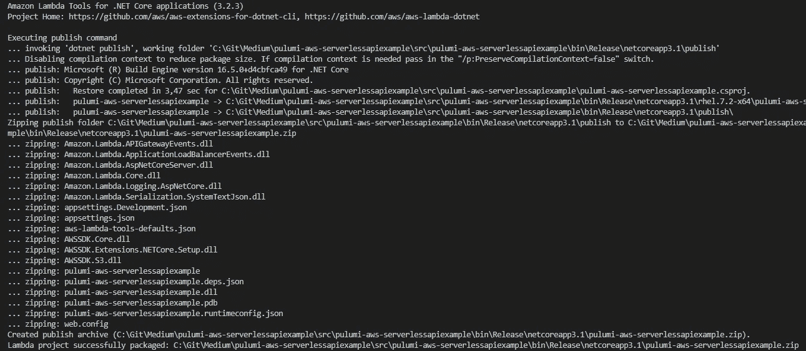
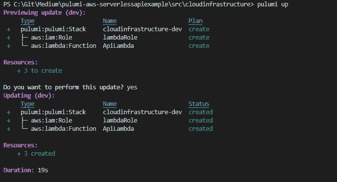
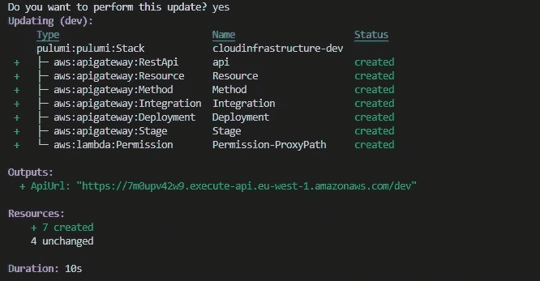
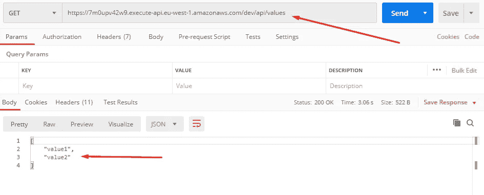

# 使用 AWS，Pulumi 和。网络核心

> 原文：<https://levelup.gitconnected.com/serverless-cloud-api-using-aws-pulumi-and-net-core-83e2e55397b3>

由 [Kaushik Panchal](https://unsplash.com/@kaushikpanchal?utm_source=medium&utm_medium=referral) 在 [Unsplash](https://unsplash.com?utm_source=medium&utm_medium=referral) 拍摄的照片

设置 API 是提供服务所需的基本工具之一。如果你没有选择或者不想维护硬件，无服务器后端似乎是一个不错的选择，所有主要的云提供商都有自己的解决方案。

习惯在云中工作意味着学习一些新概念，比如如何为云提供商定义基础设施。大多数云提供商提供了通过 YAML 或 JSON 模板定义基础设施的选项，但这种解决方案有很多限制，例如缺乏自动完成功能和将代码分成单独组件的能力。基本上，在几乎所有的编程语言中，很多我们认为理所当然的东西。

理想的选择是用真正的编程语言定义您的代码，并能够以可复制的方式将其部署到云中。AWS 一直在开发云开发工具包，它允许用多种编程语言编写基础设施(最终会翻译成 JSON 模板进行部署)。老实说，CDK 确实工作得很好，但它当然仅限于 AWS。

在云不可知的类别中，我们找到了 Pulumi。这是一个相当新的开源项目，旨在允许以 Typescript、Python、Go 和 C#为许多云提供商编写云基础设施代码。这里的主要优势是能够与几个云提供商交互，而不是被一个提供商所束缚。我喜欢的另一个选择是构建一个混合云系统，将来自 2 个或更多云提供商的资源整合到一个系统中。除非你真的需要，否则不要这样做(事情可能会变得比必要的更复杂)，但是有这个选择是很好的。

在本文中，我将介绍如何使用 API Gateway 和 Lambda 在 AWS 中设置一个基本的 API。我将使用 Pulumi 并使用 C#编写 lambda 函数和云基础设施的代码，因为我喜欢 C#的类型安全性，并且 Pulumi 最近在 2.0 版本中推出了对 C#的支持。然而，用 C#制作无服务器函数也稍微复杂一些，因为代码必须在部署前编译和打包。

先决条件:

*   [普鲁米 CLI](https://www.pulumi.com/docs/get-started/install/)
*   [。NET SDK](https://dotnet.microsoft.com/download)
*   dotnet lambda 工具(运行`dotnet tool install -g Amazon.Lambda.Tools`
*   AWS 帐户
*   AWS CLI -配置了对帐户的访问权限

# 制作你的 lambda 代码

第一件事是启动你的 C# lambda 项目。对于这个例子，我们将只设置一个基本模板，这将足以进行演示。如果您还没有安装 dotnet lambda 模板，请运行`dotnet new -i Amazon.Lambda.Templates`进行安装。之后，当运行`dotnet new`时，模板应该是可见的。

通过运行`dotnet new serverless.AspNetCoreWebAPI`启动你的项目。这将为您创建 web API 所需的各种文件。API 将开箱即用，并且提供了几个示例控制器。如果您查看一下 *ValuesController.cs* 文件，您会看到 HTTP GET 请求将返回一个字符串数组。我们稍后将使用它进行测试。

我们的控制器中用于测试的 HTTP GET 方法

# 用于部署的包 lambda

因为我们的 lambda 函数代码基本上已经准备好了，我们现在需要打包它。这意味着编译代码并把它收集到 zip 存档中，然后部署到云中的实际 lambda 上。幸运的是，使用 dotnet lambda 工具，这个过程非常简单(参见先决条件)。只需在包含您的。csproj 文件。您应该会看到类似如下的输出:

打包 lambda 代码的控制台输出

记下 zip 存档的位置(输出的最后一行)。我们将需要它来定义 Pulumi 中的代码。

# 使用 Pulumi 将 lambda 函数定义为代码

现在我们已经有了 lambda 函数的部署包，我们应该使用 Pulumi 将云基础设施定义为代码。通过运行`pulumi new aws-csharp`在 Pulumi 中创建一个新的 C#项目，并遵循 CLI 的指示(给出项目名称、描述、堆栈名称并选择 AWS 区域)。通过运行`dotnet add package Pulumi.Aws`为 AWS 安装 Pulumi nuget 包。

看看 MyStack.cs，你现在已经有了一个基本的 AWS 云基础设施，其中只包括一个 S3 桶。您可以删除 bucket 和使用 bucket 的输出，因为在这个例子中我们不需要它。现在我们应该开始定义我们的 lambda，为此我们需要两样东西:角色(定义 lambda 的权限)和 lambda 函数本身。让我们首先创建角色。

这个角色本身是非常基本的。它所做的只是说 lambda 函数被允许承担这个角色。不需要进一步的策略，因为 lambda 函数不需要访问任何其他资源。

基本 IAM 角色，可由 AWS Lambda 承担

接下来是 lambda 函数本身。这里还有更多的内容，让我们来看一下。lambda 函数被定义为一个“函数”类对象，位于 *Pulumi 下。Aws.Lambda* 命名空间。正确设置 lambda 需要几个属性:

1.  运行时:定义运行时，因为我们使用的是 dotnet core 3.1，所以将它作为值提供，尽管如果您想尝试，dotnetcore 2.1 也是可用的。
2.  handler:assembly::TYPE::METHOD 格式的处理程序路径。更多信息[这里](https://docs.aws.amazon.com/lambda/latest/dg/csharp-handler.html)。
3.  超时:以秒为单位。默认值是 3 秒，这对于 C# lambda 的冷启动(第一次启动 lambda)来说是不够的。所以 ***真的*** 增加一点这个限制很重要。否则你的 lambda 函数总是会超时。
4.  代码:要部署的代码。所以这里我们提供了一个 FileArchive 类，指向我们之前制作的部署包。在此提供您自己的部署包的路径。
5.  角色:我们刚刚在上面定义的角色的 ARN。

制作 lambda 函数的 Pulumi 代码

现在我们已经定义了 lambda 函数，让我们试着部署它来验证一切正常。导航到 Pulumi 项目的目录并运行`pulumi up`。您应该会在终端中看到类似如下的输出:

部署我们的 lambda 的输出

如果您导航到 AWS 控制台，lambda 现在应该也在那里。但是一个无法触发的 lambda 有什么用呢？接下来，我们将通过一个 API 来访问它！

# 定义代理 API

我们将在 API Gateway 中设置我们的 API，作为一个简单的代理 API，它将把所有流量转发给我们之前的 lambda 函数。API Gateway 实际上有许多组件需要设置来完成这个单一的目标，这在您第一次设置它时会非常麻烦。AWS CDK 已经有一个资源可以轻松地设置所有这些(称为 LambdaRestApi)，但不幸的是 Pulumi 没有这个(还没有)。幸运的是，Pulumi 使得在未来的项目中设置和重用 API 代码变得很容易，所以让我们致力于将 API 资源与项目的其余部分分开。

在 Pulumi 项目中创建一个名为 ProxyApi.cs 的新文件。在这个文件中，我们需要设置几个云资源:

*   API:整个 REST Api
*   资源:API 内部的特定资源。我们将使其成为代理资源，这意味着所有路由都将被转发。
*   方法:HTTP 方法以及是否使用 API 密钥/授权来保护它
*   集成:API 和 lambda 函数之间的集成，指定如何为传入的请求调用 lambda
*   部署:在 API 可访问之前，需要使用部署资源对其进行部署
*   阶段:API 将被部署到部署资源中的特定阶段
*   权限:定义 lambda 允许从 API 执行

仅仅为了支持调用 lambda 函数，这可能看起来有点复杂，但是请记住，API Gateway 要复杂得多，并且支持许多用例，这在本例中是不需要的。好的方面是，一旦我们使用 Pulumi 代码定义了 API，我们就可以在将来自由地重用它，而不必担心 API 的内部资源。

定义代理 API 的自定义对象

现在，这是相当多的代码，我认为如果我一行一行地看，它会变得太详细。但是请注意，我已经为我的*部署*资源添加了一个“DependsOn”到*资源*、*方法*和*集成*，因为它们需要先被创建，而 Pulumi 并没有自己弄清楚。集成也是如此，如果没有首先创建方法，集成偶尔会失败。

我还使用了`Output.format`方法为 lambda 权限格式化来自不同 Pulumi 资源的输出，这是必需的，因为 Pulumi 需要在属性可用之前创建这些资源(在 Pulumi [中阅读更多关于输入和输出的信息，请点击](https://www.pulumi.com/docs/intro/concepts/programming-model/#outputs))。

从我们的主堆栈中，我们现在可以通过调用`var api = new ProxyApi(apiLambda);`来创建一个指向 lambda 函数的完整代理 API。我还为 API url 添加了一个堆栈输出(由 AWS 自动生成)，这样一旦部署了 API，我们就可以轻松地对其进行测试。再次运行`pulumi up`来部署所有的新资源。

部署 API 的控制台输出

让我们通过在 url 上使用 [Postman](https://www.postman.com/) 来确认 API 正在工作。请记住，API 的完整路径由 Pulumi 堆栈输出的 API url 和控制器中定义的路由组成。

邮递员中的测试结果

我们现在有了一个通向 lambda 的洞，我们可以开始向 API lambda 控制器添加实际的应用程序逻辑了。

# 舍入

我们现在已经看到了使用 Pulumi 建立一个基本的无服务器 API 和定义基础设施代码是多么简单。这种 API 的设置和开发速度很快。如果你的应用程序有很大的流量，它将能够很容易地伸缩。对于较小的个人项目，这也可以是为您的项目运行云 API 的完全免费的方式，而不必担心基础设施，这要感谢 [AWS 免费层](https://aws.amazon.com/free)。

将您的基础设施设置为代码确保了可重复的部署，这对于设置集成测试的 CI/CD 管道来说是非常棒的(我将在后面的帖子中对此进行更深入的讨论)。

希望这对你有用。查看 [Github repo](https://github.com/Mikkel-Gram/pulumi-aws-serverlessapiexample) 获取示例代码。