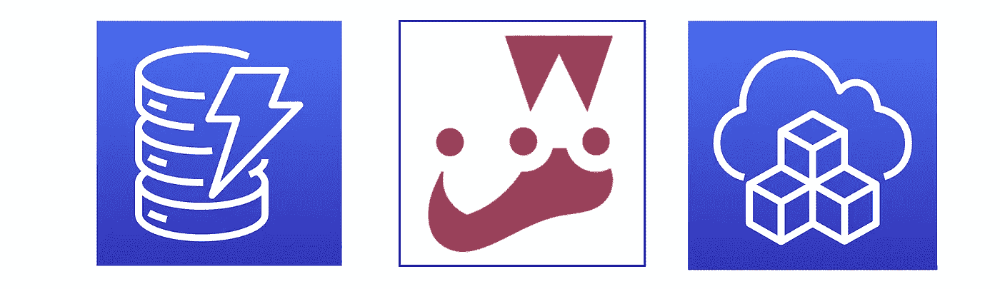
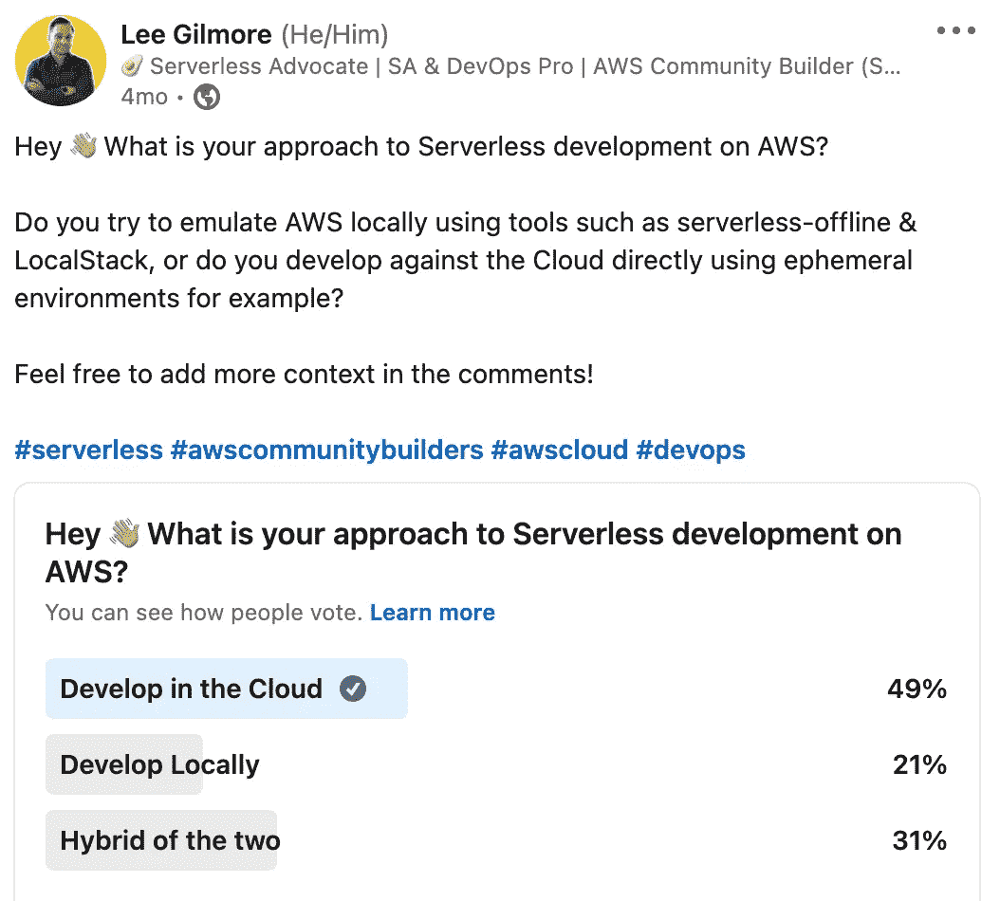
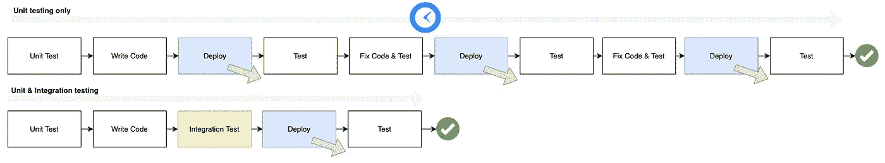
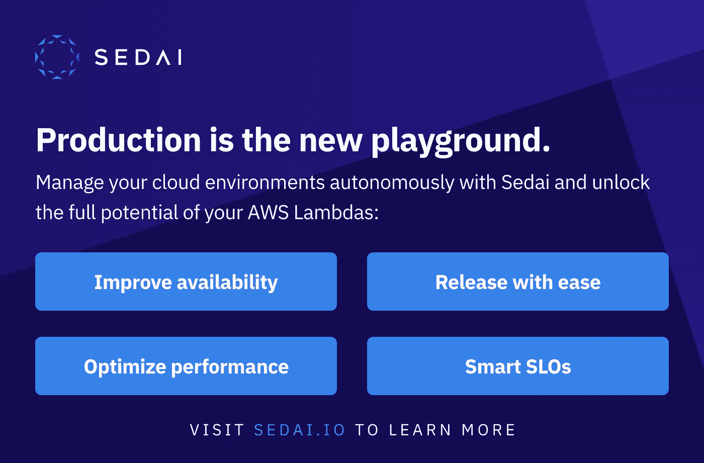

# 用 Jest 进行无服务器 DynamoDB 集成测试🚀

> 原文：<https://levelup.gitconnected.com/serverless-dynamodb-integration-tests-with-jest-cbb276aec84d>


Amy Shamblen 在 [Unsplash](https://unsplash.com/collections/962378/life-in-color?utm_source=unsplash&utm_medium=referral&utm_content=creditCopyText) 上的照片

## 如何使用 Jest 在您的无服务器解决方案中集成测试 DynamoDB 服务层，以及用 AWS CDK 和 TypeScript 编写的视觉效果和代码示例。



# 介绍

上周，我和一位同事聊起了无服务器解决方案中的集成测试 [DynamoDB](https://aws.amazon.com/dynamodb/) 调用，以及它如何加速开发；并意识到这种方法有点难以大声描述。

> “上周，我和一位同事聊到在无服务器解决方案中集成测试 DynamoDB 调用，以及它如何加快开发速度；并意识到这种方法有点难以大声描述

因此，我撰写了一篇相对较短的文章，通过一个简短的代码示例来讨论这种方法，展示如何实现这一点。

> *💡* ***注意*** :还有一个关联的[代码报告](https://github.com/leegilmorecode/serverless-dynamodb-integration-tests)，它展示了一种在开发过程中集成测试 DynamoDB 服务层的方法。

## 这如何加速开发并给 max 信心？✔️

正如我们大多数人所知道的，无服务器的本地开发仍然处于起步阶段，并且仍然不完全有效。我们可以使用各种工具，如[无服务器离线](https://www.serverless.com/plugins/serverless-offline)和[本地堆栈](https://github.com/localstack/localstack)，但在我看来，其缺点远远大于本地开发的优点:

域服务之间的❌配置可能成为一场噩梦。

❌当地的发展从来没有像云一样给人以同等程度的信心。

❌本地仿真器几乎总是随着新服务和错误而过时(例如*local stack 当前的 344 个已知问题*)

**转向在云上工作！** ☁️

这意味着大多数开发团队从短暂的环境开始，直接在云上部署和测试，这可能非常缓慢和乏味，每次部署更改时都要等待云形成完成。一些工具正在开始增强这一过程，如 SAM Accelerate 和 T2 的无服务器云，但在我看来，它仍处于起步阶段。(*围绕*以下短暂环境的讨论)

[](https://medium.com/swlh/enterprise-serverless-architecture-39c4f4ae5aff) [## 企业无服务器🚀体系结构

### 企业无服务器系列中的这一部分专门介绍了一些高级体系结构和设计…

medium.com](https://medium.com/swlh/enterprise-serverless-architecture-39c4f4ae5aff) 

**另一种方法** ✔️

在开发我的无服务器解决方案时，我个人并不经常部署我的代码，而是使用 TDD 对组成解决方案的代码及其边界/接口进行全面的单元测试，并对我在云中部署和测试时可能会发现问题的任何领域进行集成测试(**这是我希望加快过程的地方**)，在实际部署和执行全面的 e2e 测试之前，给我充分的信心。

容易出错并降低开发和部署周期的一个典型例子是在服务层中使用 AWS DynamoDB SDK，并首次获得正确的参数(*Inc query 等*)。

我们可以对 DocumentDB、SNS、S3 等使用相同的集成测试方法，并通过使用服务层包或在许多无服务器解决方案的 monorepos 中重用它们来充分实现这一点(t *hink Lerna 或 Nx* )。

这是相当常见的做法，最近的一项调查显示，大多数无服务器团队要么完全在云中工作，要么在本地和云的混合环境中工作，这样做是有意义的:



# 让我们直观地看看这种方法👀

好了，让我们来看看团队是如何随着时间的推移而工作的:

**新的无服务器团队尝试本地开发**。
当开始设置本地开发环境时，无服务器团队会很兴奋，开发人员会使用诸如[无服务器-离线](https://www.serverless.com/plugins/serverless-offline)、[本地堆栈](https://github.com/localstack/localstack)、[无服务器-dynamo db-本地](https://www.npmjs.com/package/serverless-dynamodb-local)、[无服务器 appsync 插件](https://www.serverless.com/plugins/serverless-appsync-offline)等服务进行测试..


团队在基本解决方案上快乐起步——照片由 [Csaba Balazs](https://unsplash.com/@balazscsaba2006?utm_source=unsplash&utm_medium=referral&utm_content=creditCopyText) 在 [Unsplash](https://unsplash.com/s/photos/office-sad?utm_source=unsplash&utm_medium=referral&utm_content=creditCopyText) 上拍摄

**随着时间的推移，团队意识到这是一场噩梦，于是转而使用短暂的环境(或者两种方法的混合)。
随着时间的推移，随着组织的成长，无服务器团队需要集成越来越多的微服务和域服务(*以及额外的团队*)；并增加他们对其他自动气象站服务的使用；他们很快意识到，由于本地和云开发之间的额外配置，以及所需的大量模仿，整体本地开发变得缓慢而繁琐。转向短暂的云开发是必须的！**


团队可能会对当地的发展感到非常沮丧——照片由 [Tim Gouw](https://unsplash.com/@punttim?utm_source=unsplash&utm_medium=referral&utm_content=creditCopyText) 在 [Unsplash](https://unsplash.com/s/photos/office-sad?utm_source=unsplash&utm_medium=referral&utm_content=creditCopyText) 上拍摄

**现在团队的认知负荷减少了，但是向云的部署循环可能会很慢。**
现在，当直接在云上工作时，短暂环境的一个折衷是，变更的部署可能会很慢(*尤其是在云形成的情况下*),这种反馈循环真的会减慢团队的速度。该去喝杯咖啡了。)


等待部署本地变更—照片由[克里斯·本森](https://unsplash.com/@lordmaui?utm_source=unsplash&utm_medium=referral&utm_content=creditCopyText)在 [Unsplash](https://unsplash.com/s/photos/office-sad?utm_source=unsplash&utm_medium=referral&utm_content=creditCopyText) 上拍摄

作为两种方法的混合，团队利用本地集成测试来加速无服务器开发。
根据我的经验，在有意义的地方利用本地开发，例如在使用 Docker 容器部署到云之前对服务层进行集成测试，确实可以加快开发速度。让我们看看下面的方法和代码示例。


好吧好吧，也许没这么开心！——照片由 [Unsplash](https://unsplash.com/s/photos/office-happy?utm_source=unsplash&utm_medium=referral&utm_content=creditCopyText) 上的[窗口](https://unsplash.com/@windows?utm_source=unsplash&utm_medium=referral&utm_content=creditCopyText)拍摄

从过程流的角度来看，我们可以看到将集成测试的信心添加到组合中所产生的差异(*部署后出现问题的机会减少，以及修复+部署+测试*的恒定周期):



# 入门！✔️

首先，使用以下 git 命令克隆以下 repo:

```
git clone [https://github.com/leegilmorecode/serverless-dynamodb-integration-tests](https://github.com/leegilmorecode/serverless-dynamodb-integration-tests)
```

这将把示例代码下载到您的本地机器上。

# 测试解决方案🎯

## 单元和集成测试设置

让我们首先看看 Jest 的单元测试设置。我们专门为寻找`*.spec.ts`文件的单元测试创建一个 jest 配置:

我们为集成测试添加了一个单独的文件来寻找`*.int.ts`文件:

两者都是通过 npm 脚本获取的，如下所示(*通过不同的配置路径*):

```
"test": "jest --config jest.unit.config.js",
"test:int": "LOCAL=true jest --config jest.int.config.js",
```

这意味着我们可以区分两组测试。

💡**注意** : *对于集成测试，我们还传递一个名为 LOCAL 的环境变量，该变量被设置为 true，这允许我们为本地或云配置 DynamoDB。*

## 针对本地 DynamoDB 的集成测试

对于 DynamoDB 的本地集成测试，我们使用一个 Docker 容器，它通过一个`docker-compose.yml`文件使用 DynamoDB Local:

在我们的 pre npm 脚本中，我们使用以下内容启动容器:

```
"pretest:int": "docker-compose up -d dynamodb-local"
```

这意味着当我们的集成测试开始使用 Jest 时，我们运行容器来处理本地 DynamoDB 实例。

💡**注意** : *一旦测试也运行了，我们就用一个 post npm 脚本来停止容器。*

现在，当运行集成测试时，我们确保取消对`aws-sdk` ( *，因为我们想要利用对本地实例*的实际 DynamoDB 调用，在`beforeAll` Jest 钩子中创建订单表来运行测试，并在测试运行后删除`afterAll` Jest 钩子中的本地表:

这意味着当我们在开发过程中运行集成测试时，我们有最大的信心在推进到云之前它会工作！

## 模拟单元测试

当我们运行单元测试时，我们希望确保模拟 DynamoDB 调用，因为我们不想集成任何实际的基础设施或数据库来进行单元测试。我们通过使用`__mocks__`文件夹模仿`aws-sdk`来模仿节点模块/包，如下所示，使用 Jest 模仿:

现在，当我们运行单元测试时，我们可以模拟出实际的返回值，而不是命中实际的数据库(下面的所示的*示例)*

我们可以操纵响应值(*无论是拒绝还是解决*)，这样我们就可以全面测试我们的服务。

# 结论

我们可以将这种方法用于所有的集成测试，例如针对 DocumentDB 服务层的 MongoDB 容器，甚至在测试 S3 或 SNS 时完全针对云进行集成测试。如果我们将这些服务作为包发布，或者使用 monorepos 来利用和共享它们，我们完全有信心在为开发人员测试和 e2e 测试部署更改之前，它们会按预期工作。

**本文由** [**Sedai.io**](https://www.sedai.io/) 赞助



# 摘要

我希望你觉得有用！

请点击此处订阅我的企业无服务器新闻稿，了解更多相同的内容:

[](https://www.linkedin.com/newsletters/enterprise-serverless-%F0%9F%9A%80-6875837779876605952/) [## 企业无服务器🚀LinkedIn

### Lee Gilmore |面向 AWS 开发人员、DevOps 工程师和云架构师的无服务器新闻和文章

www.linkedin.com](https://www.linkedin.com/newsletters/enterprise-serverless-%F0%9F%9A%80-6875837779876605952/) 

# 包扎👋

请[去我的 YouTube 频道](https://www.youtube.com/channel/UC_Bi6eLsBXpLnNRNnxKQUsA)订阅类似内容！


我很乐意就以下任何一个方面与您联系:

[https://www.linkedin.com/in/lee-james-gilmore/](https://www.linkedin.com/in/lee-james-gilmore/)
https://twitter.com/LeeJamesGilmore

如果你觉得这些文章鼓舞人心或有用，请随时用虚拟咖啡[https://www.buymeacoffee.com/leegilmore](https://www.buymeacoffee.com/leegilmore)来支持我，不管怎样，让我们联系和聊天吧！☕️

如果你喜欢这些帖子，请关注我的简介[李·詹姆斯·吉尔摩](https://medium.com/u/2906c6def240?source=post_page-----39c4f4ae5aff----------------------)以获取更多的帖子/系列，不要忘记联系我并打招呼👋

如果你喜欢，也请使用帖子底部的“鼓掌”功能！(*可以不止一次鼓掌！！*)

# 关于我

"*大家好，我是 Lee，英国的 AWS 社区构建者、博客作者、AWS 认证云架构师和首席软件工程师；目前是一名全球无服务器架构师，过去 6 年主要从事 AWS 上的全栈 JavaScript 工作。*

*我认为自己是一个无服务器倡导者，热爱 AWS、创新、软件架构和技术。*

*****所提供的信息是我个人的观点，我对信息的使用不承担任何责任。*****

您可能还对以下内容感兴趣:

[](https://leejamesgilmore.medium.com/serverless-content-46ef5b562d8e) [## 无服务器内容🚀

### 我的所有无服务器内容的索引，可以在一个地方轻松浏览，包括视频、博客文章等..

leejamesgilmore.medium.com](https://leejamesgilmore.medium.com/serverless-content-46ef5b562d8e)