# 无服务器事件驱动系统🚀

> 原文：<https://levelup.gitconnected.com/serverless-event-driven-systems-9617c6406064>

由 [Unsplash](https://unsplash.com/s/photos/event?utm_source=unsplash&utm_medium=referral&utm_content=creditCopyText) 上的 [Noiseporn](https://unsplash.com/@noiseporn?utm_source=unsplash&utm_medium=referral&utm_content=creditCopyText) 拍摄的照片

## 如何以及为什么应该首先使用 Amazon EventBridge 构建事件驱动的无服务器架构，以及需要考虑的一些陷阱；包括视觉效果和使用 TypeScript 和无服务器框架的相关代码报告。

# 介绍

这篇文章旨在解释为什么在构建无服务器架构时，你应该有一个事件驱动优先的心态，以及为什么 [Amazon EventBridge](https://aws.amazon.com/eventbridge/) 应该支持它们。我们还将讨论在使用最终一致的事件驱动系统时可能遇到的一些陷阱。这篇文章的基本代码可以在这里找到:[https://github.com/leegilmorecode/serverless-event-bridge](https://github.com/leegilmorecode/serverless-event-bridge)

> 这篇文章旨在解释为什么在构建无服务器架构时应该有一个事件驱动优先的心态

我们将继续上一篇关于“无服务器威胁建模”的文章，在这篇文章中，我们构建了我们虚构的 ***LeeJames HR*** 软件

这将在以下文章中介绍:

 [## 无服务器威胁建模🚀

### 您应该如何以及为什么在 AWS 上对您的无服务器解决方案进行威胁建模，并提供真实生活中的可视化示例

leejamesgilmore.medium.com](https://leejamesgilmore.medium.com/serverless-threat-modelling-df8e4028ef6d) 

如果您已经很好地掌握了如何将 Amazon EventBridge 与 TypeScript 结合使用，那么可以直接跳到下面一节: ***解决方案中的问题&缓解措施！*😈**

## 索引

1.  我们在建造什么？
2.  同步与异步
3.  事件驱动系统的主要好处是什么？
4.  事件和命令
5.  使用 Amazon EventBridge 的事件驱动系统
6.  部署解决方案
7.  测试解决方案
8.  解决方案中的问题和缓解措施！😈

我们开始吧！🚀

## 我们在建造什么？🏗️

我们将构建 **LeeJames HR** 系统的一部分，它负责从我们的客户端应用程序上传客户工资单，以及生成 PDF 版本并将其存储在[亚马逊 S3](https://aws.amazon.com/s3/) 的独立域服务。

💡*请注意，这是允许我们讨论文章要点的最基本的代码和架构，因此这不是生产就绪，也不符合编码最佳实践*。*(例如，在端点上没有认证)。我也尽量不把代码分割得太多，这样下面的例子文件很容易查看，所有的依赖关系都在一个文件中。*

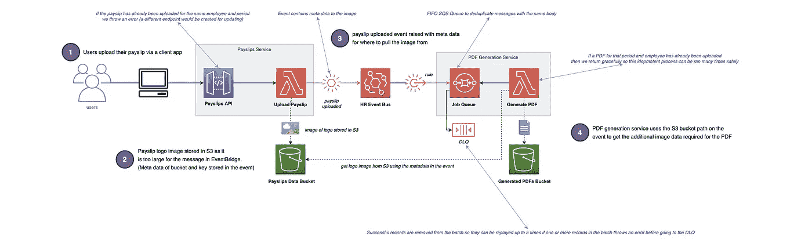

我们将构建的示例

# 同步与异步🚀

当开始使用无服务器时，使用像 [Amazon API Gateway](https://aws.amazon.com/api-gateway/) 和 [AWS Lambda](https://aws.amazon.com/lambda/) 这样的服务来构建域服务是相当容易的，然后通过使用 HTTPS 请求在它们之间同步调用来构建更大的企业架构。然而这:

1.  **增加延迟**。增加了终端用户的呼叫延迟，因为他们要等待所有 HTTPS 请求按顺序解决。
2.  **非常脆**。这使得整个体系结构高度耦合——对于任何故障都非常脆弱。

如下图所示:

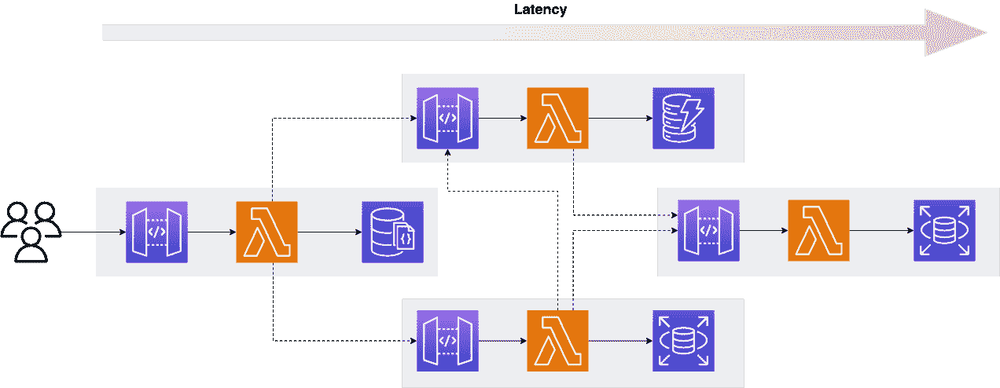

许多域服务同步地相互调用

当其中一个下游服务出现问题时(例如一个数据库的 CPU 或内存出现问题时)，我们会发现所有东西都坏了，因为它们都是完全耦合的:

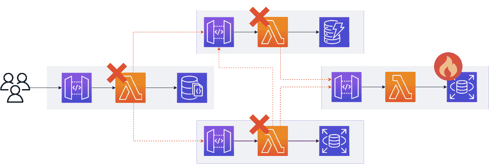

一个域服务关闭会影响所有其他服务

这是因为所有的域服务都知道彼此的存在，并且有着内在的联系——所以当一个服务出现问题时，您会发现会产生多米诺骨牌效应。**领域驱动开发的一个更好的方法**是让您的服务松散耦合，尽可能只通过使用事件进行通信(如下所示*):*

*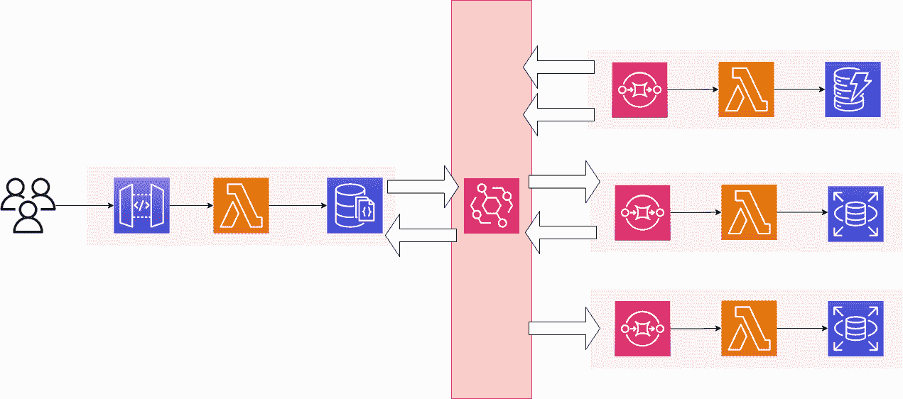*

*使用 EventBridge 的松散耦合的域服务*

*这确保了如果一个系统停机或有问题，当服务仅返回时，事件可以被重新处理，即最终一致和异步；其他域服务不受影响。这通常是使用死信队列来完成的，其中在可配置的重试次数之后，未处理的记录跟随错误前进。当域服务重新联机时，可以安全地重新处理它们。*

*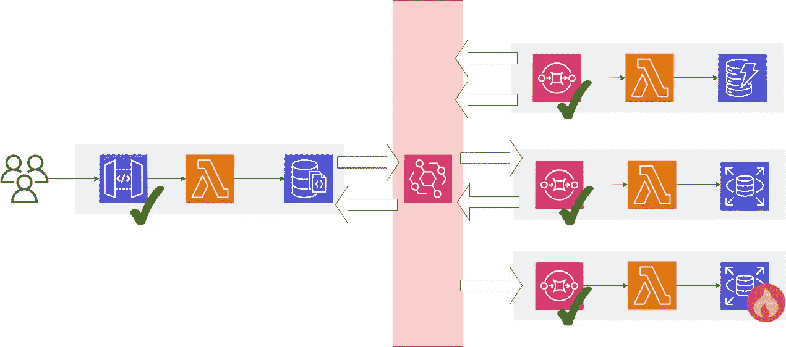*

*一旦域服务重新联机，就可以使用死信队列处理失败的事件*

*从上图中可以看到，除了右下角的一个服务外，所有域服务都保持在线，但是它的失败记录被安全地保存起来以供重新处理，因此您的客户不会意识到任何问题。*

# *事件驱动系统的主要好处是什么？💭*

*事件驱动系统有许多好处，下面将讨论:*

1.  ***域服务是可单独测试的**。您可以孤立地测试一个域服务，而不需要与其他几个团队协作，也不需要多个依赖项。*
2.  ***域服务可以单独部署**。同样，只要事件模式没有改变，您可以独立地部署您的域服务，而不依赖于其他团队。*
3.  ***事件的共享版本化模式**。历史上，团队会通过 Nuget 或 NPM 包与实际代码共享契约，而现在，团队可以简单地共享版本化的模式，以便以松散耦合的方式开发、测试和部署工作。这减少了团队之间的整体依赖性。*
4.  *他们有自己的数据存储。域服务应该有自己的数据存储(*通常是数据库*)，所以它们在数据层没有这种依赖性。如果域服务有一个共享的数据库，它们就会变得紧密耦合，冒着交叉感染 bug、部署问题和安全风险的风险。*
5.  ***完全解耦**。域服务不应该互相知道。生产者可以生产事件，而不关心哪些消费者在使用它们。消费者也不关心谁制造了这些事件。*
6.  ***它们可以独立伸缩**。领域服务可以独立扩展，不需要其他团队和领域服务之间的关注和协调。*

# *事件和命令*

*因此，我们已经在上面讨论了拥有“事件驱动”的思维模式，事件驱动架构的好处，以及通过“事件”构建您的架构，使其解耦并最终保持一致— **但什么是事件**？*

> *“通过使用事件消息，您可以很容易地在身份(您广播事件而不关心谁响应它们)和时间(当接收者准备好处理事件时，事件可以排队并转发)方面分离发送者和接收者。由于这种松散耦合，这种架构提供了大量的可伸缩性和可修改性。”—马丁·福勒*

## *事件*

*一个**事件**是一个域内的状态变化(*过去已经发生的并且不可改变的*)。一个例子是'*订单生成*或'*发票生成*'。这通常意味着一个或多个消费者可以对该事件做出反应。*

## *命令*

*一个**命令**是一个针对另一个域的意图，它导致一些输出(*将来会发生的事情*)。例如'*发送电子邮件*或'*生成 pdf* '。这通常是一对一的映射，生产者希望消费者处理重试和失败。*

*如下图所示:*

*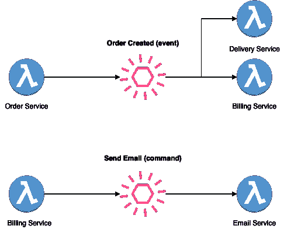*

# *使用 Amazon EventBridge 的事件驱动系统*

> *“Amazon EventBridge 是一种无服务器事件总线，使用您的应用程序、集成的软件即服务(SaaS)应用程序和 AWS 服务生成的事件，可以更轻松地构建大规模事件驱动的应用程序。”——AWS*

*现在，我们已经讨论了为什么我们要设计事件驱动的无服务器架构，并且讨论了什么是事件和命令。*

*现在让我们来看看 Amazon EventBridge 作为 AWS 上的一个无服务器事件总线，以及它在无服务器世界中如此重要的原因。*

*Amazon EventBridge 应该是无服务器事件驱动架构的默认选择，原因如下:*

1.  ***没有需要维护或管理的服务器**。它是完全无服务器的，允许我们以最小的开销分离我们的域服务。*
2.  ***使用注册表的模式发现**。共享事件模式在历史上一直很困难，但是模式注册中心允许我们在一个地方轻松地在域和团队之间找到和共享模式结构。[https://docs . AWS . Amazon . com/event bridge/latest/user guide/e b-schema . html](https://docs.aws.amazon.com/eventbridge/latest/userguide/eb-schema.html)*
3.  ***模式代码生成**。EventBridge 允许团队查看他们需要的事件模式版本，并自动下载代码绑定以直接拉入他们的代码。[https://docs . AWS . Amazon . com/event bridge/latest/user guide/e b-schema-code-bindings . html](https://docs.aws.amazon.com/eventbridge/latest/userguide/eb-schema-code-bindings.html)*
4.  ***基于内容的过滤**。基于内容的过滤，甚至在正文级别，允许我们只消费我们感兴趣的事件。
    [https://docs . AWS . Amazon . com/event bridge/latest/user guide/EB-event-patterns-content-based-filtering . html](https://docs.aws.amazon.com/eventbridge/latest/userguide/eb-event-patterns-content-based-filtering.html)*
5.  ***输入转换**。输入转换允许我们转置事件结构来满足消费者的需求，而不需要编写特定的粘合代码。*
6.  ***存档和回放**。EventBridge 允许您将事件存档，并在以后重放它们。当您需要在 bug 修复后重放事件，或者填充新域服务的读取存储时，这是非常棒的。[https://docs . AWS . Amazon . com/event bridge/latest/user guide/e b-archive . html](https://docs.aws.amazon.com/eventbridge/latest/userguide/eb-archive.html)*
7.  ***静止加密。** EventBridge 对其存储的事件元数据和消息数据进行加密。默认情况下，EventBridge 使用 256 位高级加密标准( *AES-256* )在 [AWS 拥有的密钥](https://docs.aws.amazon.com/kms/latest/developerguide/concepts.html#aws-owned-cmk)下加密数据，这有助于保护您的数据免受未经授权的访问。使用 AWS 拥有的密钥加密您的数据无需额外付费。
    [https://docs . AWS . Amazon . com/event bridge/latest/user guide/e b-data-protection . html](https://docs.aws.amazon.com/eventbridge/latest/userguide/eb-data-protection.html)*
8.  ***传输中的加密**。EventBridge 通过使用传输层安全性( *TLS* )对 EventBridge 和其他服务之间传递的数据进行加密。*

# *部署解决方案！👨‍💻*

> **🛑* ***注意*** *:* 运行以下命令将在您的 AWS 账户上产生费用。*

*让我们在这里部署您可以克隆的代码示例:[https://github.com/leegilmorecode/serverless-event-bridge](https://github.com/leegilmorecode/serverless-event-bridge)*

*一旦您克隆了存储库，您就可以运行`npm i`来安装所有的依赖项，然后运行`npm run deploy:develop`来将代码部署到 AWS。*

# *测试解决方案🎯*

*一旦您部署了解决方案，您就可以使用`./postman/serverlerss-event-bridge.postman_collection.json`中的 postman 文件来调用 POST API 端点来上传一个虚构的工资单。*

*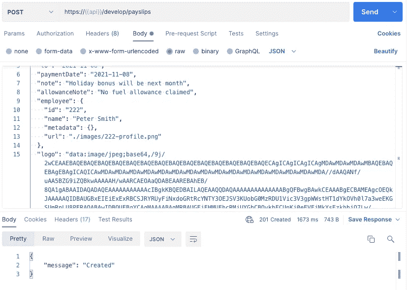*

*示例调用 Postman 来调用我们的 API*

> **🛑* ***注*** :您需要将 Postman 中的 API 变量更新为部署中为您的端点返回的任何无服务器框架:*

*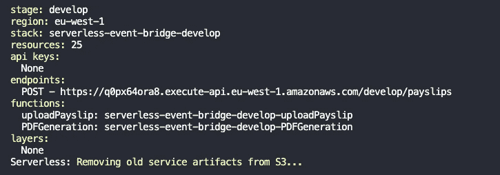*

*来自端点服务框架的 API 响应示例*

*现在，当您调用 API 时，您将得到一条`‘Created’`消息( *201 状态代码*)，当您导航到存储 PDF 的 S3 存储区时，您应该会看到每个工资单 PDF 的以下内容:*

**

***好吧，好吧..不是世界上最好看的工资条 PDF 文件，但足以展示架构，我相信你会同意！**😅*

*同样值得注意的是，本演示的工资条模式本身在 [**Staffology**](https://www.staffology.co.uk/) 记入团队名下，这里:【https://app.staffology.co.uk/api/docs/models/payslip】T4*

# *解决方案中的问题和缓解措施！😈*

*当构建新的无服务器架构或从单片服务器迁移时，有必要规划以下部分，以确保您的解决方案能够 ***应对故障*** 。您刚刚部署的解决方案展示了以下内容:*

## *考虑幂等性*

*将您的服务构建为[等幂](https://en.wikipedia.org/wiki/Idempotence)，这样如果您不止一次地获得相同的事件输入，您将总是获得相同的结果。例如，如果您错误地收到两个付款事件，您不想对您的客户进行两次计费！呀!..*

*EventBridge 保证至少传递一次，但是消费者可以多次获得相同的消息。*

> *Amazon EventBridge 向目标提供至少一次事件交付，包括长达 24 小时的指数补偿重试。事件跨多个可用性区域(az)持久存储，为您的事件发送到目的地提供了额外的保证。Amazon EventBridge 还提供 99.99%可用性服务级别协议(SLA)，确保您的应用程序能够可靠地访问服务。*

*有几种方法可以减轻这种情况(*或它们的组合*):*

1.  ***等幂键**。您可以允许 API 的消费者在头或数据体中传递幂等键，这允许您在域服务中检查该请求是否已经被处理，并相应地采取行动而不会引起问题。这允许消费者重试请求，而不用担心副作用。*
2.  ***使用 UUID v5** 。您可以在有效载荷中使用带有名称空间和唯一属性的 UUID 版本 5(*无论它是事件、消息还是 API* )，并且您将总是得到相同的生成的 UUID。在我看来，这是一个非常好的方法，我们在回购中使用了这种方法。*
3.  *控制数据库。您可以使用 DynamoDB 之类的控制数据库来存储成功的请求(*使用幂等键或 V5 生成的 UUIDs，例如*)，如果您两次收到相同的请求，您可以简单地吞下请求并返回前一个成功的有效负载响应。错误响应也是如此。*

*在我们的代码回购示例中，我们使用员工 ID 和工资单期间以及 UUID 名称空间(*以防止 UUID 冲突)*，然后使用这个“工资单 ID”来检查代码，看我们之前是否已经创建了工资单 PDF。这使我们能够确保您只能上传一次工资单，并保证只生成一次。我通常会使用 DynamoDB 之类的数据存储来完成这项工作，但是对于这个简单的演示，我们只需检查该文件是否已经存在于 S3。*

## *使用 FIFO 队列重复删除事件消息*

*在我们的例子中，事件从 EventBridge 直接流向 SQS FIFO 队列，并且打开了`Content-based deduplication`，同时将`Deduplication scope`设置为`Queue`级别；这意味着在五分钟的时间内，如果我们在队列中获得具有相同有效负载的相同 SQS 消息，它将被忽略。也就是说，注意在这个场景中，消息复制 id 是'**可选的**'。(*见下文*)*

*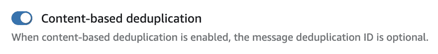**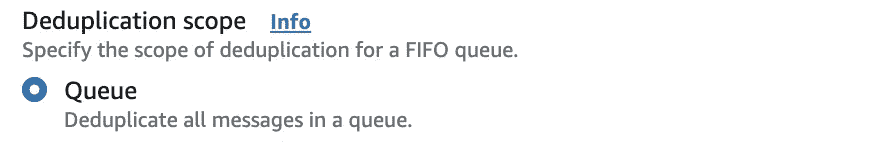*

> *为队列启用基于内容的重复数据删除(您的每封邮件都有唯一的正文)。生成器可以省略消息重复数据删除 ID—[https://docs . AWS . Amazon . com/awssimplequeuservice/latest/SQSDeveloperGuide/using-messagededuplicationid-property . html](https://docs.aws.amazon.com/AWSSimpleQueueService/latest/SQSDeveloperGuide/using-messagededuplicationid-property.html)*

*这里有一个问题，假设我们的 EventBridge 规则中的事件以我们的 FIFO SQS 队列为目标，这意味着 SQS 将默认在五分钟内基于相同的事件主体对我们的事件进行重复数据删除。*

*碰巧在这个规则集成中，Amazon EventBridge 规则默认发送*MessageDeduplicationId***，所以如果我们在`putEvents`命令中用完全相同的主体将相同的条目添加到 entries 数组中，每个条目都将获得自己的 *MessageDeduplicationId* ，**，并且它们不会像您可能期望的那样在 FIFO 队列**中进行重复数据删除。***

***这是因为 EventBridge 自动将`PutEventsRequestEntry`的`EventID`属性设置为一个随机 UUID，该出现在 SQS 消息正文中，所以当 MessageDeduplicationID 作为正文的 SHA256 哈希生成时，它每次都是不同的！***

> ***调用 PutEvents 后，EventBridge 会为每个事件分配一个唯一的 ID—[https://docs . AWS . Amazon . com/event bridge/latest/user guide/e b-put events . html](https://docs.aws.amazon.com/eventbridge/latest/userguide/eb-putevents.html)***

*****我们如何解决这个**？我们可以使用输入转换来省略事件中的`Event ID`,就像这样，这意味着我们所有的事件现在都在 FIFO 队列中进行重复数据删除:***

## ***SQS 和失败的消息***

***当您使用亚马逊 SQS 对来自 EventBridge 的事件消息进行批处理时，您需要考虑如果批处理中的一个或多个记录失败(*，即通过您的 Lambda 代码抛出一个错误*)，那么整个批处理将回到队列中重新处理。这意味着:***

1.  ***您的代码需要是等幂的，以确保同一批记录可以被多次处理，而不会导致问题。(*例如多次从客户处获得相同的付款*)。***
2.  ***理想情况下，您需要一种方法来忽略批处理中已经成功处理的记录。***

******

***对于第二点，您可以使用[Middy‘SQS 部分批处理失败’](https://www.npmjs.com/package/@middy/sqs-partial-batch-failure)中间件，在批处理进入 DLQ 之前，成功地从批处理中删除已处理的记录。这意味着当 Lambda 选择批处理进行重新处理时，只有失败的记录保留下来。***

## ***模式注册表的版本事件***

***仅在开发阶段使用模式注册表自动发现模式，因为如果在生产阶段继续使用，成本会很高！***

***您还可以将自己的 OpenAPI 3.0 模式手动添加到模式注册中心，以便在域服务和团队之间共享它们。这是我采取的方法。***

## ***事件携带状态转移***

***EventBridge 的最大消息大小是 256kb，这对于大多数应用程序来说通常是合适的，但请记住，对于大于这个大小的消息，AWS 建议将事件有效负载放入亚马逊 S3，并在事件中包含指向它的链接或元数据。***

> ***当您希望以这样一种方式更新系统的客户机，使它们不需要联系源系统来做进一步的工作时，就会出现这种模式。每当客户更改他们的详细信息(如地址)时，客户管理系统可能会用包含已更改数据详细信息的事件来触发事件。然后，接收方可以用这些更改更新它自己的客户数据副本，这样它就永远不需要为了将来的工作而与主客户系统通信。***
> 
> ***这种模式的一个明显的缺点是有大量的数据和副本。但在一个储存丰富的时代，这不是什么问题。我们获得的是更大的弹性，因为如果客户系统变得不可用，接收系统可以运行。—马丁·福勒***

***在我们的示例中，当两个独立的域服务需要工资单徽标(*图像*)时，我们会这样做，该徽标是通过 API 网关(*显示在*下方)上传的，但是徽标正文不适合事件本身。***

***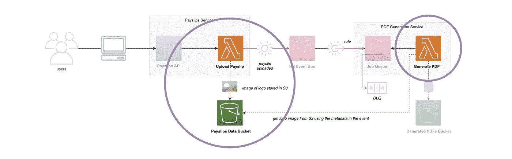***

***在我们的场景中，我们将图像存储在 S3 桶中，并将桶和键作为数据添加到`payslip.uploaded`事件本身中(*，因为图像本身无法容纳在 256kb 的事件*中)，因此当 PDF Generation lambda 使用该事件时，它可以从 S3 桶中获取 PDF 所需的徽标。***

## ***发布路由事件***

***有时，由于 IAM 问题，Amazon EventBridge 可能无法将事件路由到目标，例如，如果引入了错误，那么您可以使用标准 SQS 队列作为死信队列来存储失败的事件，直到您解决了问题:***

 ***[## 事件重试策略和使用死信队列

### 有时，事件没有成功传递到规则中指定的目标。这可能发生在，例如…

docs.aws.amazon.com](https://docs.aws.amazon.com/eventbridge/latest/userguide/eb-rule-dlq.html)*** 

***如果我们在我们的解决方案中实现了这一点，那么它应该在这里，添加一个 DLQ，以防 EventBridge 无法将事件路由到我们的 PDF 生成 SQS FIFO 队列:***

***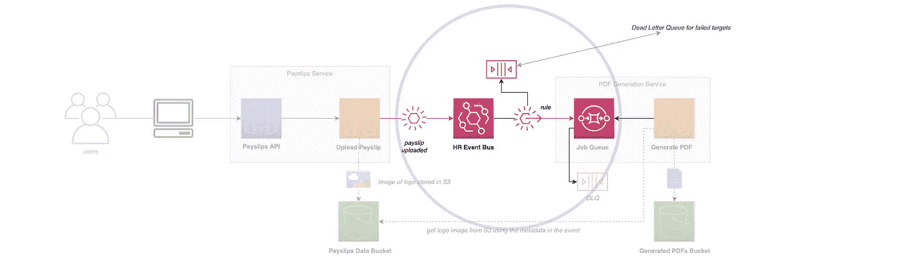***

***下面的视频对此进行了进一步的探讨:***

## ***潜在地使用亚马逊社交网络来处理低延迟/高频率的消息***

***对于需要低延迟和高消息频率的架构，可能值得看看 Amazon EventBridge 上的 Amazon SNS，但这是在特殊情况下。Amazon EventBridge 通常有大约半秒的延迟。***

> ***当您想要构建一个对其他应用程序或微服务发布的高吞吐量或低延迟消息做出反应的应用程序时(因为 Amazon SNS 提供几乎无限的吞吐量)，或者对于需要非常高的扇出(数千或数百万个端点)的应用程序，建议使用 Amazon SNS。消息是非结构化的，可以是任何格式。亚马逊 SNS 支持向六种不同类型的目标转发消息，包括 AWS Lambda、亚马逊 SQS、HTTP/S 端点、短信、移动推送和电子邮件。亚马逊社交网络的典型延迟低于 30 毫秒。——【https://aws.amazon.com/eventbridge/faqs/ ***

## ***使用 EventBridge 了解异步和同步 Lambda 调用***

***根据事件源映射和所涉及的服务，Lambda 可能被同步调用 ***或异步调用*** ，这决定了在事件驱动的系统中如何管理失败的处理。***

***例如，通过我们的 SQS FIFO 队列与 Lambda 的集成，Lambda 被调用`synchronously`，因此我们不使用 Lambda 目的地，而是使用与 FIFO 队列本身相关联的死信队列。***

***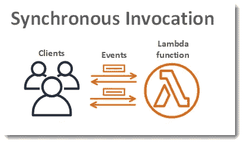***

***[https://docs . AWS . Amazon . com/lambda/latest/DG/invocation-sync . html](https://docs.aws.amazon.com/lambda/latest/dg/invocation-sync.html)***

***对于 EventBridge 中的 Lambda 目标，这将被调用`asynchronously`，因此您需要显式定义如何处理错误。默认情况下，将有两次重试尝试，然后事件消失，即默认情况下，它不会进入 DLQ！***

***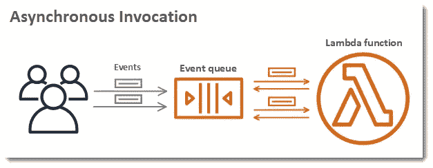***

***[https://docs . AWS . Amazon . com/lambda/latest/DG/invocation-async . html](https://docs.aws.amazon.com/lambda/latest/dg/invocation-async.html)***

***在这种情况下，您应该使用 Lambda Destinations，以便将失败的执行发送到另一个服务，如 SQS DLQ:***

*** [## 无服务器 Lambda 目的地🚀

### 充分利用 lambda 目的地粘合代码..

levelup.gitconnected.com](/serverless-lambda-destinations-146f8b3c3456) 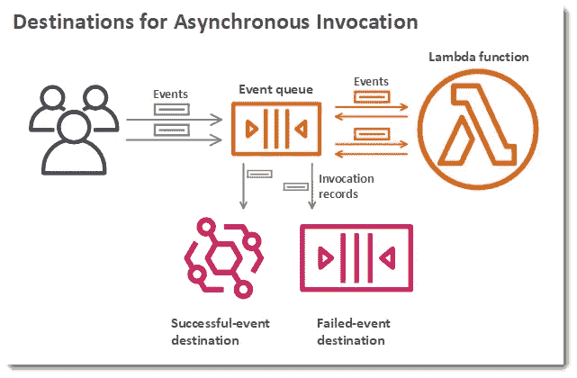

[https://docs . AWS . Amazon . com/lambda/latest/DG/invocation-async . html](https://docs.aws.amazon.com/lambda/latest/dg/invocation-async.html)

您也可以为 Lambda 设置异步调用配置，在这里您可以设置一个 SNS 主题或队列，以便进一步处理错误。

还要确保不要同时设置两者，因为消息会在队列中重复出现！

# 包扎👋

我希望您发现这对于为什么您应该有一个事件驱动的思维模式，并使用 Amazon EventBridge 作为任何无服务器架构的默认设置是有用的！

请 [**前往我的 YouTube 频道**](https://www.youtube.com/channel/UC_Bi6eLsBXpLnNRNnxKQUsA) 订阅类似内容！

我很乐意就以下任何一个方面与您联系:

[https://www.linkedin.com/in/lee-james-gilmore/](https://www.linkedin.com/in/lee-james-gilmore/)
https://twitter.com/LeeJamesGilmore

如果你喜欢这些帖子，请关注我的简介[李·詹姆斯·吉尔摩](https://medium.com/u/2906c6def240?source=post_page-----39c4f4ae5aff----------------------)以获取更多的帖子/系列，不要忘记联系我并打招呼👋

如果你喜欢，也请使用帖子底部的“鼓掌”功能！(*可以不止一次鼓掌！！*)

**本文由**[**sedai . io**](https://www.sedai.io/)赞助

# 关于我

"*大家好，我是 Lee，英国的 AWS 社区构建者、博客作者、AWS 认证云架构师和首席软件工程师；目前是一名技术云架构师和首席无服务器开发人员，过去 5 年主要从事 AWS 上的全栈 JavaScript 工作。*

我认为自己是一个无服务器的布道者，热爱 AWS、创新、软件架构和技术。”

提供的信息是我个人的观点，我对信息的使用不承担任何责任。***

 [## 无服务器威胁建模🚀

### 您应该如何以及为什么在 AWS 上对您的无服务器解决方案进行威胁建模，并提供真实生活中的可视化示例

leejamesgilmore.medium.com](https://leejamesgilmore.medium.com/serverless-threat-modelling-df8e4028ef6d)  [## 无服务器内容🚀

### 我的所有无服务器内容的索引，可以在一个地方轻松浏览，包括视频、博客文章等..

leejamesgilmore.medium.com](https://leejamesgilmore.medium.com/serverless-content-46ef5b562d8e)  [## 无服务器合成金丝雀🚀

### 使用 CloudWatch 合成金丝雀来监控你的无服务器应用程序的实际例子，有视觉效果和…

leejamesgilmore.medium.com](https://leejamesgilmore.medium.com/serverless-synthetic-canaries-7946dc5216ba)  [## 无服务器 S3 对象 Lambda🚀

### 一个使用 AWS S3 对象 Lambda 的实际例子，使用 Amazon 动态地用元数据给图像加水印…

levelup.gitconnected.com](/serverless-s3-object-lambda-88c923a8a771)  [## 记录您的无服务器解决方案🚀

### 一个生成和托管你的无服务器文档的例子，比如 OpenAPI/Swagger，ADRs 和 code…

levelup.gitconnected.com](/documenting-your-serverless-solutions-509f1928564b)  [## 无服务器 API 到 API 认证🚀

### 使用 OAuth2 客户端凭证使用 Amazon Cognito 验证 API 到 API 集成的实用指南…

levelup.gitconnected.com](/serverless-api-to-api-authentication-d4cb4472721e)***