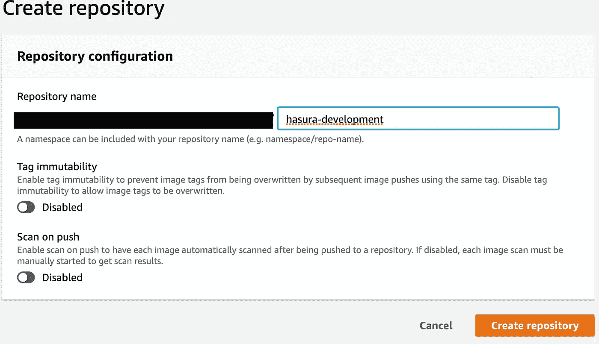

# AWS ECS over Aurora PostgreSQL 上带 Hasura 的无服务器 GraphQL

> 原文：<https://levelup.gitconnected.com/serverless-graphql-with-hasura-on-aws-ecs-over-aurora-postgresql-6c4e1eb09282>

ECS + Hasura =惊人的后端

我们将构建一个水平可伸缩的 GraphQL API，它运行在由 AWS 的无服务器 Aurora 产品支持的 PostgreSQL 数据库上。我们将为 GraphQL API、AWS ECR 和 ECS 使用 Hasura 来运行 docker 映像，并使用 AWS Cloudformation 来部署资源。

首先，在[哈苏拉](https://hasura.io/)向团队大声喊出来。他们的产品让任何专业人士感觉他们是 GraphQL 热潮的一部分，并为任何项目提供了难以置信的价值。

为了完成本文的标题，我们需要假设一些 AWS 资源已经到位。

1.  你应该拥有一个域名，并在 53 号公路上有一个托管区。
2.  您应该在 AWS Certificate manager 上拥有一个 SSL 证书，该证书覆盖了您想要提供 API 的域或子域。证书必须位于您将部署 ECS 的同一区域。

我们还需要假设您已经在本地机器上配置了一些东西。

1.  Docker 已安装
2.  您已经正确设置了 AWS CLI
3.  您有 IAM 权限使用所有必需的资源

我们将分三步完成我们的目标。首先，将 Hasura 映像推送到一个弹性容器注册中心(ECR)。其次，收集 Cloudformation 模板参数，并演示它的功能。第三，使用 AWS CLI 部署 Cloudformation 模板。

本文的所有参考资料都可以在这个 [git hub repo](https://github.com/joninsky/ECS-and-Hasura) 上找到。

## 弹性容器注册设置

要在 AWS 弹性容器服务上运行 Hasura，您需要在 ECR 上存储 Hasura 映像。

这些是步骤:

1.  注册表认证
2.  图像拉动
3.  ECR 容器创建
4.  图像推送

使用 AWS CLI 获取[认证命令](https://docs.aws.amazon.com/en_pv/AmazonECR/latest/userguide/registries.html#registry_auth)，如下所示:`aws ecr get-login --region <region> --no-include-email` **。**将 CLI 输出复制到您的剪贴板，然后运行它。在接下来的 12 个小时里你已经通过了认证。

接下来要做的事情是将 Hasura 映像拉到您的本地机器上。你跑`docker pull hasura/graphql-engine`

现在，要创建存储库，请转到 AWS ECR 控制台，创建一个名为`hasura-development`的存储库

创建存储库后，复制 ECR 的 URI 值(这看起来像一个 ARN)。

回到您的 CLI。运行`docker images`并注意您提取的 Hasura 图像的`IMAGE ID`。你用回购协议的 URI 标记哈苏拉`IMAGE ID`，就像这样:`docker tag <hasura-image-ID> <ECR-URI>`，然后用`docker push <ECR-URI>`推动新标记的回购协议。

你现在在 ECR 上有了哈苏拉的图像。请注意，当 Hasura 发布新版本时，这些也是更新图像的步骤，他们会定期进行更新。

## 收集云形成的参数

如上所述，应该有两个 AWS 资源。在 Route 53 上具有托管区域的域名，以及 AWS 证书管理器中的 SSL 证书，用于您要提供 GraphQL API 的域或子域。

看一下提供的回购中的`parameters.json`文件

让我们一个一个地检查参数。

`DNSRecordSetName`

这应该是您希望为 GraphQL API 提供服务并访问 Hasura 控制台的域。你可以有一个顶级域名，比如`mydomain.io`，或者你可以传入一个子域，比如`api.mydomain.io`。只要确保`SSLCertARN`参数的 ARN 设置覆盖您选择的域。

`HostedZoneID`

在 AWS Route 53 控制台上，单击“托管区域”后，您可以清楚地看到您想要的托管区域的 ID。

`SSLCertARN`

您应该能够在 AWS 证书管理器控制台中找到您想要的 SSL 证书的 ARN

`ECRImage`

本文中我们做的第一件事是将 Hasura 图像放在 ECR 上。这将是 ECR 图像的 URI。

`DBMasterUsername`

您的无服务器 PostgreSQL DB 仍然需要一个老式的管理员用户名和密码组合。这是用户名部分。

`DBMasterUserPassword`

补充您的用户名的密码

`DBName`

任何新的 PostgreSQL 实例都需要一个实际数据库的名称。在这里提供。

`HasuraAccesskey`

哈苏拉在`<your-domain>/console`上方担任控制台。对于一些轻量级的安全性，控制台隐藏在一个需要这个密码的对话框后面。这也是签署管理请求的`X-Hasura-Admin-Secret`密钥的密钥。

一旦你收集了所有这些变量，我们将需要把它们放到`parameters.json`文件中。[这里又是回购的链接。](https://github.com/joninsky/ECS-and-Hasura)

## 使用云信息

您需要为这个堆栈命名一个对您有意义的名称。出于演示的目的，我将调用这个堆栈`MyProduct-GraphQL-Stack`。

将目录(`cd`)更改为填写好的`parameter.json`文件和`Stack.yaml`文件所在的目录。从 AWS CLI 中，您将需要一个相当详细的语句。

`aws cloudformation create-stack --stack-name MyProduct-GraphQL-Stack --template-body file://./Stack.yaml --parameters file://./parameters.json --capabilities CAPABILITY_NAMED_IAM`

该堆栈大约需要 5-10 分钟完成部署。

## **结论**

如果您的堆栈由于任何原因未能创建，请查看 AWS Cloudformation 控制台中的堆栈事件。寻找失败的原因，并尝试从那里除错。如果你成功了，恭喜你！您已经创建了一个非常强大和可伸缩的 GraphQL API！如果你发现错误，请尽情享受并随时评论或纠正。

 [## 编写面试问题

### 一个完整的平台，在这里我会教你找到下一份工作所需的一切，以及…

技术开发](https://skilled.dev)