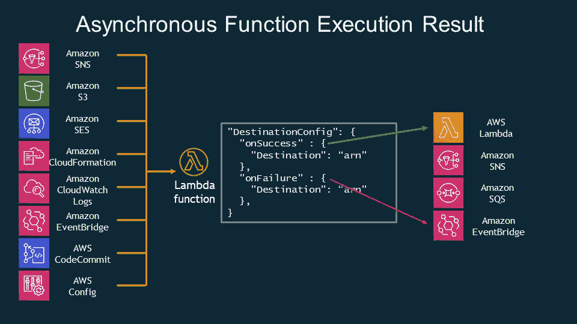
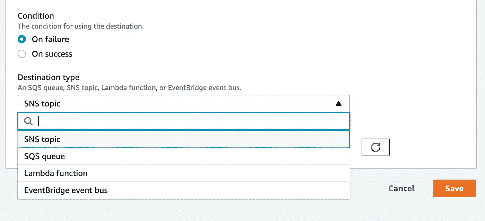
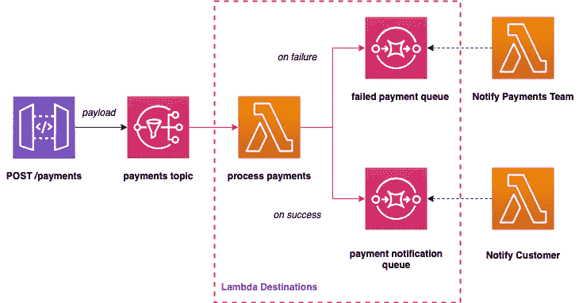
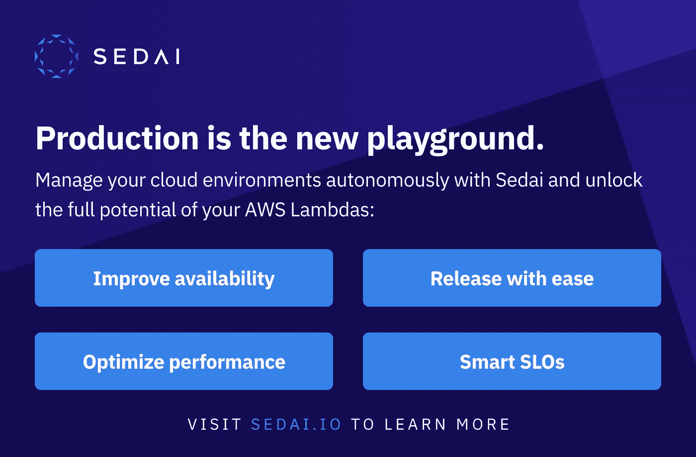

# 无服务器 Lambda 目的地🚀

> 原文：<https://levelup.gitconnected.com/serverless-lambda-destinations-146f8b3c3456>


照片由 [beasty 拍摄。](https://unsplash.com/@beastydesign?utm_source=unsplash&utm_medium=referral&utm_content=creditCopyText) on [Unsplash](https://unsplash.com/collections/9249086/geometric-architecture?utm_source=unsplash&utm_medium=referral&utm_content=creditCopyText)

# 介绍

这篇文章将涵盖 [AWS Lambda](https://aws.amazon.com/lambda/) 的一个功能，该功能自 2019 年冬季以来一直存在，但许多开发人员和架构师并不知道它，或者以我的经验来看并不典型地利用它— [Lambda destinations](https://docs.aws.amazon.com/lambda/latest/dg/invocation-async.html#invocation-async-destinations) 。知道这个特性是可用的，并在设计新的解决方案时把它放在心里，这可能是值得的。🛠

我添加了下面的基本代码 repo，在这里显示了一个小的示例应用程序。

# 目的地是如何工作的？

Lambda 目的地允许您自动将来自异步 lambda 调用的**成功**或**失败**场景路由到四个 AWS 服务目的地，而无需编写粘合代码！

想象一个非常小的[步骤功能或快速工作流](https://docs.aws.amazon.com/step-functions/latest/dg/welcome.html)，当它与一些基本的成功/失败路由过度时，不需要创建状态机。

这基本上意味着在 lambda 函数中，您不需要引入相关的 AWS SDK 并编写和测试代码来将成功和失败的有效载荷发送给每个不同的消费者！🥳

> 一种常见的事件驱动微服务架构模式是使用队列或消息总线进行通信。这有助于弹性和可伸缩性。Lambda 异步调用可以将事件或消息放到[亚马逊简单通知服务](https://aws.amazon.com/sns/) (SNS)、[亚马逊简单队列服务](https://aws.amazon.com/sqs/) (SQS)或[亚马逊事件桥](https://aws.amazon.com/eventbridge/)上进行进一步处理。以前，您需要在 Lambda 函数中编写 SQS/SNS/EventBridge 处理代码，并自己管理重试和失败。
> 
> 使用目标，您可以将异步函数结果作为执行记录路由到目标资源，而无需编写额外的代码。执行记录包含 JSON 格式的请求和响应的详细信息，包括版本、时间戳、请求上下文、请求有效负载、响应上下文和响应有效负载。对于每个执行状态，比如*成功*或*失败*，你可以选择四个目的地之一:另一个 Lambda 函数、SNS、SQS 或 EventBridge。Lambda 还可以被配置为将不同的执行结果路由到不同的目的地。朱利安·伍德。亚马逊网络服务，无服务器开发者倡导者。

下图很好地概述了 Lambda 目的地的工作方式以及通常涉及的服务:



[https://AWS . Amazon . com/blogs/compute/introducing-AWS-lambda-destinations/](https://aws.amazon.com/blogs/compute/introducing-aws-lambda-destinations/)

如果您登录 AWS 控制台并选择一个新的或现有的 lambda，您将看到以下目标类型，如上图所示:



lambda 异步调用一次失败和成功的可用目标

# 我何时使用目的地？

如果您在无服务器架构中构建一个流，需要将成功或失败记录路由到两个独立的 AWS 服务，那么 lambda destinations 可能是您的好朋友！

这意味着您不需要使用 AWS SDK 在处理 lambda 中编写粘合代码来将有效负载推送到给定的服务。下面是一个虚构的例子:



显示目的地何时有用的基本示例

在本例中，流程是:

1.  一个 API 网关端点接受一个基本的支付负载，看起来像这样:`{ “paymentId” : “123” }`
2.  有效负载被直接路由到 [AWS SNS](https://aws.amazon.com/sns/?whats-new-cards.sort-by=item.additionalFields.postDateTime&whats-new-cards.sort-order=desc) ，无需计算层。
3.  A ' *处理付款* ' lambda 尝试处理付款，并且:

在**成功时**使用 lambda 目的地将有效负载路由到一个“*支付通知*”[SQS 队列](https://aws.amazon.com/sqs/) **，该有效负载由一个“*通知客户*”lambda 提取，以向他们发送电子邮件或 SMS。
在**失败**时，有效载荷被路由到一个“*失败的支付*”SQS 排队等待一个“*通知支付团队*”λ来取货，以通过电子邮件通知相关团队(**再次使用λ目的地**)。**

# 如何使用无服务器框架进行配置？

无服务器框架使得 Lambda 目的地的配置非常简单，这里显示为`serverless.yml`文件中 Lambda 的基本示例集:

```
functions:
  helloStarting:
    handler: handler.starting
    destinations:
      onSuccess: helloSuccess
      onFailure: helloFailure
  helloSuccess:
    handler: success.handler
  helloFailure:
    handler: failure.handler
```

上面的例子显示了一个非常基本的`helloStarting`λ，它通向成功时的`helloSuccess`λ和失败时的`helloFailure`λ。

> 使用 async lambdas 时，值得注意的是 maximumRetryAttempts 属性，该属性默认为 2，可以取值 0、1 或 2。如果不这样做，异步失败将重试多次，并且您将在队列中收到多条消息。

这个来自无服务器框架团队的视频展示了一个使用 Python 的简短实践演示:

[https://youtu.be/8KBLzRi76Tc](https://youtu.be/8KBLzRi76Tc)

## 好的，给我看一些无服务器代码！

对于我们上面的虚拟支付架构图，您的`serverless.yml`将如下所示:

以下报告显示了[完整示例](https://github.com/leegilmorecode/serverless-lambda-destinations)。

在我看来，有几个权衡值得了解:

1.  查看您的 lambda 代码的开发人员可能不知道 lambda 的输出将去往何处(*成功和失败*)，因为它已经在您的无服务器代码中完全配置好了。当胶水代码写在 lambda 本身(*中时，这一点显然更明显，但是和任何东西一样，总会有权衡！*)。自述文件中的好的架构图和代码中的注释可能就足够了。
2.  在控制台中调用是同步的，所以如果您在单击测试按钮时没有看到结果，不要感到困惑！
3.  无服务器框架有一个当前的错误，您必须规定非 lambda 资源的 ARN 字符串，即您不能使用引用，例如引用您刚刚在资源部分创建的队列或主题。你需要自己积累，这很容易。
4.  在使用异步 lambdas/SQS/SNS 时，请记住始终要考虑“[幂等性](https://aws.amazon.com/premiumsupport/knowledge-center/lambda-function-idempotent/)！

# 包扎

如果您认为本文有趣，那么让我们从以下任何一个方面进行连接:

[https://www.linkedin.com/in/lee-james-gilmore/](https://www.linkedin.com/in/lee-james-gilmore/)
[https://twitter.com/LeeJamesGilmore](https://twitter.com/LeeJamesGilmore)

如果你觉得这些文章鼓舞人心或有用，请随时用虚拟咖啡[https://www.buymeacoffee.com/leegilmore](https://www.buymeacoffee.com/leegilmore)来支持我，不管怎样，让我们联系和聊天吧！☕️

如果你喜欢这些帖子，请关注我的简介[李·詹姆斯·吉尔摩](https://medium.com/u/2906c6def240?source=post_page-----39c4f4ae5aff----------------------)以获取更多的帖子/系列，不要忘记联系并说**嗨**👋

**本文由** [**Sedai.io**](https://www.sedai.io/) 赞助



# 关于我

**"** *大家好，我是 Lee，英国的 AWS 认证技术架构师和首席软件工程师，目前是技术云架构师和首席无服务器开发人员，过去 5 年主要从事 AWS 上的全栈 JavaScript 工作。*

*我认为自己是一个热爱 AWS、创新、软件架构和技术的无服务器布道者。*

******所提供的信息是我个人的观点，我对这些信息的使用不承担任何责任。*******