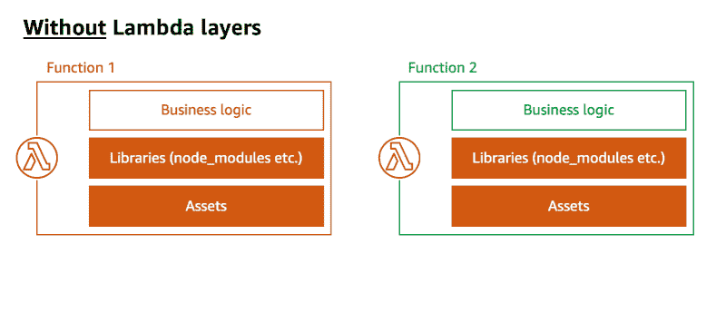
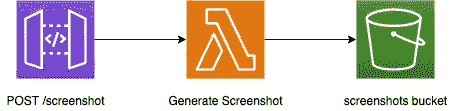
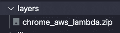
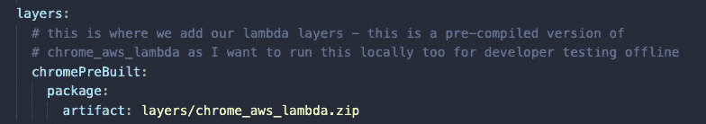
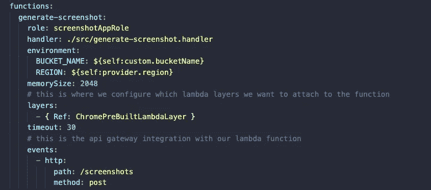
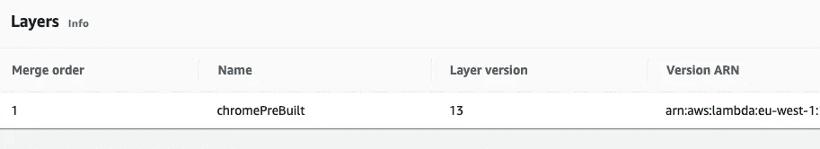
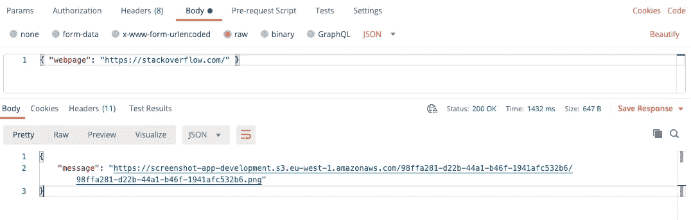
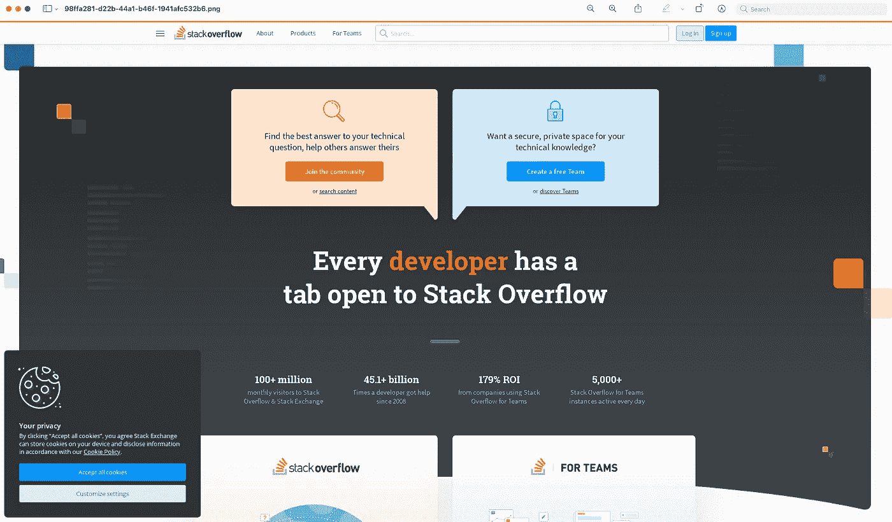

# 无服务器 Lambda 层🚀

> 原文：<https://levelup.gitconnected.com/serverless-lambda-layers-d8f8374404e3>


[Gradienta](https://unsplash.com/@gradienta?utm_source=unsplash&utm_medium=referral&utm_content=creditCopyText) 在 [Unsplash](https://unsplash.com/s/photos/colour-splash?utm_source=unsplash&utm_medium=referral&utm_content=creditCopyText) 上拍摄的照片

## 在 Lambda 中使用无头浏览器使用 AWS Lambda 层生成截图的实际例子。

这篇博文介绍了 [AWS Lambda 层](https://aws.amazon.com/blogs/aws/new-for-aws-lambda-use-any-programming-language-and-share-common-components/)，然后使用[无服务器框架](https://www.serverless.com/)、[类型脚本](https://www.typescriptlang.org/)和木偶师构建了一个无服务器截图应用程序。您可以在这里 **访问代码回购示例 [**。**我发现大多数使用无服务器的开发人员忘记了这个特性，当你构建 applications🛠时，在你的大脑工具箱中有这个特性是非常有用的](https://github.com/leegilmorecode/serverless-lambda-layers)**

Puppeteer 是一个[节点](https://nodejs.org/en/)库，它提供了一个高级 API 来控制 Chrome 或基于 [DevTools 协议](https://chromedevtools.github.io/devtools-protocol/)的 Chrome，它可以在 lambda 中运行来执行以下任务:

*   *生成页面截图和 pdf。*
*   *抓取一个 SPA(单页应用)并生成预渲染内容(即“SSR”(服务器端渲染))。*
*   自动化表单提交、用户界面测试、键盘输入等。
*   创建一个最新的自动化测试环境。使用最新的 JavaScript 和浏览器功能，在最新版本的 Chrome 中直接运行测试。
*   *捕获站点的* [*时间轴跟踪*](https://developers.google.com/web/tools/chrome-devtools/evaluate-performance/reference) *，帮助诊断性能问题。*

使用 AWS 提供的 Lambda 层的另一个很好的例子在这篇早期的博客文章中讨论过，围绕 AWS [AppConfig](https://docs.aws.amazon.com/appconfig/latest/userguide/what-is-appconfig.html) 的特性标志:

[](/serverless-feature-flags-6e49d534e79f) [## 无服务器功能标志🚀

### 带有 lambda 扩展和 AppConfig 的无服务器功能标志

levelup.gitconnected.com](/serverless-feature-flags-6e49d534e79f) 

## 什么是 Lambda 层？

那么什么是 Lambda 层，我为什么需要它们？[达尼洛·波西亚](https://aws.amazon.com/blogs/aws/author/danilop/) ( *亚马逊网络服务的首席传道者(EMEA)*)将他们描述为:

> **在构建无服务器应用程序时，跨 Lambda 函数共享代码是很常见的。它可以是由多个函数使用的自定义代码，也可以是标准库，您可以添加它来简化业务逻辑的实现。**
> 
> **以前，您必须将这个共享代码与使用它的所有功能打包并部署在一起。现在，你可以把通用组件放在一个 ZIP 文件中，并把它作为 Lambda 层上传。您的函数代码不需要更改，并且可以像平常一样引用层中的库。**
> 
> **层可以被版本化以管理更新，每个版本都是不可变的。当一个版本被删除或使用它的权限被撤销时，以前使用它的功能将继续工作，但您将不能创建新的功能。**

****下面的动画展示了这种重复使用的直观示例:****

********

****[https://AWS . Amazon . com/blogs/mobile/how-to-use-lambda-layers-with-amplify-CLI/](https://aws.amazon.com/blogs/mobile/how-to-use-lambda-layers-with-the-amplify-cli/)****

****这对于代码重用和保持函数[干燥](https://en.wikipedia.org/wiki/Don%27t_repeat_yourself)来说是极好的，但是一个额外的好处是当处理大型依赖项(如“Chromium”和“Puppeteer”)时，您的 lambda 包大小适合部署。👌再加上许多 lambda 层是开源的，可以直接使用该层的 ARN 在你自己的代码中使用。****

****这不会减少您的冷启动时间，但会提高部署速度，确保您的 lambda 只是您的“代码”，实现共享代码和资产重用，并确保您不会遇到可怕的“*codestorageexceded*”错误(*，特别是如果您有多个 lambda 都使用这些大型依赖项！*)。****

> ****在这个特定的代码示例中使用层从总的函数大小中删除了 41MB，这使得部署很快，因为它的大小只有 61KB！****

****这里有一个很棒的开源 Lambda 层列表，你可以在你的无服务器配置中直接使用，方法是链接到与你的函数相同区域的层 ARN，而不是本地 zip 文件(*但是这确实使本地开发成为这种方法的一个挑战*****

****[](https://github.com/mthenw/awesome-layers) [## GitHub-mth enw/awesome-Layers:λAWS Lambda 图层的精选列表。

### 令人敬畏的 AWS Lambda 层的精选列表 Lambda 层是一种新类型的工件，可以包含任意代码…

github.com](https://github.com/mthenw/awesome-layers)**** 

## ****Lambda 层是如何工作的？****

****lambda 函数最多可以有五个不同的 Lambda 层，所有层解压缩后的 Lambda 部署包的总大小不超过 250 MB。****

****Lambda 层是一个. zip 文件档案，可以包含附加代码或数据。一个层可以包含库、[自定义运行时](https://docs.aws.amazon.com/lambda/latest/dg/runtimes-custom.html)、数据或配置文件。****

****当设置函数的执行环境时，Lambda 将层内容提取到`/opt`目录中。****

> ****请记住，所有五个图层都将提取到同一个/opt 文件夹中，因此请确保没有文件名冲突，否则文件将被后续图层覆盖。****

****然后你可以通过访问 lambda 代码中的`/opt`文件夹来使用资产、依赖项等。****

## ****我们在建造什么？****

****我们将使用图层构建一个在线截图工具，它可以:****

********

****演示 Lambda 图层的基本演示应用程序****

1.  ****允许用户向`/screenshots/`端点发布一个有效负载，其中包括我们想要截图的网页。****
2.  ****将调用一个 lambda 函数，根据来自 API Gateway 的有效载荷生成网页截图(*Lambda*中的无头浏览器)。****
3.  ****然后，屏幕截图被保存在公共的 S3 存储桶中以供查看，并且资产路径在结果中被返回给消费者以供查看。****

## ****让我们开始建造吧！****

****以下摘录自[代码报告](https://github.com/leegilmorecode/serverless-lambda-layers)显示了构建该解决方案的主要配置。****

******建立/添加图层******

********

****图层 zip 文件****

****`chrome_aws_lambda`层是一个 zip 文件，存储在`layers`文件夹中，如图所示。****

****您可以使用下面的命令来构建 [chrome-aws-lambda](https://www.npmjs.com/package/chrome-aws-lambda) 层，这里将详细介绍这些命令来生成 zip 文件:****

```
**git clone --depth=1 https://github.com/alixaxel/chrome-aws-lambda.git && \
cd chrome-aws-lambda && \
make chrome_aws_lambda.zip**
```

******部署图层******

****使用`serverless framework`，我们可以确保该层被部署到 AWS ( *，它也将被版本化*):****

********

****部署该层的无服务器框架****

******添加图层到功能******

****然后，可以使用以下代码将图层链接到函数:****

********

****将层添加到函数中****

****部署完成后，当您登录 AWS 控制台时，您将看到与该功能相关的层:****

********

****添加到函数中的层****

******本地 vs AWS******

****我们使用`Webpack`和无服务器框架的组合来确保如果我们使用`serverless-offline`在本地运行，我们可以使用`chrome-aws-lambda`和`puppeteer`的开发依赖项，但是当部署到 AWS 时，我们不捆绑它们，因为我们有 lambda 层可以使用，我们只使用`pupeteer-core` ( *默认情况下，这个版本不下载浏览器*)来执行与该层的交互(*并且只部署代码*)。****

> ****这是 lambda 层的缺点之一，因为许多本地构建工具在指向 ARN 共享的 lambda 层时无法工作，这可能会使本地开发变得困难。因此有了上面的解决方法。****

******功能码******

****生成截图并从 S3 返回路径供用户查看的基本代码(*包括示例*的详细注释)如下所示(*这不是生产代码！这是演示图层的基本示例*):****

******生成截图******

****一旦部署到云(*或离线运行*)并在 repo 中使用 Postman 集合，您就可以通过 POST 调用和以下有效负载调用端点，例如:****

```
**{ "webpage": "https://stackoverflow.com/" }**
```

********

****Postman 集合和调用屏幕截图端点的示例****

****当点击返回 URL 即消息属性时，您将能够下载 Stackoverflow 的截图 PNG，如下所示！****

********

****lambda 制作的可下载 png 图像截图****

****我想尝试的一个想法是一个用于前端开发的 visual diff CI/CD 工具，接下来我将会介绍这个工具。****

# ****包扎****

****我很乐意就以下任何一个问题与您联系:****

****[https://www.linkedin.com/in/lee-james-gilmore/](https://www.linkedin.com/in/lee-james-gilmore/)T21[https://twitter.com/LeeJamesGilmore](https://twitter.com/LeeJamesGilmore)****

****如果你觉得这些文章鼓舞人心或有用，请随时用虚拟咖啡[https://www.buymeacoffee.com/leegilmore](https://www.buymeacoffee.com/leegilmore)来支持我，不管怎样，让我们联系和聊天吧！☕️****

****如果你喜欢这些帖子，请关注我的简介[李·詹姆斯·吉尔摩](https://medium.com/u/2906c6def240?source=post_page-----39c4f4ae5aff----------------------)以获取更多的帖子/系列，别忘了联系我并打招呼👋****

****如果你喜欢，也请使用帖子底部的“鼓掌”功能！( ***可以不止一次鼓掌！！*** )****

******本文由** [**Sedai.io**](https://www.sedai.io/) 赞助****

********

# ****关于我****

****"*大家好，我是 Lee，英国的 AWS 认证技术架构师和首席软件工程师，目前是技术云架构师和首席无服务器开发人员，过去 5 年主要从事 AWS 上的全栈 JavaScript 工作。*****

*****我认为自己是一个热爱 AWS、创新、软件架构和技术的无服务器布道者。*”****

********所提供的信息是我个人的观点，我对这些信息的使用不承担任何责任。*********