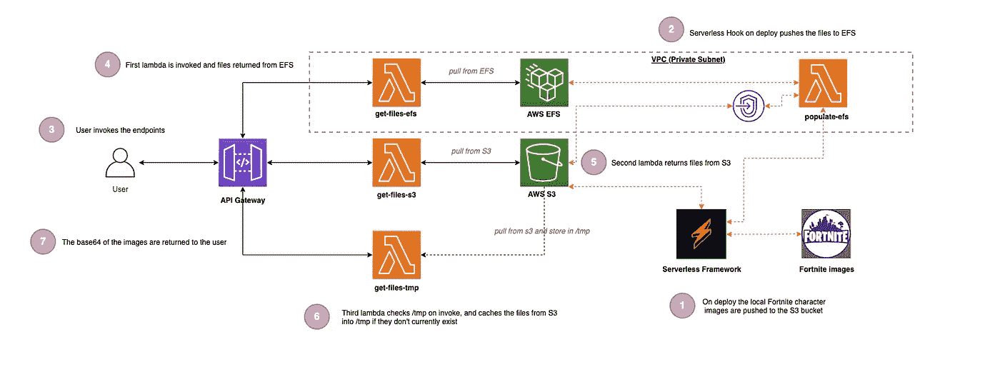
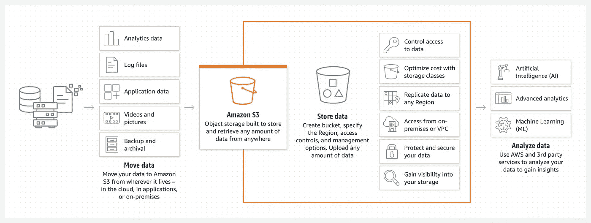
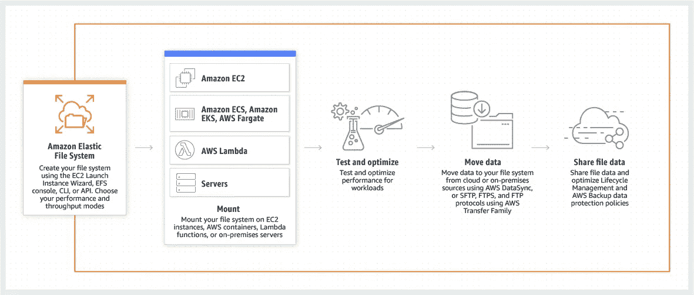
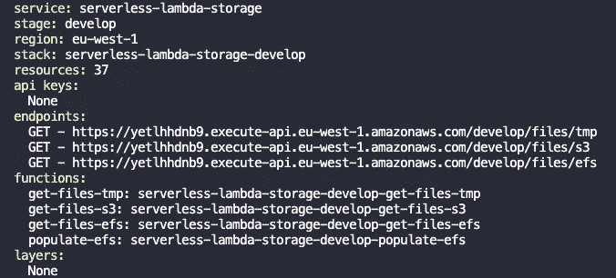
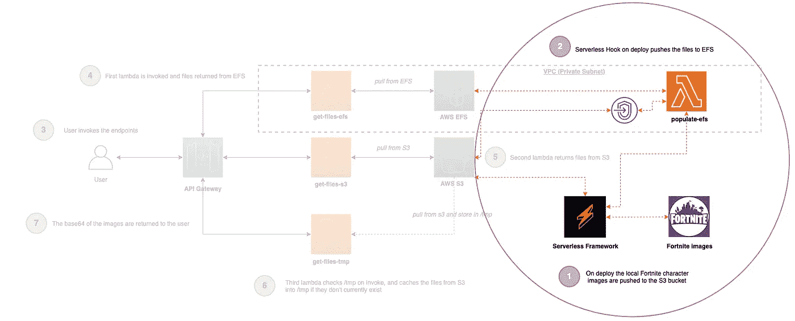
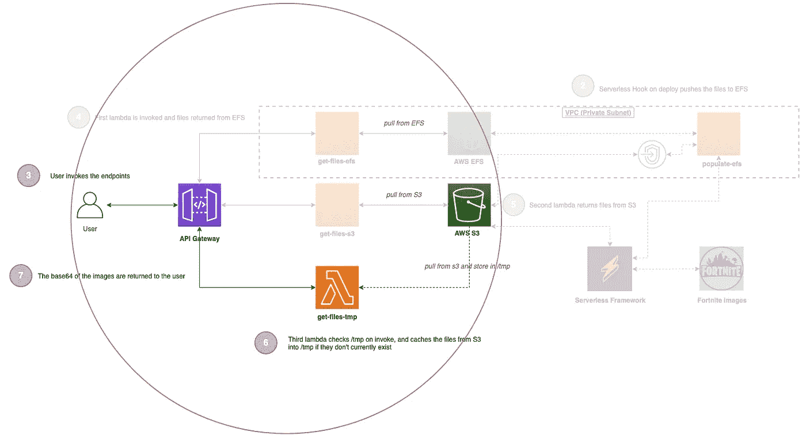
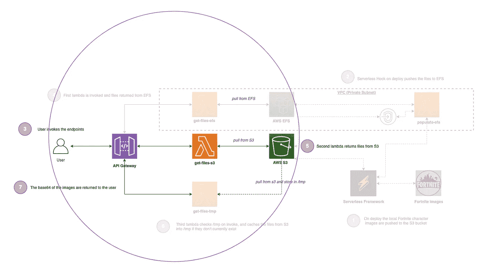
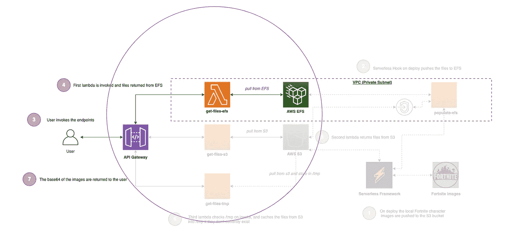
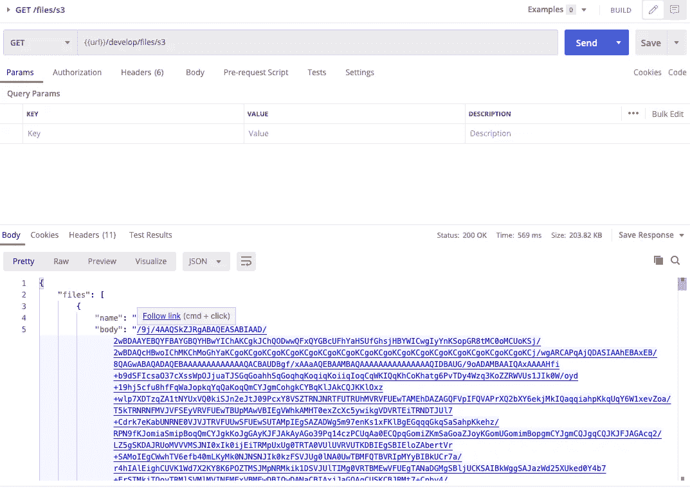
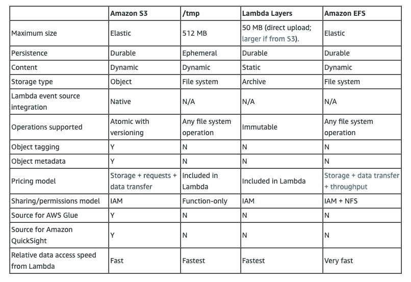

# 无服务器 Lambda 存储选项🚀

> 原文：<https://levelup.gitconnected.com/serverless-lambda-storage-options-6c483d1fa990>


弗拉德·戈尔什科夫在 [Unsplash](https://unsplash.com/s/photos/fortnite?utm_source=unsplash&utm_medium=referral&utm_content=creditCopyText) 上的照片

## 使用 Lambda 临时临时存储的实际示例，S3 和 EFS 作为比较，利用无服务器框架和 TypeScript，以及支持代码示例

# 介绍

> 当使用 AWS Lambda 时，在处理文件时有多种存储选项可用，但是在哪种情况下应该使用每一种呢？

这篇博文涵盖了三个选项，并附有代码示例；以及关于何时使用每种方法、优缺点和相对速度的讨论:

✔️AWS S3
✔️AWS EFS
✔️lambda 短暂存储( *tmp* )

Lambda 层还有第四个选项，我不会在这里介绍，因为在这种情况下文件总是静态的，但会在下面的博客文章中介绍:

[](/serverless-lambda-layers-d8f8374404e3) [## 无服务器 Lambda 层🚀

### 在 Lambda 中使用无头浏览器使用 AWS Lambda 层生成屏幕截图的实际示例

levelup.gitconnected.com](/serverless-lambda-layers-d8f8374404e3) 

## 我们在建造什么？

我们将构建一个解决方案，该解决方案包含一个 API，该 API 有三个端点，通过 Lambda 与每种存储类型进行交互，出于好玩，我们正在处理堡垒之夜角色的图像😜

下面的步骤和图表显示了我们正在构建的内容(这里有[代码回购](https://github.com/leegilmorecode/serverless-lambda-storage)):



博客文章的基本架构示例

1.  在使用无服务器框架进行部署时，我们将四个[堡垒之夜](https://www.epicgames.com/fortnite/en-US/home)角色图像推送到一个 S3 桶中(*1.jpeg、2.jpeg、3.jpeg&4.jpeg*)(**设置**)。
2.  在成功部署时，我们还使用'[挂钩](https://www.npmjs.com/package/serverless-plugin-scripts)来调用一个[λ](https://aws.amazon.com/lambda/)，它将相同的映像推送到 [EFS](https://aws.amazon.com/efs/) ( **设置**)。
3.  用户可以调用每种存储类型的三个端点中的任何一个。
4.  基于 EFS 的 Lambda 通过 [API 网关](https://aws.amazon.com/api-gateway/)调用，并从 EFS ( **EFS** )返回文件。
5.  基于 [S3](https://aws.amazon.com/s3/) 的 Lambda 通过 API 网关调用，并从 S3 ( **S3** )返回文件。
6.  基于 tmp 的 Lambda 检查文件是否已经驻留在 Lambda 容器本身的`/tmp`文件夹中，如果不是，它缓存来自 S3 的相同文件。在通过 API Gateway 的后续调用中，这些文件已经在 tmp 中，可以从 lambda ( **TMP** )中提供服务。
7.  所有文件都以 base64 格式返回。(*下面的网站非常适合查看 base64 字符串图像:*[*https://codebeautify.org/base64-to-image-converter*](https://codebeautify.org/base64-to-image-converter))

以下示例图片仅供参考:


以上图片的版权归 https://www.epicgames.com/fortnite/的堡垒之夜所有

> *💡* *注意:这是演示三个存储选项使用的最少代码和架构，因此这不是生产就绪代码，也不符合所有编码和架构最佳实践*

# 那么有哪些不同的存储选项呢？

我们将讨论的三个选项详述如下:

## AWS S3

AWS S3 是用于对象存储的无服务器选项，可根据您的项目需求无限扩展，具有 11 个 9 的耐用性，允许静态和传输时的各种加密选项，并且非常经济高效。在无服务器的世界里，这是存储和检索文件的一个极好的选择，尤其是有各种各样的存储类可用的情况下。

下图显示了一些使用案例，包括构建数据湖、托管前端 web 应用程序、备份和检索、存储日志等:



【https://aws.amazon.com/s3/】

## AWS EFS

亚马逊弹性文件系统(AWS EFS)提供了一个简单的弹性文件系统，让您无需配置或管理存储即可共享文件数据。它可以与 AWS 云服务和内部资源一起使用，并且可以按需扩展到 Pb 级，而不会中断应用程序。

带有 Lambda 的 EFS 是另一个很棒的无服务器产品，它具有成本效益，具有各种[存储类](https://docs.aws.amazon.com/efs/latest/ug/storage-classes.html)(S3 也是*)，自动扩展到您的应用程序需求，并且是另一个使用 Lambda 的持久文件存储的好方法:*



[https://aws.amazon.com/efs/](https://aws.amazon.com/efs/)

## 自动气象站λ(tmp)

第三个选项是利用第一次调用 Lambda 时在 Lambda 容器中创建的`/tmp`文件夹。这允许您直接在这个文件夹中读写文件，这个文件夹在特定的 Lambda 容器本身的生命周期中都存在。这意味着你不能保证文件总是在你的代码中。

当水平伸缩时，如果持久化的文件不需要在同一个 Lambda 的不同调用之间共享，这是一个很好的选择，但是这种方法有一些限制，本文将进一步讨论。

# 入门！

> *🛑* ***注意*** *:运行以下命令将在您的 AWS 帐户上产生费用，因此相应地更改配置。*

## 部署解决方案

在文件夹的根目录下运行`npm i`，然后运行`npm run deploy:develop`，这将安装所有的依赖项，然后部署到 AWS。

这将使用[无服务器框架](https://www.serverless.com/)为您生成资源，即 API、计算层和存储资源。成功部署后，您将看到与以下内容类似的输出:



sls deploy 的输出示例

## 部署时用映像自动填充 S3 和 EFS

在部署资源的过程中，我们使用无服务器插件`[serverless-s3-sync](https://www.npmjs.com/package/serverless-s3-sync)`，它获取`./assets`文件夹中的四个映像，并使用`serverless.yml`中的以下配置自动将它们推送到 S3 存储桶，这确保了当我们到达端点时，我们在成功部署后立即取回文件:

```
s3Sync:
   - bucketName: ${self:custom.bucketName}
     localDir: ./assets/
```

现在我们已经将图像部署到了一个 S3 桶中，在`sls deploy`结束时，我们自动运行一个 Lambda，它从 S3 桶中提取图像，并将它们推送到 EFS 文件共享。这是使用无服务器插件`[serverless-plugin-scripts](https://www.npmjs.com/package/serverless-plugin-scripts)`和下面的`serverless.yml`中的配置完成的(*再次确保我们直接从 EFS 端点获取文件*):

```
scripts:
   hooks:
      'deploy:finalize': sls invoke -f populate-efs
```



使用无服务器部署将资产部署到 EFS 和 S3 的示例

这就调用了`populate-efs` Lambda，它从 S3 获取图像，如果它们不在 EFS，就把它们写到那里。**现在，作为部署的一部分，我们已经在 EFS 和 S3 部署了完整的映像！**😜

## 从 tmp 中提取图像

我们将讨论的第一个 lambda 是从 Lambda 本身的`/tmp`文件夹中提取图像。显然，作为部署的一部分，我们只将映像推送到 S3 和 EFS，而 Lambda 是短暂的(*寿命很短，只在需要时创建*，**)，那么我们如何将映像放入 tmp 文件夹**？

> **"**Lambda 执行环境提供了一个文件系统，供你的代码在/tmp 下使用。该空间的固定大小为 512 MB。多个 Lambda 调用可以重用同一个 Lambda 执行环境来优化性能。/tmp 区域在执行环境的生命周期内被保留，并为调用之间的数据提供临时缓存。每次创建新的执行环境时，都会删除这个区域。
> 
> 因此，这是一个短暂的存储区域。虽然函数可以在调用之间缓存数据，但它应该只用于代码在一次调用中需要的数据。它不是一个永久存储数据的地方，最好用于支持代码所需的操作。**——詹姆斯·贝斯威克**

**当 lambda 第一次调用时，我们检查图像是否已经驻留在 tmp 文件夹中，如果没有，我们从 S3 中取出它们，它们现在将被缓存在 tmp 文件夹中，以供这个 lambda 容器和进一步调用使用。**

****

**冷启动时从本地 tmp 文件夹提取 lambda 并从 S3 填充的示例**

**这意味着第一次调用在冷启动时会稍慢一些，因为它从 AWS S3 获取图像，但随后的 API 调用却快如闪电！**

> ***💡*使用 NodeJS 在 lambda 中进行缓存的另一个很好的例子是在 lambda 处理程序之外填充一个全局变量，它现在将在以后的调用中保留内存中的值。您不能假设它总是被填充，但是我过去曾使用它来存储在访问内部 API 时从客户端凭证授权流生成的令牌(即，而不是在每次调用时都生成新的令牌)。检查它是否被填充，如果没有，生成一个新的令牌并缓存它——类似于上面讨论的使用 tmp 的方法。**

## **从 S3 调出图像**

**接下来是一个相当简单的设置，直接从 AWS S3 存储桶中提取文件。**

****

**显示直接从 AWS S3 提取文件的示例**

**这是三种方法中最慢的，但仍然非常快。**

## **从 EFS 调出图像**

**第三个 Lambda 直接从 EFS 获取文件，是三个中最复杂的设置。**

**这是因为要将 EFS 与 Lambda 一起使用，您的 Lambda 函数需要附加到 VPC。与创建 EFS 文件系统相关的云信息非常多，所以我在`serverless.yml`文件中添加了详细的注释。**

**还有一个额外的复杂性，即我们在无服务器部署上从 S3 填充 EFS 的 Lambda 需要访问 S3 和 EFS，并且 Lambda 位于没有互联网访问的私有子网中，这意味着我们需要引入一个 [VPC 网关端点](https://docs.aws.amazon.com/vpc/latest/privatelink/vpc-endpoints-s3.html)，以允许该功能与 AWS S3 进行对话(*另一种方法可能是使用 Nat 网关*)。**

****

**显示直接从 EFS 提取图像的示例**

## **测试端点**

**现在我们已经讨论了设置，您可以通过使用 repo 中的`./postman`文件夹中的 Postman 集合来测试端点。**

> ***💡*一旦[导入了](https://learning.postman.com/docs/getting-started/importing-and-exporting-data/)Postman 集合，[将 url 变量](https://learning.postman.com/docs/sending-requests/variables/)修改为 API 网关 URL，我们在成功部署后的截图中显示了该 URL。**

**示例屏幕截图显示了使用 Postman 调用端点:**

****

**文件对象数组响应示例(名称和图像的 base64 正文)**

# **何时使用每个存储选项？**

**现在我们已经看到了在同一个解决方案中编码和配置的三个选项，您何时会使用每个选项，在我看来每个方法的优缺点是什么？**

## **AWS 临时存储**

**让我们先讨论 Lambda 上的`/tmp`文件夹。在您的解决方案中读写文件时，这是三个选项中最快的一个，但是在使用文件之前，您需要检查文件是否已经驻留在文件夹中，这增加了代码的复杂性。这实质上相当于在本地硬盘上读写数据。**

**显然，您也不能在同一个 lambda 的不同调用之间共享文件(*，因为您通常不能在单独的机器上使用硬盘驱动器*)。**

**tmp 存储也有 512MB 的上限，与其他选项相比，这是一个规模限制。然而，这具有成本效益，并且与其他选项相比需要更少的 IaC(*即不需要创建文件共享或 s3 存储桶，不必担心配置和权限等问题*)。**

**我过去曾用这种方法在 Lambda 中缓存电子邮件模板，这种方法很少改变，但为我们的客户提高了速度。**

## **AWS S3**

**AWS S3 在读写文件时是三个选项中最慢的(*，但对于大多数应用来说仍然非常快*)；然而，这不像 EFS 那样需要 VPC，所以如果您的完整解决方案不需要，这是一个很好的选择(*，即更少的 IaC、配置、设置等*)。**

**在我看来，S3 还拥有与其他 AWS 服务的最佳集成(例如，*当一个新对象上传到桶*时调用 Lambda)，允许[对象版本](https://docs.aws.amazon.com/AmazonS3/latest/userguide/Versioning.html)和标记，以及允许[向对象](https://docs.aws.amazon.com/AmazonS3/latest/userguide/UsingMetadata.html)添加元数据。**

> **记住 S3 对象存储的某些特征是很重要的。虽然可以对 S3 对象进行版本控制，但不能像在文件系统中那样追加数据。你必须存储一个对象的全新版本。S3 也有一个不同于文件系统的平面存储层次结构。通过在键名中添加前缀“foldername/”,您可以使用[文件夹](https://docs.aws.amazon.com/AmazonS3/latest/user-guide/using-folders.html)来逻辑地组织对象，而不是目录。—James Beswick—AWS 无服务器团队的主要开发人员支持者**

**一个很好的用例是允许您的客户生成或上传他们自己的需要版本化的文档和图像(*非结构化数据*)，这是我过去在一个企业应用程序中使用的一种方法，效果非常好。**

**S3 还允许你使用 [Amazon Athena](https://aws.amazon.com/athena) 对数据进行查询，使用 [Amazon QuickSight](https://aws.amazon.com/quicksight/) 运行报告，这些都是很棒的附加功能。**

## **AWS EFS**

**AWS Lambda EFS 允许您在第一次调用 Lambda 时将共享文件系统挂载到您的 Lambda，这将在 Lambda 的生命周期内保留挂载。**

**这对于在许多 Lambda 调用之间共享大量数据非常有用，而且像 tmp 方法一样，与 S3 相比，它是最快的。由于动态绑定，它还允许你非常容易地共享最新的大型二进制文件或代码库(*你可以用 Lambda 层做到这一点，但这有管理和部署层的开销，并且它不太动态*)。**

**使用此选项，您可以通过 EFS 文件共享拥有多达 25K 个并发 Lambda 连接，所有 Lambda 都使用最新的文件数据。**

> **由于其速度和支持标准的文件操作，EFS 也是有益的摄取或写入大量文件持久。例如，这对于压缩或解压缩大型归档文件很有帮助。对于附加到现有文件，EFS 也是使用 S3 的首选选项。—James Beswick—AWS 无服务器团队的主要开发人员支持者**

**下图显示了 AWS 的官方比较，在我看来，它很好地突出了这些差异:**

****

**摘自 [AWS 博客文章](https://aws.amazon.com/blogs/compute/choosing-between-aws-lambda-data-storage-options-in-web-apps/)的存储选项比较**

**希望你觉得这有用！**

# **包扎**

**我很乐意就以下任何一个问题与您联系:**

**【https://www.linkedin.com/in/lee-james-gilmore/】T3
T5[https://twitter.com/LeeJamesGilmore](https://www.linkedin.com/in/lee-james-gilmore/)**

**如果你觉得这些文章鼓舞人心或有用，请随时用虚拟咖啡[https://www.buymeacoffee.com/leegilmore](https://www.buymeacoffee.com/leegilmore)来支持我，不管怎样，让我们联系和聊天吧！☕️**

**如果你喜欢这些帖子，请关注我的简介[李·詹姆斯·吉尔摩](https://medium.com/u/2906c6def240?source=post_page-----39c4f4ae5aff----------------------)以获取更多的帖子/系列，不要忘记联系我并打招呼👋**

**如果你喜欢，也请使用帖子底部的“鼓掌”功能！( ***可以不止一次鼓掌！！*** )**

****本文由**[**sedai . io**](https://www.sedai.io/)赞助**

****

# **关于我**

**"*大家好，我是 Lee，英国的 AWS 认证技术架构师和首席软件工程师，目前是技术云架构师和首席无服务器开发人员，过去 5 年主要从事 AWS 上的全栈 JavaScript 工作。***

**我认为自己是一个无服务器的布道者，热爱 AWS、创新、软件架构和技术。”**

****所提供的信息是我个人的观点，我对这些信息的使用不承担任何责任。*****