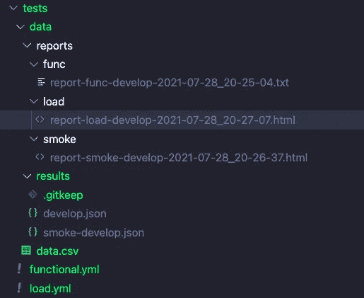

# 火炮规模的无服务器负载测试🚀

> 原文：<https://levelup.gitconnected.com/serverless-load-testing-at-scale-with-artillery-53ef6c8b77f7>


迈克·范·登博斯在 [Unsplash](https://unsplash.com/s/photos/loading?utm_source=unsplash&utm_medium=referral&utm_content=creditCopyText) 上的照片

## 使用无服务器框架和大炮对无服务器应用程序进行负载、冒烟、功能和模糊测试，并提供支持代码示例！


# 介绍

下面的文章描述了如何使用[大炮](https://artillery.io/)和[无服务器框架](https://www.serverless.com/)对你的无服务器应用进行负载测试，支持代码 repo 在[这里](https://github.com/leegilmorecode/serverless-load-testing-artillery)可用。有负载，烟雾，模糊和功能测试的例子，并生成报告。

## 支持视频

## 为什么要负载测试？

> **"** 为什么要对完全可伸缩的无服务器应用程序进行负载测试？转移到无服务器的原因肯定是首先否定了负载测试的需要吗？？**🤔**

在我看来，当使用企业级无服务器架构时，由于其他关键因素，你仍然需要进行负载测试；例如:

❌可扩展性较差的下游服务，以及它们如何应对 lambda 的突然扩展(*可能是集成了遗留系统或数据库技术的最大连接数* )
❌异步最终一致的流程符合最终用户可接受的阈值。
❌ [硬和软 AWS 区域限制](https://docs.aws.amazon.com/general/latest/gr/aws_service_limits.html)。
❌预留和供应的并发配置如何大规模影响端点。
❌内存配置在 lambdas 上。
❌，甚至是 lambdas 本身写得很差的代码(*内存泄漏、糟糕的批处理配置等*)。

下面直观地显示了这一点:


## 火炮是什么？

[cannon](https://artillery.io/)是一个开源的负载和功能/冒烟测试解决方案，它可以作为您使用 NPM 的无服务器解决方案的依赖项来安装，[使用 yml 文件](https://artillery.io/docs/guides/guides/test-script-reference.html)和[附带的 CSV 文件来配置负载测试数据](https://artillery.io/docs/guides/guides/test-script-reference.html#Payload-Files)，并在您的管道内运行以进行常规负载/冒烟测试。也有额外的社区插件可以使用，其中一个允许模糊测试。

# 示例架构

这篇博客文章附带的基本示例无服务器[代码报告](https://github.com/leegilmorecode/serverless-load-testing-artillery)具有以下架构:

> 请注意，这是演示火炮使用的最小代码和架构，所以这不是生产就绪，不符合编码和架构最佳实践

1.  大炮使用 CSV 文件中的员工通过`POST employees`端点([AWS API Gateway](https://aws.amazon.com/api-gateway/)>[AWS Lambda](https://aws.amazon.com/lambda/))创建新员工。
2.  员工记录被保存到`employees` [AWS DynamoDB](https://aws.amazon.com/dynamodb) 表中。
3.  cannon 迭代 CSV 文件，对单个雇员执行`GET employee`。


这个简单演示的示例体系结构

## 这个场景中的测试会带来什么好处？

在上面的简单架构场景中，使用 cannon，您将能够断言:

1.  我们是否在 [DynamoDB](https://aws.amazon.com/dynamodb/) 上正确设置了[调配的容量](https://aws.amazon.com/dynamodb/pricing/provisioned/)，或者我们是否会由于缺少可用资源而受到限制？我们是应该增加它，还是根据我们的预期规模来按需改变？(*例如，黑色星期五的等效负荷是什么样的？*)
2.  我们是否在 lambdas 上正确设置了[保留的](https://docs.aws.amazon.com/lambda/latest/dg/configuration-concurrency.html#configuration-concurrency-reserved) / [供应的](https://docs.aws.amazon.com/lambda/latest/dg/configuration-concurrency.html#configuration-concurrency-provisioned)并发？冷启动看起来怎么样，我们会因为负载得到 429 风格的响应吗？
3.  响应时间(*延迟*)是否在我们针对最终用户的 [NFRs](https://www.scaledagileframework.com/nonfunctional-requirements/) 范围内？即平均响应时间是否可以接受？一个例子可以是一个员工下载他们生成的工资单，一个生成定制的 PNG 图片的服务，一个根据外部服务检查你的信用检查的服务，等等
4.  断言的 API 响应在功能上是否正确？也就是说，在一个新版本发布后，我们是否得到了我们期望的正确的属性？
5.  如果我们发布过多/不足，发送不良/恶意的有效载荷等，我们会得到什么样的回应？我们的 API 验证工作正常吗？

正如你所看到的，即使在上面这个非常琐碎的例子中，火炮测试也有很多好处。用潜在的异步处理和涉及的更多 AWS 服务/配置、集成的下游遗留/较慢的系统以及对 API 进行的功能更改来推断这一点；从在管道中运行的联合负载和功能/冒烟测试套件的角度，展示了这种方法是多么有用。

# 如何部署示例代码？

> *🛑*

在文件夹的根目录下运行`npm i`，然后运行`npm run deploy:develop`，这将安装所有的依赖项，然后部署到 AWS。

这将使用无服务器框架(即 API、计算层和数据库)为您生成资源。您将看到与此类似的输出:


运行 npm 的输出运行部署:开发

然后，在`tests/load.yml`文件中，将`environments > develop`部分中的`target`属性修改为运行部署时生成的基本 URL(*我已经为 staging 和 production 添加了条目，只是为了展示这是如何工作的*)。一个例子:

```
environments:
   develop:
      target: "**https://**something**.execute-api.eu-west-1.amazonaws.com/develop**"
```

> *💡*实际上，这将是您众所周知的域端点，例如使用 AWS Route 53 和 CloudFront，显然我不会在这个简单的示例中这样做，但是您通常不会像上面那样修改这个文件。

然后您可以使用`npm run test:load:develop`运行负载测试，这将在 results 文件夹中生成一个`develop.json`文件，并在 reports 文件夹中生成一个带有时间戳的报告。

您还可以运行`npm run test:smoke:develop`,它将运行一组冒烟测试而不是负载测试，并生成一个如上的报告。

最后，对于使用 cannon 运行功能测试(*包括* [*模糊化*](https://owasp.org/www-community/Fuzzing) )运行`npm run test:func:develop`，这将产生测试运行的文本文件报告(*包括任何失败的测试和导致失败的设置数据/场景等*

> *💡CSV 文件中的模拟员工数据是使用 https://www.mockaroo.com/的免费优秀资源[生成的](https://www.mockaroo.com/)*

# 这是怎么配置的？

主炮配置被分成两个文件(*实际上你可以进一步分割*):

**load.yml** 用于负载和烟雾测试。
**functional.yml** 用于功能测试( *inc fuzzing* )。

yml 文件通过 NPM 脚本调用，每个脚本运行生成输出 JSON 文件的测试，以及获取 JSON 文件并生成报告的 post 脚本:

```
"test:smoke:develop": "DEBUG=plugin:expect $(npm bin)/artillery run --output ./tests/data/results/smoke-develop.json -e smoke-develop ./tests/load.yml","posttest:smoke:develop": "$(npm bin)/artillery report --output ./tests/data/reports/smoke/report-smoke-develop-\"$(date \"+%Y-%m-%d_%H-%M-%S\")\".html ./tests/data/results/smoke-develop.json",
```

## load.yml

负载测试文件`load.yml`如下所示，带有详细注释:

> *💡*如您所见，冒烟测试和负载测试之间的唯一区别在于冒烟测试是作为一个虚拟用户(即无负载)按顺序一次运行一个测试。

测试数据是从一个`data.csv`文件中提取的，在配置中有下面一行:

```
payload:
   path: "./data/data.csv" # pull in the employee data csv
```

您还可以看到,`[expect](https://www.npmjs.com/package/artillery-plugin-expect)`插件被用来确保:

正在返回✔️正确的状态代码。
✔️返回正确的内容类型。
✔️的回答具有正确的性质。
✔️对返回值进行一些正确的测试，例如`fullName`，它是代码中`firstName`和`surname`属性的串联。

## functional.yml

功能和模糊测试可以在下面的`functional.yml`文件摘录中看到，带有详细注释:

从上面你可以看到,`[fuzzer](https://artillery.io/docs/guides/plugins/plugin-fuzzer.html)`插件已经被引入，它将产生错误的输入用于我们的测试，如下所示:

```
firstName: "{{ naughtyString }}"
```

我们正在明确测试:

✔️ ️that，我们的 lambda 函数中的有效载荷验证工作正常。
✔️检查正确的预期响应代码。
✔️检查正在返回的正确响应。

> *💡*功能测试由一个虚拟用户运行，类似于烟雾测试。

我们在代码中添加了一个基本的`validate`函数，它使用 [JSON 模式](https://json-schema.org/)和 [AJV](https://ajv.js.org/) 来检查我们的输入负载，如果有任何失败，它会抛出一个名为`AppError`的自定义错误类型:

自定义的`AppError`错误类型允许我们区分我们在代码中抛出的已知错误(*例如我们通过 AJV* 验证的错误请求)和未捕获的错误。**我们这样做是因为如果出现未知错误，我们不想在响应中返回堆栈跟踪或秘密！**

lambda 处理程序中使用的基本通用错误处理程序的示例如下所示(*默认为 500 错误，带有标准错误消息*):

然后，我们可以使用 JSON 模式测试有效负载输入，如下所示，用于创建 employee 端点:

如果有效载荷验证失败，我们可以返回正确的响应，可以使用上面的功能测试进行验证！


可以在我们的功能测试中检查的示例响应

# 举报！📈

一旦测试已经运行，一个 [NPM post 脚本](https://docs.npmjs.com/cli/v7/using-npm/scripts#pre--post-scripts)在`reports`文件夹中为给定的环境和测试类型生成一个本地报告；例如:`report-load-develop-2021–07–28_20–27–07.html`



生成报告的文件夹结构示例

然后，您可以打开基本生成的报告并查看它，它显示了以下示例输出:


本地生成的基本报告

如果你想从生成的 JSON 输出中看到一个更好的报告风格，你可以进入[https://reportviewer.artillery.io/](https://reportviewer.artillery.io/)并上传生成的 JSON 文件以获得以下结果:


通过[https://reportviewer.artillery.io/](https://reportviewer.artillery.io/)生成的漂亮报告

在大多数浏览器中，您可以`select > edit > print > print to pdf`获得 PDF 格式的可下载报告。

两个 yml 文件中的以下配置确保了如果我们有任何错误，或者如果延迟超过某个阈值，管道将会失败:

```
ensure:
   p95: 1000 # ensure latency is equal to or under 1000ms
   maxErrorRate: 0 # no percentage of error rate i.e. no errors or pipeline fails
```

# 插件🔌

火炮有许多插件，可以和它一起使用来扩展它的功能，例如:

[**cannon-plugin-cloud watch**](https://www.npmjs.com/package/artillery-plugin-cloudwatch)—cannon . io 的插件，将响应数据记录到 AWS CloudWatch 中。

这个插件使得在你的 HTTP API 上运行一些模糊测试变得容易。使用它来发送意想不到的负载到您的端点，看看有什么问题，并修复它，使您的应用程序更安全，更有弹性。这个插件产生的有效载荷是基于令人敬畏的[淘气字符串大列表](https://github.com/minimaxir/big-list-of-naughty-strings/)。

[**cannon-plugin-SNS**](https://www.npmjs.com/package/artillery-plugin-sns)—cannon . io 的插件，发布对 AWS SNS 主题的响应数据。

[**cannon-plugin-dynamo db**](https://www.npmjs.com/package/artillery-plugin-dynamodb)—cannon . io 的一个插件，将统计数据发布到 AWS DynamoDB。

查看更多插件[这里](https://www.npmjs.com/search?q=artillery-plugin-&page=0&perPage=20)，显然你也可以创建自己的插件。

# 扩展到企业级负载测试！👊🏼

随着 cannon 社区的加入，您可以发出的请求数量受到运行测试的机器资源的限制(*即性能和网络*)。

为了减轻这种情况并超越平均规模，您可以利用[火炮专业](https://www.artillery.io/docs/guides/guides/running-tests-with-artillery-pro)如果:

1.  您想知道您的高流量服务(*内部或公共*)是否能够处理大量的流量负载(*即性能或负载测试*)。
2.  您希望在部署新的变更之后测试您的服务是否如您所期望的那样运行(*即验收测试*)。
3.  您希望随时监控您的企业服务，以确保您的服务的延迟处于控制之下(*即监控模式*)。

> ***注意*** *:根据您的使用情况和组织情况查看* [*定价*](https://www.artillery.io/pricing) *页面。*

# 可供选择的事物

这里要提一点的是，市面上还有其他比较成熟的工具，比如[Apache JMeter](https://jmeter.apache.org/)；然而，canary 可能适合您当前的需求，它非常轻量级，因为它是使用 NPM 安装的，可以在 CI 管道中运行，并且还有 canary 的 [Pro 版本，它具有增强的功能，并与 AWS 等建立了更好的集成](https://artillery.io/pro/)

在我看来，它是这项工作的正确工具，也是在设计和开发新的无服务器解决方案时，您头脑中的另一个工具！🛠

# 包扎

我很乐意就以下任何一个问题与您联系:

[https://www.linkedin.com/in/lee-james-gilmore/](https://www.linkedin.com/in/lee-james-gilmore/)https://twitter.com/LeeJamesGilmore[](https://twitter.com/LeeJamesGilmore)

如果你觉得这些文章鼓舞人心或有用，请随时用虚拟咖啡[https://www.buymeacoffee.com/leegilmore](https://www.buymeacoffee.com/leegilmore)来支持我，不管怎样，让我们联系和聊天吧！☕️

如果你喜欢这些帖子，请关注我的简介[李·詹姆斯·吉尔摩](https://medium.com/u/2906c6def240?source=post_page-----39c4f4ae5aff----------------------)以获取更多的帖子/系列，不要忘记联系我并打招呼👋

如果你喜欢，也请使用帖子底部的“鼓掌”功能！( ***可以不止一次鼓掌！！*** )

**本文由**[**sedai . io**](https://www.sedai.io/)赞助


# 关于我

"*大家好，我是 Lee，英国的 AWS 认证技术架构师和首席软件工程师，目前是技术云架构师和首席无服务器开发人员，过去 5 年主要从事 AWS 上的全栈 JavaScript 工作。*

我认为自己是一个无服务器的布道者，热爱 AWS、创新、软件架构和技术。

提供的信息是我个人的观点，我对信息的使用不承担任何责任。***