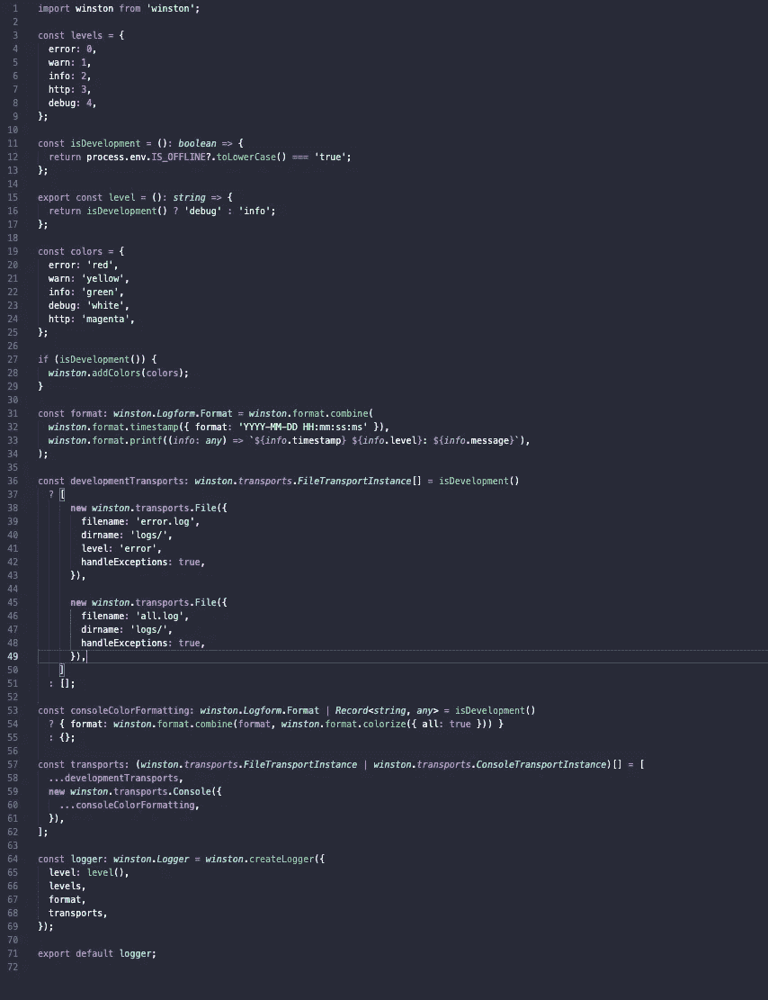
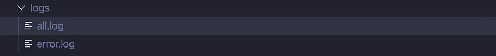
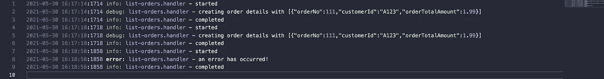
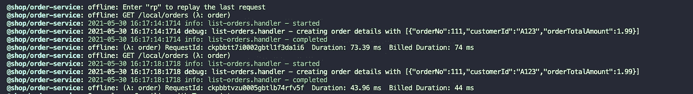
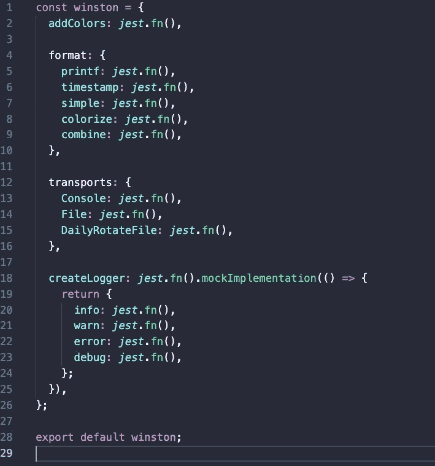

# 无服务器本地日志记录🚀

> 原文：<https://levelup.gitconnected.com/serverless-local-logging-cc966ace0d0d>

乔安娜·科辛斯卡在 [Unsplash](https://unsplash.com/s/photos/pattern-background-hex?utm_source=unsplash&utm_medium=referral&utm_content=creditCopyText) 上的照片

## 本地运行无服务器应用时的实用日志。

当使用像[无服务器离线](https://github.com/dherault/serverless-offline)这样的框架时，我认为最大的痛点之一是访问将在云中生成的对等 [CloudWatch 日志](https://aws.amazon.com/cloudwatch/)🔥。本文向您展示了在本地以最有效的方式无服务器离线运行时，如何轻松地模拟 CloudWatch 日志。

## 最优解！✔️

当我最初着手解决这个问题时，我想的正是我想要实现的目标:

1.  **访问**:可以访问日志，不仅仅是通过标准的终端输出，还可以在运行开发测试或基本负载测试时检查物理日志(例如使用[*cannon*](https://artillery.io/)),就像我使用 CloudWatch 一样。如果需要的话，我希望能够在闲暇时阅读、导出和操作，以及在开发过程中引用..🤔
2.  **漂亮**:我想让日志变得*漂亮*！没有什么比黑白冗长平凡日志更糟糕的了！🙈
3.  仅本地:我只是想让它影响本地无服务器运行，而不是部署到云中。在云中，CloudWatch 是 AWS 上的王者，我不需要编写额外的物理日志。👑
4.  我希望能够在多个项目中使用这个解决方案。(*干*)。👊🏼

## 解决方案是…自定义记录器！✏️

我对此问题的解决方案是创建一个自定义记录器，它将:

1.  **仅脱机**:仅在脱机模式下本地记录到文件。
2.  **分割日志**:我想把日志分割成“仅错误”和“所有”组合日志，以便于查看。
3.  **丰富多彩的**:我希望日志丰富多彩，易于阅读，无论是在物理日志中，还是在终端输出中。
4.  **调试日志**:我还想在本地记录调试日志，但不是在部署到云时。
5.  **测试**:我使用 [Jest](https://jestjs.io/) 进行我的 TDD/BDD/集成测试，并且在运行测试时不想记录到终端或物理磁盘，但是在本地的所有其他场景中，我希望将其记录到磁盘 ***和*** 终端。

考虑到这一点，我使用 [Winston](https://www.npmjs.com/package/winston) 创建了一个定制的 logger 包，当在离线模式下运行时，它将在本地记录到磁盘(【all and error only，包括调试日志)，而当部署到 AWS 时，它将只正常记录到 CloudWatch。简单！🤘

## 一个简单的例子..

下面是一个非常基本的例子，告诉你如何做到这一点。我个人喜欢 [Monorepo 的](https://en.wikipedia.org/wiki/Monorepo)到 [Lerna](https://lerna.js.org/) 或 [Nx](https://nx.dev/) ，所以有一个可重用的日志包是有意义的，它可以跨所有服务使用，而不是发布它并通过 [npm](https://www.npmjs.com/) ( *将其拉入每个 repo，尽管这显然是一个替代方案！*

***注*** *:当创建一个实际的生产包时，您可以通过配置来更改文件夹目的地、日志名称等。*

记录器的基本类型脚本代码示例。

这意味着，当您离线运行无服务器时，*process . env .****IS _ OFFLINE****[环境变量已经为其设置好了](https://www.serverless.com/plugins/serverless-offline#the-processenvis_offline-variable)，因此我们可以区分在云中运行还是通过无服务器离线运行的上下文。*

*然后，离线模式下的日志被写入本地磁盘，如下图所示，位于一个日志文件夹中(*被很好地分离出来*)。*

**

*示例本地日志记录文件夹和日志在全部(合并)和仅错误之间拆分。*

*当使用这个自定义日志记录器和离线运行无服务器时，本地日志的输出是丰富多彩的，易于阅读，颜色编码到日志级别，时间戳，分割日志，其中还包括调试日志。每个 lambda 也有自己的日志，就像 CloudWatch 一样。*

**

*使用自定义记录器时的日志输出示例。*

*在终端中，日志也以类似的方式格式化，并进行完美的颜色编码，易于阅读，两种类型的日志还包括时间戳:*

**

*使用自定义记录器的无服务器离线终端输出。*

*当通过 Jest 运行测试时，除了 Jest 测试通过和失败之外，我不想在终端日志中看到任何输出，所以在这个场景中，我在`node_modules`旁边添加了一个`__mocks__`文件夹，它具有以下名称和代码:*

***/__mocks__/winston.ts***

**

*使用 Jest 模仿 Winston 包的基本示例。*

*这意味着这个场景中的底层 Winston 包在只运行测试时被[用空的 jest 函数模仿了](https://jestjs.io/docs/manual-mocks)，所以我们覆盖了这个功能，并且不在 Jest 测试运行输出中显示任何日志或者写到磁盘。*

# *包扎*

*我希望您发现这个基本示例很有用，并可以在此基础上继续学习！*

*让我们连接以下任何一项:*

*[https://www.linkedin.com/in/lee-james-gilmore/](https://www.linkedin.com/in/lee-james-gilmore/)T8[https://twitter.com/LeeJamesGilmore](https://twitter.com/LeeJamesGilmore)*

*如果你觉得这篇文章有用，请随时用虚拟咖啡[https://www.buymeacoffee.com/leegilmore](https://www.buymeacoffee.com/leegilmore)来支持我，不管怎样，让我们联系和聊天吧！☕️*

*如果你喜欢这篇文章，请关注我的简介[李·詹姆斯·吉尔摩](https://medium.com/u/2906c6def240?source=post_page-----39c4f4ae5aff----------------------)以获取更多的文章/系列，不要忘记联系我并问好👋*

***本文由**[**sedai . io**](https://www.sedai.io/)赞助*

**

# *关于我*

***"** *大家好，我是 Lee，英国的 AWS 认证解决方案架构师和多语言软件工程师，是一名云架构师和首席开发人员，在过去 5 年中主要从事 AWS 上的全栈 JavaScript 工作。**

*我认为自己是一个无服务器的布道者，热爱 AWS、创新、软件架构和技术。*

*******所提供的信息是我个人的观点，我对这些信息的使用不承担任何责任。*****