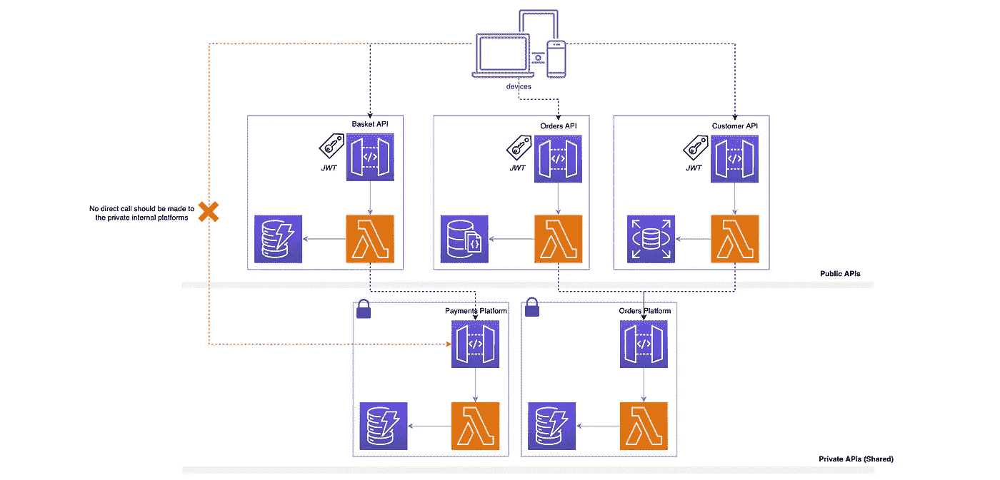
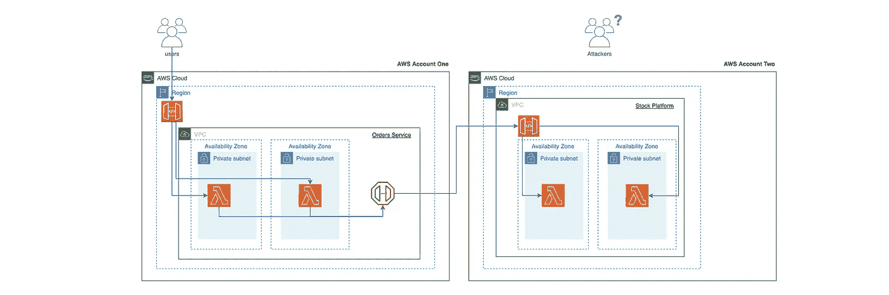
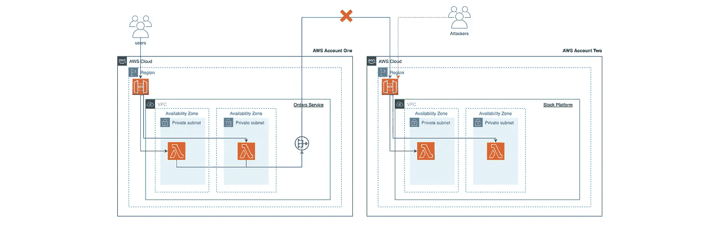
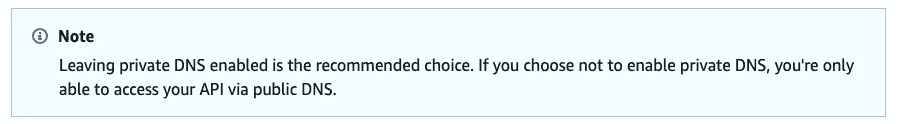
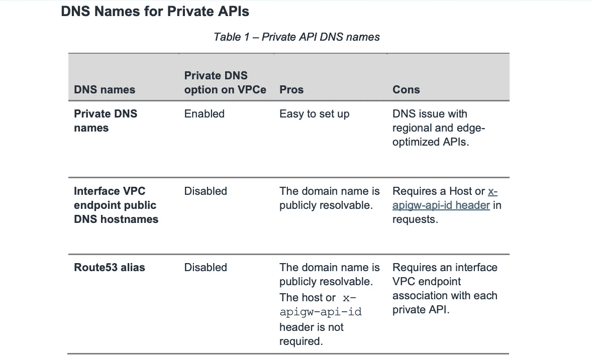
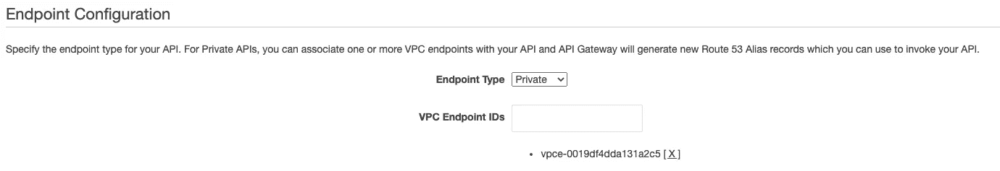
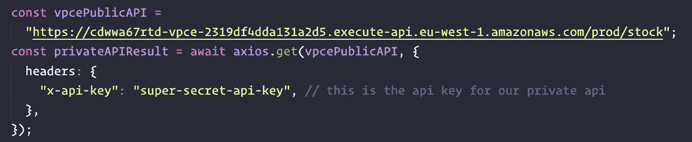
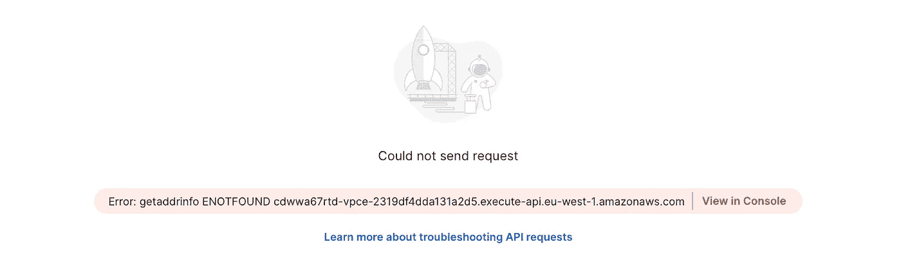
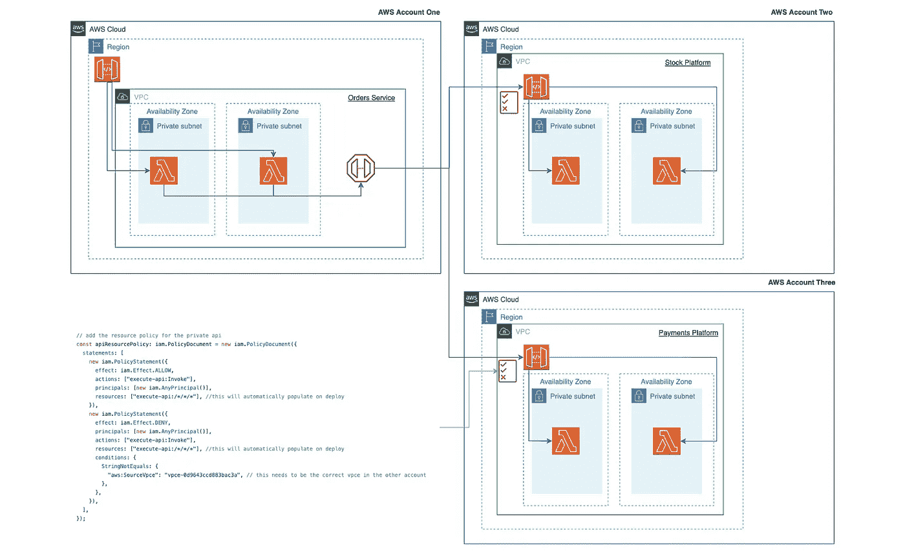
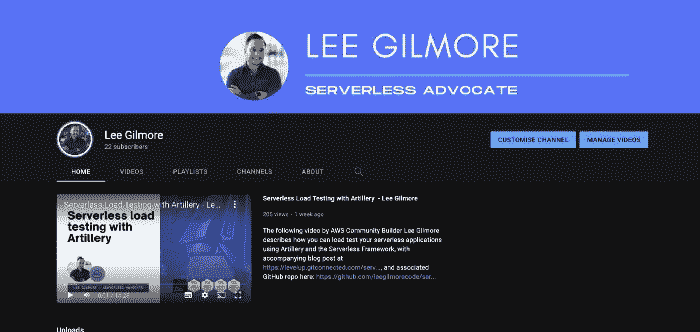

# 无服务器私有 APIs 第 1 部分🚀

> 原文：<https://levelup.gitconnected.com/serverless-private-apis-60749934b161>

马库斯·温克勒在 [Unsplash](https://unsplash.com/s/photos/jigsaw?utm_source=unsplash&utm_medium=referral&utm_content=creditCopyText) 上的照片

## 如何允许私有无服务器平台 API 在您的组织内部安全通信，而无需穿越公共互联网。包括用 TypeScript 和 AWS CDK 编写的视觉效果和代码库。

# 介绍

很多时候，在设计无服务器解决方案时，您会发现您有一个安全的内部平台，由多个域使用，并且没有必要让流向它的流量穿越公共互联网。通常，这将是域服务之间的机器到机器的流。本文将讨论一种使用 API 网关、VPC 端点和 Lambda 的方法，使用 AWS CDK 部署，代码示例可以在这里找到。

有关使用客户端凭证授权流的“*机器对机器*”流的更多信息，请查看这篇单独的文章:

 [## 无服务器 API 到 API 认证🚀

### 使用 OAuth2 客户端凭证使用 Amazon Cognito 验证 API 到 API 集成的实用指南…

levelup.gitconnected.com](/serverless-api-to-api-authentication-d4cb4472721e) 

这篇文章的第二部分可以在[这里](https://leejamesgilmore.medium.com/91fb9ab0c484)找到。

## 我们讨论的是哪些 API 层？💭

让我们看看下面的例子，展示了我们的无服务器架构的各个层:

基于**Andy Butcher(AO 首席架构师)**作品的典型架构层

下图显示了:

1.  **UI 层**。这是典型的移动和网站前端。
2.  **MFE ( *微前端* )** 。这通常是嵌入在 UI 层中的 MFE 组件或 web 应用程序。
3.  **MFE API**。这些 API 封装得很好，位于 MFE 组件的后面。这使得它们可以被放到其他 ui 中，并且不需要任何进一步的开发工作就可以工作(*除了通过*传递令牌)。
4.  **公共 API**。这些 API 往往位于 UI 层之后，通常使用 JWT 进行绑定(*示例是用户通过 UI 登录到您的应用程序，该 UI 进行身份验证，返回一个 JWT，并使用它来验证 API 调用*)。
5.  **平台 API**。平台 API 通常是私有 API，具有良好定义的 REST 模式( *OpenAPI/Swagger* )，并允许其他公共 API、平台 API 和 MFE APIs 使用公共功能。它们不应该公开。
6.  **数据层**。最后是数据层，它支撑着大多数公共和平台 API。每个微服务都应该有自己的数据存储，通常是数据库。

在本文中，我们将关注下面粉红色圆圈中显示的这组 API 之间的交互，即公共 API、平台 API 和 MFE APIs 之间的交互(*或者当然还有一个或多个内部平台 API*):

本文将关注 API 类型之间的私有交互

## 对于典型的无服务器解决方案，上图是什么样的？💭

如果我们以上面的架构层示意图为例，展示它在一个虚构的组织中的样子，它可能如下所示:

调用共享平台的典型无服务器架构示例

从上图中我们可以看到，我们有一组三个 API，它们是可公开访问的( *Basket、Orders 和 Customer* )，用于促进前端 web/移动应用。客户通过 jwt 使用这些 API 进行认证(可能通过 Amazon Cognito )。

然后，这些公共 API 调用共享平台 API，例如支付和订单平台。这两个共享平台不应该可以从公共互联网访问(*没有必要这样做，它们需要是安全的*)，并且不能从除了面向公众的 API 或内部业务系统之外的任何地方直接调用。所有流量都应该在内部 AWS 网络上保持私有。

> 然后，这些公共 API 调用共享平台 API，例如支付和订单平台。这两个共享平台应该不能从公共互联网访问

> *💡* ***注*** :现实中并不是所有的调用都是这样同步的，在我看来大多数架构应该是事件驱动优先。也就是说，即使在事件驱动的无服务器架构中，也几乎总是需要同步 API 调用。有关无服务器事件驱动系统的更多信息，请查看以下内容

 [## 无服务器事件驱动系统🚀

### 您应该如何以及为什么首先使用 Amazon EventBridge 构建事件驱动的无服务器架构…

leejamesgilmore.medium.com](https://leejamesgilmore.medium.com/serverless-event-driven-systems-9617c6406064) 

# AWS 上的私有 API 网关是什么？

那么到底什么是私有 API 网关呢？在我看来，下面这段由神奇的[资源策略](https://medium.com/u/1eea7e34b9e5#apigateway-private-api-set-up-resource-policy)，你可以允许或拒绝从选定的 VPC 和 VPC 端点、*访问你的私有 API，包括跨 AWS 账户*。每个端点都可以用来访问多个私有 API。

## 私有 DNS

当启用私有 DNS 时，您可以通过私有 DNS 访问您的私有 API。如果没有，您将需要使用 Route 53 别名或者通过 VPCE 端点本身(*加上一些额外的头*)。

# 我们在建造什么？🏗️

> *💡* ***注意*** :要运行这些示例，您需要两个单独的 AWS 帐户或一个帐户中的两个 VPC。

我们将在下面构建一个利用私有 API 的简单示例(*摘自我们上面的虚构无服务器架构图示例*):

我们今天正在构建的架构示例—非常安全，攻击者没有机会攻击我们的平台

这个架构允许用户调用一个公共的`Orders API`来创建一个订单，其标准如下:

1.  订单 API 网关由 Lambdas 在两个没有公共互联网接入的私有子网中提供支持(*没有互联网网关、NAT 实例或 NAT 网关*)。
2.  订单服务中的专用子网具有 API 网关服务的 VPC 端点。
3.  从 orders Lambdas 到 private `Stock Platform API`的流量安全地通过 VPC 端点，而不穿越公共互联网。

## 根据我的经验，团队通常会做什么？❌

我经常看到团队构建出下面的示例架构:

穿越公共互联网的流量示例

在这个例子中，股票平台 API 对任何人都是公开可访问的(*即，你可以从 Postman、你的移动设备或 CURL 命令*点击它)，并且只能通过 API 密钥绑定。这意味着:

1.  攻击者可能试图暴力破解这个 API 密钥。
2.  攻击者可以尝试 DDOS 或拒绝钱包攻击 API。
3.  内部不良行为者可以利用 API 密钥，在家中访问客户数据而不留下任何痕迹。
4.  API 密钥不应单独用于认证(*见下文*)。

> 不要依赖 API 密匙作为 API 认证和授权的唯一方式。如果在一个使用计划中有多个 API，拥有该使用计划中一个 API 的有效 API 密钥的用户可以访问该使用计划中的*所有*API。相反，使用一个 IAM 角色，[，一个 Lambda 授权者](https://docs.aws.amazon.com/apigateway/latest/developerguide/apigateway-use-lambda-authorizer.html)，或者一个 [Amazon Cognito 用户池](https://docs.aws.amazon.com/apigateway/latest/developerguide/apigateway-integrate-with-cognito.html)。—[https://docs . AWS . Amazon . com/API gateway/latest/developer guide/API-gateway-API-usage-plans . html](https://docs.aws.amazon.com/apigateway/latest/developerguide/api-gateway-api-usage-plans.html)

有关威胁的更多信息，请参见以下文章:

 [## 无服务器威胁建模🚀

### 您应该如何以及为什么在 AWS 上对您的无服务器解决方案进行威胁建模，并提供真实生活中的可视化示例

leejamesgilmore.medium.com](https://leejamesgilmore.medium.com/serverless-threat-modelling-df8e4028ef6d) 

不言而喻，从架构层的角度来看，股票平台 API 不需要公开访问，并且应该是安全的，所有流量都保留在内部 AWS 专用网络上。

# 私有 API 的局限性是什么？😔

因此，在我们深入探讨之前，让我们讨论一下 AWS 上私有 API 网关的一些限制:

## **自定义域名**

[私有 API 不支持自定义域名](https://docs.aws.amazon.com/apigateway/latest/developerguide/how-to-custom-domains.html)。这意味着您将需要通过自动生成的专用 DNS API URL、VPC 端点(带标头)或 Route 53 别名(*见下文*)来访问它们。

> 有一种方法可以绕过这个非常复杂的问题，但是在本文的第 2 部分中讨论了这个问题。

## **私有 DNS**

默认情况下，在您的 VPC 端点上启用私有 DNS，但是这意味着如果您使用 VPC 端点连接到您的私有 API，您将无法同时访问任何公共 API 网关(*见下文*)

[https://docs . AWS . Amazon . com/API gateway/latest/developer guide/API gateway-private-APIs . html](https://docs.aws.amazon.com/apigateway/latest/developerguide/apigateway-private-apis.html)

[https://D1 . AWS static . com/whites/private-API-best-practices . pdf](https://d1.awsstatic.com/whitepapers/private-api-best-practices.pdf)

当与亚马逊 VPC 关联的 API 网关[接口 VPC 端点](https://docs.aws.amazon.com/vpc/latest/userguide/vpce-interface.html)启用了[私有 DNS](https://docs.aws.amazon.com/vpc/latest/userguide/vpce-interface.html#vpce-private-dns) 时，从 VPC 到 API 网关 API 的所有请求都解析到该接口 VPC 端点。**然而，不可能同时使用 VPC 端点连接到公共 API。**

> 由于在接口 VPC 端点上启用了专用 DNS 选项，DNS 会针对*进行查询。execute-api.amazonaws.com 将被解析为端点的私有 IP。当 VPC 中的客户端尝试调用区域或边缘优化的 API 时，这会导致问题，因为这些类型的 API 必须通过互联网访问。不允许通过接口 VPC 端点的流量。唯一的解决方法是使用边缘优化的自定义域名。

VPC 中试图连接到公共 API 的资源必须具有 internet 连接。

下面显示了一个示例代码片段，其中 VPC 端点上启用了 DNS:

## 我们如何解决这个问题，为什么它很重要？

如果您是一个拥有多个平台和多个消费者的组织(*就像本文开头的图表*)，您可能会发现这些消费者需要从他们的 VPC 中同时调用私有和公共 API 作为标准(*，并且肯定还需要调用第三方 API，例如 fulfilment.acme.com、deliveries.acme.com 等*)。

我们总是想让我们内部平台 API 的消费者尽可能简单地使用它，而不能期望他们做大量的跑腿工作！

在没有自定义域名的情况下，有两种主要方法可以解决这个问题，下面将讨论这两种方法:

✅ **利用边缘优化定制域解决这个问题**

如果使用边缘优化的自定义域名访问公共 API，私有 DNS 设置不会影响从 VPC 调用这些公共 API 的能力。使用 edge 优化的自定义域名访问您的公共 API ( *同时使用私有 DNS 访问您的私有 API* )是从 VPC 访问公共和私有 API 的一种方式，其中端点是使用私有 DNS `enabled`创建的。

**✅ **私有 API Route53 别名****

**另一种解决这个问题的方法是使用 Route 53 别名访问您的私有 API，并将私有 DNS 设置为`false`，当您将 VPC 端点与私有 API 网关相关联时，会为您创建别名:[https://docs . AWS . Amazon . com/API gateway/latest/developer guide/API gateway-Private-API-test-invoke-URL . htm](https://docs.aws.amazon.com/apigateway/latest/developerguide/apigateway-private-api-test-invoke-url.html)l(*参见下面的示例*)**

****

**显示将私有 API 网关与一个或多个特定 VPC 端点相关联的示例**

**然后，您可以使用这个别名记录来调用您的私有 API，就像您调用您的边缘优化或区域 API 一样，而无需覆盖一个`Host`头或传递一个`x-apigw-api-id`头。**

**对于 Route 53 别名，生成的别名 URL 现在采用以下格式:**

**`[https://{rest-api-id}-{vpce-id}.execute-api.{region}.amazonaws.com/{stage}](https://{rest-api-id}-{vpce-id}.execute-api{region}.amazonaws.com/{stage})`**

****

**将 Route 53 别名记录与 API 密钥一起使用的示例**

**我们使用它来代替我们的私有 URL，因为私有 DNS 在 VPC 端点上被禁用，私有 URL 将不再起作用，也就是说，下面的内容将无法使用私有 DNS 进行解析`disabled`:**

**`[https://{rest-api-id}.execute-api.eu-west-1.amazonaws.com/{stage}](https://{rest-api-id}.execute-api.eu-west-1.amazonaws.com/{stage})`**

**如果我们试图在 VPC 之外找到 53 号公路的别名，你将无法解决这个问题:**

****

**这允许您将 VPC 端点的'`enablePrivateDNS`'属性设置为`false`，并且在您的私有子网路由表中添加一个指向公共子网中 NAT 网关的路由现在可以工作了(***重要的是*** — *)，同时仍然保持您的私有 API 只能从您的第二个 VPC 内部访问，并且也能够访问外部 API—公共 API 网关和第三方 API 都可以***

# **部署解决方案！👨‍💻**

> ***🛑* ***注意*** *:* 运行以下命令将在您的 AWS 账户上产生费用。**

**让我们在这里部署您可以克隆的基本代码示例:[https://github.com/leegilmorecode/serverless-private-apis](https://github.com/leegilmorecode/serverless-private-apis)**

**💡*请注意，在我的示例中，部署 NPM 脚本使用不同的 AWS 配置文件，因为我们要部署到两个独立的 AWS 帐户，这就是为什么它们不是同一个应用程序中的两个独立的 CDK 堆栈。***

1.  **在订单服务和库存服务文件夹中运行以下命令:`npm i`**
2.  **将目录切换到订单服务文件夹并运行`npm run deploy`**
3.  **部署完成后，记下终端输出的`VPC Endpoint ID`。**
4.  **在文件`serverless-private-apis/stock-service/lib/stock-service-stack.ts`中，将第 68 行更新为正确的 VPC 端点 ID。**
5.  **现在执行第二步，但这次是在库存服务文件夹中。**
6.  **获取部署输出中输出的库存 API，并将其添加到第 7 行的文件`orders-service/orders/create-order/create-order.ts`中，然后再次重新部署。**

**💡*请注意，这是允许我们讨论文章要点的最基本的代码和架构，因此这不是生产就绪，也不符合编码最佳实践*。*(例如，端点上无认证)。我也尽量不把代码分割得太多，这样下面的例子文件很容易查看，所有的依赖关系都在一个文件中。***

# **测试解决方案🎯**

**一旦部署了解决方案，您可以使用`serverless-private-apis/postman/serverless-private-apis.postman_collection.json`中的 postman 文件来尝试访问 orders 公共端点，该端点本身将在 AWS 网络上私下调用 Stock API:**

****

**示例显示了使用 Postman 的呼叫，其中股票数据被私下解析**

# **更深入地探究架构**

**下图显示了您如何通过对您组织中可能有的多个私有 API 的任何调用来重用您的 VPC 端点，也就是说，您不需要为每个不想使用的私有 API 使用一个 VPC 端点。**

**私有 API 本身的资源策略规定了哪些 VPC 端点(*或 VPC*)可以将流量路由到它，因此它是完全安全的。正如您在下面的示例中所看到的，我们在支付平台 API 的资源策略上声明，我们将只允许来自 VPC 端点`vpce-0d9643ccd883bac3a.`的流量进入，我们也将对库存平台资源策略执行同样的操作，并且在订单专用子网中只需要一个 VPC 端点。**

> ****注意**您还可以添加一个 VPC 端点策略来进一步保护哪些流量可以路由到您的 VPC 端点，从而保护两端的安全。**

****

# **摘要**

**我希望你觉得有用！在本文的第 2 部分中，我将展示如何通过使用自定义域名的解决方案，让您的消费者更容易地使用您的私有 API。让我们面对现实吧，对于你的内部 API 的消费者来说，需要使用 VPC 端点和所有这些变通办法并不太好。**

**在本文的第 2 部分[中，我们将介绍如何使用带有内部私有 API 的定制域。](https://leejamesgilmore.medium.com/91fb9ab0c484)**

**请点击此处订阅我的企业无服务器新闻稿，了解更多相同的内容:**

** [## 企业无服务器🚀LinkedIn

### Lee Gilmore |面向 AWS 开发人员、DevOps 工程师和云架构师的无服务器新闻和文章

www.linkedin.com](https://www.linkedin.com/newsletters/enterprise-serverless-%F0%9F%9A%80-6875837779876605952/)** 

# **包扎👋**

**我希望你觉得有用！**

**请[去我的 YouTube 频道](https://www.youtube.com/channel/UC_Bi6eLsBXpLnNRNnxKQUsA)订阅类似的内容！**

****

**我很乐意就以下任何一个方面与您联系:**

**[https://www.linkedin.com/in/lee-james-gilmore/](https://www.linkedin.com/in/lee-james-gilmore/)T8[https://twitter.com/LeeJamesGilmore](https://twitter.com/LeeJamesGilmore)**

**如果你觉得这些文章鼓舞人心或有用，请随时用虚拟咖啡[https://www.buymeacoffee.com/leegilmore](https://www.buymeacoffee.com/leegilmore)来支持我，不管怎样，让我们联系和聊天吧！☕️**

**如果你喜欢这些帖子，请关注我的简介[李·詹姆斯·吉尔摩](https://medium.com/u/2906c6def240?source=post_page-----39c4f4ae5aff----------------------)以获取更多的帖子/系列，不要忘记联系我并打招呼👋**

**如果你喜欢，也请使用帖子底部的“鼓掌”功能！(*可以不止一次鼓掌！！*)**

****本文由**[**sedai . io**](https://www.sedai.io/)赞助**

****

# **关于我**

**"*大家好，我是 Lee，英国的 AWS 社区构建者、博客作者、AWS 认证云架构师和首席软件工程师；目前是一名技术云架构师和首席无服务器开发人员，过去 5 年主要从事 AWS 上的全栈 JavaScript 工作。***

**我认为自己是一个无服务器倡导者，热爱 AWS、创新、软件架构和技术。”**

*****所提供的信息是我个人的观点，我对这些信息的使用不承担任何责任。*****

**您可能还对以下内容感兴趣:**

** [## 无服务器战术 DD(R)🚀

### 对于无服务器解决方案，什么是战术性 DD(R)作为非功能性需求的战术方法，以及…

leejamesgilmore.medium.com](https://leejamesgilmore.medium.com/serverless-tactical-dd-r-23d18d529fa1)  [## 无服务器威胁建模🚀

### 您应该如何以及为什么在 AWS 上对您的无服务器解决方案进行威胁建模，并提供真实生活中的可视化示例

leejamesgilmore.medium.com](https://leejamesgilmore.medium.com/serverless-threat-modelling-df8e4028ef6d)  [## 无服务器内容🚀

### 我的所有无服务器内容的索引，可以在一个地方轻松浏览，包括视频、博客文章等..

leejamesgilmore.medium.com](https://leejamesgilmore.medium.com/serverless-content-46ef5b562d8e)  [## 无服务器合成金丝雀🚀

### 使用 CloudWatch 合成金丝雀来监控你的无服务器应用程序的实际例子，有视觉效果和…

leejamesgilmore.medium.com](https://leejamesgilmore.medium.com/serverless-synthetic-canaries-7946dc5216ba)  [## 记录您的无服务器解决方案🚀

### 一个生成和托管你的无服务器文档的例子，比如 OpenAPI/Swagger，ADRs 和 code…

levelup.gitconnected.com](/documenting-your-serverless-solutions-509f1928564b)**