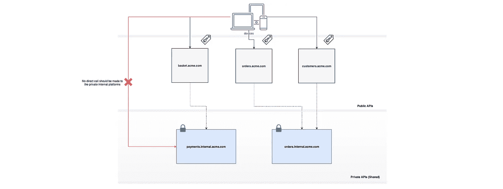
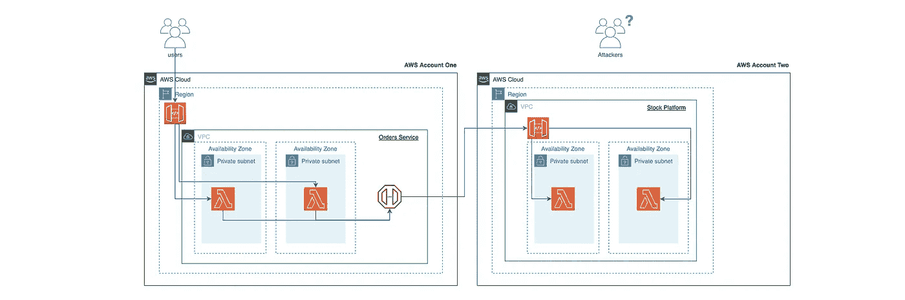
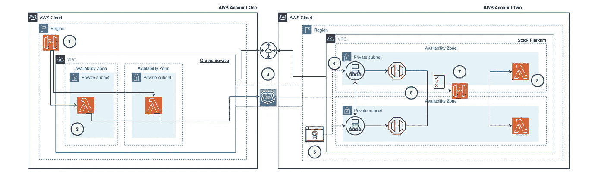
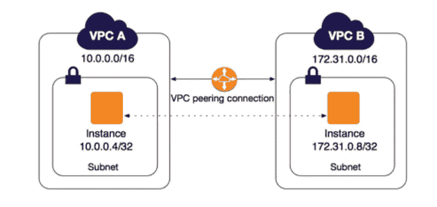
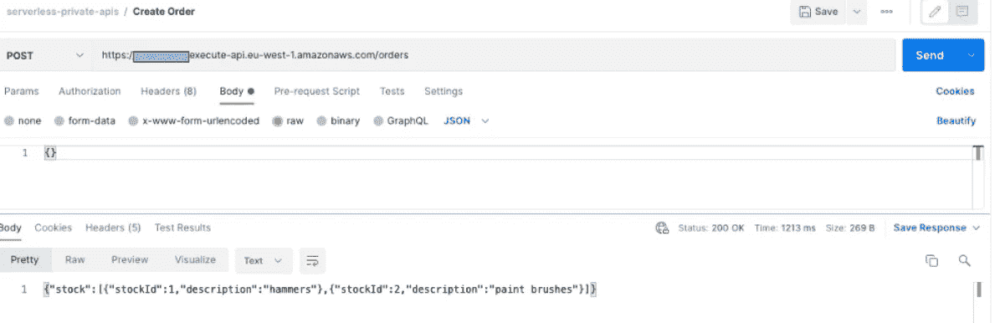

# 无服务器私有 APIs 第 2 部分🚀

> 原文：<https://levelup.gitconnected.com/serverless-private-apis-part-2-91fb9ab0c484>

蒂姆·莫斯霍尔德在 [Unsplash](https://unsplash.com/s/photos/connection?utm_source=unsplash&utm_medium=referral&utm_content=creditCopyText) 上的照片

## 如何允许私有无服务器平台 API 在组织内部使用自定义域名进行安全通信，而无需穿越公共互联网。包括用 TypeScript 和 AWS CDK 编写的视觉效果和代码库。

# 介绍

在这篇文章的第一部分的[中，我们讨论了如何使用 Amazon API Gateway 私有 API 以及 VPC 端点，让两个 VPC(*甚至跨不同的 AWS 帐户*)在内部通信，而不需要流量穿越公共互联网。我们发现这种方法有一些限制，比如**不能为私有 API**添加自定义域名。理想情况下，我们想要的是:](https://leejamesgilmore.medium.com/serverless-private-apis-60749934b161)

我们的理想架构(简化)带有私有 API，不能在公共互联网上访问，但可以通过域名在内部访问

> *💡* ***注*** *:* 现实中并不是所有的调用都是这样同步的，在我看来大多数架构应该是事件驱动优先。也就是说，即使在事件驱动的无服务器架构中，也几乎总是需要同步 API 调用。有关无服务器事件驱动系统的更多信息，请查看以下内容:

 [## 无服务器事件驱动系统🚀

### 您应该如何以及为什么首先使用 Amazon EventBridge 构建事件驱动的无服务器架构…

leejamesgilmore.medium.com](https://leejamesgilmore.medium.com/serverless-event-driven-systems-9617c6406064) 

在这种情况下，我们有一些明确定义的内部定制域，它们只能通过我们的 VPC 访问(*不能在互联网上公开访问，因为它们需要安全*)，并且它们只能由支持移动和 web 前端的 API 访问。

本文讨论了我们如何通过使用特定的架构方法，在 API 网关和自定义域名上使用私有 API 来解决这个限制。(*见第一部分下面的链接*)

 [## 无服务器私有 API🚀

### 如何允许私有无服务器平台 API 在您的组织内部进行安全通信，而无需…

leejamesgilmore.medium.com](https://leejamesgilmore.medium.com/serverless-private-apis-60749934b161) 

本文第二部分的 Github repo 可以在[这里](https://github.com/leegilmorecode/serverless-private-apis-part-2)找到。

# 让我们回顾一下💭

在第一篇文章中，我们构建了如上所述的以下简单架构:

我们在文章的第一部分中构建的示例

这种方法对于某些简单的用例可能是好的，并且在 AWS 内部网络上保持所有流量的私密性和安全性；但是有以下限制:

1.  **您无法使用自定义域名**。这意味着您将不能拥有一个名称为“`stock.internal.acme.co.uk`”的内部私有 API。相反，你需要利用一个自动生成的网址，这不是很好看'`https://{rest-api-id}-{vpce-id}.execute-api.{region}.amazonaws.com/{stage}’`
2.  **自动生成网址**。自动生成的 URL 会在每次需要重新创建堆栈时更改名称，这意味着所有消费者都需要更改他们的目标，当然，也就是说，基于'`https://{rest-api-id}-{vpce-id}.execute-api.{region}.amazonaws.com/{stage}’`
3.  **VPC 端点的使用**。消费 VPC 需要使用 VPC 端点与另一个 VPC 中的私有 API 进行通信。当一个组织中有许多产品和团队时，这并不理想。对于较小的团队和组织来说，这可能是好的。
4.  **DNS 问题**。有各种各样的 DNS 问题可以解决，但并不理想。

# 我们将使用什么服务？🧰

除了在本文第一部分中使用的服务之外，我们还将使用以下 AWS 服务:

> 请随意跳到下一部分“我们在构建什么？”如果您对大多数 AWS 服务感到满意，并且只想看看架构模式。

## ✔️53 号公路私人托管区

一个 [*私有托管区域*](https://docs.aws.amazon.com/Route53/latest/DeveloperGuide/hosted-zones-private.html) 是一个容器，它保存了关于您希望 Amazon Route 53 如何响应您使用 Amazon VPC 服务创建的一个或多个 VPC 内的域及其子域的 DNS 查询的信息。要深入了解 AWS 上的 DNS 和 Route 53，请观看下面的 YouTube 视频:

## 应用程序负载平衡器✔️

[弹性负载平衡](https://docs.aws.amazon.com/elasticloadbalancing/latest/application/introduction.html)在一个或多个可用性区域中，自动将传入流量分布到多个目标，例如 EC2 实例、容器和 *IP 地址*。它监控其注册目标的运行状况，并仅将流量路由到运行状况良好的目标。随着传入流量的不断变化，弹性负载平衡会扩展您的负载平衡器。它可以自动扩展到绝大多数工作负载。要深入了解 ALB 在 AWS 上的表现，请观看下面的 YouTube 视频:

## 证书管理员✔️

AWS 证书管理器是一项服务，可让您轻松提供、管理和部署公共和私有安全套接字层/传输层安全( *SSL/TLS* )证书，以用于 AWS 服务和您的内部连接资源。SSL/TLS 证书用于确保网络通信的安全，并确定互联网上的网站以及专用网络上的资源的身份。要深入了解 AWS 上的证书，请观看下面的 YouTube 视频:

# 我们在建造什么？🏗️

> *💡* ***注意*** *:* 要运行这些示例，您需要两个单独的 AWS 帐户或一个帐户中的两个 VPC。我也不会在本文中讨论 VPC 对等(这将在第 3 部分中讨论)。

下图显示了我们在文章(2)的这一部分中构建的内容，允许我们的域服务通过私有 API 网关与内部自定义域名进行通信，即订单域服务可以调用内部股票域服务，而无需穿越公共互联网:

这就是我们在本文第 2 部分中构建的东西(如下所述)

## 让我们讨论一下图表和相关的代码

1.)在 AWS account one 中，我们有一个面向公众的`Orders` API，为了便于演示，它没有身份验证。

> *💡* ***注意*** *:* 理想情况下，这可以用亚马逊 Cognito 来说明。

2.)API 以两个独立的私有子网/AZ 中的 Lambdas 为目标，这些子网/AZ 随后使用域名`https://stock.{your domain}.co.uk/prod/stock`调用内部股票平台域服务 API。(*注意它也在使用 API 密钥和使用计划*)

3.)我们使用 VPC 对等，并在独立的 AWS 帐户中的 VPC 之间共享 Route 53 专用区域，因此它们可以在 AWS 网络上相互通信。这基本上是两个专用子网之间跨越 AWS 帐户的专用通信路径，以及共享的内部自定义 DNS。

> *💡* ***注*** *:* 我们将在本文的第 3 部分介绍 VPC 对等和路由 53 私有区域关联的设置，这样我们可以继续这个旅程。

4.)在私有托管区域中有一个 [A 记录](https://docs.aws.amazon.com/Route53/latest/DeveloperGuide/ResourceRecordTypes.html#AFormat)，它以第二个 AWS 帐户中的内部应用程序负载平衡器为目标。

5.)ALB 有一个与我们的内部域名相关联的自定义 SSL 证书，该证书也必须与私有股票 API 网关上的相同 SSL 证书相匹配。

💡**注意** *:我们不会在这里讨论如何生成一个自定义证书，我可以想象你的 AWS 账户中已经有了一些可以使用的*。

6.)ALB 使用跨两个 az 部署的 IP 地址将流量路由到我们的 VPC 端点。

7.)VPC 端点将流量路由到私有的`Stock` API 网关，该网关上有一个资源策略，声明只允许流量通过内部应用负载平衡器。我们还在私有 API 上添加了一个资源策略，声明只允许来自 VPC 端点的流量。这保证了整个链条的安全。

💡**注意** *:根据您的需求，您可以使用 VPC 端点策略和安全组进一步限制这一点*。

8.)私有的`Stock` API 网关然后在它自己的 VPC 中调用 Lambdas 来返回股票数据。正如您在下面看到的，在本例中这是存根。

# 部署解决方案！👨‍💻

> *🛑* ***注意*** *:* 运行以下命令将在您的 AWS 账户上产生费用。

让我们在这里部署您可以克隆的基本代码示例:[https://github . com/leegilmorecode/server less-private-APIs-part-2](https://github.com/leegilmorecode/serverless-private-apis-part-2)

> *💡* ***注意:*** 对于我的示例，部署 NPM 脚本使用不同的 AWS 配置文件，因为我们正在部署到两个独立的 AWS 帐户，也就是说，这就是为什么它们不是同一应用程序中的两个独立的 CDK 堆栈(我的配置文件称为默认和测试版)。

1.  在订单服务和库存服务文件夹中运行以下命令:`npm i`
2.  将目录切换到订单服务文件夹并运行`npm run deploy`
3.  将目录切换到库存服务文件夹并运行`npm run deploy`

此时，您需要手动在两个 VPC 之间建立一个 VPC 对等连接，详细信息可以在[这里](https://docs.aws.amazon.com/vpc/latest/peering/create-vpc-peering-connection.html)找到。我将在本文的第 3 部分通过 CDK 介绍这一点，而不是手动介绍，以及它与 [AWS Transit Gateway](https://aws.amazon.com/transit-gateway/) 之间的区别。(*参见下面的 VPC 对等示例*)

[https://docs . AWS . Amazon . com/VPC/latest/peering/what-is-VPC-peering . html](https://docs.aws.amazon.com/vpc/latest/peering/what-is-vpc-peering.html)

> VPC 对等连接是两个 VPC 之间的网络连接，使您能够使用专用 IPv4 地址或 IPv6 地址在它们之间路由流量。任一 VPC 中的实例可以相互通信，就好像它们在同一个网络中一样。

然后，您需要将您的私有托管区域与两个 AWS 帐户相关联，基本步骤在这里定义为。我将在本文的第 3 部分进一步讨论这个问题，但这基本上允许我们在 VPC 订单域中运行对`stock.yourdomain.co.uk`的 DNS 查询，允许它在内部查找和路由流量。

> *💡* ***注意*** :这是允许我们在文章中讨论关键架构点的最小代码和架构，因此这不是生产就绪的，并且不符合编码最佳实践。(例如，在端点上没有认证)。我还尽量不把代码分割得太多，这样所有依赖关系都在一个文件中的示例文件就很容易查看。

# 测试解决方案🎯

一旦部署了解决方案，您可以使用`serverless-private-apis/postman/serverless-private-apis.postman_collection.json`中的 postman 文件来尝试访问 orders 公共端点，该端点本身将在 AWS 网络上私下调用内部股票 API:

示例显示了使用 Postman 的呼叫，股票数据通过自定义域名秘密解析

# 摘要

我希望你觉得有用！希望这给了你一个在你的组织中使用私有 API 和自定义域名的简单方法。对此有更有效的方法吗？如果有，请伸出援手！

请点击此处订阅我的企业无服务器新闻稿，了解更多相同的内容:

 [## 企业无服务器🚀LinkedIn

### Lee Gilmore |面向 AWS 开发人员、DevOps 工程师和云架构师的无服务器新闻和文章

www.linkedin.com](https://www.linkedin.com/newsletters/enterprise-serverless-%F0%9F%9A%80-6875837779876605952/) 

# 包扎👋

请[去我的 YouTube 频道](https://www.youtube.com/channel/UC_Bi6eLsBXpLnNRNnxKQUsA)订阅类似内容！

我很乐意就以下任何一个方面与您联系:

[https://www.linkedin.com/in/lee-james-gilmore/](https://www.linkedin.com/in/lee-james-gilmore/)
https://twitter.com/LeeJamesGilmore

如果你觉得这些文章鼓舞人心或有用，请随时用虚拟咖啡[https://www.buymeacoffee.com/leegilmore](https://www.buymeacoffee.com/leegilmore)来支持我，不管怎样，让我们联系和聊天吧！☕️

如果你喜欢这些帖子，请关注我的简介[李·詹姆斯·吉尔摩](https://medium.com/u/2906c6def240?source=post_page-----39c4f4ae5aff----------------------)以获取更多的帖子/系列，不要忘了联系并问好👋

如果你喜欢，也请使用帖子底部的“鼓掌”功能！(*你可以不止一次鼓掌！！*)

**本文由** [**Sedai.io**](https://www.sedai.io/) 赞助

# 关于我

"*大家好，我是 Lee，英国的 AWS 社区构建者、博客作者、AWS 认证云架构师和首席软件工程师；目前是一名技术云架构师和首席无服务器开发人员，过去 5 年主要从事 AWS 上的全栈 JavaScript 工作。*

*我认为自己是一名无服务器倡导者，热爱 AWS、创新、软件架构和技术。*

*****所提供的信息是我个人的观点，我对这些信息的使用不承担任何责任。*****

您可能还对以下内容感兴趣:

 [## 无服务器战术 DD(R)🚀

### 对于无服务器解决方案，什么是战术性 DD(R)作为非功能性需求的战术方法，以及…

leejamesgilmore.medium.com](https://leejamesgilmore.medium.com/serverless-tactical-dd-r-23d18d529fa1)  [## 无服务器事件驱动系统🚀

### 您应该如何以及为什么首先使用 Amazon EventBridge 构建事件驱动的无服务器架构…

leejamesgilmore.medium.com](https://leejamesgilmore.medium.com/serverless-event-driven-systems-9617c6406064)  [## 无服务器威胁建模🚀

### 您应该如何以及为什么在 AWS 上对您的无服务器解决方案进行威胁建模，并提供真实生活中的可视化示例

leejamesgilmore.medium.com](https://leejamesgilmore.medium.com/serverless-threat-modelling-df8e4028ef6d)  [## 无服务器合成金丝雀🚀

### 使用 CloudWatch 合成金丝雀来监控你的无服务器应用程序的实际例子，有视觉效果和…

leejamesgilmore.medium.com](https://leejamesgilmore.medium.com/serverless-synthetic-canaries-7946dc5216ba)  [## 无服务器 S3 对象 Lambda🚀

### 一个使用 AWS S3 对象 Lambda 的实际例子，使用 Amazon 动态地用元数据给图像加水印…

levelup.gitconnected.com](/serverless-s3-object-lambda-88c923a8a771)  [## 记录您的无服务器解决方案🚀

### 一个生成和托管你的无服务器文档的例子，比如 OpenAPI/Swagger，ADRs 和 code…

levelup.gitconnected.com](/documenting-your-serverless-solutions-509f1928564b)