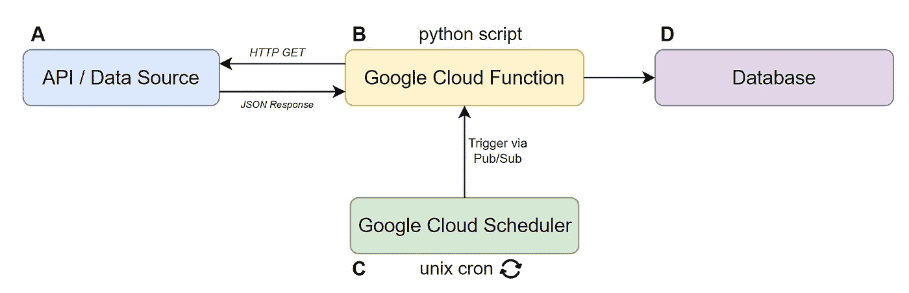
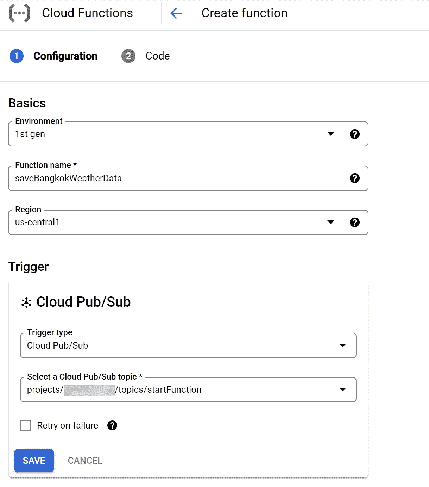
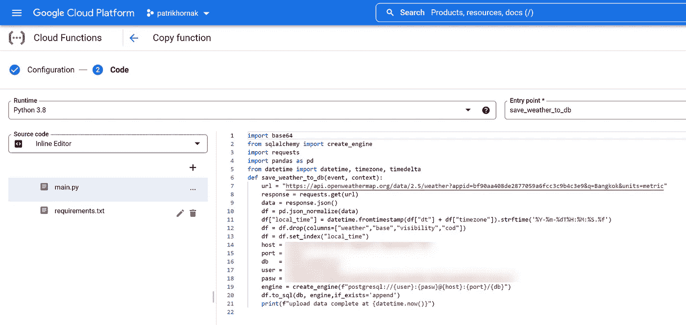
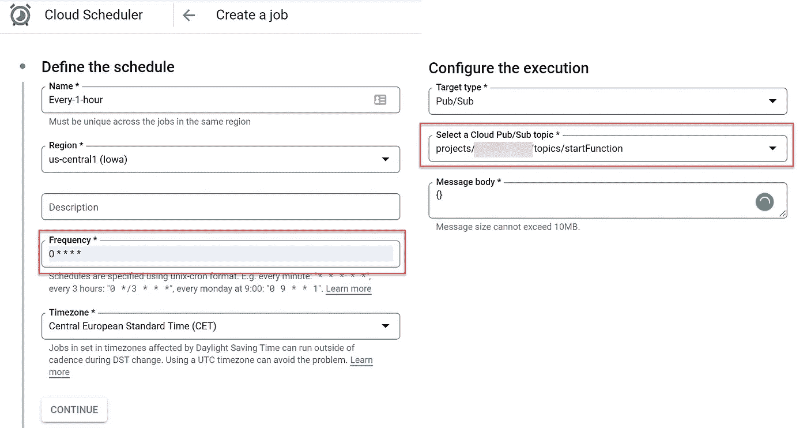
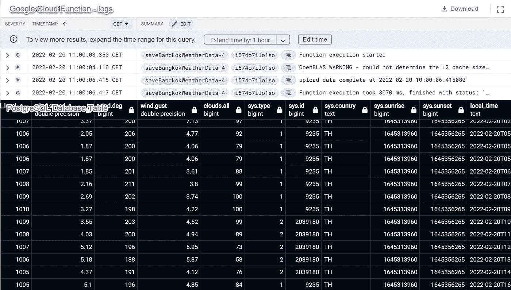

# 使用谷歌云平台的无服务器 Python Bot

> 原文：<https://levelup.gitconnected.com/serverless-python-bot-using-google-cloud-platform-ee724f4a6b1f>

## 分步教程:从 API 到数据库


(插图由[金彩云](https://medium.com/@chaeyunkim)绘制)

使用 Python 脚本作为提取、转换、加载数据的工具已经变得很普遍。为了正确地自动化 Python 脚本并作为“刮刀/机器人”运行，我们需要一种方法让它们在适当的时间自动执行。实现这种自动化的一个简单方法可能是在本地运行，但这意味着你必须一直打开你的电脑。

幸运的是，这不是唯一的方法。本文将向您展示一种使用 Google 平台的无服务器方法，特别是“Google Cloud Function”和“Google Cloud Scheduler”来自动化您的 Python 脚本。

# 循序渐进的教程

## 用例:定期将天气数据存储到数据库中

*了解平均天气数据可以显示模式和趋势，并帮助研究人员弄清楚我们的大气是如何工作的。示例数据包括温度、风速、雨水、湿度和压力。*

## 步骤 0:理解结构

在本例中，开源天气数据将使用无服务器方法保存到数据库中。Python 脚本用于从 OpenWeatherMap API 请求(HTTP GET)数据，然后将其更新到 PostgreSQL 数据库。



A —数据来源: [OpenWeatherMap API](https://home.openweathermap.org/)

B — Python 流程:[谷歌云功能](https://cloud.google.com/functions)

C—作业调度:[谷歌云调度](https://cloud.google.com/scheduler)

D—数据库: [PostgreSQL](https://elements.heroku.com/addons/heroku-postgresql)

## 步骤 1:准备 Python 脚本

我们可以创建一个简单的 Python 脚本，如下例所示。您可以根据您的数据集和数据库凭证进行跟踪和调整。

*   第[5–9]行:将数据从 API 加载到 Dataframe
*   第[11–17]行:连接到数据库
*   行[20]:将数据帧发布到数据库

提示:在进入下一步之前，不要忘记测试您的 Python 脚本。为此，您也可以使用[扳手](https://colab.research.google.com/)。

## 第二步:上传 Python 脚本到谷歌云功能

在将 Python 脚本上传到 Google Cloud 之前，如果你还没有帐户，你必须注册一个帐户。然后，在 API [仪表板](https://console.cloud.google.com/apis/dashboard)创建一个项目并激活云构建/云功能/云调度器 API。之后，前往云[功能](https://console.cloud.google.com/functions)，点击创建功能。选择您认为合适的功能名称和区域。

**触发设置**:这是您的功能被触发运行的方式。大多数教程将显示“HTTP”作为一个例子，但我宁愿推荐 Cloud Pub/Sub，因为我们将安排它在 Google Cloud 中定期运行，稍后我们将使用 Google Cloud Scheduler 来执行此操作。通过选择云发布/订阅，系统将提示您创建或选择主题。如果这是您的第一个功能，只需创建一个新主题。



作者截图

您可以将其他设置保留为默认设置。在下一页，您可以选择运行时为“Python 3.8”或“Python 3.9”。将您的脚本复制并粘贴到 main.py 中，确保您的函数名与入口点名匹配。



在谷歌云功能上部署 Python 脚本(作者)

在“requirements.txt”中输入脚本的所有依赖项。在我们的例子中，这些都是需求:

```
**requests>=2.23.0
pandas>=1.3.5
sqlalchemy>=1.4.31
datetime>=4.4
psycopg2>=2.8.6**
```

点击“部署”后，进入云[功能](https://console.cloud.google.com/functions)列表，您可以看到我们的功能正在显示。等到绿色按钮出现，表示所有依赖项都已安装。单击 action- > test，然后单击 action- > views logs，查看我们的函数是否成功运行，没有出现错误。

此外，您可以查询数据库来检查是否有新数据被更新。

## 第三步:安排你的活动

前往 Google Cloud [Scheduler](https://console.cloud.google.com/cloudscheduler) 使用 Pub/Sub 定期触发您的功能。



**频率**:指定以 Unix-cron 格式运行 python 脚本的频率。你可以使用[https://crontab.guru/](https://crontab.guru/)来帮助构建 cron 频率。

**发布/订阅主题**:选择我们构建云函数时在步骤 2 中创建的主题。

就这样，现在您的 Python 脚本已经准备好并运行在 GCP 的云架构上了！

## 结果



## 未来改进

这个例子只是为了展示如何使用谷歌云功能的整体过程，还有待改进的地方，如

*   在第二步中，您可以添加数据库凭证作为环境变量。
*   在 Python 中通过请求加载数据之后，建议在将数据存储到数据库之前进行数据清理。
*   必须打开数据库端口，Google Cloud 功能才能访问。您可能需要为云功能应用静态 IP 来提高数据库安全性。

## 成本呢？

根据 [GCP](https://cloud.google.com/pubsub/pricing#pubsub-pricing) 的说法，云功能为计算时间资源提供了一个永久的免费层，其中包括 GB 秒和 GHz 秒的分配。除了 200 万次调用之外，免费层每月还提供 400，000 GB 秒、200，000 GHz 秒的计算时间和 5GB 的互联网出口流量。我们今天的例子是一个非常简单的过程，当然没有成本。

## **另类？**

是的，有几个选项，我之前已经详细介绍过了。

*   使用 [AWS Lambda](https://towardsdatascience.com/serverless-covid-19-data-scraper-with-python-and-aws-lambda-d6789a551b78) 运行你的 python 机器人。

[](https://towardsdatascience.com/serverless-covid-19-data-scraper-with-python-and-aws-lambda-d6789a551b78) [## 使用 Python 和 AWS Lambda 的无服务器新冠肺炎数据刮刀

### 分步教程:使用 AWS Lambda 调度 Python 脚本

towardsdatascience.com](https://towardsdatascience.com/serverless-covid-19-data-scraper-with-python-and-aws-lambda-d6789a551b78) 

*   从 Oracle Cloud 获得一个免费的 VPS，并在您的服务器上定期运行 [Python Bot。](https://towardsdatascience.com/automate-your-python-script-with-pm2-463238ea0b65)

[](https://towardsdatascience.com/automate-your-python-script-with-pm2-463238ea0b65) [## 用 PM2 自动化你的 Python 脚本

### 以新冠肺炎数据收集为例的分步指南

towardsdatascience.com](https://towardsdatascience.com/automate-your-python-script-with-pm2-463238ea0b65) [](/a-powerful-server-from-oracle-cloud-always-free-cbc73d9fbfee) [## 来自 Oracle Cloud 的强大服务器—永远免费

### 4 个 CPUs | 24 GB 内存🚀

levelup.gitconnected.com](/a-powerful-server-from-oracle-cloud-always-free-cbc73d9fbfee) 

我希望你喜欢这篇文章，并发现它对你的日常工作或项目有用。如果你有任何问题，请随时联系我。

*喜欢这篇文章吗？成为* [*中等会员*](https://medium.com/@joets/membership) *继续无限制学习。如果你使用下面的链接，我会收到你的一部分会员费，不需要你额外付费。*

[](https://medium.com/@joets/membership) [## 通过我的推荐链接加入 Medium-Joe t . Santhanavanich

### 作为一个媒体会员，你的会员费的一部分会给你阅读的作家，你可以完全接触到每一个故事…

medium.com](https://medium.com/@joets/membership)