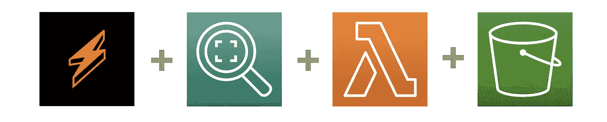
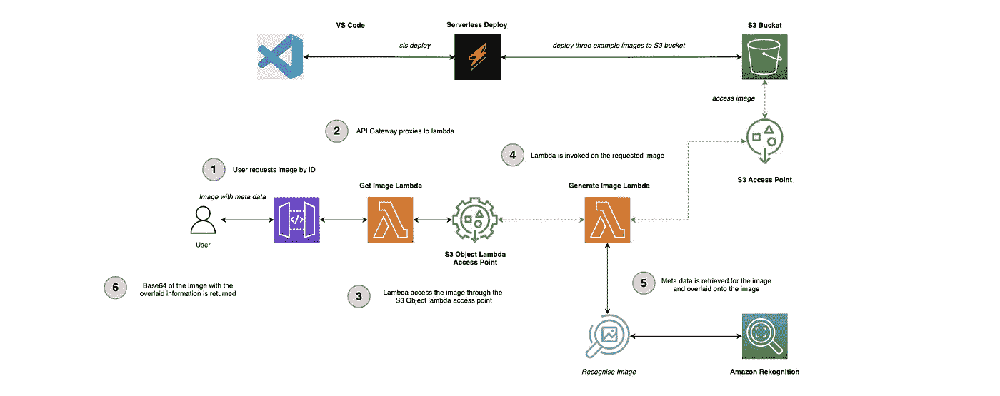
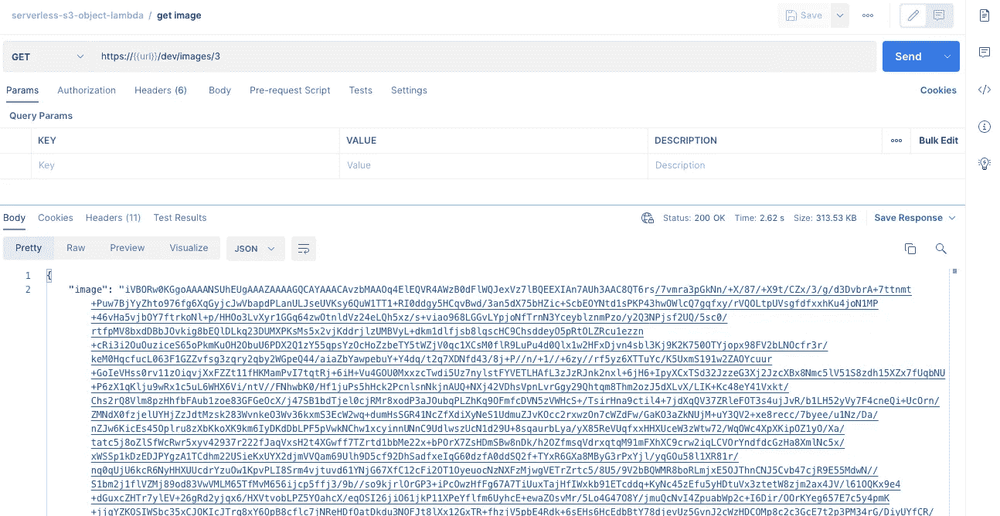
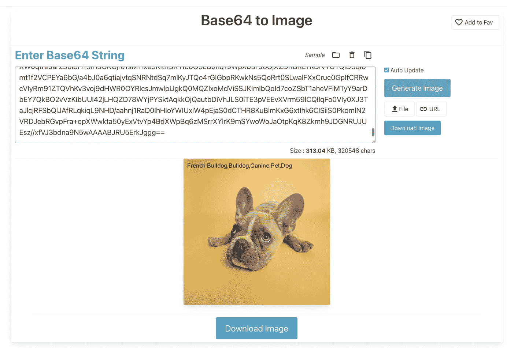

# 无服务器 S3 对象 Lambda🚀

> 原文：<https://levelup.gitconnected.com/serverless-s3-object-lambda-88c923a8a771>

布莱恩·加尔塞斯在 [Unsplash](https://unsplash.com/s/photos/patterns?utm_source=unsplash&utm_medium=referral&utm_content=creditCopyText) 上的照片

## 一个使用 AWS S3 对象 Lambda 的实际例子，使用 Amazon Rekognition、AI 和机器学习(包括用 TypeScript 和无服务器框架编写的代码报告)和视觉效果，动态地用元数据给图像添加水印。

# 介绍

下面的文章展示了[亚马逊 S3 对象 Lambda](https://aws.amazon.com/blogs/aws/introducing-amazon-s3-object-lambda-use-your-code-to-process-data-as-it-is-being-retrieved-from-s3/) 的一个示例用例，使用 AI/ML 从[亚马逊重新认知](https://aws.amazon.com/rekognition/)中产生的元数据动态地给图像添加水印。

你可以在这里访问[代码报告，为了清楚起见，这里有详细的注释。](https://github.com/leegilmorecode/serverless-s3-object-lambda)

> *💡*请注意，这是演示动态使用水印图像的最小代码和架构，因此这不是生产就绪，也不符合编码最佳实践*。*

# 我们在建造什么？🏗️

下图显示了我们在回购中构建的架构:

**架构步骤为:**

1.  用户通过 ID ( *1、2 或 3* )通过 [API 网关](https://aws.amazon.com/api-gateway/) API 请求图像。
2.  API 网关调用*获取图像λ*。
3.  lambda 使用 S3 对象 Lambda 访问点访问相关图像。
4.  当自动请求图像时，调用*生成图像λ*。
5.  在生成图像 lambda 的情况下，lambda 使用内部预签名的 URL 下拉现有的图像，用图像调用 Amazon Rekognition，然后根据从 Amazon Rekognition 返回的标签在图像上生成水印。
6.  在响应中，更新图像的 base64 通过 API Gateway 返回给用户。

> **注意**:我们使用 serverless-s3-sync 插件在 serverless deploy 上自动部署了三个测试映像，即 using、using 和 using，因此您可以直接部署和使用 API..

# 前后的图像是什么样的？🧑‍🦲🧔

以下是 S3 存储桶中的图像示例，以及通过 S3 对象 Lambda 访问点使用 Get Object 命令请求图像后的图像:

从上面的图片可以看出，我们使用 Amazon Rekognition 通过 AI/ML 运行图片，提取相关的图片标签，并在图片被请求时将它们覆盖在图片上。

> 在“assets”文件夹中，随意替换为您自己的名为“1.png”、“2.png”和“3.png”的测试图像，看看它们是如何生成的

# 我们在使用什么服务？💭

在本教程中，我们将使用以下服务，这些服务将在下面详细介绍:

## AWS S3 对象 Lambda

S3 对象 Lambda 允许我们在从桶中请求图像副本时对其进行操作。在我们的场景中，这是用元数据给图像加水印，但我们也可以选择对对象做其他事情，比如编辑 PII 或返回不同大小的图像。

> 您可以使用自定义代码修改标准 S3 GET 请求返回的数据，以过滤行、动态调整图像大小、编辑机密数据等

S3 对象 Lambda 概述

S3 对象 Lambda 与您现有的应用程序一起工作，并使用 [AWS Lambda](https://aws.amazon.com/lambda/) 函数自动处理和转换从 S3 检索的数据。Lambda 函数是用标准的 [S3 GET 请求](https://docs.aws.amazon.com/AmazonS3/latest/API/API_GetObject.html)内联调用的，所以你不需要改变你的应用程序代码。

通过这种方式，您可以轻松地呈现来自同一个数据集的多个视图，并且可以随时更新 Lambda 函数来修改这些视图。

## 亚马逊认可

我们使用 Amazon Rekognition 来自动识别关于我们传递给它的图像的元数据(*标签*),它使用 AI/ML。在上面的示例图像中，我们传递给它一张牛头犬的图片，并获取元数据"*法国牛头犬，牛头犬，犬科动物，宠物，狗*"。

> “使用 Amazon Rekognition，您可以识别图像和视频中的对象、人物、文本、场景和活动，并检测任何不适当的内容”

什么是亚马逊 Rekognition？

Amazon Rekognition 使用成熟的、高度可扩展的深度学习技术，无需使用机器学习专业知识，就可以轻松地将图像和视频分析添加到您的应用程序中。通过 Amazon Rekognition，您可以识别图像和视频中的对象、人物、文本、场景和活动，并检测任何不适当的内容。Amazon Rekognition 还提供高度精确的面部分析和面部搜索功能，您可以使用这些功能来检测、分析和比较面部，以用于各种用户验证、人数统计和公共安全用例。

# 部署解决方案！👨‍💻

> *🛑* ***注意*** *:* 运行以下命令将在您的 AWS 帐户上产生费用，因此相应地更改配置*。*

在文件夹的根目录下运行`npm i`，然后运行`npm run deploy:develop`，这将安装所有的依赖项，然后部署到 AWS。

# 测试 API！🎯

现在，您可以使用`./postman folder`中的 [Postman 文件](https://learning.postman.com/docs/getting-started/importing-and-exporting-data/)来测试端点，并点击“ *Get Image* ”请求，对 image ID 使用 1、2 或 3(*，如下图*所示):

这将返回已处理图像的 base64 字符串，您可以通过将返回的' *image* '属性值复制到以下网站来查看:[https://codebeautify.org/base64-to-image-converter](https://codebeautify.org/base64-to-image-converter)

使用[https://codebeautify.org/base64-to-image-converter](https://codebeautify.org/base64-to-image-converter)网站输出图像的示例

# 包扎👋

**我希望您发现这是一个用自己的无服务器解决方案动态操作图像的简单示例！你现在可以尽情发挥你的想象力，操纵任何从 S3 返回的物品！**

我很乐意就以下任何一个问题与您联系:

[https://www.linkedin.com/in/lee-james-gilmore/](https://www.linkedin.com/in/lee-james-gilmore/)https://twitter.com/LeeJamesGilmore

如果你觉得这些文章鼓舞人心或有用，请随时用虚拟咖啡[https://www.buymeacoffee.com/leegilmore](https://www.buymeacoffee.com/leegilmore)来支持我，不管怎样，让我们联系和聊天吧！☕️

如果你喜欢这些帖子，请关注我的简介[李·詹姆斯·吉尔摩](https://medium.com/u/2906c6def240?source=post_page-----39c4f4ae5aff----------------------)以获取更多的帖子/系列，别忘了联系我并打招呼👋

如果你喜欢，也请使用帖子底部的“鼓掌”功能！( ***可以不止一次鼓掌！！*** )

**本文由**[**sedai . io**](https://www.sedai.io/)赞助

如果您喜欢这篇文章，您可能也会喜欢以下内容:

 [## 无服务器 API 到 API 认证🚀

### 使用 OAuth2 客户端凭证使用 Amazon Cognito 验证 API 到 API 集成的实用指南…

levelup.gitconnected.com](/serverless-api-to-api-authentication-d4cb4472721e)  [## 记录您的无服务器解决方案🚀

### 一个生成和托管你的无服务器文档的例子，比如 OpenAPI/Swagger，ADRs 和 code…

levelup.gitconnected.com](/documenting-your-serverless-solutions-509f1928564b)  [## 您的无服务器客户是高兴还是难过？🚀

### 使用 AWS 的理解来理解你的客户内容的情绪的例子，同时也编辑 PII，与…

levelup.gitconnected.com](/are-your-serverless-customers-happy-or-sad-32f904ede5ff)  [## 无服务器 S3 预签名网址🚀

### 一个在您的无服务器解决方案中使用 AWS S3 预签名 URL 的实例，以及支持代码示例…

levelup.gitconnected.com](/serverless-s3-pre-signed-urls-e52eebad8d2d)  [## 无服务器 Lambda 存储选项🚀

### 使用 Lambda 临时存储的实际示例，S3 和 EFS 作为比较，利用无服务器框架…

levelup.gitconnected.com](/serverless-lambda-storage-options-6c483d1fa990) 

# 关于我

"*大家好，我是 Lee，英国的 AWS 认证技术架构师和首席软件工程师，目前是技术云架构师和首席无服务器开发人员，过去 5 年主要从事 AWS 上的全栈 JavaScript 工作。*

*我认为自己是一个无服务器布道者，热爱 AWS、创新、软件架构和技术。*

****提供的信息是我个人的观点，我对信息的使用不承担任何责任。*****