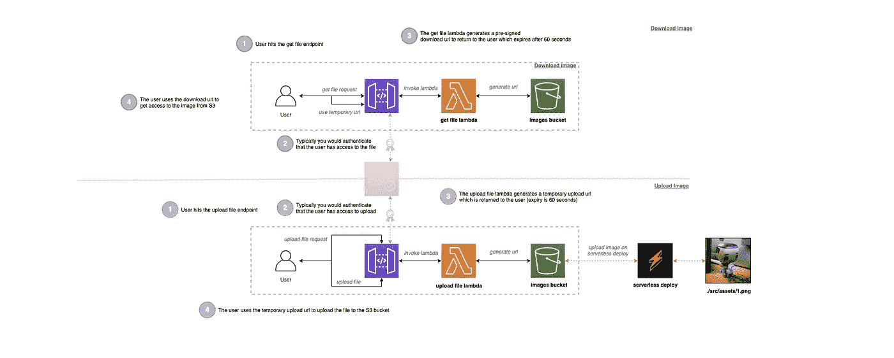
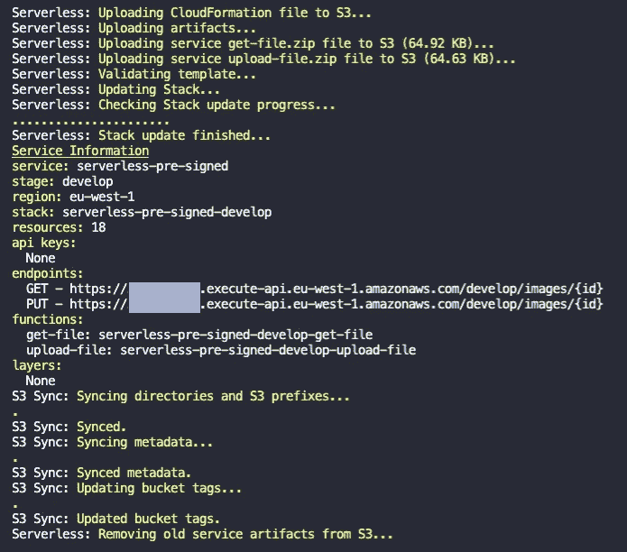
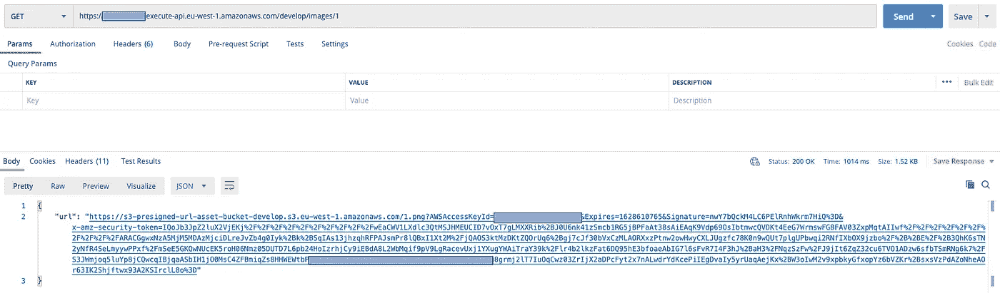
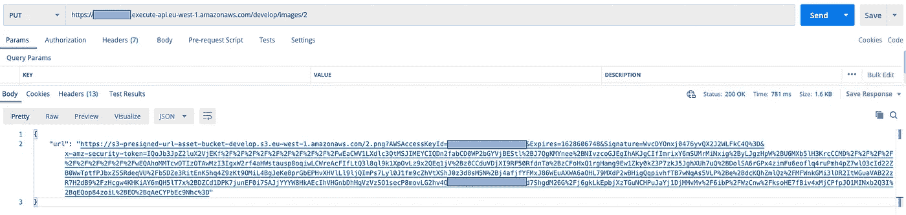
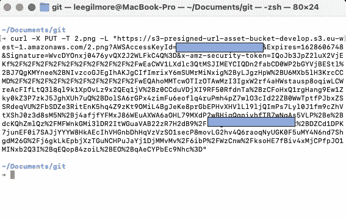
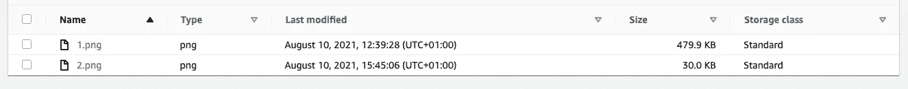

# 无服务器 AWS S3 预签名网址🚀

> 原文：<https://levelup.gitconnected.com/serverless-s3-pre-signed-urls-e52eebad8d2d>


由[克里斯蒂安·斯特克](https://unsplash.com/@christiansterk?utm_source=unsplash&utm_medium=referral&utm_content=creditCopyText)在 [Unsplash](https://unsplash.com/s/photos/smoke?utm_source=unsplash&utm_medium=referral&utm_content=creditCopyText) 上拍摄的照片

## 通过使用无服务器框架和 TypeScript，在您的无服务器解决方案中使用 AWS S3 预签名 URL 的实际示例以及支持代码示例和图表。


# 介绍

在 AWS 上构建解决方案时，您经常需要授予用户临时访问权限，以便向您的系统下载或上传他们私有的文件。

例如，员工下载他们的工资单，将你的银行对账单上传给抵押贷款经纪人，或者下载你付费的内容，比如课程内容。

本文讨论了如何使用 AWS S3 预签名 URL 来满足上述要求，同时通过使私有资源的 URL 快速过期来确保我们减少恶意行为者访问资源的机会。

> “您实际上是在授予用户对您的私有资源的临时访问权限，而不需要他们拥有 AWS 安全凭据或权限。”

你可以在这里访问[代码报告，为了清晰起见，这里有详细的注释。](https://github.com/leegilmorecode/serverless-pre-signed-urls)

> *💡*请注意，这是演示在 AWS S3 中使用预签名 URL 的最基本的代码和架构，因此这不是生产就绪，也不符合编码最佳实践。

## 什么是预签名的 URL？

我们在这个演示中使用了两个独立的 AWS S3 预签名 URL 操作，`putObject`和`getObject`。您可能已经猜到，putObject 用于上传文件，getObject 用于下载文件。

> **"** 默认情况下，所有对象和桶都是私有的。但是，您可以使用预先签名的 URL 来选择性地共享对象，或者使您的客户/用户能够在没有 AWS 安全凭证或权限的情况下将对象上传到存储桶。**"**—[https://docs . AWS . Amazon . com/Amazon S3/latest/user guide/using-pre signed-URL . html](https://docs.aws.amazon.com/AmazonS3/latest/userguide/using-presigned-url.html)

正如您从代码回购中看到的，我们使用`aws-sdk`来获得使用`AWS.S3.getSignedUrl`方法的临时 URL，该方法在几秒钟内就可以获得动作(`getObject`和`putObject`)，以及`bucket`名称、`key`(文件名)和`expiry`。

## 我们在建造什么？

下图显示了我们在回购中构建的架构:



我们正在建造的建筑范例

> *💡*当我们说预签名的 url“返回给用户”时，这通常是一个前端客户端或后端服务，如 React 前端，因此用户不知道这种 URL 交换的发生，即它全部在代码中完成。

## 获取文件端点

获取文件端点通过以下方式工作:

1.  用户点击特定图像 ID 的获取文件端点，该图像 ID 存储在 S3 的私有存储桶中，即他们不能访问它。
2.  API Gateway 调用一个 lambda，它为私有桶中的图像生成一个预签名的下载 URL。
3.  在响应中将临时预签名 URL 返回给用户。
4.  在链接过期之前，用户使用该 URL 下载图像内容。

> *💡*为了演示的简单，示例代码只适用于 PNG 图像，因此我们不需要使用其他服务(如 DynamoDB)来存储文件密钥。

## 上传文件端点

上传文件端点通过以下方式工作:

1.  用户点击上传文件端点以请求将特定图像上传到私有 S3 桶。
2.  API Gateway 调用一个 lambda，它为私有 bucket 生成一个预先签名的上传 URL。
3.  在响应中将临时预签名 URL 返回给用户。
4.  在链接过期之前，用户使用 URL 将图像内容上传到私有桶。

> *💡*在一个真实的例子中，您将在两个公共端点上进行身份验证，这确保用户有权请求预签名的 URL。这可能是使用 Amazon Cognito 的认证，以及检查 DynamoDB 数据库，该人是相关组的一部分，例如*。*

# 部署解决方案！👨‍💻

🛑 ***注意*** *:* 运行以下命令将在您的 AWS 帐户上产生费用，因此相应地更改配置*。*

在文件夹的根目录下运行`npm i`，然后运行`npm run deploy:develop`，这将安装所有的依赖项，然后部署到 AWS。

> *💡作为部署的一部分，我们使用了 [serverless-s3-sync](https://www.serverless.com/plugins/serverless-s3-sync) 插件，它会自动将本地文件夹中的任何文件推送到 s3。在我们的示例 repo 中，这会将“1.png”文件推送到 S3 存储桶，因此我们可以直接使用 get 端点！这方面的代码如下所示:*

```
custom:
   s3Sync:
      - bucketName: ${self:custom.bucketName}
        localDir: src/assets
        acl: private
```

无服务器部署将使用[无服务器框架](https://www.serverless.com/)为您生成资源，即 API、计算层和 s3 存储桶。如果成功，您将看到与此类似的输出:



运行成功部署的结果示例

> *💡*记下主 API url，因为在使用 Postman 文件测试端点时，您将在下一部分需要它。

# 测试 API！🎯

以下部分描述了下载和上传图像。

## 测试图像下载⬇️

您可以使用`./postman folder`中的 [Postman 文件](https://learning.postman.com/docs/getting-started/importing-and-exporting-data/)来测试图像的下载，并使用`1`的`ID`点击“*获取图像下载 URL* ”请求:



来自获取图像端点的示例响应

现在，您可以从响应中的'`url`'属性复制预先签名的 url，并在浏览器中打开它，这应该会下载图像，如下所示。


1.png 图像下载示例

> “是的，我桌上有一张堡垒之夜‘Giddy Up’Funko 流行音乐收藏品的图片..我在苦苦寻找灵感***😜***

## **测试图像上传⬆️**

**您可以通过使用`./postman folder`中的 [Postman 文件](https://learning.postman.com/docs/getting-started/importing-and-exporting-data/)，点击“*上传图片 URL* ”请求来测试图片的上传:**

****

**点击上传端点的响应示例**

**现在，在您的终端中使用以下 curl 命令的响应中的`url`属性(*预先签名的上传 URL*)(*确保在您从*运行命令的同一个目录中有一个名为 2.png 的图像)**

```
curl -X PUT -T 2.png -L "<the pre-signed upload url>"
```

**您将看到类似于以下内容的响应:**

****

**curl 命令的响应示例**

**如果您现在登录 AWS 控制台并转到 S3 存储桶，您将看到上传的图像:**

****

**该图像显示了使用预先签名的上传 URL 上传的“2.png”图像**

**现在，您可以使用原始的获取图像 URL 下载您刚刚上传的图像，使用正确的密钥，即上面示例中的图像 ID 2。**

## **关于 URL 有什么安全考虑吗？**

**需要注意的一点是，一旦使用了 url，它仍然是活动的，不会过期，因此恶意用户在链接过期之前仍然可以访问它。这是保持 url 短寿命的一个原因，实际上，根据我的经验，当代码使用返回的 URL 时，这通常是生产中的一秒钟。**

# **包扎**

**我希望作为 S3 预签名 URL 的一个简单例子，以及当你可能在自己的解决方案中使用它们时，你会发现这很有用。**

**我很乐意就以下任何一个问题与您联系:**

**[https://www.linkedin.com/in/lee-james-gilmore/](https://www.linkedin.com/in/lee-james-gilmore/)
https://twitter.com/LeeJamesGilmore**

**如果你觉得这些文章鼓舞人心或有用，请随时用虚拟咖啡[https://www.buymeacoffee.com/leegilmore](https://www.buymeacoffee.com/leegilmore)来支持我，不管怎样，让我们联系和聊天吧！☕️**

**如果你喜欢这些帖子，请关注我的简介[李·詹姆斯·吉尔摩](https://medium.com/u/2906c6def240?source=post_page-----39c4f4ae5aff----------------------)以获取更多的帖子/系列，不要忘记联系我并打招呼👋**

**如果你喜欢，也请使用帖子底部的“鼓掌”功能！( ***可以不止一次鼓掌！！*** )**

****本文由**[**sedai . io**](https://www.sedai.io/)赞助**

****

# **关于我**

**"*大家好，我是 Lee，英国的 AWS 认证技术架构师和首席软件工程师，目前担任技术云架构师和首席无服务器开发人员，过去 5 年主要从事 AWS 上的全栈 JavaScript 工作。***

***我认为自己是一个无服务器布道者，热爱 AWS、创新、软件架构和技术。*”**

******所提供的信息是我个人的观点，我对这些信息的使用不承担任何责任。*******