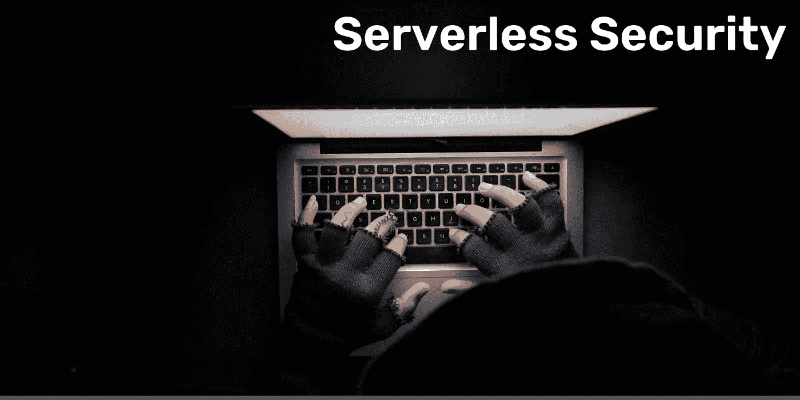
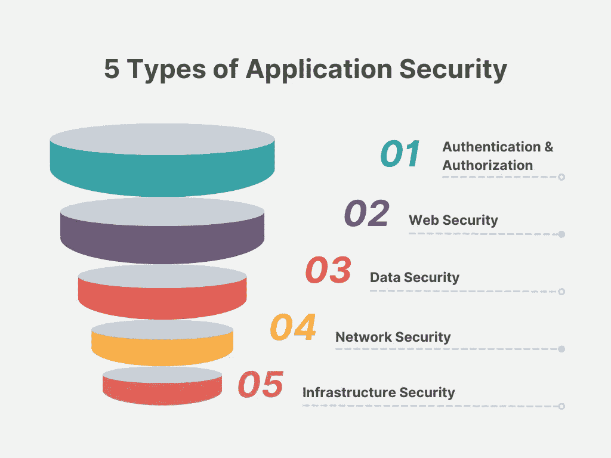

# 无服务器安全和十大无服务器攻击

> 原文：<https://levelup.gitconnected.com/serverless-security-and-top-10-serverless-attacks-316b8fff2d2a>

AWS 应用程序安全性的大多数最佳实践建议打开 WAF、API 网关认证、节流限制、lambda 并发、cloudwatch 警报、全面日志记录等。在我关于[解决方案架构](https://medium.com/gitconnected/10-attributes-of-solution-architecture-8d67075a5bc5)的 10 个属性的文章中，我简要介绍了以下 5 种类型的应用安全性:

应用程序安全类型

传统的 AWS 安全和/或七层安全应用的最佳实践是不够的，在某些情况下，不适用于无服务器。

> 也许在你的云环境中最不安全的 T2 计算服务是你的无服务器功能，不是因为 AWS，而是因为代码易受 T4 影响。

本文将讨论无服务器应用程序安全性所需的思维转变。它还将谈到风险以及如何应对这些风险。

问自己两个问题:

*   为什么传统的应用安全解决方案不合适？
*   测试和保护无服务器应用程序的挑战？

## 无服务器应用程序必须采取的 6 项安全措施

*   阻止恶意事件输入— **API 网关集成请求**
*   检测和防止恶意行为— **WAF、Auth、CORS 等**
*   始终清理用户输入— **AWS Lambda**
*   最低特权和最不灵活— **Lambda 角色**
*   知道你何时受到攻击— **化学武器警报(何时)，x 光(谁)**
*   了解您的安全状况— **仪表盘、指标、行动**

> 无服务器架构是“事件驱动的”。这意味着它们可以被许多具有多种格式和编码的不同来源触发，绕过 WAFs 提供的保护，并向不同类型的攻击开放——在[事件注入](https://www.jeremydaly.com/event-injection-protecting-your-serverless-applications/)中[杰瑞米·戴利](https://twitter.com/jeremy_daly)

# 无服务器架构安全性(SAS)

理论说够了；让我们继续讨论细节。当我在寻找不同于 WAFs、wsg 等传统应用问题的独特用例时。我见过的最有希望的文档是[无服务器山羊](https://github.com/OWASP/Serverless-Goat/blob/master/LESSONS.md)和 [Puresec 的 SAS top 10](https://github.com/puresec/sas-top-10) 攻击缓解指南。

Puresec 的文档还包括减轻这些威胁的建议。由于实际的限制，您无法实现指南中的所有内容，但是我希望在以后的文章中描述我在工作负载中实现的内容。

> 请记住，无论您处于无服务器之旅的哪个阶段，都不能忽视 SAS-1、SAS-2、SAS-3 和 SAS-4。

该列表按照 SAS-1 至 10 的重要程度排列，其中 SAS-1 表示最重要的风险，SAS-10 表示最不重要的风险。

**SAS-1** :函数事件数据注入
**SAS-2** :断认证
**SAS-3** :不安全的无服务器部署配置
**SAS-4** :超特权函数权限&角色
**SAS-5** :功能监控和日志记录不足
**SAS-6** :不安全的第三方依赖
**SAS-7** :不安全的应用

## 奖金

AWS 在《再发明 2022》中强调了这两种对无服务器功能的攻击。我没有机会深入了解细节，但我在此分享，以供将来参考:

*   参数篡改攻击
*   XSS 对 API 网关 VTL 攻击

## 参考

[https://www . Jeremy Daly . com/securing-server less-a-newbies-guide/](https://www.jeremydaly.com/securing-serverless-a-newbies-guide/)

 [## GitHub - puresec/sas-top-10:无服务器架构安全性十大指南

### “无服务器架构十大安全”文档旨在作为安全意识和教育指南…

github.com](https://github.com/puresec/sas-top-10)