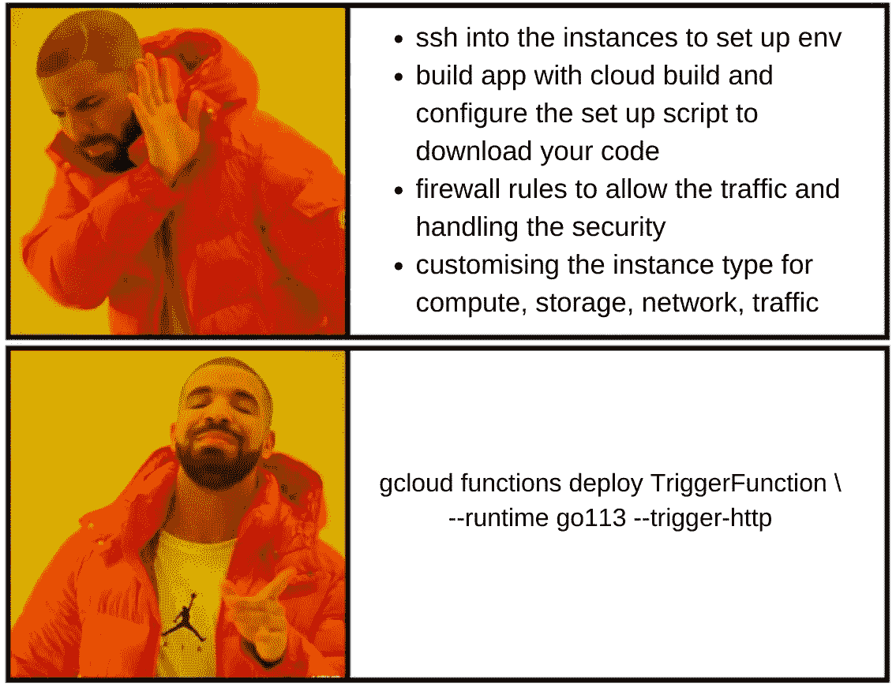
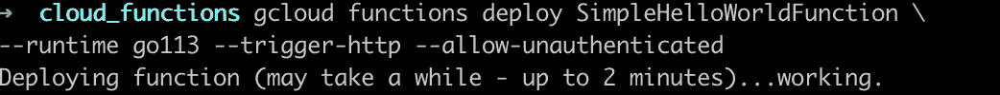

# 无服务器，装在盘子里

> 原文：<https://levelup.gitconnected.com/serverless-served-on-a-plate-93af93afbe49>

## 使用 GCP 云功能部署您的第一个无服务器功能，然后开始


照片由 [Hisu lee](https://unsplash.com/@lee_hisu?utm_source=unsplash&utm_medium=referral&utm_content=creditCopyText) 在 [Unsplash](https://unsplash.com/s/photos/plate?utm_source=unsplash&utm_medium=referral&utm_content=creditCopyText) 上拍摄

随着 2015 年 AWS Lambda 的推出，无服务器计算的概念在云服务中获得了很大的动力。GCP 的专家坚持认为，GCP 在 2008 年的 App Engine 上遥遥领先，它本质上也是无服务器的。
关于是否使用无服务器架构以及使用哪家云提供商的无服务器架构的争议很多，并且很大程度上取决于使用案例。

然而，云专家一致同意的一点是，无服务器是 swift 在云上的最佳方式。而且，从个人经验来看，没有什么比 GCP 的云功能更直观、更简单的方式来开始构建伟大的周末项目和 MVP 了。

这是我为你服务的机会。:)

# 那么，什么是无服务器？

本质上就是，运行代码而不配置服务器。

**这是什么意思？**

*   无需设置任何虚拟机(如 EC2 或计算引擎)。服务器在幕后，但是云平台会处理它
*   服务器会在需要时自动启动和停止
*   费用是基于函数被调用的次数。只需为您拨打的服务付费
*   无服务器应用根据流量自动扩展
*   GCP 云函数提供多语言支持，可以用 [Node.js](https://nodejs.org/) 、 [Python](https://python.org/) 、 [Go](https://golang.org/) 、 [Java](https://www.java.com/) 、[编写。NET](https://dotnet.microsoft.com/languages) 、 [Ruby](https://www.ruby-lang.org/en/) 和 [PHP](https://www.php.net/) 编程语言，并在特定于语言的运行时中执行

# 为什么是无服务器？

供应服务器可能是一件痛苦的事情，尤其是当您只想在云中运行一个简单的功能时。



如果我们将一个完整的应用程序部署到云上，那么配置和供应服务器是有意义的，但是如果我们只是在云上运行一个简单的功能，那么这是一件非常费力的事情。甚至将一个应用部署到一个计算引擎也需要[大量的工作](https://cloud.google.com/go/getting-started/getting-started-on-compute-engine)。

说到这里，让我们明确一下为什么无服务器并不总是最好的解决方案。

# 无服务器的局限性

*   不适用于长时间运行的流程:云函数的超时时间为 9 分钟，Lambda 的超时时间为 15 分钟，这是云函数/Lambda 允许函数运行的时间
*   可能会影响性能:它们有冷启动(函数调用的开销)，这意味着 it 需要时间来配置和启动服务器、复制代码和运行函数。
*   应用程序大小限制:对于源文件，100MB(压缩)和 500MB(未压缩)
*   调试可能很困难，因为无法看到其他后端进程

# 什么是 GCP？你为什么要从 GCP 开始？

谷歌云平台(GCP)和 AWS 一样，都是云平台服务提供商。

*   GCP 对初学者更友好，对开发者也更友好。
*   更少的登机时间，更直观。
*   此外，它对围棋也有很多支持。
*   GCP 服务都非常简单，尽管配置性稍差

# 谷歌云功能——运行在云上的功能

*使用云函数，你可以编写简单的、单一用途的函数来响应云事件，而无需管理服务器或运行时环境。您的代码在完全托管的环境中执行。*

云函数只会对函数执行过程中消耗的资源进行计费。云函数通常用于执行由事件触发的活动。此外，它还可以触发其他服务。

# 基于触发器的云函数类型

## HTTP 函数

从标准 HTTP 请求中调用 HTTP 函数。

## 事件驱动函数

这些是通过触发函数的事件间接调用的，比如发布/订阅主题上的消息，或者云存储桶中的变化。

# 云功能的使用案例

云功能最常见的使用案例有:

*   **处理文件上传:**对用户上传的任何文件进行分析/压缩，然后保存
*   **点播视频分析:**使用 GCP 的 ML APIs 分析用户上传的视频内容

# 为云函数构建您的 Go 代码


由[万花筒](https://unsplash.com/@kaleidico?utm_source=medium&utm_medium=referral)在 [Unsplash](https://unsplash.com?utm_source=medium&utm_medium=referral) 上拍摄的照片

云函数定义了自己的`**package main**`来导入和运行你的函数。为了让云函数找到你的函数定义，每个运行时对你的源代码都有[结构化要求](https://cloud.google.com/functions/docs/writing#functions-writing-file-structuring-go)。对于 Golang 来说，

> 函数应该位于目录的根目录。它不应该在主包中。
> 
> 如果包被导入，那么`**go.mod**`需要在目录中
> 
> 目录中可以有子包
> 
> 您的源代码必须包含已经在您的部署中正确指定的入口点函数，通过[云控制台](https://cloud.google.com/functions/docs/deploying/console)或[云 SDK](https://cloud.google.com/functions/docs/deploying/filesystem)

```
.
├── function.go
├── go.mod
└── shared/
    └── shared.go
```

有关所有故障排除，请参考[https://cloud . Google . com/functions/docs/trouble shooting # cloud-SDK](https://cloud.google.com/functions/docs/troubleshooting#cloud-sdk)

# GCP 入门-先决条件

*   创建一个 Google 云平台帐户，并提供您的付款详情。
*   GCP 服务在前 90 天是免费的；此后，除非您明确要求，否则您的信用卡/借记卡将不会被扣款。GCP 免费试用三个月；因此，提供付款细节和帐单将被生成
*   首先，登录你的谷歌账户，导航到 GCP 平台。制作一个项目，选择它，并为它打开计费。
*   启用 gcloud functions api 和 gcloud build api，它们用于创建应用并将其部署到云。

# 内联模板化函数入门

1.  转到[云函数](https://console.cloud.google.com/functions/list)并点击*创建函数*
2.  给出一个函数名并选择一个区域，将 trigger 设置为 HTTP 并选择*允许未认证调用*
3.  选择您选择的运行时，选择*内联编辑器，然后*点击*部署*。如果它要求您启用云部署 api，请继续启用它。(如果部署不起作用，则启用云部署并转到云功能中的编辑，然后重试)
4.  部署后，选择功能，我们可以看到指标，来源，触发器，日志，测试。去触发标签，并尝试点击触发网址，它应该会给出一个未经授权的错误
5.  在控制台上选择功能，进入权限，添加*所有用户*为新成员，再次触发 url。它应该说*你好世界！*

***恭喜恭喜！您刚刚在 GCP 上部署了您的第一个无服务器功能！***

# 带授权的云内嵌功能

您可以使用计算元数据服务器获取具有特定受众(在本例中为您的函数的触发器 url)的 ID 令牌，如下所示:

```
curl "http://metadata.google.internal/computeMetadata/v1/instance/service-accounts/default/identity?audience=<trigger-url>" \-H "Metadata-Flavor: Google"
```

现在，将这个令牌 id 添加到 bearer auth 头中，以便从邮递员那里获取触发器 url 的 curl 请求。:)

# Gcloud CLI 中的云功能

使用 [gcloud 命令行工具](https://cloud.google.com/sdk/docs/quickstart)从本地机器运行功能。下载解压[Google-cloud-SDK-347 . 0 . 0-Darwin-x86 _ 64 . tar . gz](https://dl.google.com/dl/cloudsdk/channels/rapid/downloads/google-cloud-sdk-347.0.0-darwin-x86_64.tar.gz)。使用以下命令运行脚本(从上一步中提取的文件夹的根目录):

```
./google-cloud-sdk/install.sh./google-cloud-sdk/bin/gcloud initgcloud components updategcloud init
```

1.  在您的浏览器中，根据提示登录您的 Google 用户帐户，然后单击**允许**授予访问 Google 云资源的权限。
2.  选择地区和项目，你就可以走了！

# 开始使用 gcloud CLI local

1.  创建一个 Go 项目(如 Goland)并创建一个函数目录
2.  您的源代码必须包含已经在您的部署中正确指定的入口点函数，通过[云控制台](https://cloud.google.com/functions/docs/deploying/console)或[云 SDK](https://cloud.google.com/functions/docs/deploying/filesystem)
3.  这是一个简单的函数，结构如下:

```
func SimpleHelloWorldFunction(w http.ResponseWriter, r *http.Request) { w.Header().Set("Content-Type", "application/json") w.WriteHeader(200) w.Write([]byte("Hello World!"))}
```

6.不要在与函数相同的目录中定义主函数

7.在功能目录中，在终端
Go mod init <模块名可选>

```
go mod tidygo get all
```

# 运行您的函数

cd 到您的函数目录

```
gcloud functions deploy <function name> \--runtime go113 --trigger-http --allow-unauthenticated
```

按回车键，2 分钟后，瞧！部署后查看日志并点击触发 url。



# 通过授权从 CLI 调用云函数

*   如果您在本地机器上工作，确保您已经[下载了服务帐户密钥](https://cloud.google.com/docs/authentication/getting-started#creating_a_service_account)(并添加了云函数调用程序作为权限)并设置了 GOOGLE_APPLICATION_CREDENTIALS 环境变量。
*   在您的请求中提供身份验证凭证，作为存储在授权头中的 Google 生成的 ID 令牌。例如，您可能通过 gcloud 获得一个令牌，如下所示:

```
curl [https://REGION-PROJECT_ID.cloudfunctions.net/FUNCTION_NAME](https://REGION-PROJECT_ID.cloudfunctions.net/FUNCTION_NAME) \-H "Authorization: bearer $(gcloud auth print-identity-token)"
```

*恭喜恭喜！现在，您已经具备了在内嵌云功能上部署具有云功能的应用程序的基础知识，并通过本地机器上的 gcloud CLI 部署了具有和不具有身份验证的应用程序。*


阿拉斯代尔·埃尔默斯在 [Unsplash](https://unsplash.com/s/photos/congrats?utm_source=unsplash&utm_medium=referral&utm_content=creditCopyText) 上拍摄的照片

为你坚持到这篇文章结束而干杯！请继续关注下一篇关于如何制作无服务器机器人的文章！