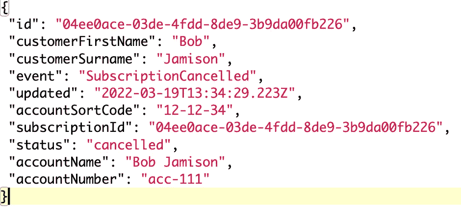

# 无服务器流式事件🚀

> 原文：<https://levelup.gitconnected.com/serverless-streamed-events-ada6ed9a9ecf>


## 如何使用 EventBridge 在 DynamoDB 和 DocumentDB 中基于数据库更改对域事件进行流式处理，并提供用 TypeScript 和 CDK 编写的视觉效果和代码示例。


# 介绍

当我们跨多个域构建事件驱动的无服务器解决方案时，确保不可变事件仅在事件发生后才被明确引发是很重要的。

我们可以利用 [DynamoDB 流](https://docs.aws.amazon.com/amazondynamodb/latest/developerguide/Streams.html)和 [DocumentDB 更改流](https://docs.aws.amazon.com/documentdb/latest/developerguide/change_streams.html)来确保我们只在数据被提交到相关数据库时才引发相关事件，并确保事件总是 100%被引发(*通过使用死信队列、重试等*)。这种架构模式和附带的类型脚本 repo 可以在这里找到:[https://github . com/leegilmorecode/server less-streamled-events](https://github.com/leegilmorecode/serverless-streamed-events)

> **注意**:为了方便人们部署和使用，这都在一个 AWS 帐户内。理想情况下，所有三个领域将在单独的 AWS 帐户。

## 我们可以用其他方法让自己置身于什么场景中？

有三种常见的情况:

❌数据库记录在代码中提交，但是出现了一个问题，该事件未能引发。在这种情况下，我们的消费域永远不会被通知状态/事件的变化。

❌:我们在代码中成功引发了该事件，但是在提交数据库记录时出现了问题。在这个场景中，我们的消费者认为状态/事件发生了变化，但实际上记录并没有被提交。

✔️第三个选项是在成功提交到数据库的记录后面生成事件，并利用死信队列来确保事件总是 100%为消费者引发(*即使它最终是一致的*)。

如下所示:


我们可能遇到的一些奇怪情况以及解决方法

在下一节中，让我们看看如何对此进行设计。

## 事务发件箱模式

我们在上图的第三个设置中描述的是'*事务发件箱*'模式。

下图显示了这一点:


[https://microservices . io/patterns/data/transactional-outbox . html](https://microservices.io/patterns/data/transactional-outbox.html)

一个域服务通常需要更新一个数据库，然后向数据库后面的其他域发送一个事件(*例如‘order created’*)。我们需要确保这个过程是原子性的，否则我们可能会陷入上一节讨论的场景中。

当我们为数据库和消息代理使用 AWS 服务时，我们无法执行原子两阶段提交(*分布式事务*)，需要一种不同的方法。

如果我们确保只在实际更新的数据库后面引发事件，并确保我们在发送事件时有弹性，那么我们有以下好处:

*   我们不需要使用两阶段提交。
*   当且仅当数据库事务提交时，才能保证发送消息。

让我们看看在使用 EventBridge 时，如何使用 DynamoDB 和 DocumentDB 来实现这一点。

# 我们在建造什么？🏗️


我们虚构的剃须刀订阅公司'李詹姆斯剃须刀'

我们将构建一个虚构的场景，其中客户可以在我们的`Subscription`域中创建 mens razors 的月度订阅，然后在`Stock`域中分配相关股票，并在`Payments`域中创建直接借记记录。


创建订阅

如果客户通过`Payments`域名取消他们的直接借记，那么`Stock`域名将解除股票分配，而`Subscription`域名将取消认购。如下所示:


付款取消流程

从这个示例基本架构中我们可以注意到，事件是在两个流的后面生成的( *DynamoDB 流和 DocumentDB Change 流*)。我们将在下面做更深的潜水。

# 为什么没有中心事件总线？

对于上图中的鹰眼，我们可以看到没有中央事件总线，每个事件总线都相互通信。这是我们将使用的多总线、多帐户模式。

使用 EventBridge，为了跨帐户进行通信，我们需要从一个总线到另一个总线，并且当正确地构建我们的域时，每个域应该被划分到它自己的 AWS 帐户中。这给了我们两个选择:

## 单总线、多账户模式

组织通常拥有一个“DevOps”团队，负责通过单一事件总线管理共享资源。每个服务团队拥有并管理自己的应用程序堆栈，而 DevOps 团队管理定义服务集成的事件总线规则和目标配置的堆栈。


[https://github . com/AWS-samples/Amazon-event bridge-resource-policy-samples/blob/main/patterns/readme . MD](https://github.com/aws-samples/amazon-eventbridge-resource-policy-samples/blob/main/patterns/README.md)

**注意事项**

*   额外的跨账户策略管理(*相比于单总线、单账户模式*)。
*   服务团队管理目标配置，但不管理路线
*   引入了对多个事件总线的需求，以便在帐户之间传输事件
*   仍然通过中央总线的路由规则
*   目标规则迁移到服务帐户事件总线

## 多总线、多账户模式

在这个模式中，每个事件总线都归服务团队所有。每个服务团队管理自己的公交车。没有路由逻辑或目标配置的集中管理。

服务团队需要了解对订阅他们发布的事件感兴趣的服务。

> **注意**:每个事件总线都设置自己的 EventBusPolicy 来限定哪些事件源可以发布到总线，并创建 EventBusPolicy 来定义哪些帐户可以管理其帐户上的规则和目标。


[https://github . com/AWS-samples/Amazon-event bridge-resource-policy-samples/blob/main/patterns/readme . MD](https://github.com/aws-samples/amazon-eventbridge-resource-policy-samples/blob/main/patterns/README.md)

**注意事项**

*   服务团队管理发送和接收事件的所有资源
*   管理分布式规则和资源策略的额外开销
*   每个服务团队管理自己的事件总线
*   不需要额外的总线来促进跨客户事件交付
*   与服务边界一致

# 入门！✔️

首先，使用以下 git 命令克隆以下 repo:

```
git clone [https://github.com/leegilmorecode/serverless-streamed-events](https://github.com/leegilmorecode/serverless-streamed-events)
```

这将把示例代码下载到您的本地机器上。

> *💡* ***注意*** *:* 这不是生产就绪代码，仅用于演示概念。我们将所有的域服务部署到一个 AWS 帐户，但我们通常会将每个服务部署到自己的帐户中，这是最佳做法。我们还将强化发送事件等方面的弹性

# 部署解决方案！👨‍💻

🛑 **注意** : *运行以下命令会在你的 AWS 账户上产生费用，而且有些服务不在免费层。*

在文件夹下运行`npm run deploy`。

在文件夹*支付服务/src/流*中运行`npm run build`。

在文件夹*支付服务*中运行`npm run deploy`。

在文件夹*库存服务*中运行`npm run deploy`。

在*订阅服务*中运行`npm run deploy`。

🛑 **注意** : *记得在你完成的时候拆掉堆叠，这样你就不会继续被收费了，使用上面相关文件夹中的‘NPM run remove’。*

# 讨论一下👊

🛑 **注意** *:请记住，这段代码只是为了概念验证和讨论而编写的。我还试图将相关代码保存在更少的文件中，这样文章更容易阅读。*

## dynamodb 中的流

下图显示了在 DynamoDB 中提交数据库记录后的流事件的基本示例:


DynamoDB 流的作用

正如我们从上图中看到的，我们从提交的 DynamoDB 记录的背面引发事件，并对任何未能引发的事件使用 DLQ，这样它们就不会丢失。

## ✅文档中的流 DB

下图显示了通过[更改流](https://docs.aws.amazon.com/documentdb/latest/developerguide/change_streams.html)将数据库记录提交到 DocumentDB 之后的流事件的流程:


DocumentDB 流在运行

正如我们从上图中看到的，当支付被取消并且 DocumentDB 数据库中的记录被更新时，ECS 任务使用了更新的变更流。该任务将消息发送到 FIFO 队列，Lambda 读取该队列并将正确的事件发送到 EventBridge。

> *💡* ***注意*** *:* 对于我们的变更流，如果出现问题或消息未能发送到 SQS，例如网络问题或 ECS 任务失败，我们需要进行恢复。出于这个原因，我们将更新在 ECS 中运行的代码，以将更改流恢复到最后一个被处理的记录。[https://docs . AWS . Amazon . com/document db/latest/developer guide/change _ streams . html # change _ streams-resumption](https://docs.aws.amazon.com/documentdb/latest/developerguide/change_streams.html#change_streams-resuming)

# 测试解决方案🎯

## 新订阅🪒

我们首先为我们的剃须刀创建一个新的客户订阅:


然后在订阅域中创建相关记录:


新的客户预订已创建

当股票域接收到'`SubscriptionCreated`'事件时，它分配相关的股票，如下所示，并且在支付域中创建相关的支付(*我们预先分配 12 个月的价值，并且还创建支付订阅记录*)。


创建库存记录以分配库存

## 取消❌付款

现在让我们取消付款，就像客户从第三方系统取消了他们的直接借记一样:


取消付款

这引发了`PaymentCancelled`事件，这意味着订阅域现在取消了订阅:



客户订阅被取消

在股票领域，我们取消了相关股票的分配，因为付款和认购已经取消:


股票域解除相关股票的分配

**请访问我们的赞助商** [**Sedai.io**](https://www.sedai.io/)


# 摘要

我希望您发现这是一个有用的基本例子，它是 DynamoDB 和 DocumentDB 的无服务器模式！

请点击此处订阅我的企业无服务器新闻稿，了解更多相同的内容:

[](https://www.linkedin.com/newsletters/enterprise-serverless-%F0%9F%9A%80-6875837779876605952/) [## 企业无服务器🚀LinkedIn

### Lee Gilmore |面向 AWS 开发人员、DevOps 工程师和云架构师的无服务器新闻和文章

www.linkedin.com](https://www.linkedin.com/newsletters/enterprise-serverless-%F0%9F%9A%80-6875837779876605952/) 

# 包扎👋

请[去我的 YouTube 频道](https://www.youtube.com/channel/UC_Bi6eLsBXpLnNRNnxKQUsA)订阅类似的内容！


我很乐意就以下任何一个方面与您联系:

[https://www.linkedin.com/in/lee-james-gilmore/](https://www.linkedin.com/in/lee-james-gilmore/)T10[https://twitter.com/LeeJamesGilmore](https://twitter.com/LeeJamesGilmore)

如果你觉得这些文章鼓舞人心或有用，请随时用虚拟咖啡[https://www.buymeacoffee.com/leegilmore](https://www.buymeacoffee.com/leegilmore)来支持我，不管怎样，让我们联系和聊天吧！☕️

如果你喜欢这些帖子，请关注我的简介[李·詹姆斯·吉尔摩](https://medium.com/u/2906c6def240?source=post_page-----39c4f4ae5aff----------------------)以获取更多的帖子/系列，不要忘记联系我并打招呼👋

如果你喜欢，也请使用帖子底部的“鼓掌”功能！(*可以不止一次鼓掌！！*

# 关于我

"*大家好，我是 Lee，AWS 社区构建者、博客作者、AWS 认证云架构师和全球无服务器架构师，住在英国；目前在 City Electrical Factors 工作，过去 6 年主要从事 AWS 上的全栈 JavaScript 工作。*

*我认为自己是一个无服务器倡导者，热爱 AWS、创新、软件架构和技术。*”

*****所提供的信息是我个人的观点，我对这些信息的使用不承担任何责任。*****

您可能还对以下内容感兴趣:

[](https://leejamesgilmore.medium.com/serverless-content-46ef5b562d8e) [## 无服务器内容🚀

### 我的所有无服务器内容的索引，可以在一个地方轻松浏览，包括视频、博客文章等..

leejamesgilmore.medium.com](https://leejamesgilmore.medium.com/serverless-content-46ef5b562d8e)