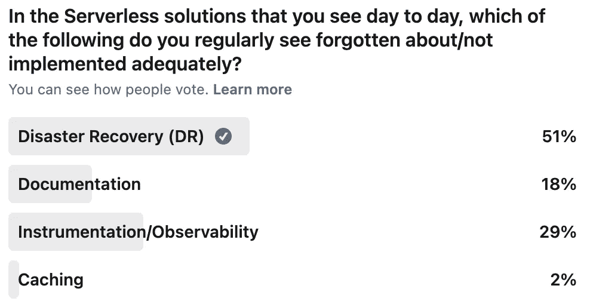
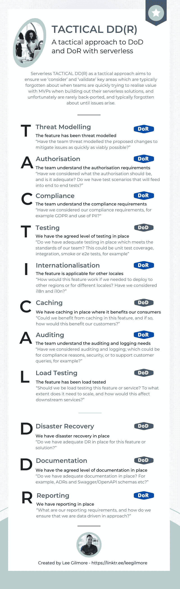
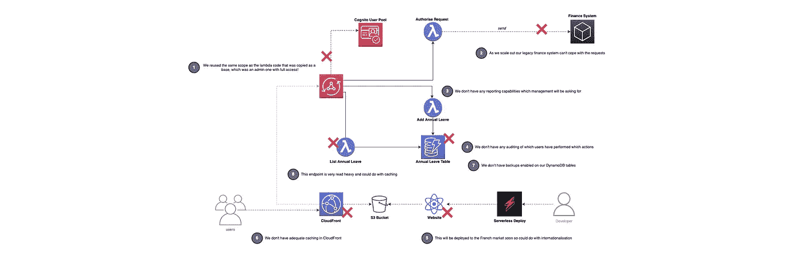
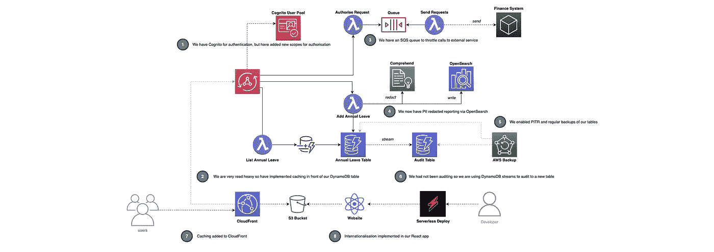
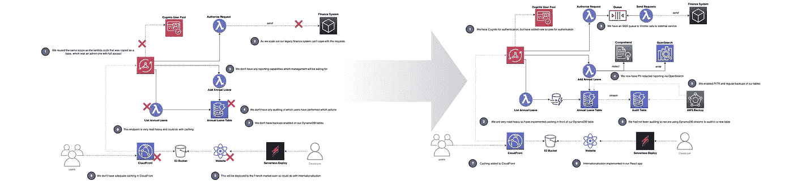

# 无服务器战术 DD(R)🚀

> 原文：<https://levelup.gitconnected.com/serverless-tactical-dd-r-23d18d529fa1>

照片由[在](https://unsplash.com/@thecreative_exchange?utm_source=unsplash&utm_medium=referral&utm_content=creditCopyText) [Unsplash](https://unsplash.com/s/photos/color?utm_source=unsplash&utm_medium=referral&utm_content=creditCopyText) 上的创意交流

## 对于无服务器解决方案，什么是战术性 DD(R)作为非功能性需求的战术方法，它如何补充您的 DoR 和 DoD 以确保您的解决方案更具可扩展性、安全性、容错性、合规性等？本文还包含一个 GitHub repo，其中包含供团队使用的下载，并展示了它如何补充无服务器威胁建模。

# 介绍

当谈到在 AWS 上构建无服务器架构时，入门的主要好处之一是非常容易，最大的缺点之一也是非常容易！团队可以使用 AWS 服务，如 Amazon API Gateway、AWS Lambda 和 Amazon DynamoDB，非常快速地构建出可扩展的 MVP(**M**最小 **V** 可变 **P** 产品)，但这样做的缺点是，许多团队忘记了如何正确地生产这些解决方案，并错过了真正的关键因素，这些因素最终会在以后影响他们！

> “在构建无服务器体系结构时，入门的主要好处之一是非常容易，最大的缺点之一也是非常容易！”

本文将讨论如何使用一种我称之为无服务器战术 DD(R) 的方法，这种方法补充了一个团队 DoR ( **D** 定义 **o** f **R** eady)和 DoD ( **D** 定义 **o** f **D** one)，作为在适当的时候从无服务器角度提出的问题清单。

我们将继续构建虚拟的' ***LeeJames HR*** '，展示一个团队如何实现这种方法，以及它如何在之前和之后影响他们的架构。

你可以在这里找到 Github 回购[。](https://github.com/leegilmorecode/serverless-tactical-ddr)

# 敏捷世界中的 NFR、多尔和国防部是什么？💭

在我们开始采用这种方法之前，让我们快速了解一些关键概念:

## ✔️的定义

有了“就绪”的定义，就意味着故事必须能够立即付诸行动。团队必须能够确定需要做什么，以及完成用户故事或 PBI 所需的工作量。—[https://www.scruminc.com/definition-of-ready/](https://www.scruminc.com/definition-of-ready/)

> 实际上，准备好的定义必须包含所有过去伤害过你或者将来可能伤害你的事情。这些项目必须在工作开始前解决。—https://www.leadingagile.com/

## ✔️国防部的定义

团队必须理解“完成”的标准，以及将执行什么测试来证明故事是完整的。在将 PBI 交付给最终用户之前，可以把国防部看作是组织所需要的。——【https://www.scruminc.com/definition-of-done/ 

> Done 的定义描述了目标状态。它必须被就绪的定义所告知。就这么简单。大多数团队采用的反模式是两者都忽略。—https://www.leadingagile.com/

## ✔️非功能需求的定义

非功能需求(nfr)定义了系统属性，如安全性、可靠性、性能、可维护性、可伸缩性和可用性。它们作为不同积压工作的系统设计的约束或限制—[https://www . scaledagileframework . com/nonfunctional-requirements/](https://www.scaledagileframework.com/nonfunctional-requirements/)

# 什么是无服务器战术 DD(R)方法？☑️

无服务器**战术 DD(R)** 作为 DoR 和 DoD 的战术方法，旨在确保我们“*考虑“*”和“*验证*”关键领域，根据我的经验，当团队在构建解决方案时快速尝试实现业务价值时，这些领域通常会被遗忘，不幸的是，这些领域很少被支持，并且通常会被遗忘，直到出现问题！

这些不是进入 sprint 的工作“大门”;更多的是从无服务器的角度来思考这些领域。

这些评论和我自己的经验表明，还有其他一些关键领域

在适当的时候询问这些关键问题可以确保在您的无服务器解决方案中不会发生这种情况。下面我们来看看战术 DD(R)代表什么:

[https://github.com/leegilmorecode/serverless-tactical-ddr](https://github.com/leegilmorecode/serverless-tactical-ddr)

# 团队是如何处理的？🚀

该团队之前已经有了一个典型的通用 DoR 和 DoD，如下所示(*并考虑了* [*投资矩阵*](https://www.agilealliance.org/glossary/invest/) ):

**就绪的定义**

1.  *故事应该完全按照“用户故事”的格式编写。*
2.  *团队必须理解验收标准。*
3.  *团队需要对故事进行评估。*
4.  *团队应该了解如何提供功能演示。*
5.  *团队应该理解绩效标准。*

**完成的定义**

1.  *单元和集成已测试。*
2.  *可释放。*
3.  *发行说明已创建。*
4.  *部署生产。*

正如你从 DoR 和 DoD 的这些典型例子中所看到的，它允许团队了解一个故事何时准备好从基础层面开始，以及它何时完成，但在我看来，我们可以从无服务器的角度来称赞这一点，因为上面的护栏当然与无服务器无关。

## 队伍接近了

敏捷教练 Ben 使用了**战术 DD(R)** 方法中的示例问题，在谈到无服务器功能时，将具体项目添加到 DoR 和 DoD 的清单中。这确保了团队至少在故事创作、backlog 细化和计划中考虑了这些方面。它们之所以是问题，是因为它为团队提供了更多的上下文，以确定它们是否适合他们采用，以及他们是否希望将它们作为定义的语句添加到自己的检查表中。

[杰森·古德曼](https://unsplash.com/@jasongoodman_youxventures?utm_source=unsplash&utm_medium=referral&utm_content=creditCopyText)在 [Unsplash](https://unsplash.com/@jasongoodman_youxventures?utm_source=unsplash&utm_medium=referral&utm_content=creditCopyText) 上拍摄的照片

接下来，团队开始为《LeeJames HR 的新专题收集故事，该专题围绕年假管理展开。当他们在开发阶段推进故事时，他们会定期查看基于下载的 done 的新定义上的项目，以确保他们正在推进。这作为正在完成的工作的检查清单，因此在他们的解决方案中添加了一套无服务器的'*护栏*。

杰森·古德曼在 [Unsplash](https://unsplash.com/@jasongoodman_youxventures?utm_source=unsplash&utm_medium=referral&utm_content=creditCopyText) 上的照片

随着时间的推移，团队在进行工作和发布产品时，会定期考虑这些默认的无服务器护栏；因此，当每个项目成为他们的第二天性时，它就从列表中被删除了。

它们只是作为一组可以用一定程度的常识来遵循的精神焦点区域，而不是门口的保镖，阻止工作被引入和进展，或交付到生产中。

> 因此，就绪的定义不是一种隔离团队和阻碍协作的机制。恰恰相反。这是一个工具，在旅程的某些阶段，当它以正确的理由正确应用时，它会增加价值。
> 
> 也不是我们想永远锁定的东西。当组织发展到不再需要它的时候，准备就绪的正式定义可以被简化，甚至可能被取消——https://www.leadingagile.com/

# 这对 LeeJames HR 有什么影响？

既然我们已经讨论了无服务器战术性 DD(R)方法，那么让我们来看一下之前和之后如何影响他们在“ ***LeeJames HR*** ”中设计和构建一个用于管理年假的无服务器域服务。

> **注**:这是一个完全虚构的例子，下面的架构只是为了讨论一个概念。

不考虑设计中的这些关键因素，解决方案会是什么样子

这是使用这种方法的结果:

使用战术性 DD(R)方法的解决方案示例

## 这些功能的主要变化是什么？

因此，让我们更详细地讨论一下无服务器的战术 DD(R)方法带来的主要变化:

1.  **威胁建模**。团队威胁对提议的架构进行了建模，并发现了安全方面的各种潜在差距，这些差距已得到缓解(下文将进一步讨论*)。
    有关无服务器威胁建模的更多信息，请查看:
    [https://leejamesgilmore . medium . com/server less-Threat-modeling-df8e 4028 ef 6d](https://leejamesgilmore.medium.com/serverless-threat-modelling-df8e4028ef6d)*
2.  **授权**。围绕授权没有具体的接受标准，团队可能会重用已经存在的作用域，这可能会导致解决方案的安全问题。因此，为最低权限创建了一组专用范围，并与团队和产品所有者/业务分析师进行了映射和协商。
3.  **合规**。之前没有考虑过报告，但是在实现 [OpenSearch](https://aws.amazon.com/blogs/opensource/introducing-opensearch/) 时，使用[Amazon understand](https://aws.amazon.com/comprehend/)编辑任何 [PII](https://en.wikipedia.org/wiki/Personal_data) 是很重要的，因为它不是必需的。该团队还确保没有不必要的 PII 被记录到亚马逊 CloudWatch。
4.  **测试**。该团队确保这些功能具有正确的商定测试级别，包括单元测试覆盖、使用 cannon 的 e2e 测试，以及他们使用 Jest 针对 docker 容器创建的 [Amazon DynamoDB](https://aws.amazon.com/dynamodb/) 包的集成测试。
5.  **国际化**。该团队讨论了未来一年进入其他四个国家的未来增长计划，因此决定现在在 React 应用中实施`react-intl`,以允许他们本地化前端，并确保将部署区域和客户端 ID 添加到无服务器设置中，以区分不同的部署。这避免了将来的大量返工。
6.  **缓存**。该团队决定将 [Amazon DynamoDB DAX](https://aws.amazon.com/dynamodb/dax/) 添加到解决方案中，因为它的读取量非常大，这将减少客户的延迟，并通过减少 Amazon DynamoDB 上的读取量和加快 Lambda 执行时间来节省潜在成本。他们还在[亚马逊 CloudFront](https://aws.amazon.com/cloudfront/) 中添加了缓存，为他们的客户提供了正确的配置。
7.  **审计**。在威胁建模练习中，团队中的 Dan 讨论了[不可否认性](https://leejamesgilmore.medium.com/serverless-threat-modelling-df8e4028ef6d)，并且我们没有审计系统用户实际在做什么。出于这个原因，团队通过 Lambda 将 DynamoDB 流实现到一个单独的审计表，该审计表通过 IAM 绑定。
8.  **负载测试**。在一些早期负载测试之后，发现[遗留的下游金融系统无法应对新系统的预期流量，因为它无法以相同的速率扩展](https://leejamesgilmore.medium.com/serverless-event-driven-systems-9617c6406064)。因此，该团队在两个服务之间实现了一个 SQS 队列，允许以可接受的速率进行节流。
    关于无服务器负载测试的更多信息，请看这里:[https://level up . git connected . com/server less-Load-Testing-at-scale-with-cannon-53e F6 c 8 b 77 f 7](/serverless-load-testing-at-scale-with-artillery-53ef6c8b77f7)
9.  **灾难恢复**。该团队意识到根本没有考虑灾难恢复，最大的风险在于数据库。由于这个原因，团队在他们的 DynamoDB 表上实现了 PITR(**P**point**I**n**T**ime**R**e covery)，以及使用 [AWS Backup](https://aws.amazon.com/backup/) 的定期备份。更多信息请见此处:[https://level up . git connected . com/enterprise-server less-databases-208 b 8790998](/enterprise-serverless-databases-208b8790998)
10.  **文献**。该团队确保他们为需要的系统部分准备了 ADR、代码文档和 OpenAPI 模式。有关无服务器文档的更多信息，请参见此处:[https://level up . git connected . com/documentating-your-server less-solutions-509 f 1928564 b](/documenting-your-serverless-solutions-509f1928564b)
11.  **举报**。该团队了解数据驱动的重要性，以及从利益相关者的角度进行报告的必要性。该团队决定使用亚马逊理解来编辑 PII，并将相关数据传输到 OpenSearch 进行报告和分析。

下图显示了与以迭代方式使用这种方法相比，它的前后视图:

这件作品之前和之后的例子

## 这个可以迭代应用吗？

当考虑迭代方法时，可能通过像 [SPIDR](https://www.mountaingoatsoftware.com/exclusive/spidr-poster-download) 这样的框架，然后战术 DD(R)可以以相同的方式与框架一起迭代应用(*即，当我们期望进一步分解故事时*)。并不是列表上的所有项目都与所有的故事相关，这没关系。

## 这如何与无服务器威胁建模一起工作？

根据我的经验，这种方法可以补充无服务器威胁建模，成为 Ready 定义的一部分，以应对架构、用户或数据流的任何重大变化:

 [## 无服务器威胁建模🚀

### 您应该如何以及为什么在 AWS 上对您的无服务器解决方案进行威胁建模，并提供真实生活中的可视化示例

leejamesgilmore.medium.com](https://leejamesgilmore.medium.com/serverless-threat-modelling-df8e4028ef6d) 

# 摘要

我希望您在团队中工作时会发现这种方法很有用，因为根据我的经验，这些是在设计和构建无服务器解决方案时通常会忽略的关键领域，并且这些项目很少在以后出现大问题时才被返回。

> 团队可能有他们自己的 DoR 和 DoD，在组织级别、团队级别或两者之间的任何级别。根据我的经验，敏捷可能是一个非常固执己见的领域，但是我个人认为它是对团队有用的东西。

这种简单的团队日常工作方法可以确保不遗漏生产无服务器解决方案的关键因素，并最终使您的服务对客户来说更加安全、有弹性、合规和安全。

# 包扎👋

我希望你觉得有用！

请[前往我的 YouTube 频道](https://www.youtube.com/channel/UC_Bi6eLsBXpLnNRNnxKQUsA)订阅类似内容！

我很乐意就以下任何一个方面与您联系:

【https://www.linkedin.com/in/lee-james-gilmore/】T3
T5[https://twitter.com/LeeJamesGilmore](https://www.linkedin.com/in/lee-james-gilmore/)

如果你喜欢这些帖子，请关注我的简介[李·詹姆斯·吉尔摩](https://medium.com/u/2906c6def240?source=post_page-----39c4f4ae5aff----------------------)以获取更多的帖子/系列，不要忘记联系我并打招呼👋

如果你喜欢，也请使用帖子底部的“鼓掌”功能！(*可以不止一次鼓掌！！*)

**本文由**[**sedai . io**](https://www.sedai.io/)赞助

# 关于我

"*大家好，我是 Lee，英国的 AWS 社区构建者、博客作者、AWS 认证云架构师和首席软件工程师；目前是一名技术云架构师和首席无服务器开发人员，过去 5 年主要从事 AWS 上的全栈 JavaScript 工作。*

*我认为自己是一个无服务器倡导者，热爱 AWS、创新、软件架构和技术。*

***提供的信息是我个人的观点，我对信息的使用不承担任何责任。*****

您可能还对以下内容感兴趣:

 [## 无服务器事件驱动系统🚀

### 您应该如何以及为什么首先使用 Amazon EventBridge 构建事件驱动的无服务器架构…

leejamesgilmore.medium.com](https://leejamesgilmore.medium.com/serverless-event-driven-systems-9617c6406064)  [## 无服务器内容🚀

### 我的所有无服务器内容的索引，可以在一个地方轻松浏览，包括视频、博客文章等..

leejamesgilmore.medium.com](https://leejamesgilmore.medium.com/serverless-content-46ef5b562d8e)  [## 无服务器合成金丝雀🚀

### 使用 CloudWatch 合成金丝雀来监控你的无服务器应用程序的实际例子，有视觉效果和…

leejamesgilmore.medium.com](https://leejamesgilmore.medium.com/serverless-synthetic-canaries-7946dc5216ba)  [## 无服务器 S3 对象 Lambda🚀

### 一个使用 AWS S3 对象 Lambda 的实际例子，使用 Amazon 动态地用元数据给图像加水印…

levelup.gitconnected.com](/serverless-s3-object-lambda-88c923a8a771)  [## 您的无服务器客户是高兴还是难过？🚀

### 使用 AWS 的理解来理解你的客户内容的情绪的例子，同时也编辑 PII，与…

levelup.gitconnected.com](/are-your-serverless-customers-happy-or-sad-32f904ede5ff)