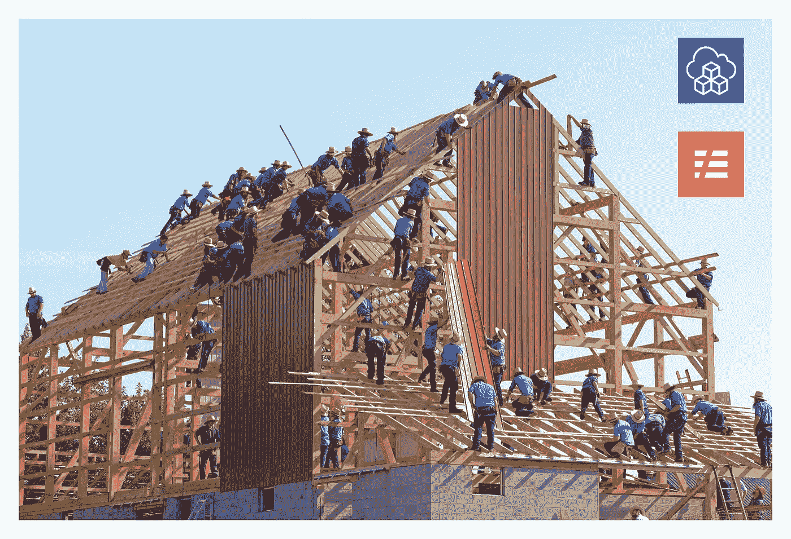
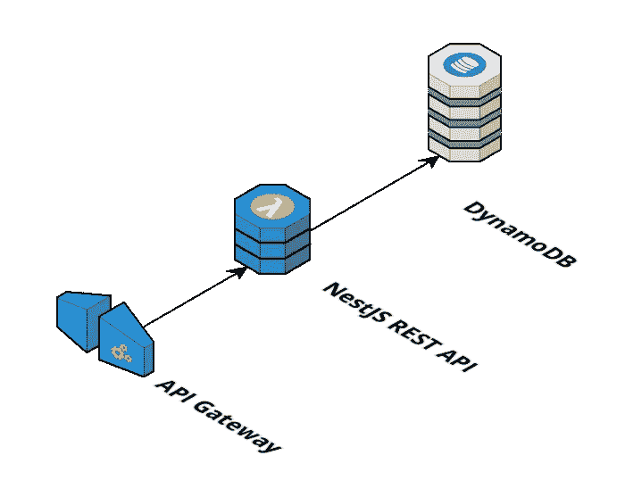
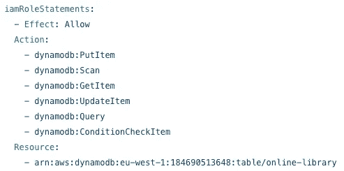

# 无服务器 vs CDK

> 原文：<https://levelup.gitconnected.com/serverless-vs-cdk-a7f3ee391f24>

## 选择在 AWS 上创建无服务器基础架构资源的策略

Josue Isai Ramos Figueroa 在 [Unsplash](https://unsplash.com?utm_source=medium&utm_medium=referral) 上的照片

在 AWS 上创建无服务器基础架构有几种方法。你可以通过 AWS 控制台创建它，使用 AWS CLI，或使用一个框架，如[无服务器](https://www.serverless.com)或 [AWS 云开发工具包](https://aws.amazon.com/cdk)(肯定不会问阿米什人😁).

我是自动化一切的大力支持者，所以让一段代码来做繁重的工作而不是点击控制台窗口对我来说非常有吸引力。在我使用无服务器技术的过程中，我了解到你可以使用无服务器框架和 AWS CDK。在这篇文章和接下来的文章中，我想向你展示我对如何结合这两种技术来创建无服务器基础设施的认识。

## 使用案例

为了保持真实而不是抽象，我将详细说明如何为 REST API Lambda 设置 infra，该 API 连接到 DynamoDB 进行存储，如前面的[故事](https://medium.com/dev-genius/how-to-build-a-serverless-rest-api-with-nestjs-and-dynamodb-7b58b5b59bf6)中所述。该架构如下所示:

无服务器架构图

在基础设施级别，需要配置以下资源:

*   API 网关
*   AWS 函数
*   DynamoDB 表
*   访问管理(AWS 上的 IAM)

> 重要的是要知道，CDK 和无服务器框架最终都转化为一个 [AWS Cloudformation](https://aws.amazon.com/cloudformation/) 堆栈。AWS Cloudformation 是 AWS 上的基础设施即代码服务。

让我们看看无服务器和 CDK 有哪些选项。

## 无服务器

[无服务器框架](https://www.serverless.com/)允许你以一种非常简洁的方式定义你的 AWS Lambda。查看我的前一篇关于用 Typescript 创建 REST API 的文章中的无服务器 YAML 文件，你会看到该文件描述了 Lambda 函数的特征。

无服务器. yml

“提供商”部分说明了使用哪个云供应商以及地区和运行时间。您甚至可以通过添加 AWS IAM 语句来配置访问管理。

AWS IAM 角色声明

无服务器框架的这种配置已经涵盖了 API 网关、AWS Lambda 功能和用于访问管理的 IAM。

无服务器框架还允许您在“资源”部分下的 serverless.yml 文件中配置其他 AWS 资源。以下代码片段显示了如何在 serverless.yml 文件中配置 DynamoDB 表。

无服务器框架实际上遵循纯 AWS Cloudformation 语法。因此，如果您知道如何在 AWS Cloudformation 中定义它，您可以很容易地将其添加到 serverless.yml 配置文件中。

## 云开发套件(CDK)

让我们看看云开发工具包，或简称 CDK，在基础设施层面上能为你做些什么。

> CDK 到底是什么？
> 
> CDK 是一个基础设施作为代码的解决方案，它允许你用你最喜欢的编程语言以声明的方式为你的基础设施建模。它支持 TypeScript、JavaScript、Java、C#、Python 和 Go。

CDK 为每一种支持的编程语言都提供了一个 SDK，其中包含了构建基础设施的基本构件。在这个故事中，我将使用 Java，这是最常用的编程语言之一。

下面的 Java 伪代码部署了一个用 Java 编写的 Lambda 函数，并在 API 网关中定义了一个端点。

Java 中 Lambda 的 cdk 代码

比无服务器多一点冗长。而且更加灵活，允许进行更多的配置，正如您在日志保留期配置中看到的那样。

现在让我们看看如何定义对 DynamoDB 表的访问。我们将创建一个具有必要策略的角色来查询和更新 DynamoDB 表。

用于访问管理的 cdk 代码

代码非常简单明了，可读性比 AWS Cloudformation 格式好得多。最后，让我们看看如何用 CDK 定义一个 DynamoDB 表。代码也是用 Java 编写的。

非常简单明了，也很容易做到。使用像 Java 这样的静态语言的好处是，编写代码非常容易，因为 IDE 会为您建议选项。更重要的是，Java SDK 大量使用了[构建器模式](https://medium.com/@andreaspoyias/design-patterns-a-quick-guide-to-builder-pattern-a834d7cacead)，并帮助您轻松找到所有选项。

## 战略

那么，有两个很好的选择来提升你在 AWS 中的基础设施，最好的策略是什么？我真的很喜欢无服务器的简洁，但也知道 CDK 提供了更多的灵活性来调整基础架构解决方案。CDK 真的布置得很好，和他一起工作很愉快。我确实觉得 CDK 值得你花时间去了解它。

我的策略是两者并用。我使用无服务器框架来设置与 Lambda 本身、API 网关和关于 Lambda 函数的访问策略相关的一切。无服务器的简洁让我更有效率。

对于我的架构中的其他基础设施资源，我使用 CDK，因为它允许我调整关于基础设施资源的一切，而 CDK 代码对我来说就像一个文档工件。

现在知道了无服务器和 CDK 的优点，你打算用什么呢？很高兴收到你的来信。

感谢阅读！

# 海科·范德沙夫

*   ***如果你喜欢这个，请*** [***跟随 Serverlesscorner.com 上中***](https://serverlesscorner.com/about) ***。***
*   ***爱情*** ❤️ ***阅读*** ***我的故事和其他关于媒？*** [***成为会员***](https://serverlesscorner.com/membership) ***如果你还不是会员的话。***
*   ***想阅读更多无服务器？报名参加我的*** [***月刊***](https://serverlessconsulting.org/newsletter) ***📬关于无服务器技术和使用案例的启发性和深刻的故事。***