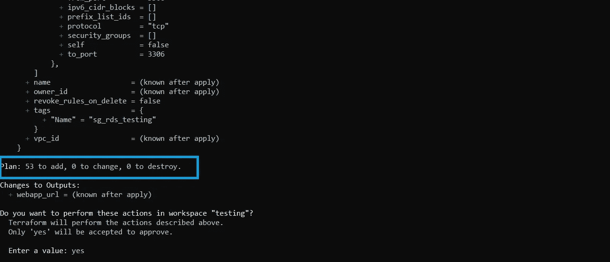
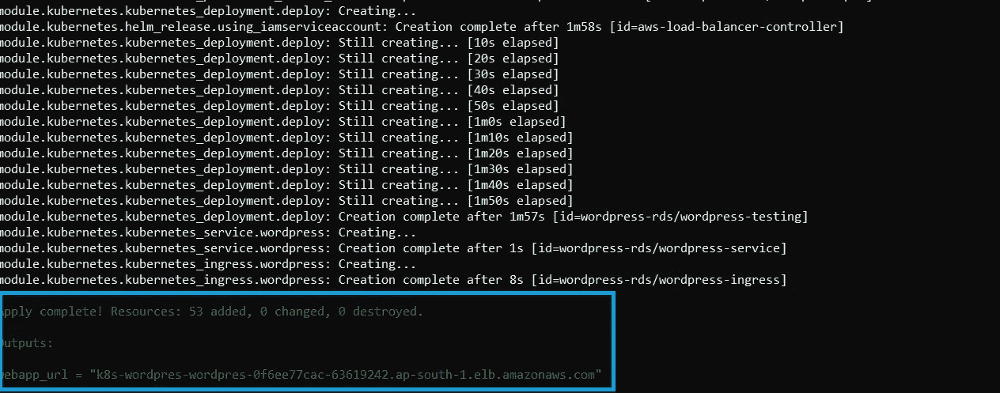
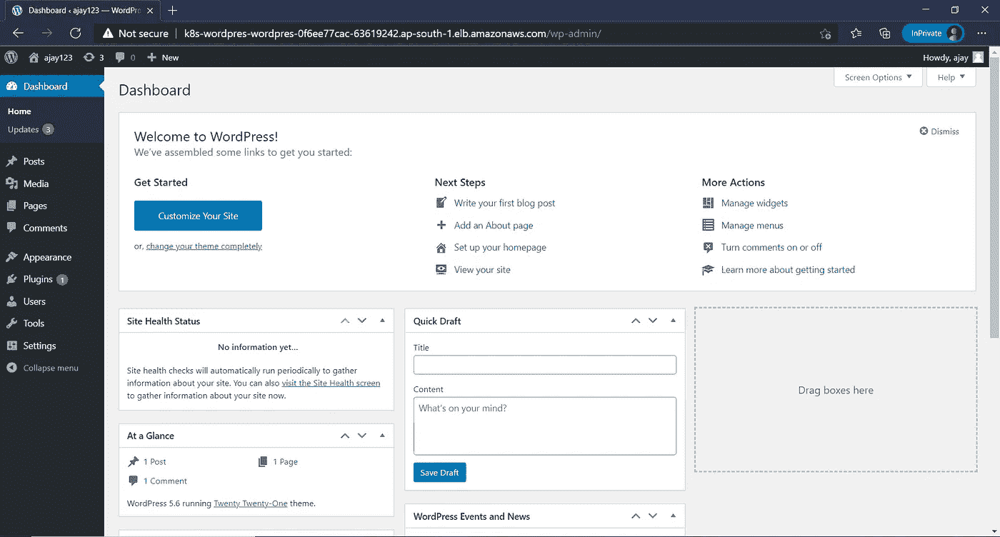

# Terraform:带 AWS EKS 的无服务器 Kubernetes 集群

> 原文：<https://levelup.gitconnected.com/serverless-webhosting-with-aws-eks-on-fargate-using-terraform-fcd1d98170c1>

## 与 EKS 一起在法盖特运行豆荚，并使用 Terraform 向外界展示它们


图片来源:谷歌

一个 **WS Fargate** 是一个用于容器的无服务器计算引擎，它与 [**亚马逊弹性容器服务(ECS)**](https://aws.amazon.com/ecs/) 和 [**亚马逊弹性库本内特服务(EKS)**](https://docs.aws.amazon.com/eks/latest/userguide/what-is-eks.html) 一起工作。Fargate 使您可以轻松地专注于构建应用程序。Fargate 消除了供应和管理服务器的需要，允许您为每个应用程序指定和支付资源，并通过设计应用程序隔离来提高安全性。

今天的世界完全是关于**敏捷**和**自动化**的，我们正在向**无服务器这样的新趋势发展。因此，这篇文章充满了自动化，解释了从无服务器到保护数据库，从测试到生产环境和代码管理的一切。**

这篇文章解释了如何托管自己的 web 应用程序，比如 WordPress、Owncloud 等等。通过与 EKS 建立一个 Kubernetes 集群。为了完成这个设置，我们将使用 [**地形**](https://www.terraform.io/) ，这是一个 **IaC** 工具。但是如果你不熟悉 terraform，那么你可以参考我的这篇文章。

从[这里](https://github.com/Ajaypathak372/eks-fargate-terraform.git)获得完整的代码，这样您就可以跟随文章了

# 项目描述

在本文中，我们将首先创建网络设置，如 VPC、子网等。对于 EKS 集群来说。然后，我们将使用受管节点组和 Fargate 配置文件创建一个 **EKS** 集群。接下来，我们将为我们的 web 应用程序(即 Fargate 上的 WordPress)启动一个 Kubernetes 部署，并为该部署创建一个 PVC(持久卷声明)。为了访问该应用程序，我们还将在 Kubernetes 中创建一个负载平衡器类型的服务。最后，我们为我们的 web 应用程序创建一个数据库。

在这个完整的设置中，我们将使用**地形**来自动化我们的工作。最后，我将通过创建我们自己的 Terraform 模块向您展示一件有趣的事情，即**代码管理。并将以这样一种方式构建我们的代码，即只需一个命令就可以使用相同的代码来设置测试环境和生产环境。**

在本文中，我试图从头开始向您展示几乎所有内容，我相信您会发现一些与 Terraform 和 AWS 相关的有趣而重要的概念:)

# 先决条件

*   需要有一个 AWS 帐户
*   [安装和配置的地形](https://www.terraform.io/downloads.html)

**注意:——我用 windows 10 作为我的本地系统**

## **本文分为 4 个步骤:**

*   [在 AWS 中设置网络基础设施](#b057)
*   [AWS EKS、Fargate 和节点组](#9a71)
*   [Kubernetes 部署，PVC，web 应用的负载平衡器服务](#572a)
*   [AWS RDS 数据库](#e76d)
*   [使用 Terraform 模块进行代码管理](#1e99)

# 步骤 1:为 EKS 设置网络

这一步包括创建 VPC、子网、互联网和 NAT 网关、路由表等。所以这部分不会花太多时间。我们创建的 VPC 将同时拥有公有子网和私有子网。让我们从编写 VPC 的代码开始。

首先，我们必须告诉 Terraform 我们的 AWS 帐户，所以我们需要先添加一个**提供者**

```
provider "aws" {
  region = "ap-south-1"
  profile = "Ajay"
}
```

**创造 VPC**

vpc

## **创建子网**

在这里，我们将创建公共和私有子网

**公共子网**

发布子网

上述代码将在指定区域的所有**可用区域**中创建一个子网，并使用 VPC 的 CIDR 创建子网 CIDR。在这里，您可以注意到我为子网提供了一些标记，如果我们要使用这些子网创建 EKS 群集，提供这些标记非常重要。

*   `kubernetes.io/cluster/{clustername}: shared`标签需要添加到集群应该能够使用的所有子网中
*   `kubernetes.io/role/elb: 1`标签需要添加到公共子网中，以便 Kubernetes 知道只将这些子网用于公共负载平衡器
*   `kubernetes.io/role/internal-elb: 1`标签需要被添加到私有子网，以便 Kubernetes 知道使用这些子网作为内部负载平衡器

你可以在这里阅读关于这些标签[的更多信息。](https://aws.amazon.com/premiumsupport/knowledge-center/eks-vpc-subnet-discovery/)

**私有子网**

私有子网

**创建互联网和 NAT 网关**

接下来，我们必须为公共子网创建一个**互联网网关**，为私有子网创建 **NAT 网关**，以便私有子网中启动的资源能够访问互联网。

互联网和 nat 网关

**创建路由表**

接下来，我们必须为公共和私有子网创建**路由表**。在这些路由表中，我们使用 CIDR 块 **"0.0.0.0/0"** 创建了一条路由，这样这些子网中的资源就可以到达外部世界的任何地方。这将允许 SNAT。

最后，所有公共和私有子网都需要与各自的路由表相关联。这里我使用了 **count** 变量将每个子网与路由表关联起来。

路由表

# 步骤 2:使用节点组和 Fargate 创建 EKS 集群

## EKS 集群

为了用 EKS 创建一个 Kubernetes 集群，我们首先必须创建一个 **IAM 角色**和一些**策略**，因为 EKS 代表你调用其他 AWS 服务来使用或管理与服务相关的资源。所以基本上我们必须允许 EKS 为我们管理事情。

eks-iam-角色

现在要创建一个 EKS 集群，我们必须编写以下 terraform 代码

eks 集群

## 节点组

现在我们的集群已经准备好了，但是我们没有任何节点来运行我们的 pod。也可以在 Fargate 上运行整个集群，但为此，我们必须对 CoreDNS 部署做一些调整，你可以在这里看到更多。

我们实际上在 Fargate 上运行我们的 web 应用程序 pods，但是我们还必须为 **kube-system** 名称空间创建一个节点组，它用于运行操作 Kubernetes 集群所需的任何 pods。

节点组 iam

**注意:-** 如果您正在使用 **"ap-south-1"** 区域，那么不要使用 **t2** 类作为该区域的 **ap-south-1c** 区域不支持此类型的实例类型。

在上面的代码中，根据你的需要设置`desired_size`和`max_size`，因为在一个实例中只能发射有限的吊舱，比如在`t2.micro`你只能发射 2 个吊舱，在这里阅读更多关于它的[。](https://docs.aws.amazon.com/eks/latest/userguide/pod-networking.html)

类似地，对于节点组，我们必须创建单独的 IAM 角色和策略。

节点组

## 法尔盖特

> AWS Fargate 是**无服务器**意味着我们不需要担心 CPU 和内存使用、存储、实例**可用性**和**耐用性**等问题，因为 AWS 为我们管理所有这些事情，并且他们使用他们最好的资源来使事情始终对我们可用。

为了在 **Fargate(又名“无服务器”)**配置中运行 pod，我们首先需要创建一个 **Fargate 概要文件**。这个概要文件定义了名称空间和选择器，它们用于识别哪些 pod 应该在 Fargate 节点上运行。

同样，对于 fargate 配置文件，我们必须创建一个 pod 执行角色，让 Fargate 控制器代表您调用 AWS API。

# 步骤 3:创建 Kubernetes 部署并在 Fargate 上运行它

接下来的部分主要是关于如何在 Kubernetes 集群上部署一个应用，如何在 fargate 上运行它，以及如何在负载平衡器控制器的帮助下从外部访问应用。并为应用程序创建一个 PVC。

## 部署

在 Kubernetes 中创建 [**部署**](https://kubernetes.io/docs/concepts/workloads/controllers/deployment/) 非常简单，部署有助于 pods 的滚动更新。这里我们将部署一个[**WordPress**](https://wordpress.org/)**app**这是一个强大的托管平台，通过它，你可以轻松地创建一个漂亮的网站、博客或应用程序。还有其他应用程序，如 Owncloud、Drupal 等。****

****在上面的代码中，如果你注意到我已经为 wordpress 使用了**环境变量**，由于我们不需要手动连接 WordPress 和数据库，这将自动获得数据库地址和登录细节，并将其与 WordPress 连接。****

## ****聚氯乙烯****

****下一件事是为部署创建一个 **PVC(永久卷声明)**，这样你在 wordpress 中做的任何事情都将被永久保存，如果任何一个 Pod 关闭，你也不会丢失你的数据。****

****因为我们的 Pods 运行在 Fargate 上，而 Fargate 只支持[**【EFS】(弹性文件系统)**](https://aws.amazon.com/efs/#:~:text=Amazon%20EFS%20is%20a%20regional,Direct%20Connect%20or%20AWS%20VPN.&text=What%20is%20Cloud%20File%20Storage%3F) 来创建 PVC，所以在这里我们首先要创建一个 EFS。****

****需要将一个安全组连接到 EFS，该安全组将只允许在 VPC 内连接到 EFS。****

****现在，要使用这个 EFS，需要创建一个存储类和一个 PV(持久卷),最后是一个将由部署使用的 PVC。****

## ****公开部署****

****在 kubernetes 中，为了公开部署，需要创建某种类型的[服务](https://kubernetes.io/docs/concepts/services-networking/service/)，由于我们的集群运行在 AWS 上，因此我们必须使用**负载平衡器**类型的服务，这意味着 Kubernetes 将使用 AWS 的 **ELB** 服务，使应用程序可以从外部访问。****

****现在在 AWS 中有三种类型的[**【ELB(弹性负载均衡)**](https://aws.amazon.com/elasticloadbalancing/) 分别是经典、网络和应用负载均衡器。因为我们的 EKS 集群也有一个节点组，所以任何 ELB 都可以用来暴露我们的应用程序，否则 **Fargate 只支持 ALB 和 NLB** 。从技术上来说，所有的 ELB 做同样的工作，但有不同的方式来使用它们。****

****为了使用传统的负载平衡器，只需创建一个类型为`LoadBalancer`的服务，如下所示****

****要创建一个网络负载平衡器，请在元数据中的上述代码中添加这个**注释******

```
**annotations = {
      "service.beta.kubernetes.io/aws-load-balancer-type" = "nlb-ip"
}**
```

****现在创建一个应用程序负载平衡器比其他两个负载平衡器稍微复杂一点，为此，我们需要一个**负载平衡器控制器**。****

## ****负载平衡器控制器****

****为了创建一个 ALB，我们需要添加一个 [AWS 负载平衡器控制器](https://docs.aws.amazon.com/eks/latest/userguide/aws-load-balancer-controller.html)(以前叫做 *AWS ALB 入口控制器*)。为了使该控制器具有创建 ALB 以及在 ALB 中注册(注销)目标 pod 的访问权限，我们需要首先创建一个 IAM 角色和策略来允许这样做。****

*****在上面的代码中，如果你注意到我已经直接给出了 IAM 策略的 URL，因为这个策略写起来太长了，这会使我们的代码变大，所以这就是为什么我使用了一个 terraform 技巧来使代码变短，但你可以在这里阅读完整的策略*[](https://raw.githubusercontent.com/kubernetes-sigs/aws-load-balancer-controller/v2.1.0/docs/install/iam_policy.json)**。******

*****现在，要将上面创建的 IAM 角色与集群连接起来，我们需要在 kubernetes 集群中有一个集群角色和一个服务帐户，但是要将 IAM 角色用于服务帐户，您的集群必须有一个 IAM **OIDC 提供者**。*****

```
***data "tls_certificate" "certificate" {
  url = aws_eks_cluster.eks_cluster.identity[0].oidc[0].issuer
}# creating OIDC provider
resource "aws_iam_openid_connect_provider" "oidc_provider" {
  client_id_list  = ["sts.amazonaws.com"]
  thumbprint_list = [data.tls_certificate.certificate.certificates[0].sha1_fingerprint]
  url = aws_eks_cluster.eks_cluster.identity[0].oidc[0].issuer
}***
```

*****现在，我们可以为入口控制器创建集群角色和服务帐户*****

*****负载平衡器控制器是一个在 pod 中运行的程序，因此要部署此控制器，我们必须在集群中创建一个部署。为了部署控制器，我借助了 kubernetes 中管理资源的工具[**Helm**](https://helm.sh/)**，因此它的 terraform 代码是*******

*******随着负载平衡器控制器的部署，现在我们可以为 WordPress 创建 ALB，我们还创建了一个类型为 **NodePort** 的**服务**，它将充当内部负载平衡器，并使负载平衡器控制器可以访问部署。*******

# *****步骤 4:创建 AWS RDS 数据库*****

*****在这一步中，我们将为 WordPress 应用程序创建一个数据库，我使用 AWS **RDS(关系数据库服务)**创建数据库，这是由 AWS 提供的数据库即服务，通过它我们可以建立自己的 RDBMS 类型的数据库，它支持几乎所有的数据库引擎，如 MySQL、PostgreSQL、Aurora 等。你可以在这里阅读更多关于 RDS [的内容](https://aws.amazon.com/rds/)。*****

*****在这里，我用私有子网中的 ***RDS 创建了一个 MySQL 数据库，因为数据库对任何公司来说都非常重要，所以这就是为什么我没有为它提供任何公共连接*** 。并且还附加了一个安全组来限制其仅在 VPC 内的连通性。*****

*****因此，要使用 RDS 创建数据库，必须使用 Terraform 进行以下设置:*****

*****在 RDS 中，我们必须给出用户名和密码，但是如果你在团队中工作，那么你不能在**纯文本**中给出密码。所以密码需要加密，为此，我们可以使用 **AWS KMS** 来加密秘密。*****

*****首先，用您的秘密创建一个名为`db-creds.yml`的文件:*****

```
***username: admin
password: password***
```

*****接下来，使用`aws kms encrypt`命令加密该文件，并将结果密文写入`db-creds.yml.encrypted`:*****

```
***aws kms encrypt \
  --key-id <YOUR KMS KEY> \
  --region <AWS REGION> \
  --plaintext fileb://db-creds.yml \
  --output text \
  --query CiphertextBlob \
  > db-creds.yml.encrypted***
```

*****现在我们可以在 terraform 中使用`db-creds.yml.encrypted`文件来获取秘密，并且需要在 terraform 中编写这段代码*****

```
***data "aws_kms_secrets" "creds" {
  secret {
    name    = "db"
    payload = file("rds-creds.yml.encrypted")
  }
}locals {
  db_creds = yamldecode(data.aws_kms_secrets.creds.plaintext["db"])
}***
```

*****下一次使用本地密码，就像我在上面的 RDS 代码中给出的一样。*****

# *****步骤 5:使用 Terraform 模块进行代码管理*****

*****这是最后一步，但也是最重要的一步。在这一步，我们将把现有的所有 terraform 代码或文件转换成单独的 [**模块**](https://www.terraform.io/docs/language/modules/index.html) 。然后只创建一个文件并使用其中的所有模块。所以这将使我们的**代码更加清晰易读。*******

*****在下面的代码中，您可以清楚地看到我的完整存储库的树形结构，其中我为每个主要资源创建了模块，如网络、EKS 集群、RDS 数据库、Kubernetes。*****

```
***│   main.tf
│   outputs.tf
│   production.tfvars
│   testing.tfvars
│   variables.tf
│
├───eks
│   ├───eks_cluster
│   │       main.tf
│   │       outputs.tf
│   │       variables.tf
│   │
│   ├───eks_node_group
│   │       main.tf
│   │       outputs.tf
│   │       variables.tf
│   │
│   └───fargate
│           main.tf
│           outputs.tf
│           variables.tf
│
├───kubernetes
│       app.tf
│       aws-load-balancer-controller.tf
│       main.tf
│       outputs.tf
│       pvc.tf
│       variables.tf
│
├───network
│       main.tf
│       outputs.tf
│       variables.tf
│
└───rds
        main.tf
        outputs.tf
        variables.tf***
```

*****在现实世界中，我们总是创建两个环境，即**测试**和**生产。**在将应用程序部署到生产环境之前，首先由 **QA 团队**对应用程序进行测试，为此，他们需要一个与生产环境几乎相同的测试环境，唯一不同的是测试环境中的**计算能力**与我们的情况不同，节点数量、副本、磁盘大小、数据库存储等将根据测试和生产环境进行设置。*****

*******现在，为了创建这两个环境，我们使用了完全相同的代码，但为测试和生产环境创建了不同的变量文件，因此在创建任何环境时，只需传递该环境的相应变量文件。*******

*****这是包含所有模块的主文件*****

*****现在是时候运行我们到目前为止编写的所有代码了。所以在 terraform 中首先运行下面的命令，这将下载所有需要的插件。*****

```
***terraform init***
```

*****接下来，为两个环境创建单独的**地形工作空间**，并根据环境选择工作空间*****

```
***# creating workspace for testing
terraform workspace new testing# selecting testing workspace
terraform workspace select testing***
```

*****下一步是建立完整的基础设施，这一条命令就能为我们做好一切。这是我保证的最后一个了:)*****

```
***terraform apply -var-file=testing.tfvars***
```

## *****输出*****

**********

*****输出-1*****

**********

*****输出-2*****

*****上面是输出的一些快照，在第二个图像通知中，它打印了负载平衡器 URL，您可以通过它访问您的应用程序。*****

**********

*****wordpress 软件*****

*****嘣嘣！！！！*****

*******现在你的 WordPress 网站已经准备好了，你可以创建自己的漂亮文章和博客，并与世界分享……*******

*****您也可以只使用一个命令来删除相同的完整基础架构*****

```
***terraform destroy -var-file=testing.tfvars***
```

*****这就是如何用相同的代码管理两种环境，并且只需要根据环境需要设置变量。*****

*******这都是我这边的……*******

******我希望你喜欢这篇文章，并了解一些有趣的概念。请与我一起关注更多这样的文章。******

*****编码快乐！！*****

*****在这里 可以找到完整的资源库 [**。**](https://github.com/Ajaypathak372/eks-fargate-terraform.git)*****

*****在 Linkedin[上与我联系](https://www.linkedin.com/in/ajay-pathak372)*****