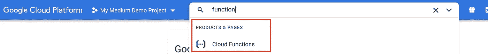
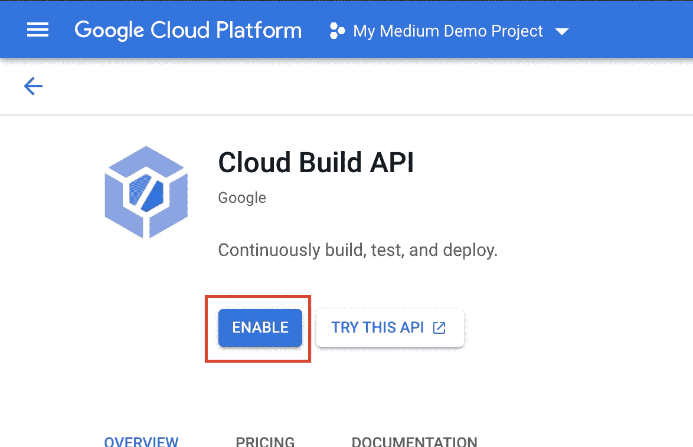
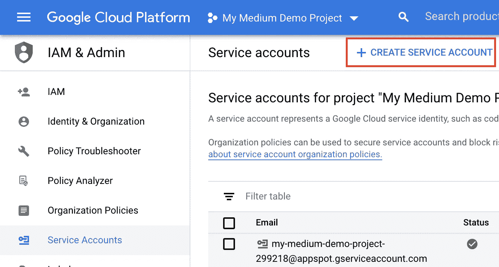
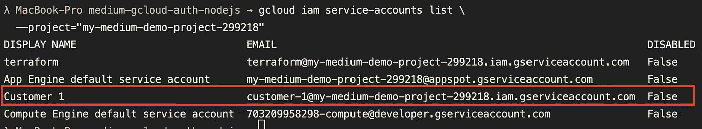
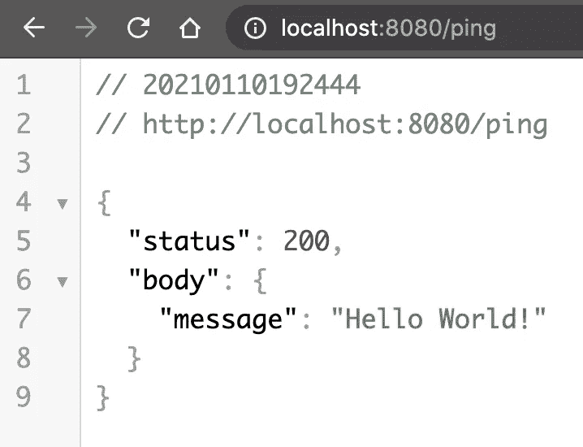

# 通过 Node.js 应用程序在 GCP 上进行服务帐户认证

> 原文：<https://levelup.gitconnected.com/service-account-authentication-on-gcp-via-node-js-app-34b3cc759bc4>

为 Google 云平台上的服务器到服务器通信提供安全访问。


马库斯·斯皮斯克在 [Unsplash](https://unsplash.com/) 上的照片

# “通过 Node.js 应用程序在 GCP 上进行服务帐户认证”是什么意思？

这是通过你的应用程序在 GCP 上作为特定服务帐户进行身份验证的过程，以便对 GCP 的进一步请求，应用程序可以发送一个身份验证令牌，将其标识为该服务帐户。这也意味着应用程序现在拥有应用于该特定服务帐户的所有权利/角色。这可以从调用云功能到编辑资源到删除某些资源。

# 可能的用例

当然，这并不是唯一的用例。但是这种“技术”的通常用例是您想要确保安全的服务器到服务器的通信，只允许授权的请求甚至**到达**您的服务器。

大多数情况下，当您的服务器对公众开放时，您的服务器接受所有请求，只有在接受请求后，它们才会检查 cookies 或授权头，如果请求的发送者甚至被允许与服务器对话并执行某个操作的话。但是，这种方法使您的服务器容易受到 DDoS 攻击，当然，即使您的服务器是可扩展的，并且可以处理大量未经授权的请求，也要花费更多的资源。但是除了 DDoS 攻击之外，您还可能忘记了某个端点中的一些身份验证代码，这可能会导致安全漏洞。

但是当你在请求到达你的服务器之前已经确保了一定的授权，你就节省了资源，提高了安全性，并且让谷歌施展魔法来保护你的服务器免受未经授权的访问。

当我想到这篇文章并研究如何完成它时，我想到的可能的、绝对有效的用例如下:

> 向客户提供一个 API，但阻止未经授权的请求访问该 API，以防止攻击并提高安全性。

# 准备

对于我们的演示，我希望你有一个有效的 GCP 项目附带的计费帐户。此外，我不会详细介绍什么是云函数、云运行等，因为本文的重点是 Node.js 中的认证部分。

## 启用必要的服务

首先，确保您已经通过 GCP 控制台启用了云函数 API 和云构建 API，因为我们将使用云函数进行演示，并且它是通过云构建自动构建的。如果您正在使用云运行，请相应地启用云运行。



转到“云功能”并启用它们(如果尚未启用的话)



启用“云构建 API ”(如果尚未启用)

## 创建服务帐户

其次，我们需要创建一个我们想要授权的服务帐户。要做到这一点，进入“IAM & Admin”->“Service Accounts”->“Create Service Account”，输入一些帐户名，在第二步中提供“Cloud Function Invoker”角色，这样这个服务帐户就可以调用我们稍后创建的 Cloud Function。类似于当你使用云运行时，有一个“云运行调用者”。不幸的是，应用程序引擎没有这样的角色。在我们的演示案例中，我们需要“云功能调用者”角色，因为这个角色告诉 GCP，拥有这个角色的服务帐户被允许触发需要认证的云功能。



创建新的服务帐户

在第二步中，如果您愿意，也可以使用`gcloud` CLI 命令来代替 GUI。用于创建服务帐户(`create-sa.sh`)、创建服务帐户私钥(`create-sa-key.sh`)和删除服务帐户(`delete-sa.sh`)的 shell 脚本也可以在根级别的存储库中获得。只需确保根据您的需要更改脚本中的变量。

## 创建服务帐户



指定项目的所有服务帐户列表

第三，我们必须生成一个在我们的应用程序中使用的密钥。您可以再次使用 GUI 或者简单地使用`create-sa-key.sh`脚本:

# 密码

[](https://github.com/Abszissex/medium-service-account-auth-node-js) [## abszisex/medium-service-account-auth-node-js

### 此时您不能执行该操作。您已使用另一个标签页或窗口登录。您已在另一个选项卡中注销，或者…

github.com](https://github.com/Abszissex/medium-service-account-auth-node-js) 

## 云函数

我们的云功能在文件夹`cloudFunction`里。这几乎是 GCP 入门教程中的代码，只是总是返回一个`200`和有效载荷`{message: 'Hello World'}`。

要部署它，请转到`cloudFunction/deploy.sh`脚本，只需将`PROJECT_ID`更改为您想要部署到的项目。之后，您可以在`cloudFunction`文件夹中运行`npm run deploy`，并将云功能部署到您的项目中。`deploy.sh`脚本最重要的部分是设置了`--no-allow-unauthenticated`标志，这样未经验证的调用者甚至无法访问您的云函数。如果你允许它不需要认证，每个人都可以调用你的云函数，你将无法控制它，我们也不需要这个教程😉

等待 1-2 分钟后，您的云功能应该已经部署完毕，可以使用了。您可以验证您的部署，也可以使用以下方法查看您的云功能可访问的 URL:

```
gcloud functions describe helloHttp
```

如果您现在尝试通过上一个命令提供的 URL 访问您的云功能，您将会看到一个`403 Forbidden` - >一切正常，我们的云功能是安全的。

## “外部”服务

现在让我们来看看我们的“外部”服务，我们希望将该服务认证为一个特定的服务帐户，以便我们可以调用我们的受保护的云功能。

这个服务以及下面列出的其他命令都希望您在`external-service`文件夹中。

在我的例子中，我使用了三个 NPM 模块:

*   `fastify` — [Fastify](https://www.fastify.io/) 是一个快速简单的 Node.js 的 HTTP webserver，当然你也可以在这里使用 express 或者其他任何框架，甚至根本不用。
*   `dotenv` — [dotenv](https://www.npmjs.com/package/dotenv) 是一个零依赖模块，将环境变量从`.env`文件加载到`[process.env](https://nodejs.org/docs/latest/api/process.html#process_process_env)`中。
*   `google-auth-library` — [Google Auth Library](https://www.npmjs.com/package/google-auth-library) 是 Google 官方支持的 [Node.js](http://nodejs.org/) 客户端库，用于使用 OAuth 2.0 授权和通过 Google APIs 进行认证。

因此，让我们只做一些配置更改来快速运行我们的示例。

如果您已经克隆了我提供的存储库，您将会看到`.env`文件包含了`PRIVATE_KEY`和`CLIENT_EMAIL`的占位符。在这里，您必须插入在本文的服务帐户部分生成的`key.json`中的`private_key`和`client_email`值。

⚠️ **重要提示**:永远不要将这些凭证以明文形式提交给你的 Git！如果你想知道如何安全地将你的秘密/密钥放入 git，请参考我的另一篇文章[在 Git 中保护你的秘密，使用 GCP·KMS 的安全方法](/securing-your-secrets-in-git-the-safe-way-using-gcp-kms-ada49e8386af)。

除此之外，您必须更改`index.ts`中的`cloudFunctionEndpoint`变量，以匹配您刚刚部署的特定云函数的端点。

在我们可以启动服务器之前，我们现在还应该通过`npm install`安装我们的依赖项。

完成这些后，您可以运行`npm run dev`直接从您的 TypeScript 文件启动您的 web 服务器。服务器成功启动后，您可以访问`localhost:8080/ping`下的 ist，应该会看到以下响应:



请求/ping 我们的“外部”服务

但是现在让我们来看看真正神奇的代码:

当然，在现实世界的服务中，您应该将上面的代码拆分得更多一点，但是对于这个演示目的来说，最好是彼此正确。

1.  我们定义了我们想要调用 web 服务器`GET /ping`的路径。
2.  我们正在检查身份验证所需的凭证是否存在，否则，我们返回一个`500`。
3.  基于我们的凭证，我们创建一个新的`JWT`对象，从`google-auth-library`模块导入。
4.  我们正在获取不记名令牌，我们必须将其添加到我们的请求中，以便通过 GCP 的安全机制进行授权，这样我们就可以访问我们的云功能
5.  我们正在创建一个新的`Map`对象，包含我们将附加到请求中的头。按照提供的类型，一个简单的键值对象应该可以正常工作，但是每次我尝试的时候，它似乎都不能正常工作。所以在这里选择`Map`。
6.  我们正在对我们的云函数进行实际的请求，由`url`定义并附有我们的授权头。
7.  我们将状态和由云函数返回的数据传递给`GET /ping`端点的调用者。

# 清除

完成演示后，我们应该确保再次清理我们的 GCP 项目。如果你只是为了这个演示的目的而创建了这个项目，你当然可以简单地删除整个项目。

在这种情况下，您想要进一步使用您的项目，我们现在必须删除云功能和服务帐户

## 删除云功能

将`cloudFunction/deployment-delete.sh`中的`PROJECT_ID`改为:

```
// ./cloudFunction/npm run deployment:delete
```

## 删除服务帐户

更换`./delete-sa.sh`中的`PROJECT_ID`和`SERVICE_ACCOUNT_ID`并运行

```
*$ ./delete-sa.sh*
```

# 摘要

我希望我能为您带来一些更接近的用例，并向您展示通过一些服务帐户用 GCP 认证您的 Node.js 应用程序是相当容易的，至少如果有人曾经告诉过您的话😉

感谢您花时间阅读我的文章。

## 你想联系吗？

如果你想联系我，请在 LinkedIn 上联系我。

另外，可以随意查看[我的书籍推荐](https://medium.com/@mr-pascal/my-book-recommendations-4b9f73bf961b)📚。

[](https://mr-pascal.medium.com/my-book-recommendations-4b9f73bf961b) [## 我的书籍推荐

### 在接下来的章节中，你可以找到我对所有日常生活话题的书籍推荐，它们对我帮助很大。

mr-pascal.medium.com](https://mr-pascal.medium.com/my-book-recommendations-4b9f73bf961b) [](https://mr-pascal.medium.com/membership) [## 通过我的推荐链接加入 Medium—Pascal Zwikirsch

### 作为一个媒体会员，你的会员费的一部分会给你阅读的作家，你可以完全接触到每一个故事…

mr-pascal.medium.com](https://mr-pascal.medium.com/membership)