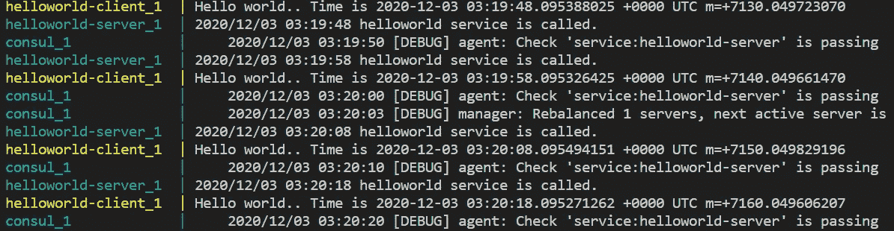
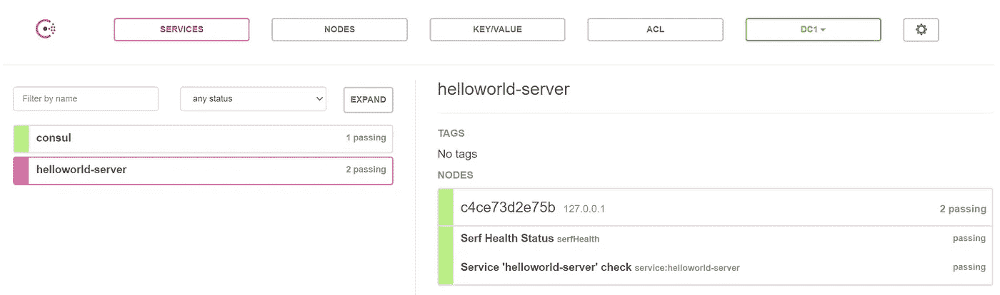

# Golang Cloud 中的服务注册和发现-带有 Consul 和 Docker 的原生微服务

> 原文：<https://levelup.gitconnected.com/service-registry-and-discovery-in-golang-cloud-native-microservice-with-consul-and-docker-731a01c648b4>

# 背景

在这篇文章中，我将给出一个真实的演示应用程序，展示如何在基于`Consul`和`Docker`的`Cloud-Native`微服务架构中进行服务注册和发现。并且服务是用`Golang`语言开发的。

它将涵盖以下技术要点:

*   集成咨询和 Golang 服务注册应用程序
*   将 Consul 与 Golang 应用程序集成在一起进行服务发现
*   用 Docker(docker-compose)配置和运行微服务

如你所见，这篇文章将涵盖几个重要的概念和有趣的工具。我将对它们做一个简短的介绍。

*   **云原生**:这是软件行业的另一个流行语。云原生应用的关键属性之一是`containerized`。要被认为是云原生的，应用程序必须是`infrastructure agnostic`并且使用容器。容器为应用程序提供了作为独立环境运行的能力，能够移入和移出云，并且不依赖于任何特定的云提供商。
*   **服务注册和服务发现**:在微服务应用中，每个服务都需要调用其他服务。为了发出请求，您的服务需要知道服务实例的网络地址。在基于云的微服务应用中，网络位置是动态分配的。因此，您的应用程序需要一种服务发现机制。另一方面，服务注册中心充当存储可用服务实例的数据库。
*   **Consul** : Consul 是我们在这个演示应用程序中用于服务注册和发现的工具。领事是`CNCF(Cloud Native Computing Foundation)`中的一员。以后我会试着写个帖子分析一下它的源代码。
*   **Docker-compose** :是一个在 Docker 上运行多容器应用的工具。它允许不同的容器可以互相通信。在这篇文章中，我也将向你展示如何使用它。

所有的代码和配置文件都可以在这个 [github repo](https://github.com/baoqger/service-discovery-demo) 中找到，请在`service-discovery`分支查看这个帖子的演示。

注:这篇文章最初发表在我的[个人博客](https://organicprogrammer.com/2020/11/16/golang-service-discovery-consul/)中，你可以在那里找到更多的技术文章。

[Kelly Sikkema](https://unsplash.com/@kellysikkema?utm_source=medium&utm_medium=referral) 在 [Unsplash](https://unsplash.com?utm_source=medium&utm_medium=referral) 上拍摄的照片

# 服务注册和发现演示

为了解释服务注册和发现，我将运行一个简单的`helloworld`服务器和一个每 10 秒钟向服务器发送请求的客户机。演示`helloworld`服务器会在`Consul`注册自己，这个过程就是服务注册。另一边，客户端在向服务器发送请求之前，会先向`Consul`发送请求，找到服务器的地址。这个过程只是服务发现。好了，我们来展示一些代码。

上面的`server.go`文件包含了许多代码，但是大多数都很简单，只是为了设置服务器和处理请求。

有趣的部分是内部函数`serviceRegistryWithConsul`。Consul 通过配置必要的信息来提供注册服务的 API。现在，我们可以关注两个字段，第一个是`ID`,它对于每个服务都是唯一的，我们还使用它在发现过程中搜索目标服务。第二个是`Check`，意思是`health check`。Consul 提供了这一有用的功能。在真正的微服务应用中，每个服务可能有多个实例来处理高并发时增加的请求，这被称为`scalability`。但是有些实例可能会关闭或抛出异常，在服务发现中，我们希望过滤掉这些实例。咨询中的健康检查就是为了这个目的。我将在下一篇文章中向你展示如何做到这一点。

同样，在`client.go`文件中，唯一关键的部分是`serviceDiscoveryWithConsul`函数。基于 Consul APIs，我们可以找到所有的服务。使用注册部分中设置的目标服务 id(在本演示中是`helloworld-server`)，我们可以很容易地找到地址。

以上部分展示了如何在一个完整的演示中进行服务注册和发现。它大量使用了 Consul APIs，我没有给出太多的解释，因为你可以在文档中找到更详细的信息。

在下一节中，我将向您展示如何基于 Docker 和 Docker-compose 以云原生方式运行这个演示应用程序。

# 集装箱化

首先，让我们为服务器创建 Dockerfile，如下所示:

这部分很简单，如果你不明白这里使用的一些命令，请查看 Docker 的手册。

我将不再向客户展示 docker 文件，因为它与上面的几乎相同。但是你可以在这个 [github repo](https://github.com/baoqger/service-discovery-demo) 里找到。

现在，服务器和客户机都在容器中运行。我们还需要将 Consul 添加到这个应用程序中，并将这 3 个容器连接在一起。我们用 Docker-compose 来做这件事。

Docker-compose 由`yml`文件驱动。在我们的例子中，情况如下:

关于 docker-compose 的用法，有几点需要提及:

*   **网络**:我们定义了一个名为`my-net`的网络，并在所有 3 个服务中使用它，使它们可以相互通话。
*   **环境**:我们可以在这个部分设置环境变量。在我们的例子中，服务器和客户机都需要向 Consul 发送注册和发现请求，对吗？你可以检查服务器和客户端文件，我们没有明确设置领事地址。因为 Consul 是以隐式的方式执行的，所以它将从名为`CONSUL_HTTP_ADDR`的环境变量中获取值。我们用`CONSUL_HTTP_ADDR=consul:8500`设置它。
*   **docker-compose up** :这是启动应用程序所需的命令。另一个有用的命令是`docker-compose build`，它用于构建 yml 文件中定义的图像。当然，`docker-compose down`可以在你想离开应用程序时停止容器。

一切都设置好了，您可以在终端和 Consul UI 中验证结果，如下所示:

服务发现

领事-ui