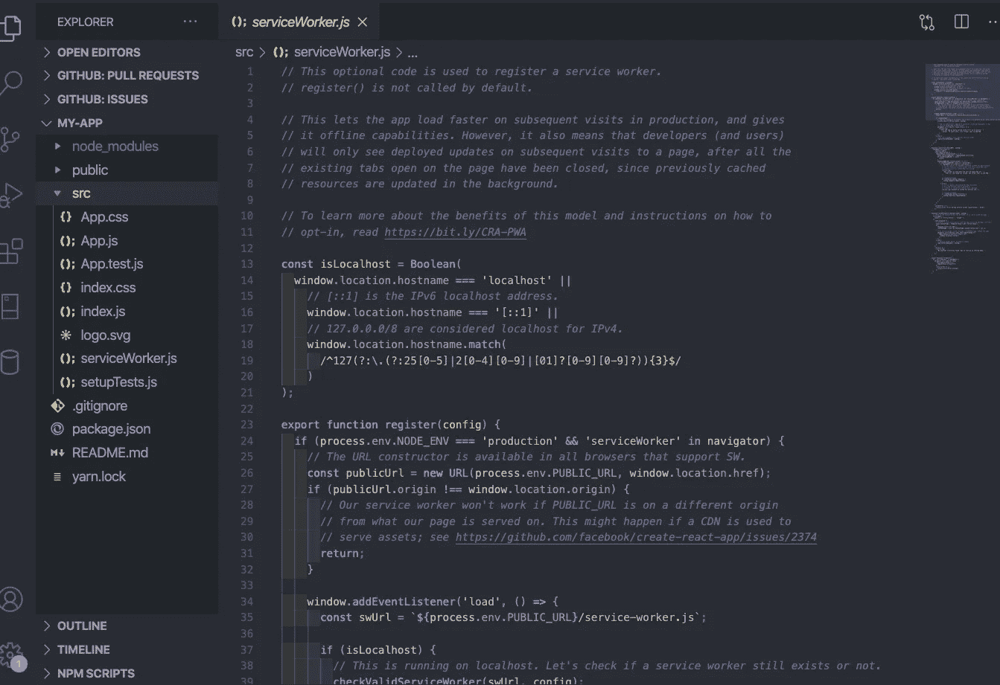
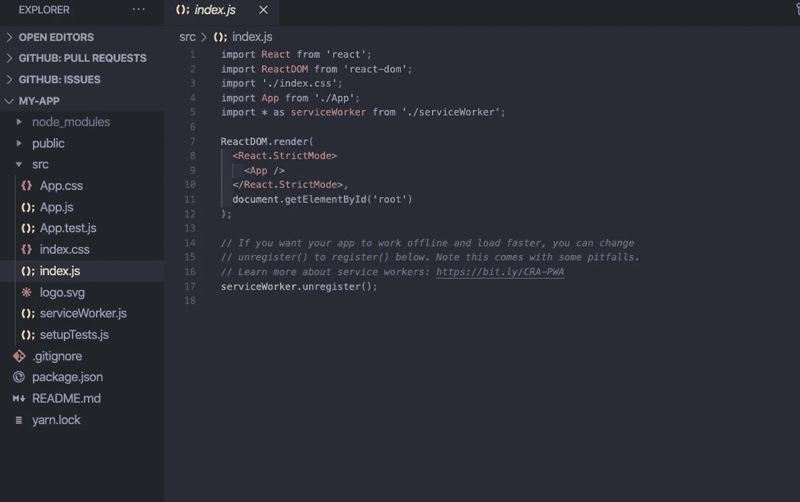

# 服务人员在反应

> 原文：<https://levelup.gitconnected.com/service-workers-in-react-8bcaccfd0356>

React 中服务人员的简要指南

[React](https://reactjs.org/) 是一个用于构建用户界面的 Javascript 库。它是基于组件的，允许开发者创建比普通 Javascript 更简单的用户界面。

> *以后想看这个故事吗？保存在* [*日记本*](https://usejournal.com/?utm_source=medium.com&utm_medium=blog&utm_campaign=noteworthy&utm_content=eid7) *。*

React 有一个工具`create-react-app`，可以很容易地从头创建一个新的 React 项目。`create-react-app`工具创建一个默认的预配置项目，准备用`npm start`启动。这个`create-react-app` 工具的一个很酷的特性是一个默认的服务工作者文件。

# **什么是服务人员？**

服务人员是您的浏览器在后台运行的脚本，独立于网页，允许使用不需要网页或用户交互的功能。当天的一个例子是[推送通知](https://developers.google.com/web/updates/2015/03/push-notifications-on-the-open-web)。服务人员允许工程师和开发人员对用户与应用程序的交互进行端到端控制。服务人员使您能够在页面存在之前运行 JavaScript，创建更快的站点，并且即使在没有互联网连接的情况下也能够显示内容。

# **【服务人员属性】**

服务人员是渐进式 web 应用程序的核心。Progressive web applications 简要地解释说，是一个使用现代网络功能向用户提供类似应用程序的体验的网络应用程序，但是，如果你想了解更多关于 PWA 的信息，请阅读更多[这里](https://ionicframework.com/docs/core-concepts/what-are-progressive-web-apps)。我们知道服务人员运行在一个独立的线程上，并允许用户不需要在线或使用应用程序的离线支持功能。现在，让我们来了解一下服务人员的属性或关键特征:

*   在它自己的全局脚本上下文中运行，它是一个 Javascript 文件
*   在独立于 UI 的线程上执行，因此不会直接绑定到特定页面
*   无法直接访问 DOM
*   是事件驱动的(仅在使用时有效)
*   服务人员需要 HTTPS

服务人员的能力足以劫持连接、伪造和过滤响应。这就是为什么只有使用 [HTTPS](https://love2dev.com/blog/how-https-works/) 服务页面时才能启用它们。这确保了一定程度的安全性，使服务人员能够在不被篡改的情况下完成网络旅程。

由于服务工作器和 UI 位于不同的线程上，因此服务工作器不能直接访问 DOM。服务人员和窗口可以通过`postMessage`方式通信。这允许消息来回传递。这需要每一侧的逻辑(在 UI 和服务工作器之间)来处理消息和触发不同的工作流。

# 我们如何使用服务人员？

正如我之前提到的，React 有一个工具`create-react-app`，它带有预配置的文件。我创建了一个名为 my-app 的简单应用程序(我知道它有多有创意？)在下面的图片中，你可以看到当我点击我的 **src** 文件夹时，里面有一个 serviceWorker.js 文件。

该文件很长，其中包含处理服务工作器生命周期方法的代码。第二个函数是 register 函数，但是默认情况下，您的服务工作器是未注册的。如果我们转到 index.js 文件，我们会发现服务工作器默认为 unregister 方法。

通过将方法从未注册更改为注册，您已经设置了一个服务工作器功能！如果您在一个不同的环境中工作，并且需要在本地安装，您可以通过这个谷歌服务人员[文档](https://developers.google.com/web/fundamentals/primers/service-workers)了解更多信息并获取指导。通过使用`create-react-app`工具，我们节省了在服务工作者生命周期中编写大量代码的时间。下面是关于服务工作人员生命周期的图片。

[https://developer . Google . com/web/foundation/primer/service-workers](https://developers.google.com/web/fundamentals/primers/service-workers)

对于我的视觉学习伙伴。

本博客对服务人员进行了简要说明，但所有添加的文档以及额外的[资源](https://developer.mozilla.org/en-US/docs/Web/API/Service_Worker_API/Using_Service_Workers)都做了更详细的说明。至少现在，当你醒来看着你的手机，instagram 通知你谁喜欢你的照片，或者 CoStar 根据占星术的建议让你深入了解你身边发生的事情，你就知道服务人员已经就位，让这些通知在你不在应用程序中的时候出现。

📝将这个故事保存在[日志](https://usejournal.com/?utm_source=medium.com&utm_medium=noteworthy_blog&utm_campaign=tech&utm_content=guest_post_read_later_text)中。

👩‍💻每周日早上醒来，你的收件箱里会有本周最值得关注的科技新闻。[阅读科技简讯](https://usejournal.com/newsletter/noteworthy-in-tech/?utm_source=medium.com&utm_medium=noteworthy_blog&utm_campaign=tech&utm_content=guest_post_text)中值得注意的内容。