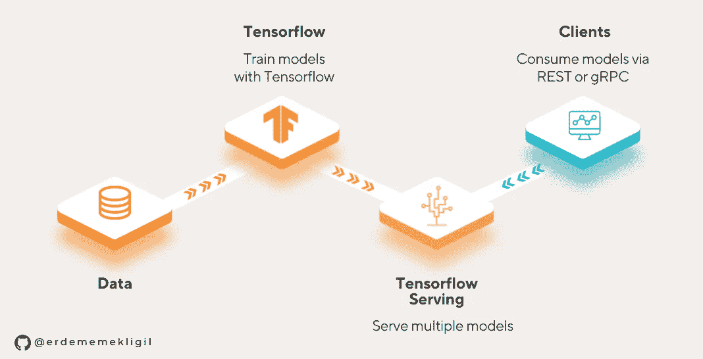

# 使用张量流服务来服务图像分类模型

> 原文：<https://levelup.gitconnected.com/serving-an-image-classification-model-with-tensorflow-serving-c4657584d73d>

## 学习利用 Tensorflow 服务来创建 web 服务，以服务于您的 Tensorflow 模型

这是博客系列的第二部分，将涵盖 Tensorflow 模型训练、Tensorflow 服务及其性能。[在之前的文章](https://medium.com/@erdememekligil/an-object-oriented-approach-to-training-an-image-classifier-with-tensorflow-3bcaa7a7864e)中，我们采用了面向对象的方法来训练图像分类器模型，并将其导出为 SavedModel。我建议在这篇文章之前看一下，因为我们将使用相同的模型。您可以在这里找到博客系列的完整应用程序代码:

[](https://github.com/erdememekligil/oop-tensorflow-serving) [## GitHub-erdememekligil/oop-tensor flow-serving:一种面向对象(OOP)的方法来训练…

### 一种面向对象(OOP)的方法，用于训练张量流模型并使用张量流服务为其提供服务。OOP 很好(在…

github.com](https://github.com/erdememekligil/oop-tensorflow-serving) 

## Tensorflow 提供的是什么？

在应用程序中使用张量流模型有许多替代方法。最简单的一种是将 Tensorflow 与 Flask、Django、Fastapi 等一起使用。创建基于 python 的 web 应用程序的框架。如果需要用其他语言开发，可以使用像 ML.NET 或 deeplearning4j 这样的框架。Tensorflow Lite、Pytorch Live 和 CoreML 是用于移动应用程序的框架。但是，在分层架构和微服务中，让机器学习模型成为独立的应用程序是一个很好的做法。这个概念叫做*模型服务*，将模型作为服务有很多好处。例如，模型可以在不停机的情况下在生产中更新，或者可以由许多不同的客户端应用程序使用。要实现模型服务，可以使用 Tensorflow Serving、TorchServe、Triton、KFServing 等应用程序。



图片由[Emre sargül](https://www.linkedin.com/in/emre-sar%C4%B1g%C3%BCl-7064aa92/)拍摄

Tensorflow 服务允许我们将 Tensorflow 模型作为 web 服务提供，而无需额外的应用程序。它支持通过 gRPC 和 REST 协议为多个模型的多个版本提供服务。但是，它要求模型采用 Tensorflow 的 SavedModel 格式。SavedModels 可以在培训后进行微调和一些修改，特别是如果它们是使用 Keras 构建的。可以向 SavedModels 添加额外的函数和签名，然后使用 TFServing 提供服务。

## 检查保存的模型

我们在[之前的媒体帖子](https://medium.com/@erdememekligil/an-object-oriented-approach-to-training-an-image-classifier-with-tensorflow-3bcaa7a7864e)中训练了一个 ResNet50 模型，并将其保存为 SaveModel 格式。我们可以使用这个命令来显示 Tensorflow 服务的模型签名:`saved_model_cli show --all --dir model_path`

```
signature_def['serving_bytes']:
  The given SavedModel SignatureDef contains the following input(s):
    inputs['image_bytes_string'] tensor_info:
        dtype: DT_STRING
        shape: unknown_rank
        name: serving_bytes_image_bytes_string:0
  The given SavedModel SignatureDef contains the following output(s):
    outputs['output_0'] tensor_info:
        dtype: DT_FLOAT
        shape: (1, 10)
        name: StatefulPartitionedCall:0
  Method name is: tensorflow/serving/predict

signature_def['serving_default']:
  The given SavedModel SignatureDef contains the following input(s):
    inputs['input_tensor'] tensor_info:
        dtype: DT_FLOAT
        shape: (-1, -1, -1, 3)
        name: serving_default_input_tensor:0
  The given SavedModel SignatureDef contains the following output(s):
    outputs['output_0'] tensor_info:
        dtype: DT_FLOAT
        shape: (-1, 10)
        name: StatefulPartitionedCall_1:0
  Method name is: tensorflow/serving/predict
```

我们可以从输出中看到，签名`serving_default`接受 4d 数组输入，而`serving_bytes`接受 base64 编码的数组(作为字符串)输入。两个签名都输出具有 10 个数字(概率)的数组，因为该模型是在 MNIST 上训练的，并且具有 10 个类别。

## 运行 Tensorflow 服务

Tensorflow [建议](https://www.tensorflow.org/tfx/serving/setup)使用 Docker image 进行 Tensorflow 服务，因为这是在 GPU 支持下使用 Tensorflow 服务的最简单方式。如果您没有 docker 并且想要手动安装 Tensorflow Serving，请遵循此[链接](https://www.tensorflow.org/tfx/serving/setup)中的说明。

以下脚本使用给定的模型创建并运行 Tensorflow 服务容器。端口 8500 用于 gRPC API，8501 用于 REST API。这个脚本将主机中的模型目录绑定到容器，并从那里读取模型。然而，在生产环境中使用 Tensorflow 服务时，更好的做法是将模型放在 Docker 映像中，而不是使用绑定。

```
docker run -p 8500:8500 -p 8501:8501 -d --name resnet_serving \
  -v /directory/on/host/models:/models \
  -e MODEL_NAME=ResnetModel tensorflow/serving:2.8.0-gpu
```

要检查它是否正常运行，请在网络浏览器中访问以下地址:`http://hostname:8501/v1/models/ResnetModel`。如果工作正常，它会返回如下 json:

```
{
 "model_version_status": [
  {
   "version": "1",
   "state": "AVAILABLE",
   "status": {
    "error_code": "OK",
    "error_message": ""
   }
  }
 ]
}
```

## 消费 REST 服务

REST 和 gRPC 协议都有其优点和缺点。可能最重要的一点是 REST 协议更常见。

要使用 REST API 调用模型，向`http://hostname:8501/v1/models/ResnetModel:predict`发送一个 POST 请求，请求体如下:

```
{
  "signature_name": "serving_bytes", 
  "instances": [{"b64": "fill_with_base64_encoded_image_bytes"}]
}
```

由于该模型是在包含从 0 到 9 的手写数字的 MNIST 数据集上训练的，因此该服务返回 10 个类别没有应用 softmax 的激活。在下面的示例中，模型的预测将是具有最高激活值的类，即第 3 个索引(属于编号 2):

```
{"predictions": [[-14.9772987, -6.99252939, 13.5781298, -8.89471, -6.88773823, -4.63609457, 0.168618962, -9.86182785, -2.09211802, -1.32305372]]}
```

用 RGB 像素值调用`serving_default`签名可以得到相同的结果。该签名支持同时处理多个图像，因为它具有 4d 输入(*批次、高度、宽度、通道):*

```
{
  "signature_name": "serving_default", 
  "instances": [[[[0, 0, 0], [0, 0, 0], [255, 255, 255], ...]
}
```

对于 REST API，当发送高分辨率图像时，这个签名比`serving_bytes`慢，因为整数数组在转换为字符串时会消耗更多的内存。

## 使用 gRPC 服务

消费 gRPC Tensorflow 服务 API 只有 Python 的[官方支持](https://pypi.org/project/tensorflow-serving-api/)。有一些针对其他语言的[开源客户端](https://github.com/figroc/tensorflow-serving-client)，但它们可能无法用于 Tensorflow 服务的最新版本。对于 python，必须安装 tensor flow-serving-API:`pip install tensorflow-serving-api`。具有不安全连接的服务存根(此处[检查](https://grpc.io/docs/languages/python/alts/)以获得安全连接)创建如下:

可以使用上面定义的存根对`serving_default`签名进行预测:

`tf.make_tensor_proto`和`tf.make_ndarray`方法用于 numpy 数组与张量之间的转换。可以在同一个`serving_default`请求中发送多个图像，以获得更快的结果。对于相对较大的图像(例如 600x600px)，可使用`serving_bytes`签名获得更快的结果:

## 结论

我们使用 Tensorflow 为我们的图像分类模型的两个签名创建 REST 和 gRPC APIs。REST API 易于使用，并且在使用 base64 字节数组而不是整数数组时速度更快。必须使用外部框架来消费 gRPC API。但是，当以 numpy 数组的形式发送多个图像时，速度会更快。

请检查 GitHub [库](https://github.com/erdememekligil/oop-tensorflow-serving)中的完整代码。欢迎在评论中提问。在下一篇文章中，我们将测量 Tensorflow 服务的性能，并讨论如何提高其性能。