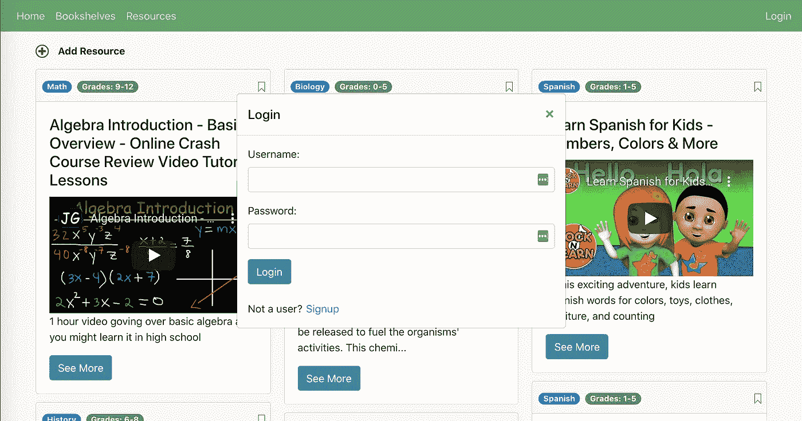

# 具有 React/Redux 前端和 Rails API 后端的会话

> 原文：<https://levelup.gitconnected.com/sessions-with-a-react-redux-frontend-and-rails-api-backend-25b7b951b287>

在我最近的项目中，我开发了一个名为 EduSource 的应用程序，允许父母众包在线教育资源并组织它们(在 [github](https://github.com/charlie763/edu-source) 或 [live](https://edusource.herokuapp.com/) 上查看)。想想 Pinterest 的教育资源。



登录在主屏幕上得到提示

我接受的一个更大的挑战是用解耦的前端/后端管理会话。如果一切都在 Rails 中，那么 RAILS 使会话变得非常容易处理，但是当您使用不同的系统来管理前端行为时，尤其是当前端和后端之间的交互是异步的时，就会变得稍微复杂一些。

可悲的是，我无法找到一个明确的指南，涵盖所有你需要知道的事情，使这一工作。相反，我根据三个不同的来源整合了一个解决方案:

1.  [Mike Clark 的概述](https://pragmaticstudio.com/tutorials/rails-session-cookies-for-api-authentication)您想要的总体流程
2.  [Kailana Kahawaii 关于使用 Rails 设置 JSON Web 令牌(JWT)的概述](https://dev.to/kahawaiikailana/rails-api-quickstart-guide-with-postgressql-and-jwt-tokens-3pnk)
3.  [JMFurlott 关于使用 JavaScript Cookies 在 React 中存储和利用会话数据的指南](https://www.jmfurlott.com/handling-user-session-react-context/)

！！警告！！—这是初学者的解决方案。我猜这不是最安全的解决方案。相反，它是一个适度安全的解决方案，我希望它对于刚刚学习如何实现安全会话的初学者来说更容易理解。

*步骤 1:在 Rails API 后端设置 JWT*

首先，你需要安装 JWT 宝石。所以，在你的 gem 文件中放入`gem “jwt”, “~> 2.2”` ，然后再放入`bundle install`。

接下来，您需要生成并安全地存储 SESSION_SECRET，这是一个加密的安全密钥，您将使用它来生成令牌。有多种方法可以生成并安全地存储该密钥。例如，上面引用的文章使用了 JWT 生成器网站和 rails 凭证。我使用 Ruby 的 SecureRandom gem 生成密钥，并使用 dotenv gem 将其存储在我的 Rails 环境中。首先设置您的存储环境很有帮助。将`gem ‘dotenv-rails’`放入您的 gemfile，`bundle install`，然后在您的根目录下创建一个. env 文件，并将`.env`放入您的。gitignore 文件(这样你就不会把你的秘钥上传到 github)。现在，安装 securerandom 后，您可以运行

```
ruby -e “require ‘sysrandom/securerandom’; puts SecureRandom.hex(64)”
```

从终端生成密钥。复制并粘贴此密钥，并将其保存在您的。env 文件如下:

```
SESSION_SECRET = [insert the key you just generated]
```

剩下的，我公然从上面的文章中剽窃，减去交换掉函数`jwt_key`的返回值，从。env 文件而不是 rails 凭证。你可以把下面的代码放在你的`ApplicationController`中，其他控制器可以继承，或者你可以创建一个助手模块。我做了前者。

```
def jwt_key
  ENV[‘SESSION_SECRET’]
enddef issue_token(user)
  JWT.encode({user_id: user.id}, jwt_key, ‘HS256’)
enddef decoded_token
  begin
    JWT.decode(token, jwt_key, true, { :algorithm => ‘HS256’ })
  rescue JWT::DecodeError
    [{error: “Invalid Token”}]
  end
enddef token
  request.headers[‘Authorization’]
enddef user_id
  decoded_token.first[‘user_id’]
enddef current_user
  user ||= User.find_by(id: user_id)
enddef logged_in?
  !!current_user
end
```

现在，当创建一个用户时，您可以简单地调用`issue_token`函数，当授权一个用户时，调用`current_user`函数将返回一个非零值，只要有一个有效的令牌。

*步骤 2:设置会话/用户存储*

大概有各种各样的方法可以做到这一点。我使用 Redux 并创建了一个`usersReducer`来设置和处理用户数据模型的存储。我的代码假设对 Redux 的工作原理有一些了解，但是如果不使用 Redux，也可以将这些数据保存在 state 中。重要的信息是我建立的商店具有以下数据结构:

```
state = {
  {…your other data models},
  user: {
    current: {},
    valid: true,
    authCompleted: false,
    errors: {}
  }
```

这里，`user.current`将存储有效的用户对象，`user.valid`表示对用户进行认证和授权的结果，`user.authCompleted`告诉您是否已经进行了认证过程，以查看是否存在有效用户。我将`user.valid`默认为`true`,以避免意外重定向到登录屏幕。然而，可能有一个更好的解决方案，我怀疑默认设置`user.valid`为`false`会更安全，而不是像我一样，每当一个 auth 进程启动时就这样设置。

*第三步:登录/注册您的用户*

这里就不一一赘述了。我就给个提纲吧。重要的是安装 js-cookie 包，导入该功能，用从 Rails API 后端返回的 JWT 值设置 cookie，然后相应地更新您的存储。完成这项工作所需的一些代码如下:

```
npm install js-cookie 
```

从终端，以及:

```
import * as Cookies from ‘js-cookie’
```

在管理 cookies 的 React 文件的顶部。对我来说，这是一个管理所有与用户活动相关的派单的`usersActions`文件。

向 API 后端发送获取请求后，如果用户数据有效，就设置 cookie。我的会话控制器发回的 JSON 看起来像这样

```
{
  valid: true, 
  user: {id: 1, username: 'Charlie'}, 
  token: '[generated api token here]'
}
```

这样，我就可以用代码在我的一个`userAcitons`函数中设置 cookie 了:

```
Cookies.remove('eduResourceSession')
Cookies.set('eduResourceSession', jsonData.token, { expires: 14 })
```

`'eduResourceSession’`指的是被存储的 cookie 的名称，但这可以是任何东西，`Cookies.set()`中的第二个参数将 cookie 的值设置为返回的令牌。

最后一步是根据返回的内容更新您的商店/状态。如果用户有效，设置`user.valid`为`true`，设置`user.current`为返回的用户数据。无论验证状态如何，将`user.authCompleted`设置为`true`。

*步骤 4:如果未授权，重定向用户登录*

对于我的 react 应用程序中的用户相关组件，我将插入以下代码:

```
componentDidMount(){
  this.props.authUser()
}
```

其中`authUser()`是向 API 会话控制器发出获取请求的函数，该请求包括在`Authorization`报头中的令牌，并且如果控制器返回有效用户，则将状态设置为`user.valid = true`。

```
function authUser(){
  let token = Cookies.get("eduResourceSession")
  return dispatch => {
    dispatch({type: "START_AUTH"})
    if (token){
      const configObj = {
        method: 'GET',
        headers: {
          'Content-Type': 'application/json',
          Accept: 'application/json',
          Authorization: token
        },
        credentials: 'include'
      }
      fetch(BASE_URL.concat('/authorize'), configObj)
        .then(resp => resp.json())
        .then(authResp => {
          if (authResp.valid === "true"){
            dispatch({type: "LOGIN_USER", user: authResp.user})
          } else {
            dispatch({type: "INVALID_USER", errors: {session: "Please login to continue"}})
          }
     })
   } else {
     dispatch({type: "INVALID_USER", errors: {session: "Please login to continue"}})
   }
  dispatch({type: "COMPLETE_AUTH"})
}
```

另请注意请求对象中的`credentials: 'include'`。如果您从前端向后端发出跨来源请求，这在生产中变得很重要。

在这之后，我会在我的`render()`函数的顶部放一些逻辑在任何我不想让用户在没有登录的情况下看到的组件中:

```
if (this.props.user.valid){ 
  return <Component/>
} else {
  return <Redirect to=’/login’/>`
}
```

当状态改变时，组件重新呈现，因此当`user.authCompleted` 在授权过程中改变时，组件重新呈现并再次检查用户是否有效。

*步骤 5:向后端 API 发出请求时授权用户*

最后一步是，每当您向后端发出请求，要求对用户进行授权时，就对用户进行授权。对于我的应用程序来说，这仅限于对专门绑定到用户数据模型的数据的 POST、PATCH 和 GET 请求。这一步的基本要点是，每当发出一个请求时，从 cookies 获取令牌，在 authorization 头中发送它，只有在令牌有效时，才从后端返回数据或向后端发送数据。该代码与步骤 4 中的代码非常相似，所以我在这里不再赘述。主要区别在于，这个逻辑决定了后端如何响应客户机请求，而不是向客户机呈现什么(如步骤 4 所述)。如果您发出 POST 或 PATCH 请求，auth 逻辑也将由表单提交而不是`componentDidMount`触发。

太多了！我希望这有助于您理解使用 React-Redux 前端和 Rails API 后端的会话流。如果您有任何意见、问题或改进，请联系我们！