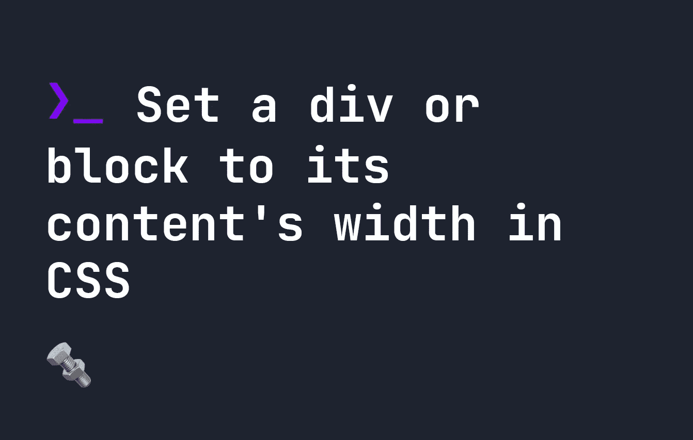

# 在 CSS 中将 div 或 block 设置为其内容的宽度

> 原文：<https://levelup.gitconnected.com/set-a-div-or-block-to-its-contents-width-in-css-af8f06b656f4>



在 HTML 中，我们使用`block`元素来占据整个页面。这些元素的属性不同于文本流中常见的`inline`元素。

# 了解箱式模型

`inline`和`block`元素都是 CSS 的重要组成部分。[要了解 CSS 中的盒子模型，点击这里](https://fjolt.com/article/css-box-model)。

当我们创建一个新的`div`或其他`block`元素时，它占据了页面的整个宽度——但是如果我们希望一个`div`或任何其他`block` DOM 元素仅仅是其内容的宽度，而不是更多呢？要让一个 HTML `block`元素(比如 div)占用的空间不超过它的内容，我们可以使用`fit-content`关键字。

例如，这里有一个`div`，包含一些带有背景的虚拟文本。尽管内容很短，但`div`占据了整个页面:


如果我们希望这个 div 现在只占用与其内容相同的宽度，我们可以添加`fit-content`:

```
div {
    width: fit-content;
}
```

现在我们的`div`要小得多，而且只有它包含的内容一样大:


# 结论和支持

对`fit-content`的支持相当广泛，但它在 Internet Explorer 中无法工作。类似的，有些浏览器只支持`width`，不支持其他属性。在任何情况下，您都可以非常自信地将该属性与`width`一起使用，但是在将它应用于其他 CSS 属性时可能会有一些警告。在 caniuse.com 网站上可以找到完整的支持列表。

[如果你想了解更多关于 CSS 的知识，点击这里](https://fjolt.com/category/css)。