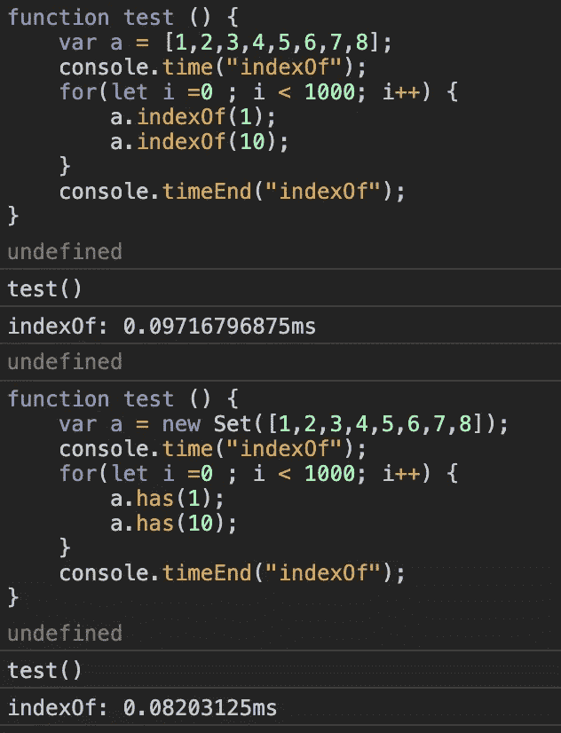

# JavaScript 中的集合数据结构

> 原文：<https://levelup.gitconnected.com/set-data-structure-in-javascript-62e65908a0e6>

了解如何以及何时在 JavaScript 中使用`Set`。


对象允许你创建一个`**unique values**`的集合(每个值只能出现一次)。

`Set`可以包含任何类型的值(原语或对象引用)。

`Set`将元素存储在`insertion order`中。

`Set`不包含的键🔑像一个[贴图](https://medium.com/front-end-weekly/simple-introduction-to-map-in-javascript-6786034f9154)物体。

使用`[SameValueZero](https://tc39.github.io/ecma262/#sec-samevaluezero)`算法检查`Set`元素的唯一性。该算法类似于`===`(严格相等)，除了在一种情况下`**NaN === NaN**`评估为真，因此在`Set`中不插入倍数`NaN`。

## **创建一个**

语法:`new Set([iterable])` →返回一个`Set`对象。

```
var set1 = new Set([1, 2, 1, 3, 4, 5]);set1; // Set(5) {1, 2, 3, 4, 5} ; duplicate values are removed.Creating an empty setvar set2 = new Set();
```

## **属性**

`size` →返回`Set`中元素的数量

```
var number = new Set([1,2,3,4,5])number.size ; 
```

## **方法**

`**add()**`

`**add()**`方法将传递的元素附加到`Set`对象的末尾，并返回`Set`对象**。**

```
var fruits = new Set(['🍇', '🍉', '🍊', '🍈' ]);fruits.add('🍋');fruits; // Set(5) {'🍇', '🍉', '🍊', '🍈', '🍋'};
```

当我们试图添加重复值时，它不会被插入。

```
fruits.add(**'🍊**'); // already present in the setfruits; // Set(5) {'🍇', '🍉', **'🍊'**, '🍈', '🍋'};
```

`add`方法是可链接的

```
fruits
      .add('🍌')
      .add('🍓')
      .add('🍎');fruits; // Set(8) {"🍇", "🍉", "🍊", "🍈", "🍋", …}
```

向`Set`添加对象

```
var set = new Set();set.add({i : 10});set.add({i : 10});set; //Set(2) {{…}, {…}}// Even-though objects look same, each object has different reference, so they are not **===
//** An object reference means that it compares the memory address of the object and not the actual key/value pairs contained in the object.--------------------------------------------------------------------var obj = {i :100};set.add(obj);set.add(obj);// Now the obj points to same object reference so it is not inserted--------------------------------------------------------------------obj.i =1000;// the value in the set is changed because we are storing the address.
```

`**has()**`

如果具有指定值的元素存在于`Set`对象中，则`**has()**`方法返回`**true**`，如果该值不存在于`Set`中，则返回`**false**`。

语法:`has(valueToBeChecked)` →返回真或假。

```
var fruits = new Set(['🍇', '🍉', '🍊', '🍈' ]);fruits.has('🍇'); //truefruits.has('🍌'); //false
```

`**has**` 方法同对象

```
var set = new Set();var obj = {i :100};set.add(obj);set.has(obj); // trueset.has(**{i : 100}**); //**false, because they are different object  reference.**
```

`**values()**`

`**values()**`方法返回一个新的`Iterator`对象，该对象包含按照插入顺序排列的`Set`对象中每个元素的值。

```
var fruits = new Set(['🍇', '🍉', '🍊', '🍈' ]);fruits.values();  // SetIterator {"🍇", "🍉", "🍊", "🍈", "🍋", …}--------------------------------------------------------------------//use destructor to print only the valuesconsole.log(**...fruits.values()**)or **var fruitsArray = ([...fruits.values]);**
```

`**entries()**`

`**entries()**`方法返回一个新的`Iterator`对象，该对象包含按照插入顺序排列的 `**[value, value]**`的数组**。**

在`Set`中没有键，所以它以`**[value, value]**` **的格式返回。**

```
var fruits = new Set(['🍇', '🍉']);fruits.entries();  SetIterator {"🍇" => "🍇", "🍉" => "🍉"}--------------------------------------------------------------------// you can use **for...of** for(var [key ,value] of fruits.entries()) {
   console.log(key, value); 
}
```

`**delete()**`

方法从一个`Set`对象中移除指定的元素。

语法:`delete(valueToBeDeleted)`

如果删除了`Set`中的一个元素，则返回`true`，否则返回`false`。

```
var fruits = new Set(['🍇', '🍉']);**fruits.delete('🍇');** //truefruits; //Set(1) {"🍉"}**fruits.delete('🍌');** false.
```

`**clear()**`

`**clear()**`方法清空`Set`对象。

```
var fruits = new Set(['🍇', '🍉']);fruits.size; // 2**fruits.clear();** fruits.size; // **0**
```

在一个`**Set**` 对象上使用`**forEach**` **:**

```
let print= function(key , value, set) { console.log(value);}var fruits = new Set(['🍇', '🍉']);fruits.forEach(print)//output
🍇
🍉
```

## 提示和技巧

1.  当我们在创建`Set`时将一个字符串作为参数传递时，它会创建一个集合，其中所有的字符都是单独的元素。

```
var text = 'LEARN';var mySet = new Set(text); //**Set(5) {"L", "E", "A", "R", "N"}**
```

2.从数组中删除重复元素

```
var names= [ '**John**', 'Brandi', 'Tony', '**John**'];var uniqueNames = [...new Set(names)]uniqueNames = [ '**John**', 'Brandi', 'Tony'];
```

3.数组和集合有什么不同

*   `Set`对象存储唯一值，而数组可以有重复值
*   在数组中，我们需要使用`indexOf`方法来检查数组中元素的可用性，但是在集合中，我们可以使用`**has**` 方法，这种方法比`indexOf`方法要快。



*   在数组中找不到带有`indexOf`的值`NaN`。
*   对象允许你根据元素的值删除元素。对于数组，您必须根据元素的索引进行拼接。

**你可以阅读地图🗺详细介绍** [**此处**](/simple-introduction-to-map-in-javascript-6786034f9154?source=friends_link&sk=c9e114a4043dddbf1e109f3ea89cd796) **。**

如果你发现这个有用的惊喜🎁我这里[](https://www.paypal.me/jagathishSaravanan)****。****

****开心就分享😃 😆 🙂。****

****跟随** [**Javascript 吉普🚙**](https://medium.com/u/f9ffc26e7e69?source=post_page-----62e65908a0e6--------------------------------) **如果你觉得值得。****

**[](https://gitconnected.com/learn/javascript) [## 学习 JavaScript -最佳 JavaScript 教程(2019) | gitconnected

### JavaScript 是世界上最流行的编程语言之一——它随处可见。JavaScript 是一种…

gitconnected.com](https://gitconnected.com/learn/javascript)**